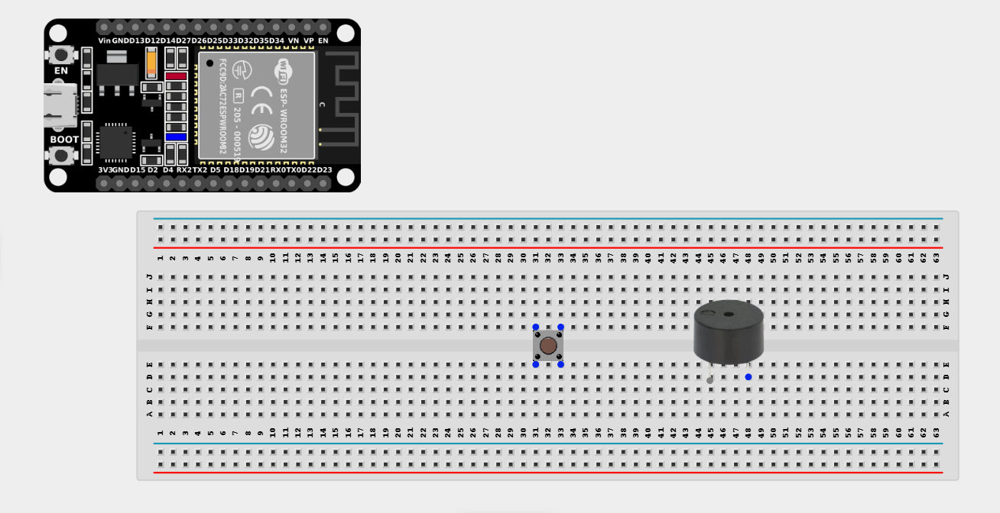
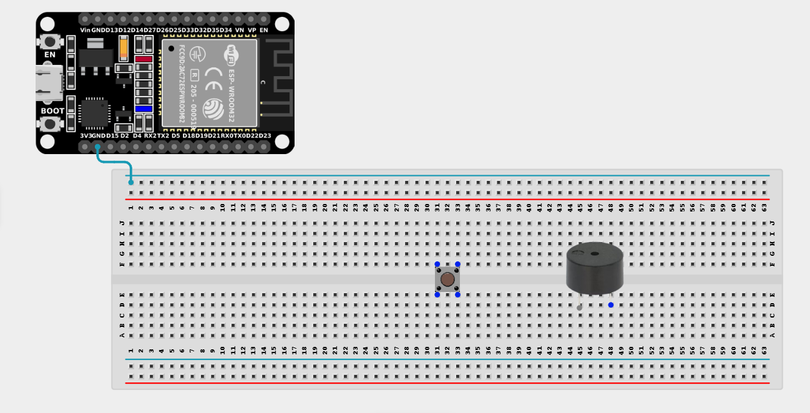
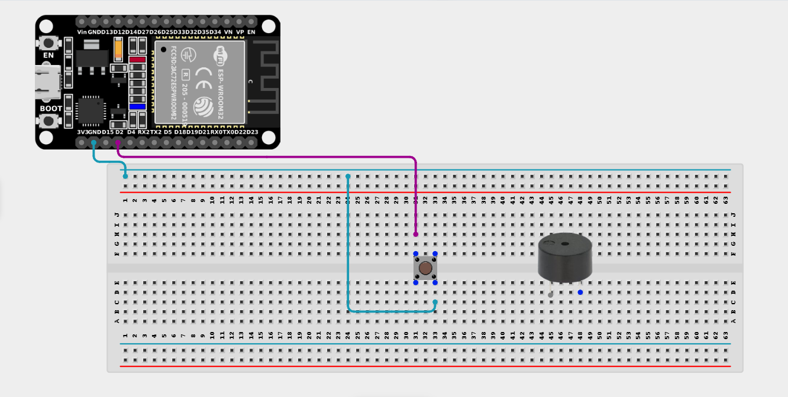
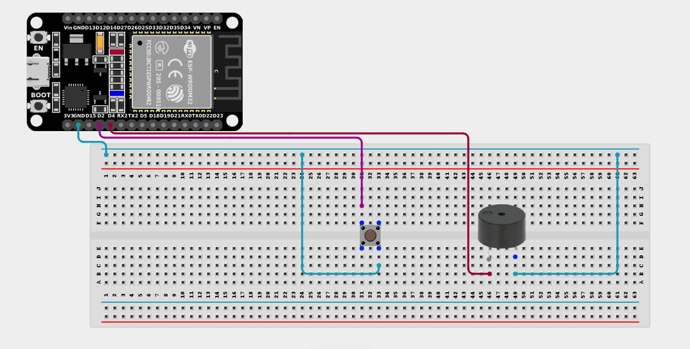

# Project 2.1.1: Push Button with Buzzer

| **Description** | This project demonstrates how to create a simple circuit using a push button and a buzzer. When the push button is pressed, the buzzer produces a sound, making the project useful for alarm systems, doorbells, and alert notifications. |
| --------------- | ------------------------------------------------------------------------------------------------------------------------------------------------------------------------------------------------------------------------- |
| **Use case**    | This project can be used in a quiz competition system where contestants press the push button to activate the buzzer, indicating who answered first.                                                                                                                                                                    |

## Components (Things You will need)

|  |  |  |  |  |  |
| --------------------------------------------------- | --------------------------------------------------- | ----------------------------------------------------------- | ----------------------------------------------------- | ------------------------------------------------------ | ------------------------------------------------------- |

## Building the circuit

> **Tip:** Use the [ESP32 Pin Mapping](../../../../assets/esp32_pin_mapping.png) image to locate the correct GPIO pins on your ESP32 board.

Things Needed:

- ESP32 board = 1

- Micro USB cable = 1

- Breadboard = 1

- Jumper wires

- Buzzer = 1

- Push button = 1

---

## Mounting the components on the breadboard

**Step 1:** Mount the ESP32 and Components:

- Align the ESP32 board across the center dividing ridge of the breadboard.

- Insert the Push button across the center divider of the breadboard.

- Insert the Buzzer into the breadboard (remember the longer leg is positive).


---

## Wiring the circuit

Follow these step-by-step connection details using your jumper wires:

**Step 1:** Create Power and Ground Rails

- Connect a **GND** pin on the ESP32 board to the negative (blue/black) rail on the breadboard.



**Step 2:** Wire the Push Button

- Connect **one side** of the push button to **GPIO 2** on the ESP32 board.

- Connect the **other side** of the push button to the negative ground rail. *(We will use the internal pull-up resistor)*.



**Step 3:** Wire the Buzzer

- Connect the **positive (+)** pin of the Buzzer to **GPIO 4** on the ESP32 board.

- Connect the **negative (-)** pin of the Buzzer to the negative ground rail.



*Make sure to connect the Micro USB cable securely to the ESP32 board and your computer.*

---

## PROGRAMMING

**Step 1:** Open your Arduino IDE. See how to set up here: [Getting Started](../../Getting Started/Arduino_IDE_Setup.md).

**Step 2:** Write the code in sections as detailed below.

### 1. Variables and Setup

```cpp
const int buttonPin = 2;
const int buzzerPin = 4;

int buttonState = 0;

void setup() {
  pinMode(buttonPin, INPUT_PULLUP);
  pinMode(buzzerPin, OUTPUT);
}
```
*Explanation:* We declare our button and buzzer pins. Crucially, we set the button to `INPUT_PULLUP` so that it reads `HIGH` by default, and `LOW` when pressed, eliminating the need for an external physical resistor.

---

### 2. Main Loop

```cpp
void loop() {
  // Read the current state of the button
  buttonState = digitalRead(buttonPin);
  
  // Check if the button is pressed (LOW state)
  if (buttonState == LOW) {
    digitalWrite(buzzerPin, HIGH); // Turn the buzzer ON
    delay(500);                    // Keep it on for half a second
    digitalWrite(buzzerPin, LOW);  // Turn the buzzer OFF
  } else {
    digitalWrite(buzzerPin, LOW);  // Ensure buzzer is off when not pressed
  }
}
```
*Explanation:* 

- We read the button state. 

- If it is `LOW` (meaning pressed down), we turn the buzzer `HIGH` (on) and emit a beep! 

- Otherwise, the buzzer remains completely silent.

---

## Uploading the code

**Step 3:** Save your code. _See the [Getting Started](../../Getting Started/Arduino_IDE_Setup.md) section_

**Step 4:** Select the ESP32 board and port _See the [Getting Started](../../Getting Started/Arduino_IDE_Setup.md) section:Selecting ESP32 board Type and Uploading your code_.

**Step 5:** Upload your code. _See the [Getting Started](../../Getting Started/Arduino_IDE_Setup.md) section:Selecting ESP32 board Type and Uploading your code_

## Conclusion

If any issues arise during the upload, recheck the wiring and code for errors. Upon successful testing, this project demonstrates how to use a digital input (a push button) to control a digital output (a buzzer), laying the foundation for interactive alarm systems!
