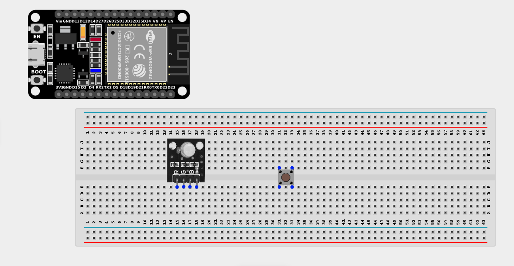
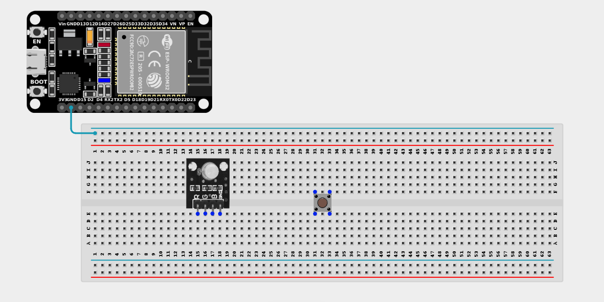
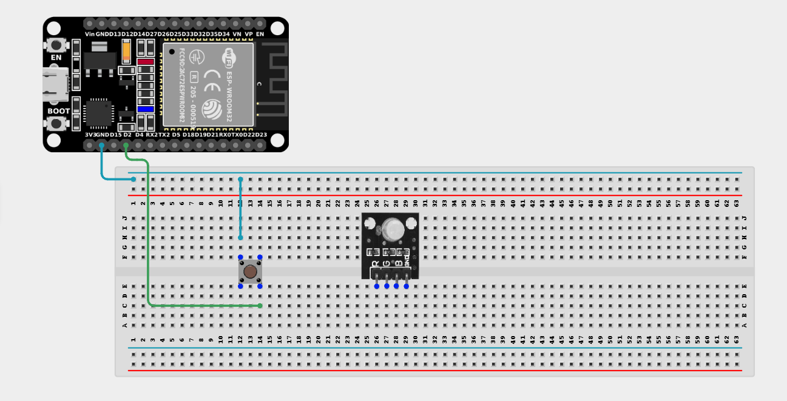
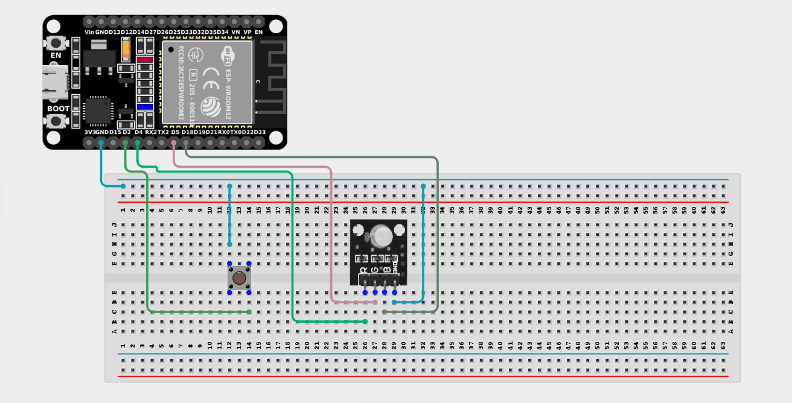

# Project 2.2.1: Pushbutton And RGB Control 

| **Description** | In this project, you will learn how to use a push button to control an RGB LED with an ESP32 board. Each press of the button changes the LED to different colors, demonstrating how a single input device can sequence through multiple outputs! |
|------------------|----------------------------------------------------------------|
| **Use case**     | This project is exactly how flashlight modes or multi-color decorative lamps work. A single button press allows users to cycle through different RGB colors and modes to create different moods. |

## Components (Things You will need)

|  |  |  |  ||  |
|-------------------------|-------------------------|-------------------------|-------------------------|-------------------------|-------------------------|

## Building the circuit

> **Tip:** Use the [ESP32 Pin Mapping](../../../../assets/esp32_pin_mapping.png) image to locate the correct GPIO pins on your ESP32 board.

Things Needed:

- ESP32 board = 1

- Micro USB cable = 1

- Breadboard = 1

- Jumper wires

- RGB Module = 1

- Pushbutton = 1

---

## Mounting the components on the breadboard

**Step 1:** Mount the ESP32 and Components:

- Align the ESP32 board across the center dividing ridge of the breadboard.

- Insert the Push Button across the center divider of the breadboard.

- Insert the RGB LED Module into the breadboard so its four pins (R, G, B, -) sit in separate adjacent rows.


---

## Wiring the circuit

Follow these step-by-step connection details using your jumper wires:

**Step 1:** Create Power and Ground Rails

- Connect a **GND** pin on the ESP32 board to the negative (blue/black) rail on the breadboard.


**Step 2:** Wire the Push Button

- Connect **one side** of the push button to **GPIO 2** on the ESP32 board.

- Connect the **other side** of the push button to the negative ground rail. *(We will use the internal pull-up resistor)*.


**Step 3:** Wire the RGB LED

- Connect the **GND (-)** pin of the RGB LED to the negative ground rail.

- Connect the **Red (R)** pin of the RGB LED to **GPIO 4** on the ESP32 board.

- Connect the **Green (G)** pin of the RGB LED to **GPIO 5** on the ESP32 board.

- Connect the **Blue (B)** pin of the RGB LED to **GPIO 18** on the ESP32 board.



*Make sure to connect the Micro USB cable securely to the ESP32 board and your computer.*

---

## PROGRAMMING

**Step 1:** Open your Arduino IDE. See how to set up here: [Getting Started](../../Getting Started/Arduino_IDE_Setup.md).

**Step 2:** Write the code in sections as detailed below.

### 1. Variables and Setup

```cpp
const int buttonPin = 2;

const int redPin = 4;
const int greenPin = 5;
const int bluePin = 18;

bool lastButtonState = HIGH;
bool currentButtonState;
int colorState = 0; // Tracks which color we are currently showing

void setup() {
  pinMode(buttonPin, INPUT_PULLUP);
  
  pinMode(redPin, OUTPUT);
  pinMode(greenPin, OUTPUT);
  pinMode(bluePin, OUTPUT);
}
```
*Explanation:* We declare our button and our three RGB pins. We also create a `colorState` integer that will count up (0, 1, 2, 3...) every time the button is pressed, telling the loop which color to display.

---

### 2. Main Loop & Functions

```cpp
void loop() {
  // 1. Read the button state
  currentButtonState = digitalRead(buttonPin);
  
  // 2. Check if the button was just pressed (transitioned from HIGH to LOW)
  if (lastButtonState == HIGH && currentButtonState == LOW) {
    colorState++; // Increment the color sequence!
    
    // If we exceed 3, wrap back around to 0
    if (colorState > 3) {
      colorState = 0;
    }
    
    delay(200); // Small debounce delay to prevent double-presses
  }
  
  // Save the state for the next loop
  lastButtonState = currentButtonState;
  
  // 3. Display the correct color based on the current state!
  if (colorState == 1) {
    setRGB(HIGH, LOW, LOW); // Red
  } 
  else if (colorState == 2) {
    setRGB(LOW, HIGH, LOW); // Green
  } 
  else if (colorState == 3) {
    setRGB(LOW, LOW, HIGH); // Blue
  } 
  else if (colorState == 0) {
    setRGB(LOW, LOW, LOW);  // Off
  }
}

// Helper function to easily turn specific pins on/off
void setRGB(int r, int g, int b) {
  digitalWrite(redPin, r);
  digitalWrite(greenPin, g);
  digitalWrite(bluePin, b);
}
```
*Explanation:* 

- We check if the button was clicked. If so, we increase `colorState` by 1. 

- If it reaches 4, we reset it back to 0. 

- The series of `if / else if` statements simply act as a director, deciding which color to show based on the current `colorState` number!

---

## Uploading the code

**Step 3:** Save your code. _See the [Getting Started](../../Getting Started/Arduino_IDE_Setup.md) section_

**Step 4:** Select the ESP32 board and port _See the [Getting Started](../../Getting Started/Arduino_IDE_Setup.md) section:Selecting ESP32 board Type and Uploading your code_.

**Step 5:** Upload your code. _See the [Getting Started](../../Getting Started/Arduino_IDE_Setup.md) section:Selecting ESP32 board Type and Uploading your code_

## Conclusion

Press the pushbutton several times to see the RGB display cycle through different LED colors. This project demonstrated how a simple button can manage complex states, sequencing through multiple outputs and modes!
