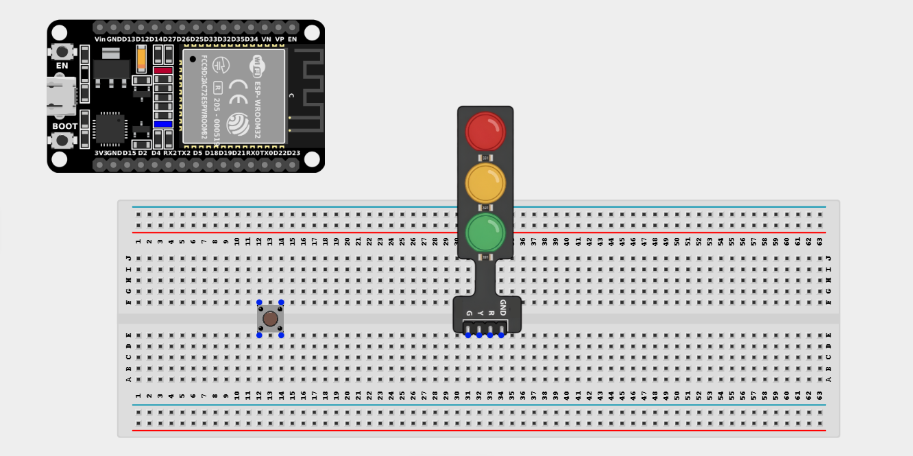
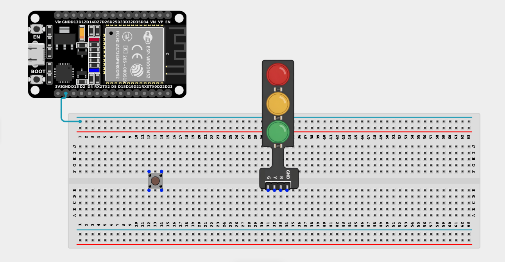
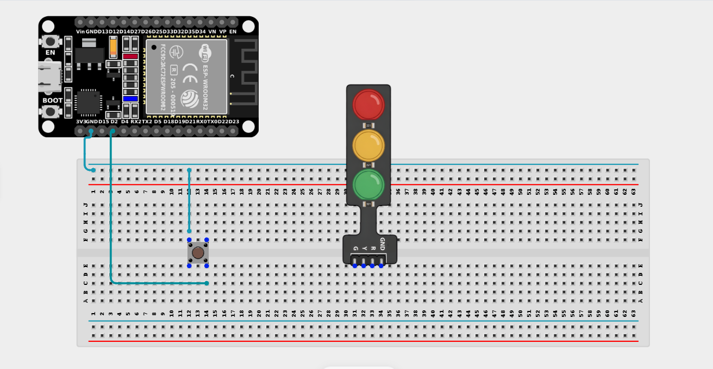
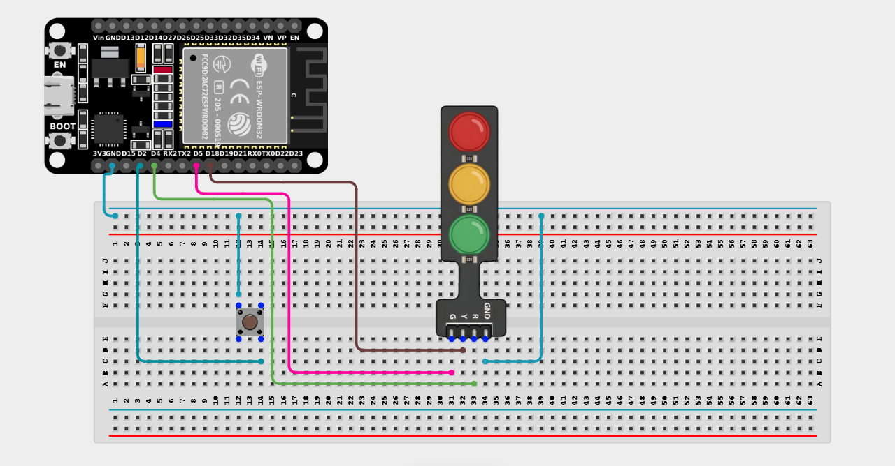

# Project 2.3.1: Push Button with Traffic Light Module

| **Description** | In this project, you will learn how to build a simple traffic light control. When the push button is pressed, it triggers the traffic light to change in sequence, simulating a real pedestrian crossing system. |
|------------------|----------------------------------------------------------------|
| **Use case**     | In this project, the system can be used as a pedestrian crossing control where a person presses a push button to request safe crossing. Once activated, the traffic lights change in sequence to stop vehicles and allow pedestrians to cross safely. |

## Components (Things You will need)

|  |  |  |  ||  |
|-------------------------|-------------------------|-------------------------|-------------------------|-------------------------|-------------------------|

## Building the circuit

> **Tip:** Use the [ESP32 Pin Mapping](../../../../assets/esp32_pin_mapping.png) image to locate the correct GPIO pins on your ESP32 board.

Things Needed:

- ESP32 board = 1

- Micro USB cable = 1

- Breadboard = 1

- Jumper wires

- Traffic Light Module = 1

- Push Button = 1

---

## Mounting the components on the breadboard

**Step 1:** Mount the ESP32 and Components:

- Align the ESP32 board across the center dividing ridge of the breadboard.

- Insert the Push button across the center divider of the breadboard.

- Insert the Traffic Light Module into the breadboard so its four pins (G, Y, R, GND) sit in separate adjacent rows.


---

## Wiring the circuit

Follow these step-by-step connection details using your jumper wires:

**Step 1:** Create Power and Ground Rails

- Connect a **GND** pin on the ESP32 board to the negative (blue/black) rail on the breadboard.


**Step 2:** Wire the Push Button

- Connect **one side** of the push button to **GPIO 2** on the ESP32 board.

- Connect the **other side** of the push button to the negative ground rail. *(We will use the internal pull-up resistor)*.


**Step 3:** Wire the Traffic Light Module

- Connect the **Green (G)** pin of the Traffic Light Module to **GPIO 5** on the ESP32 board.

- Connect the **Yellow (Y)** pin of the Traffic Light Module to **GPIO 18** on the ESP32 board.

- Connect the **Red (R)** pin of the Traffic Light Module to **GPIO 4** on the ESP32 board.

- Connect the **GND** pin of the Traffic Light Module to the negative ground rail.



*Make sure to connect the Micro USB cable securely to the ESP32 board and your computer.*

---

## PROGRAMMING

**Step 1:** Open your Arduino IDE. See how to set up here: [Getting Started](../../Getting Started/Arduino_IDE_Setup.md).

**Step 2:** Write the code in sections as detailed below.

### 1. Variables and Setup

```cpp
const int buttonPin = 2;

const int greenPin = 5;
const int yellowPin = 18;
const int redPin = 4;

int buttonState = 0;

void setup() {
  pinMode(buttonPin, INPUT_PULLUP); 
  pinMode(greenPin, OUTPUT);
  pinMode(yellowPin, OUTPUT);
  pinMode(redPin, OUTPUT);
}
```
*Explanation:* We declare our button and traffic light pins. We configure the button with `INPUT_PULLUP` so we don't need a physical resistor, and we set all three light pins to `OUTPUT`.

---

### 2. Main Loop

```cpp
void loop() {
  // Read the state of the push button
  buttonState = digitalRead(buttonPin); 
  
  // If the button is NOT pressed (HIGH), the light stays Green for cars
  if (buttonState == HIGH) {
    digitalWrite(greenPin, HIGH); 
    digitalWrite(yellowPin, LOW); 
    digitalWrite(redPin, LOW); 
  } 
  // If the button IS pressed (LOW), start the pedestrian crossing sequence!
  else {
    // Leave green on for 1 more second so drivers aren't surprised
    digitalWrite(greenPin, HIGH); 
    delay(1000);
    
    // Switch to Yellow for 2 seconds
    digitalWrite(greenPin, LOW); 
    digitalWrite(yellowPin, HIGH); 
    delay(2000);
    
    // Switch to Red for 5 seconds (Pedestrians cross now!)
    digitalWrite(yellowPin, LOW); 
    digitalWrite(redPin, HIGH); 
    delay(5000);
    
    // Turn off red, we will return to Green at the start of the next loop!
    digitalWrite(redPin, LOW); 
    delay(1000);
  }
}
```
*Explanation:* 

- By default, the button reads `HIGH`, so the Green light stays on, allowing "cars" to drive.

- When a pedestrian pushes the button, it pulls the pin `LOW`.

- This triggers an `else` block which executes a timed sequence (`delay()`) transitioning from Green -> Yellow -> Red.

- After 5 seconds of Red, the sequence ends, and the loop restarts, bringing the system back to Green!

---

## Uploading the code

**Step 3:** Save your code. _See the [Getting Started](../../Getting Started/Arduino_IDE_Setup.md) section_

**Step 4:** Select the ESP32 board and port _See the [Getting Started](../../Getting Started/Arduino_IDE_Setup.md) section:Selecting ESP32 board Type and Uploading your code_.

**Step 5:** Upload your code. _See the [Getting Started](../../Getting Started/Arduino_IDE_Setup.md) section:Selecting ESP32 board Type and Uploading your code_

## Conclusion

This project demonstrated how a push button can be used to control a traffic light system using an ESP32 board. Through this project, you learned how button presses can trigger a complex, timed sequence of events, improving knowledge of programming logic and practical automation systems!
