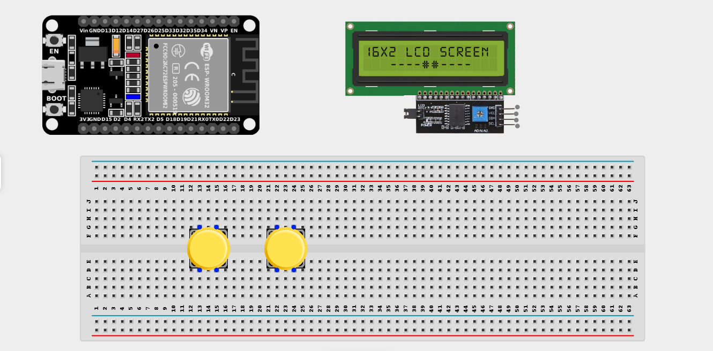
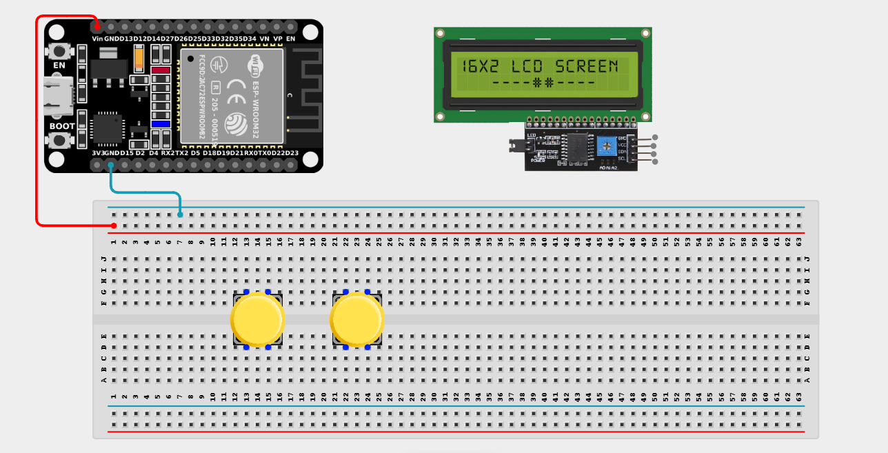
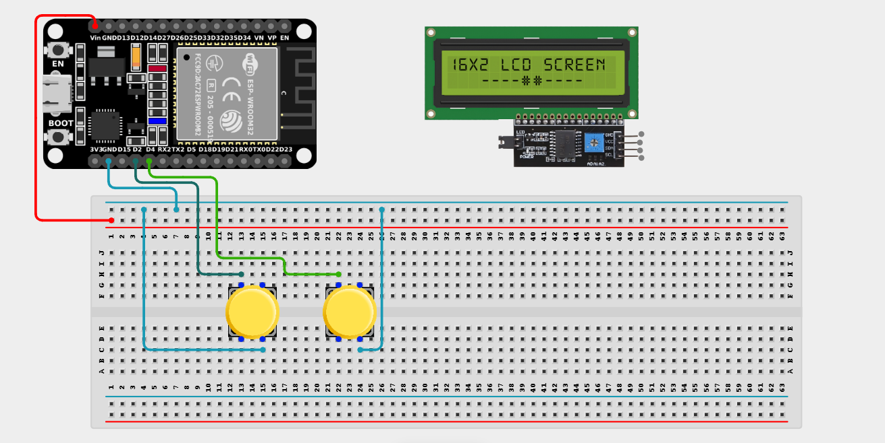
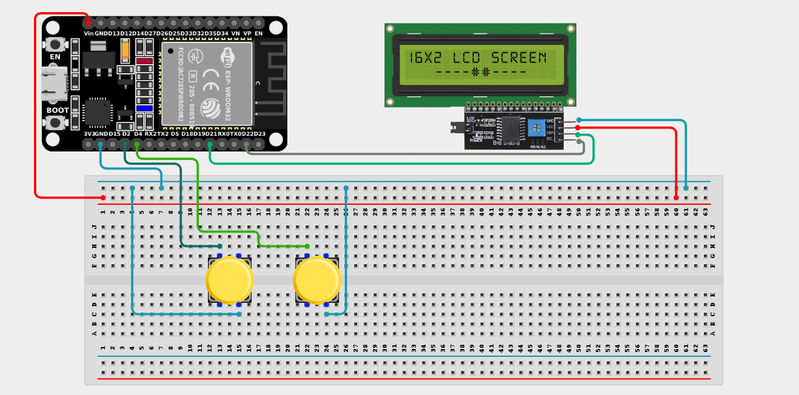

# Project 2.10: Electronic Auction System

| **Description** | In this project, learners will build a simple electronic auction system. Two participants compete by increasing their bids using separate buttons, and the LCD displays the current highest bid and the leading bidder. |
|------------------|----------------------------------------------------------------|
| **Use case**     | This project is connected to real-world uses such as online bidding platforms, electronic auctions, and sales tracking systems. It demonstrates how comparison logic and user input can be used to manage competitive bidding and display live results. |

## Components (Things You will need)

|  |  |  |  |  |  |
| --- | --- | --- | --- | --- | --- |

## Building the circuit

> **Tip:** Use the [ESP32 Pin Mapping](../../assets/esp32_pin_mapping.png) image to locate the correct GPIO pins on your ESP32 board.

Things Needed:

- ESP32 board = 1

- Micro USB cable = 1

- Breadboard = 1

- Jumper Wires

- Push Buttons = 2

- I2C LCD Display = 1

---

## Mounting the components on the breadboard

**Step 1:** Mount the ESP32 and Components:

- Align the ESP32 board across the center dividing ridge of the breadboard.

- Place the two push buttons firmly across the center gap of the breadboard.

- (Connect the LCD display using jumper wires).



---

## Wiring the circuit

Follow these step-by-step connection details using your jumper wires:

**Step 1:** Create Power and Ground Rails

- Connect the **5V** or **VIN** pin on the ESP32 board to the positive (red) rail on the breadboard.

- Connect a **GND** pin on the ESP32 board to the negative (blue/black) rail on the breadboard.



**Step 2:** Wire the Push Buttons

- Connect one terminal of the **Player 1** button to **GPIO 2** on the ESP32 board.

- Connect one terminal of the **Player 2** button to **GPIO 4** on the ESP32 board.

- Connect the opposite terminals of both buttons to the negative ground rail on the breadboard.



**Step 3:** Wire the I2C LCD Display

- Connect **VCC** of the LCD to the positive power rail.

- Connect **GND** of the LCD to the negative power rail.

- Connect **SDA** of the LCD to **GPIO 21** on the ESP32 board.

- Connect **SCL** of the LCD to **GPIO 22** on the ESP32 board.



*Make sure to connect the Micro USB cable securely to the ESP32 board and your computer.*

---

## PROGRAMMING

**Step 1:** Open your Arduino IDE. See how to set up here: [Getting Started](../Getting Started/Arduino_IDE_Setup.md).

**Step 2:** Write the code in sections as detailed below.

### 1. Library Inclusion and Object Setup

```cpp
#include <Wire.h>
#include <LiquidCrystal_I2C.h>

LiquidCrystal_I2C lcd(0x27, 16, 2);

// Button pins
const int player1Button = 2;
const int player2Button = 4;

// Game variables
int highestBid = 0;
int leader = 0;
```
*Explanation:* We include the necessary libraries and initialize the `lcd`. We define pins `2` and `4` for our two bidders. We also create variables to track the `highestBid` amount and the current `leader` (1 or 2).

---

### 2. Setup Function

```cpp
void setup() {
  // Configure buttons using internal pull-up resistors
  pinMode(player1Button, INPUT_PULLUP);
  pinMode(player2Button, INPUT_PULLUP);
  
  // Start LCD
  lcd.init();
  lcd.backlight();
  
  // Initial display message
  lcd.setCursor(0, 0);
  lcd.print("Auction Started!");
  delay(2000); // Show message for 2 seconds
  
  // Call our custom function to draw the starting screen
  updateDisplay(); 
}
```
*Explanation:* Configures the buttons and the LCD screen, shows a starting message, and then calls a custom function `updateDisplay()` which we will define later to draw the actual auction interface.

---

### 3. Custom Function and Loop Function

```cpp
void updateDisplay() {
  lcd.clear();
  lcd.setCursor(0, 0);
  lcd.print("Highest Bid:$");
  lcd.print(highestBid);
  
  lcd.setCursor(0, 1);
  if (leader == 0) {
    lcd.print("Waiting for bids");
  } else {
    lcd.print("Bidder ");
    lcd.print(leader);
    lcd.print(" leads");
  }
}

void loop() {
  // Player 1 bids
  if (digitalRead(player1Button) == LOW) {
    highestBid += 10;
    leader = 1;
    updateDisplay();
    delay(300); // Debounce to prevent multiple bids from one click
  }
  
  // Player 2 bids
  if (digitalRead(player2Button) == LOW) {
    highestBid += 10;
    leader = 2;
    updateDisplay();
    delay(300); // Debounce
  }
}
```
*Explanation:* 

- We separated the screen-drawing code into a custom function `updateDisplay()` to keep our `loop()` neat. It clears the screen and redraws the current bid and leader.

- Inside `loop()`, we constantly check both buttons.

- If Player 1 presses their button, the bid goes up by $10, `leader` becomes `1`, and the screen refreshes.

- If Player 2 presses their button, the bid goes up by $10, `leader` becomes `2`, and the screen refreshes.

---

## Uploading the code

**Step 3:** Save your code. _See the [Getting Started](../Getting Started/Arduino_IDE_Setup.md) section_

**Step 4:** Select the ESP32 board and port _See the [Getting Started](../Getting Started/Arduino_IDE_Setup.md) section:Selecting ESP32 board Type and Uploading your code_.

**Step 5:** Upload your code. _See the [Getting Started](../Getting Started/Arduino_IDE_Setup.md) section:Selecting ESP32 board Type and Uploading your code_

## CONCLUSION

The Electronic Auction System powers on and waits for user input. When a participant presses their button, the system registers the bid, increases the highest bid amount by $10, and updates the LCD display. The display provides real-time feedback, showing the current highest bid and the leading bidder, demonstrating how microcontrollers can manage competitive inputs and provide interactive feedback.
