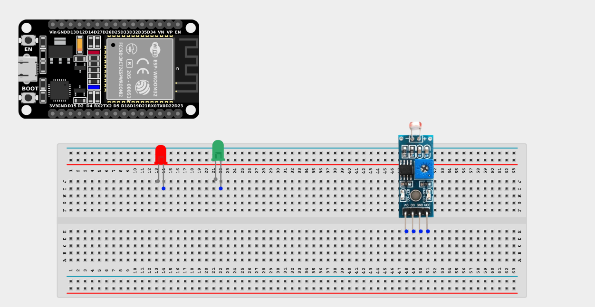
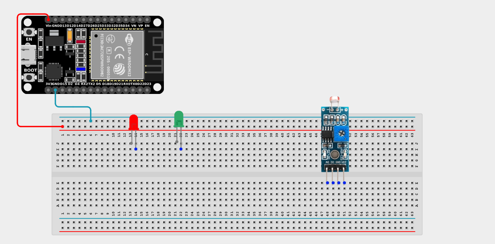
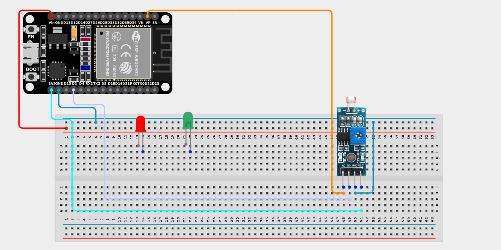

# Project 2.10.3: Smart Street Light (2 LEDs)

| **Description** | This project teaches you how to build a smart street lighting system using an LDR (Light Dependent Resistor) module and two LEDs. The ESP32 board continuously monitors the surrounding light level and automatically controls the LEDs to simulate streetlights turning ON at night and OFF during the day. |
| --------------- | ----------------------------------------------------------------------------------------------------- |
| **Use case**    | Automatic street lighting systems, smart home outdoor lighting, security lighting, parking lot illumination, pathway lighting, and other energy-efficient lighting systems that automatically respond to changes in ambient light. |

## Components (Things You will need)

|  |  |  |  |  |  |
| --------------------------------------- | --------------------------------------------------- | ----------------------------------------------------------- | ----------------------------------------------------- | ------------------------------------------------------ | ---------------------------------------------- |

## Building the circuit

> **Tip:** Use the [ESP32 Pin Mapping](../../../../assets/esp32_pin_mapping.png) image to locate the correct GPIO pins on your ESP32 board.

Things Needed:

- ESP32 board = 1

- Micro USB cable = 1

- Breadboard = 1

- Jumper Wires

- LDR Sensor = 1

- Red LED = 1

- Green LED = 1

- 220Ω Resistors = 2

---

## Mounting the components on the breadboard

**Step 1:** Mount the ESP32 and Components:

- Align the ESP32 board across the center dividing ridge of the breadboard.

- Place the LDR Sensor on the breadboard so its four pins sit in separate adjacent rows.

- Insert the Red LED and Green LED into the breadboard (remember the longer legs are positive).



---

## Wiring the circuit

Follow these step-by-step connection details using your jumper wires:

**Step 1:** Create Power and Ground Rails

- Connect the **5V** or **VIN** pin on the ESP32 board to the positive (red) rail on the breadboard.

- Connect a **GND** pin on the ESP32 board to the negative (blue/black) rail on the breadboard.



**Step 2:** Wire the LDR Sensor

- Connect the **VCC** pin of the LDR to the 3.3V pin on the ESP32 board (or 3.3V power rail).

- Connect the **GND** pin of the LDR to the negative power rail.

- Connect the **AO** (Analog Out) pin of the LDR to **GPIO 36** (also labeled VP) on the ESP32 board.

- Connect the **DO** (Digital Out) pin of the LDR to **GPIO 2** on the ESP32 board.



**Step 3:** Wire the LEDs

- Connect a **220Ω resistor** from the positive (longer) leg of the Red LED to **GPIO 18**.

- Connect the negative (shorter) leg of the Red LED to the negative ground rail.

- Connect a **220Ω resistor** from the positive (longer) leg of the Green LED to **GPIO 21**.

- Connect the negative (shorter) leg of the Green LED to the negative ground rail.


*Make sure to connect the Micro USB cable securely to the ESP32 board and your computer.*

---

## PROGRAMMING

**Step 1:** Open your Arduino IDE. See how to set up here: [Getting Started](../../../Getting Started/Arduino_IDE_Setup.md).

**Step 2:** Write the code in sections as detailed below.

### 1. Variables and Setup

```cpp
const int LDR_AO_PIN = 36;
const int LDR_DO_PIN = 2;
const int RED_LED = 18;
const int GREEN_LED = 21;

void setup() {
  Serial.begin(9600);
  
  // Set up the digital pins
  pinMode(LDR_DO_PIN, INPUT);
  pinMode(RED_LED, OUTPUT);
  pinMode(GREEN_LED, OUTPUT);
}
```
*Explanation:* We define our analog pin (`36`), digital pin (`2`), and our two output LED pins (`18` and `21`). We configure the pins as INPUT and OUTPUTs inside `setup()`.

---

### 2. Main Loop

```cpp
void loop() {
  // Read the analog value (0-4095)
  int analogValue = analogRead(LDR_AO_PIN);
  
  // Read the digital value (HIGH or LOW)
  // The LDR module usually outputs HIGH when dark and LOW when bright
  int digitalValue = digitalRead(LDR_DO_PIN);
  
  // Print values to the Serial Monitor
  Serial.print("Analog: ");
  Serial.print(analogValue);
  Serial.print(" | Digital: ");
  Serial.println(digitalValue);
  
  // Let's use the Analog value for finer control:
  // (Note: Higher analog values generally mean DARKER environment for typical LDRs,
  // but it depends on the specific module! Adjust '2000' as needed).
  if (analogValue > 2000) {
    digitalWrite(RED_LED, HIGH);   // Turn on the Red LED
    digitalWrite(GREEN_LED, LOW);  // Turn off the Green LED
  } else {
    digitalWrite(RED_LED, LOW);    // Turn off the Red LED
    digitalWrite(GREEN_LED, HIGH); // Turn on the Green LED
  }
  
  delay(200); // Check 5 times a second
}
```
*Explanation:* Instead of simply using the digital ON/OFF from the sensor, this project uses the precise analog data. If the light level crosses a threshold (like `2000`), we switch which LED is illuminated! You can customize this threshold to change exactly *how dark* it needs to be before the lights flip.

---

## Uploading the code

**Step 3:** Save your code. _See the [Getting Started](../../../Getting Started/Arduino_IDE_Setup.md) section_

**Step 4:** Select the ESP32 board and port _See the [Getting Started](../../../Getting Started/Arduino_IDE_Setup.md) section:Selecting ESP32 board Type and Uploading your code_.

**Step 5:** Upload your code. _See the [Getting Started](../../../Getting Started/Arduino_IDE_Setup.md) section:Selecting ESP32 board Type and Uploading your code_

## Conclusion

If you encounter any problems when trying to upload your code to the board, run through your code again to check for any errors or missing lines of code. If you did not encounter any problems and the program ran as expected Congratulations on a job well done. You now understand how to use raw analog sensor values to make precise logical decisions for multiple outputs.
