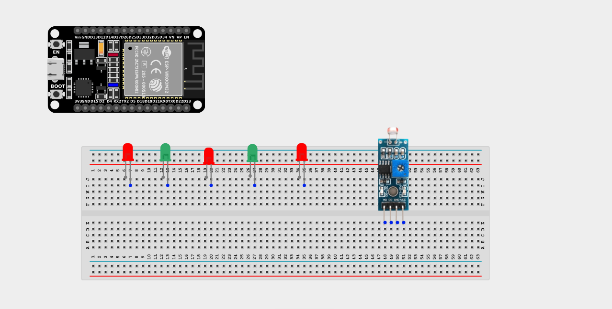
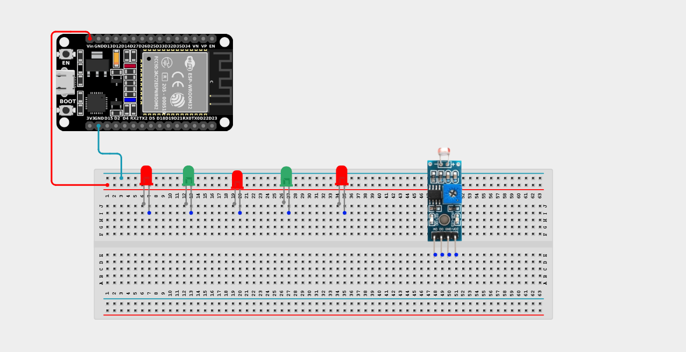
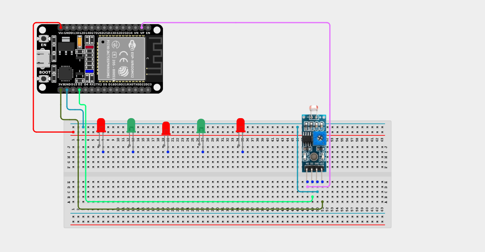
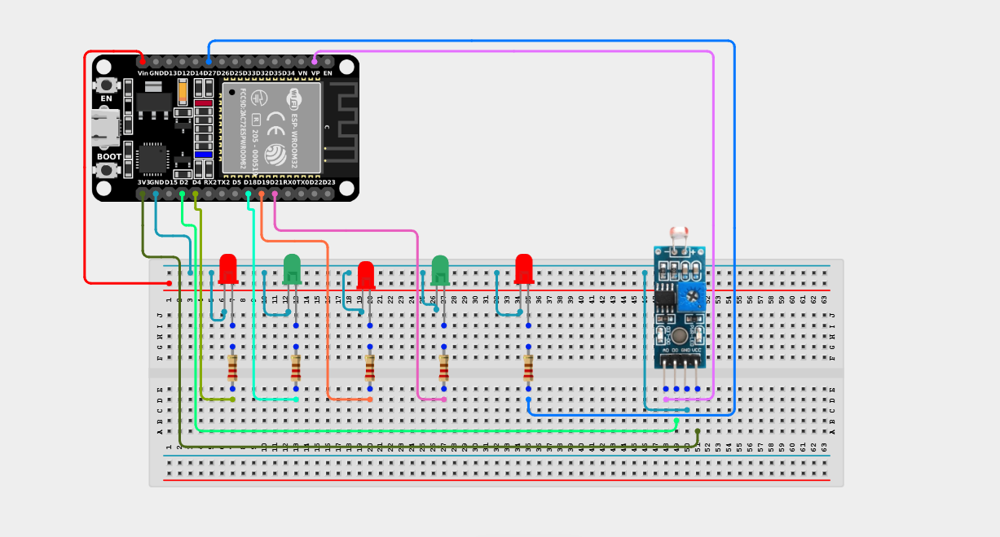

# Project 2.10.5: Smart Street Light (5 LEDs) 

| **Description** | This project demonstrates a smart street lighting system using an LDR (Light Dependent Resistor) module and five LEDs. The ESP32 board monitors the surrounding light level and automatically switches all five LEDs ON when it becomes dark and OFF when sufficient light is detected. |
|------------------|----------------------------------------------------------------|
| **Use case**     | Controlling visibility of light in streetlights at different times of the day for energy efficiency and automation. |

## Components (Things You will need)

|  |  |  |  || |
|-------------------------|-------------------------|-------------------------|-------------------------|-------------------------|-------------------------|

## Building the circuit

> **Tip:** Use the [ESP32 Pin Mapping](../../../../assets/esp32_pin_mapping.png) image to locate the correct GPIO pins on your ESP32 board.

Things Needed:

- ESP32 board = 1

- Micro USB cable = 1

- Breadboard = 1

- Jumper Wires

- LDR Sensor = 1

- Red LED = 1

- Green LED = 1

- Blue LED = 1

- White LED = 1

- Yellow LED = 1

- 220Ω Resistors = 5

---

## Mounting the components on the breadboard

**Step 1:** Mount the ESP32 and Components:

- Align the ESP32 board across the center dividing ridge of the breadboard.

- Place the LDR Sensor on the breadboard so its four pins sit in separate adjacent rows.

- Insert the five LEDs into the breadboard side-by-side, spacing them out slightly (remember the longer legs are positive).




---

## Wiring the circuit

Follow these step-by-step connection details using your jumper wires:

**Step 1:** Create Power and Ground Rails

- Connect the **5V** or **VIN** pin on the ESP32 board to the positive (red) rail on the breadboard.

- Connect a **GND** pin on the ESP32 board to the negative (blue/black) rail on the breadboard.



**Step 2:** Wire the LDR Sensor

- Connect the **VCC** pin of the LDR to the 3.3V pin on the ESP32 board (or 3.3V power rail).

- Connect the **GND** pin of the LDR to the negative power rail.

- Connect the **AO** (Analog Out) pin of the LDR to **GPIO 36** (also labeled VP) on the ESP32 board.

- Connect the **DO** (Digital Out) pin of the LDR to **GPIO 2** on the ESP32 board.



**Step 3:** Wire the LEDs

- Connect a **220Ω resistor** from the positive leg of the Red LED to **GPIO 18**.

- Connect a **220Ω resistor** from the positive leg of the Green LED to **GPIO 21**.

- Connect a **220Ω resistor** from the positive leg of the Blue LED to **GPIO 19**.

- Connect a **220Ω resistor** from the positive leg of the White LED to **GPIO 27**.

- Connect a **220Ω resistor** from the positive leg of the Yellow LED to **GPIO 4**.

- Connect the negative (shorter) legs of all five LEDs to the negative ground rail.



*Make sure to connect the Micro USB cable securely to the ESP32 board and your computer.*

---

## PROGRAMMING

**Step 1:** Open your Arduino IDE. See how to set up here: [Getting Started](../../../Getting Started/Arduino_IDE_Setup.md).

**Step 2:** Write the code in sections as detailed below.

### 1. Variables and Setup

```cpp
const int LDR_DO_PIN = 2;

const int LED_RED = 18;
const int LED_GREEN = 21;
const int LED_BLUE = 19;
const int LED_WHITE = 27;
const int LED_YELLOW = 4;

void setup() {
  Serial.begin(9600);
  
  pinMode(LDR_DO_PIN, INPUT);
  
  pinMode(LED_RED, OUTPUT);
  pinMode(LED_GREEN, OUTPUT);
  pinMode(LED_BLUE, OUTPUT);
  pinMode(LED_WHITE, OUTPUT);
  pinMode(LED_YELLOW, OUTPUT);
}
```
*Explanation:* We declare variables for the sensor's digital pin and all five LEDs. We set the LED pins as OUTPUTs in the `setup()` function.

---

### 2. Main Loop

```cpp
void loop() {
  // Read the digital value (HIGH or LOW)
  int isDark = digitalRead(LDR_DO_PIN);
  
  // If the digital pin is HIGH, it means it's dark!
  if (isDark == HIGH) {
    Serial.println("Light is not present - Turning ON streetlights");
    digitalWrite(LED_RED, HIGH);
    digitalWrite(LED_GREEN, HIGH);
    digitalWrite(LED_BLUE, HIGH);
    digitalWrite(LED_WHITE, HIGH);
    digitalWrite(LED_YELLOW, HIGH);
  } else {
    // If it's bright enough, turn everything off
    Serial.println("Light is present - Turning OFF streetlights");
    digitalWrite(LED_RED, LOW);
    digitalWrite(LED_GREEN, LOW);
    digitalWrite(LED_BLUE, LOW);
    digitalWrite(LED_WHITE, LOW);
    digitalWrite(LED_YELLOW, LOW);
  }
  
  delay(100); 
}
```
*Explanation:* When it gets dark, the sensor module outputs `HIGH`. The code detects this and flips all five LEDs on simultaneously, fully illuminating the street! When daylight returns, they all shut off to save energy.

---

## Uploading the code

**Step 3:** Save your code. _See the [Getting Started](../../../Getting Started/Arduino_IDE_Setup.md) section_

**Step 4:** Select the ESP32 board and port _See the [Getting Started](../../../Getting Started/Arduino_IDE_Setup.md) section:Selecting ESP32 board Type and Uploading your code_.

**Step 5:** Upload your code. _See the [Getting Started](../../../Getting Started/Arduino_IDE_Setup.md) section:Selecting ESP32 board Type and Uploading your code_

## Conclusion

Congratulations! You have successfully built a smart light-sensitive system using an LDR module and an ESP32 board. In this project, you learned how to detect changes in ambient light using an LDR sensor and use those readings to control an output automatically. This demonstrates the basic principles of sensor-based automation, which are widely used in smart homes, security systems, and environmental monitoring applications. Continue experimenting by adjusting the light sensitivity threshold or integrating additional components to create more advanced automation projects.
