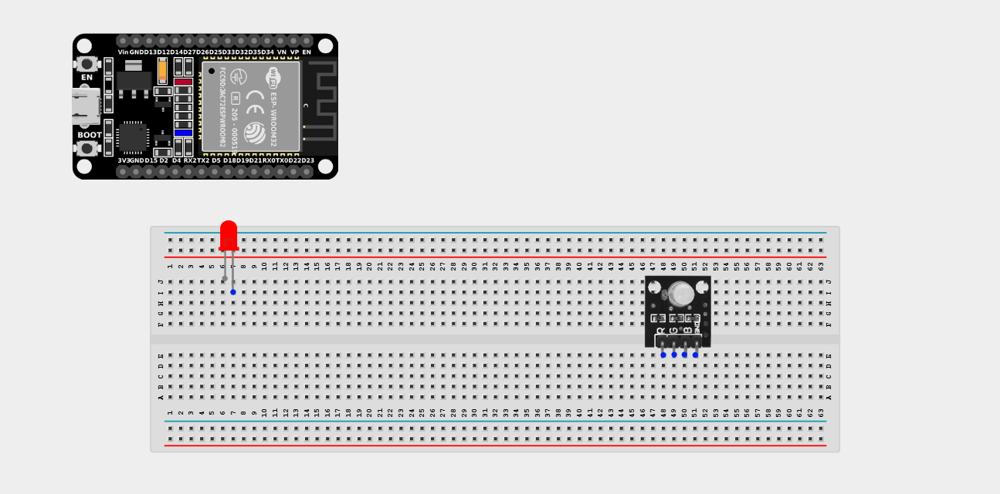
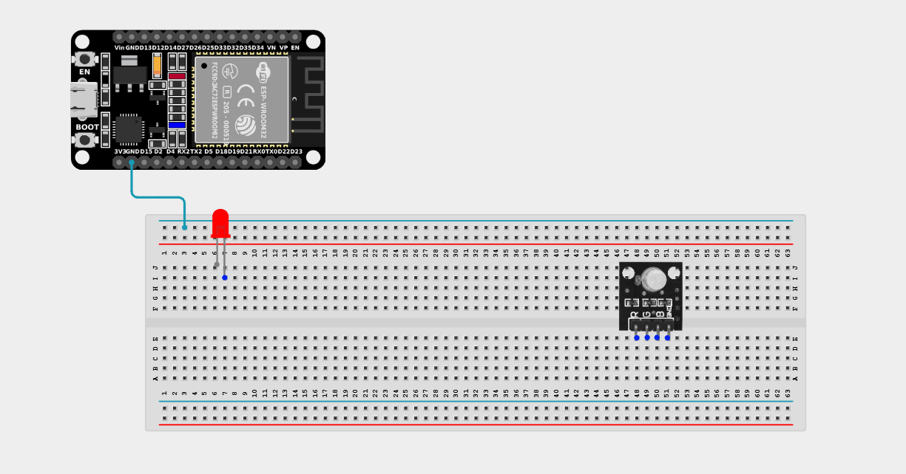
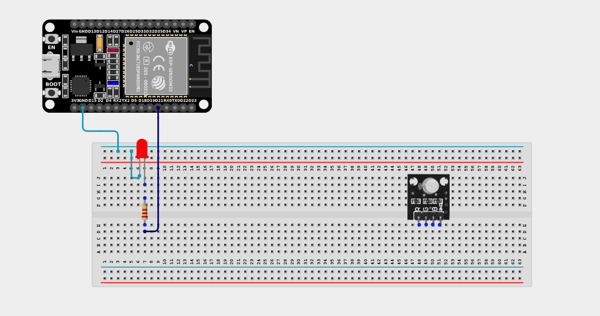
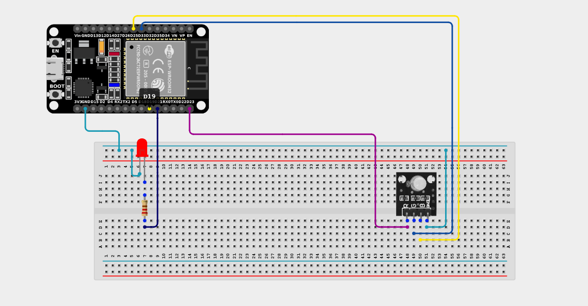

# Project 2.10.6: Diagnostic Mode Display

| **Description** | This project coordinates an LED and an RGB LED to show a system status display. The standard LED blinks steadily as a heartbeat indicator, while the RGB cycles through diagnostic colors to show system health. |
|------------------|----------------------------------------------------------------|
| **Use case**     | This project can be used in automation systems, interactive installations, and embedded control applications where visual feedback is required to diagnose system status. |

## Components (Things You will need)

| | | | | | |
|-------------------------|-------------------------|-------------------------|-------------------------|-------------------------|-------------------------|

## Building the circuit

> **Tip:** Use the [ESP32 Pin Mapping](../../../../assets/esp32_pin_mapping.png) image to locate the correct GPIO pins on your ESP32 board.

Things Needed:

- ESP32 board = 1

- Micro USB cable = 1

- Breadboard = 1

- Jumper wires 

- Standard LED (Any color) = 1

- RGB LED module = 1

- 220Ω resistor = 1

---

## Mounting the components on the breadboard

**Step 1:** Mount the ESP32 and Components:

- Align the ESP32 board across the center dividing ridge of the breadboard.

- Place the RGB LED module on the breadboard so its four pins sit in separate adjacent rows.

- Insert the standard LED into the breadboard (remember the longer leg is positive).


---

## Wiring the circuit

Follow these step-by-step connection details using your jumper wires:

**Step 1:** Create Power and Ground Rails

- Connect a **GND** pin on the ESP32 board to the negative (blue/black) rail on the breadboard.



**Step 2:** Wire the Standard LED

- Connect a **220Ω resistor** from the positive (longer) leg of the LED to **GPIO 21**.

- Connect the negative (shorter) leg of the LED to the negative ground rail.



**Step 3:** Wire the RGB LED Module

- Connect the **Red (R)** pin of the RGB Module to **GPIO 23** on the ESP32 board.

- Connect the **Green (G)** pin of the RGB Module to **GPIO 33** on the ESP32 board.

- Connect the **Blue (B)** pin of the RGB Module to **GPIO 25** on the ESP32 board.

- Connect the **GND (-) ** pin of the RGB module to the negative ground rail. *(If using a Common Anode RGB LED, connect this pin to 3.3V instead of GND).*



*Make sure to connect the Micro USB cable securely to the ESP32 board and your computer.*

---

## PROGRAMMING

**Step 1:** Open your Arduino IDE. See how to set up here: [Getting Started](../../../Getting Started/Arduino_IDE_Setup.md).

**Step 2:** Write the code in sections as detailed below.

### 1. Variables and Setup

```cpp
const int ledPin = 21;
const int redPin = 23;
const int greenPin = 33;
const int bluePin = 25;

void setup() {
  pinMode(ledPin, OUTPUT);
  pinMode(redPin, OUTPUT);
  pinMode(greenPin, OUTPUT);
  pinMode(bluePin, OUTPUT);
}
```
*Explanation:* We define the pin connections for the standard heartbeat LED and the RGB color pins.

Then we set them all as outputs in the setup function.

---

### 2. Main Loop and Custom Function

```cpp
void loop() {
  // Show Green status
  digitalWrite(ledPin, HIGH); // Heartbeat ON
  setColor(0, 255, 0);        // Green
  delay(500);
  
  digitalWrite(ledPin, LOW);  // Heartbeat OFF
  delay(500);
  
  // Show Blue status
  digitalWrite(ledPin, HIGH); // Heartbeat ON
  setColor(0, 0, 255);        // Blue
  delay(500);
  
  digitalWrite(ledPin, LOW);  // Heartbeat OFF
  delay(500);
  
  // Show Yellow status
  digitalWrite(ledPin, HIGH); // Heartbeat ON
  setColor(255, 255, 0);      // Yellow
  delay(500);
  
  digitalWrite(ledPin, LOW);  // Heartbeat OFF
  delay(500);
  
  // Show Red status
  digitalWrite(ledPin, HIGH); // Heartbeat ON
  setColor(255, 0, 0);        // Red
  delay(500);
  
  digitalWrite(ledPin, LOW);  // Heartbeat OFF
  delay(500);
}

// A custom function to easily set RGB colors using PWM values (0-255)
void setColor(int red, int green, int blue) {
  analogWrite(redPin, red);
  analogWrite(greenPin, green);
  analogWrite(bluePin, blue);
}
```
*Explanation:* 

- We use a custom `setColor()` function to mix red, green, and blue values from 0 to 255. 

- The loop cycles through Green, Blue, Yellow, and Red diagnostics.

- During each color phase, the standard LED acts as a "heartbeat", turning on and off to show the system is actively processing.

---

## Uploading the code

**Step 3:** Save your code. _See the [Getting Started](../../../Getting Started/Arduino_IDE_Setup.md) section_

**Step 4:** Select the ESP32 board and port _See the [Getting Started](../../../Getting Started/Arduino_IDE_Setup.md) section:Selecting ESP32 board Type and Uploading your code_.

**Step 5:** Upload your code. _See the [Getting Started](../../../Getting Started/Arduino_IDE_Setup.md) section:Selecting ESP32 board Type and Uploading your code_

## Conclusion

This project helps you understand how to combine multiple components with the ESP32 board to create more complex visual feedback. By separating a heartbeat status LED from a diagnostic color RGB LED, you can provide clear, readable information about a system's internal state.
