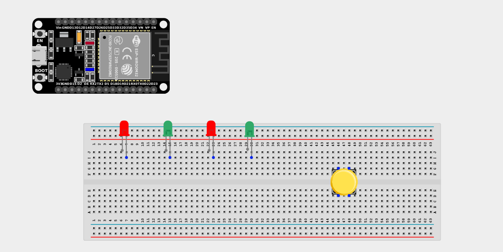
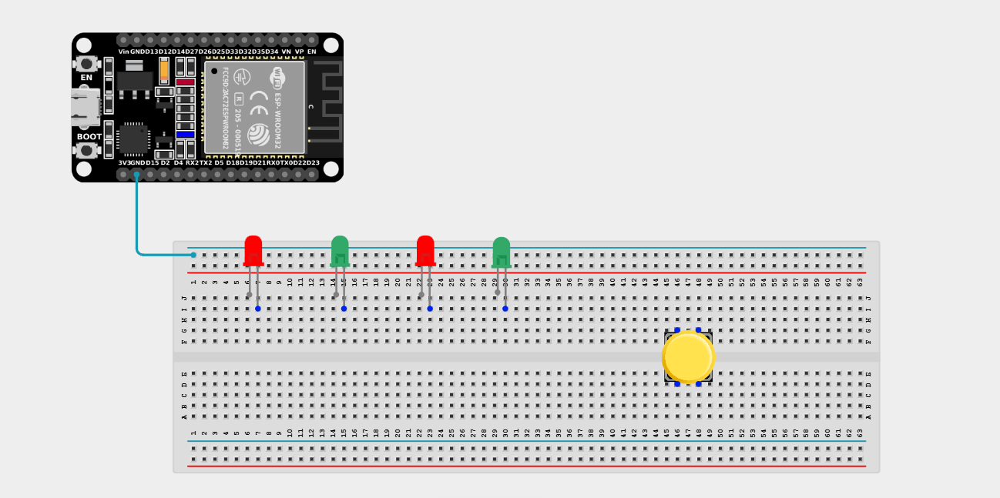
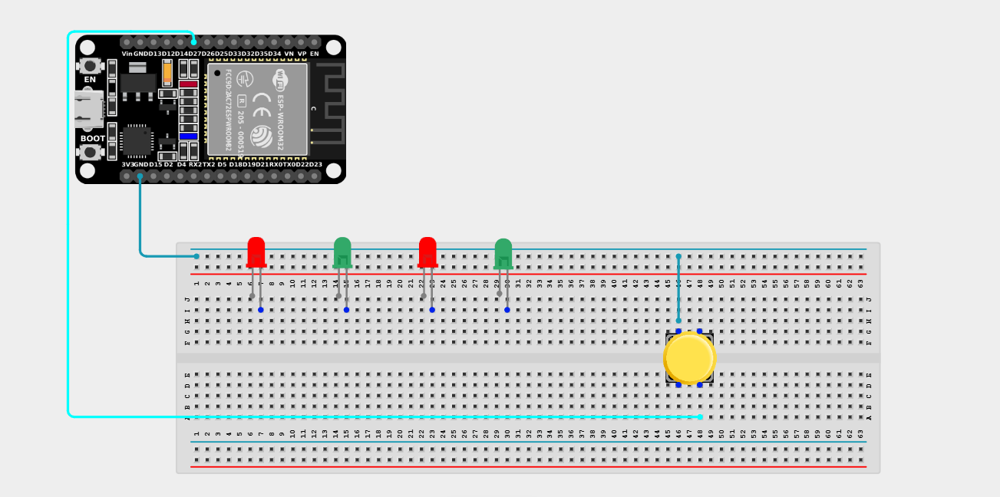
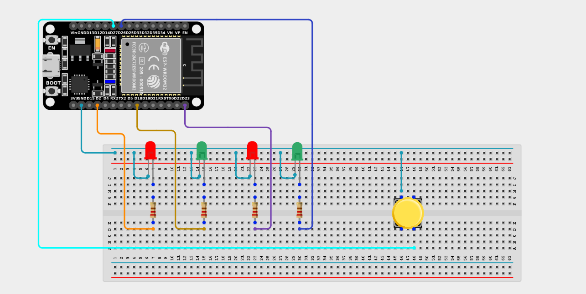

# Project 2.10.8: Four LEDs Control With Push Button

| **Description** | You will learn how to create a simple interactive lighting circuit that blinks four LEDs simultaneously while a Push Button is held down. |
| --------------- | -------------------------------------------------------------------------------------------------------------------------------------------------------------------------------------------------------------- |
| **Use case** | The use case for using a push button to control the blinking of LEDs is to provide customizable visual feedback, signaling/alerting functionality, interactive lighting, educational demonstrations, or prototyping/testing capabilities. |

## Components (Things You will need)

|  |  |  |  |  |  |  |
| ---------------------------------------- | --------------------------------------------------- | ----------------------------------------------------------- | ----------------------------------------------------- | ------------------------------------------------------ | ------------------------------------------------------- | ------------------------------------------------------- |

## Building the circuit

> **Tip:** Use the [ESP32 Pin Mapping](../../../../assets/esp32_pin_mapping.png) image to locate the correct GPIO pins on your ESP32 board.

Things Needed:

- ESP32 board = 1

- Micro USB cable = 1

- Breadboard = 1

- Jumper Wires

- Push button = 1

- LEDs = 4 (Any colors)

- 220Ω Resistors = 4

---

## Mounting the components on the breadboard

**Step 1:** Mount the ESP32 and Components:

- Align the ESP32 board across the center dividing ridge of the breadboard.

- Place the Push Button firmly across the center gap of the breadboard.

- Insert the four LEDs into the breadboard side-by-side, spacing them out slightly (remember the longer legs are positive).



---

## Wiring the circuit

Follow these step-by-step connection details using your jumper wires:

**Step 1:** Create Power and Ground Rails

- Connect a **GND** pin on the ESP32 board to the negative (blue/black) rail on the breadboard.



**Step 2:** Wire the Push Button

- Connect one terminal of the Push Button to **GPIO 27** on the ESP32 board.

- Connect the opposite terminal of the Push Button to the negative ground rail.



**Step 3:** Wire the LEDs

- Connect a **220Ω resistor** from the positive (longer) leg of the first LED to **GPIO 26**.

- Connect a **220Ω resistor** from the positive (longer) leg of the second LED to **GPIO 23**.

- Connect a **220Ω resistor** from the positive (longer) leg of the third LED to **GPIO 18**.

- Connect a **220Ω resistor** from the positive (longer) leg of the fourth LED to **GPIO 2**.

- Connect the negative (shorter) legs of all four LEDs to the negative ground rail.



*Make sure to connect the Micro USB cable securely to the ESP32 board and your computer.*

---

## PROGRAMMING

**Step 1:** Open your Arduino IDE. See how to set up here: [Getting Started](../../../Getting Started/Arduino_IDE_Setup.md).

**Step 2:** Write the code in sections as detailed below.

### 1. Variables and Setup

```cpp
const int ledPin1 = 26;
const int ledPin2 = 23;
const int ledPin3 = 18;
const int ledPin4 = 2;

const int buttonPin = 27;

void setup() {
  // Set LEDs as outputs
  pinMode(ledPin1, OUTPUT);
  pinMode(ledPin2, OUTPUT);
  pinMode(ledPin3, OUTPUT);
  pinMode(ledPin4, OUTPUT);
  
  // Set button as an INPUT_PULLUP so it doesn't float
  pinMode(buttonPin, INPUT_PULLUP);
}
```
*Explanation:* We assign variables for the 4 LED pins and the Button pin. Crucially, we use `INPUT_PULLUP` for the button. This means the pin will read `HIGH` normally, and `LOW` when the button is pressed and connects to ground.

---

### 2. Main Loop

```cpp
void loop() {
  // If the button is pressed (reads LOW)
  if (digitalRead(buttonPin) == LOW) {
    
    // Turn all 4 LEDs ON
    digitalWrite(ledPin1, HIGH);
    digitalWrite(ledPin2, HIGH);
    digitalWrite(ledPin3, HIGH);
    digitalWrite(ledPin4, HIGH);
    
    delay(500); // Wait half a second
    
    // Turn all 4 LEDs OFF
    digitalWrite(ledPin1, LOW);
    digitalWrite(ledPin2, LOW);
    digitalWrite(ledPin3, LOW);
    digitalWrite(ledPin4, LOW);
    
    delay(500); // Wait half a second
    
  } else {
    // If the button is not pressed, ensure LEDs are OFF
    digitalWrite(ledPin1, LOW);
    digitalWrite(ledPin2, LOW);
    digitalWrite(ledPin3, LOW);
    digitalWrite(ledPin4, LOW);
  }
}
```
*Explanation:* 

- The loop constantly checks if the button is pressed (`LOW`).

- If it is pressed, it flashes all four LEDs ON for half a second, then OFF for half a second. This flashing cycle will continue repeatedly for as long as you hold the button down!

- If the button is released, the `else` statement ensures all LEDs are turned completely off.

---

## Uploading the code

**Step 3:** Save your code. _See the [Getting Started](../../../Getting Started/Arduino_IDE_Setup.md) section_

**Step 4:** Select the ESP32 board and port _See the [Getting Started](../../../Getting Started/Arduino_IDE_Setup.md) section:Selecting ESP32 board Type and Uploading your code_.

**Step 5:** Upload your code. _See the [Getting Started](../../../Getting Started/Arduino_IDE_Setup.md) section:Selecting ESP32 board Type and Uploading your code_

## Conclusion

If you encounter any problems when trying to upload your code to the board, run through your code again to check for any errors or missing lines of code. If you did not encounter any problems and the program ran as expected, Congratulations on a job well done. You've successfully built an interactive alert light system using a button and multiple LEDs!
