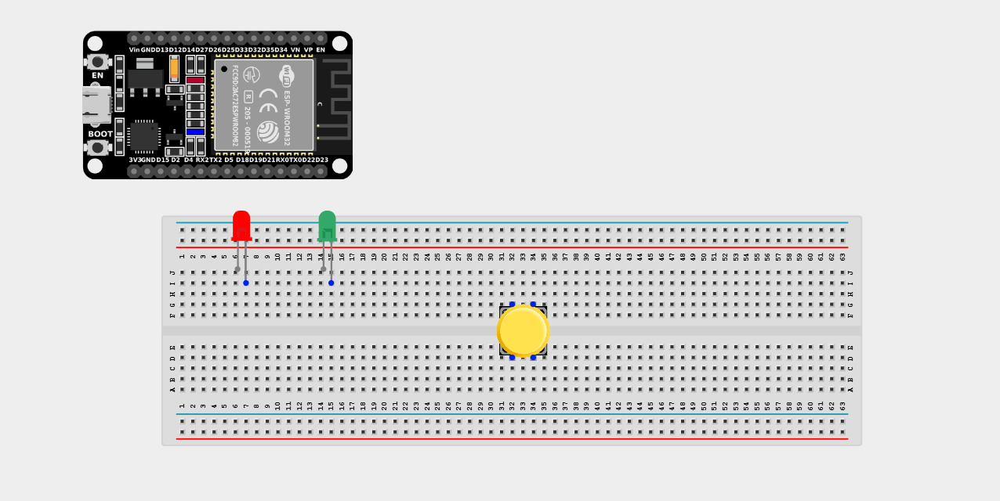
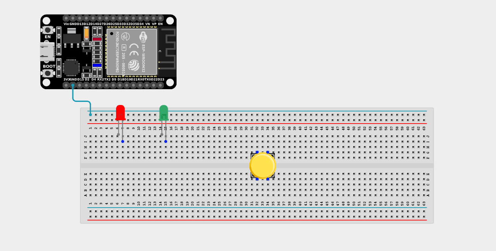
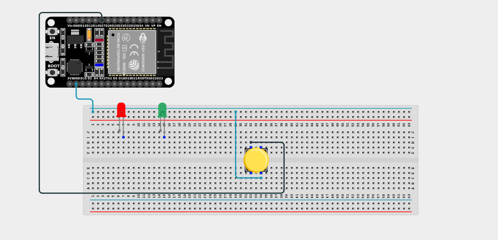
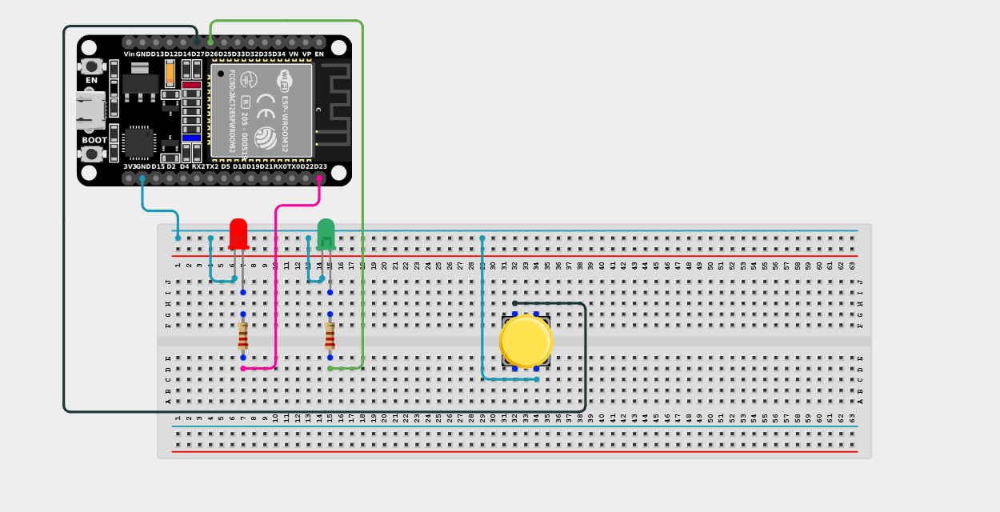

# Project 2.10.8: Two LED Blink with Push Button

| **Description** | You will learn how to create a simple circuit using an ESP32 board microcontroller and a push button to make two LEDs blink sequentially while the button is pressed. |
| --------------- | -------------------------------------------------------------------------------------------------------------------------------------------------------------------------------------------------------------- |
| **Use case**    | Imagine you want to create an interactive dual-flashing warning system (like a railroad crossing) using an ESP32 board. You want to trigger the flashing alert simply by holding down a button. |

## Components (Things You will need)

|  |  |  |  |  |  | |
| ---------------------------------------- | --------------------------------------------------- | ----------------------------------------------------------- | ----------------------------------------------------- | ------------------------------------------------------ | ------------------------------------------------------- |--------------------------------------------------- | 

## Building the circuit

> **Tip:** Use the [ESP32 Pin Mapping](../../../../assets/esp32_pin_mapping.png) image to locate the correct GPIO pins on your ESP32 board.

Things Needed:

- ESP32 board = 1

- Micro USB cable = 1

- Breadboard = 1

- Jumper Wires

- Push button = 1

- LEDs (e.g., Red and Yellow) = 2

- 220Ω Resistors = 2

---

## Mounting the components on the breadboard

**Step 1:** Mount the ESP32 and Components:

- Align the ESP32 board across the center dividing ridge of the breadboard.

- Place the Push Button firmly across the center gap of the breadboard.

- Insert the two LEDs into the breadboard (remember the longer legs are positive).



---

## Wiring the circuit

Follow these step-by-step connection details using your jumper wires:

**Step 1:** Create Power and Ground Rails

- Connect a **GND** pin on the ESP32 board to the negative (blue/black) rail on the breadboard.



**Step 2:** Wire the Push Button

- Connect one terminal of the Push Button to **GPIO 27** on the ESP32 board.

- Connect the opposite terminal of the Push Button to the negative ground rail.



**Step 3:** Wire the LEDs

- Connect a **220Ω resistor** from the positive (longer) leg of the first LED to **GPIO 26**.

- Connect a **220Ω resistor** from the positive (longer) leg of the second LED to **GPIO 23**.

- Connect the negative (shorter) legs of both LEDs to the negative ground rail.




*Make sure to connect the Micro USB cable securely to the ESP32 board and your computer.*

---

## PROGRAMMING

**Step 1:** Open your Arduino IDE. See how to set up here: [Getting Started](../../../Getting Started/Arduino_IDE_Setup.md).

**Step 2:** Write the code in sections as detailed below.

### 1. Variables and Setup

```cpp
const int buttonPin = 27;
const int ledPin1 = 26;
const int ledPin2 = 23;

void setup() {
  pinMode(ledPin1, OUTPUT);
  pinMode(ledPin2, OUTPUT);
  pinMode(buttonPin, INPUT_PULLUP);
}
```
*Explanation:* We assign our button to pin 27 and our two LEDs to pins 26 and 23. Using `INPUT_PULLUP` means the button pin reads `HIGH` when not pressed, and `LOW` when pressed.

---

### 2. Main Loop

```cpp
void loop() {
  // If the button is pressed (LOW)
  if (digitalRead(buttonPin) == LOW) {
    
    // Flash BOTH LEDs ON
    digitalWrite(ledPin1, HIGH);
    digitalWrite(ledPin2, HIGH);
    delay(500); // Wait half a second
    
    // Flash BOTH LEDs OFF
    digitalWrite(ledPin1, LOW);
    digitalWrite(ledPin2, LOW);
    delay(500); // Wait half a second
    
  } else {
    // Keep LEDs OFF if button is not pressed
    digitalWrite(ledPin1, LOW);
    digitalWrite(ledPin2, LOW);
  }
}
```
*Explanation:* The code constantly monitors the button. If it is held down (`LOW`), it enters a flashing block. It turns both LEDs ON for 500ms, then OFF for 500ms. Since it's in the `loop()`, it will keep flashing as long as you hold the button! If you release it, it hits the `else` block and stays completely off.

---

## Uploading the code

**Step 3:** Save your code. _See the [Getting Started](../../../Getting Started/Arduino_IDE_Setup.md) section_

**Step 4:** Select the ESP32 board and port _See the [Getting Started](../../../Getting Started/Arduino_IDE_Setup.md) section:Selecting ESP32 board Type and Uploading your code_.

**Step 5:** Upload your code. _See the [Getting Started](../../../Getting Started/Arduino_IDE_Setup.md) section:Selecting ESP32 board Type and Uploading your code_

## Conclusion

If you encounter any problems when trying to upload your code to the board, run through your code again to check for any errors or missing lines of code. If you did not encounter any problems and the program ran as expected, Congratulations on a job well done. You've successfully built an interactive dual-blinking light system!
