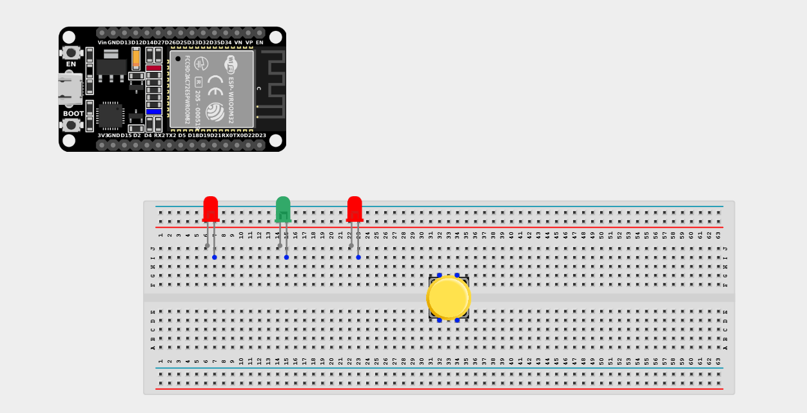
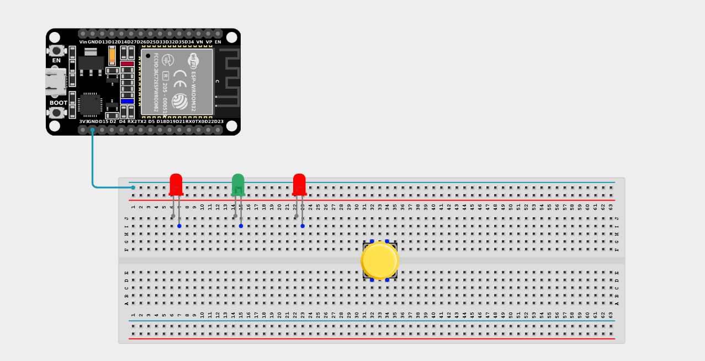
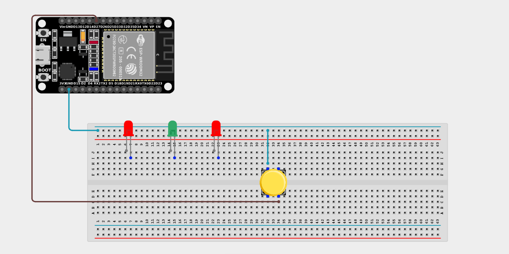
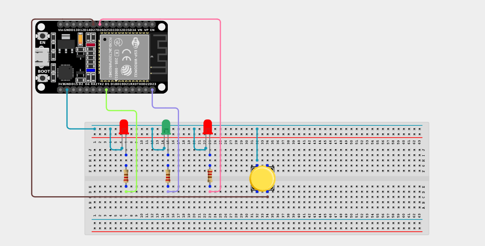

# Project 2.10.9: Three LEDs Control With Push Button

| **Description** | You will learn how to create a simple circuit using an ESP32 board microcontroller and a push button to control three LEDs simultaneously. |
| --------------- | -------------------------------------------------------------------------------------------------------------------------------------------------------------------------------------------------------------- |
| **Use case**    | Imagine you want to create an interactive lighting system for your room using an ESP32 board and push buttons. You want to trigger a multi-light display with a simple press of a button. |

## Components (Things You will need)

|  |  |  |  |  |  |  |
| ---------------------------------------- | --------------------------------------------------- | ----------------------------------------------------------- | ----------------------------------------------------- | ------------------------------------------------------ | ------------------------------------------------------- |------------------------------------------------------- |

## Building the circuit

> **Tip:** Use the [ESP32 Pin Mapping](../../../../assets/esp32_pin_mapping.png) image to locate the correct GPIO pins on your ESP32 board.

Things Needed:

- ESP32 board = 1

- Micro USB cable = 1

- Breadboard = 1

- Jumper Wires

- Push button = 1

- LEDs (e.g., Red, Yellow, Green) = 3

- 220Ω Resistors = 3

---

## Mounting the components on the breadboard

**Step 1:** Mount the ESP32 and Components:

- Align the ESP32 board across the center dividing ridge of the breadboard.

- Place the Push Button firmly across the center gap of the breadboard.

- Insert the three LEDs into the breadboard side-by-side, spacing them out slightly (remember the longer legs are positive).



---

## Wiring the circuit

Follow these step-by-step connection details using your jumper wires:

**Step 1:** Create Power and Ground Rails

- Connect a **GND** pin on the ESP32 board to the negative (blue/black) rail on the breadboard.



**Step 2:** Wire the Push Button

- Connect one terminal of the Push Button to **GPIO 27** on the ESP32 board.

- Connect the opposite terminal of the Push Button to the negative ground rail.



**Step 3:** Wire the LEDs

- Connect a **220Ω resistor** from the positive (longer) leg of the first LED to **GPIO 26**.

- Connect a **220Ω resistor** from the positive (longer) leg of the second LED to **GPIO 23**.

- Connect a **220Ω resistor** from the positive (longer) leg of the third LED to **GPIO 5**.

- Connect the negative (shorter) legs of all three LEDs to the negative ground rail.



*Make sure to connect the Micro USB cable securely to the ESP32 board and your computer.*

---

## PROGRAMMING

**Step 1:** Open your Arduino IDE. See how to set up here: [Getting Started](../../../Getting Started/Arduino_IDE_Setup.md).

**Step 2:** Write the code in sections as detailed below.

### 1. Variables and Setup

```cpp
const int buttonPin = 27;
const int ledPin1 = 26;
const int ledPin2 = 23;
const int ledPin3 = 5;

void setup() {
  pinMode(ledPin1, OUTPUT);
  pinMode(ledPin2, OUTPUT);
  pinMode(ledPin3, OUTPUT);
  
  // Use internal pull-up resistor so the button doesn't float
  pinMode(buttonPin, INPUT_PULLUP);
}
```
*Explanation:* We declare variables for the three LED pins and the Push Button pin. We set the LED pins as `OUTPUT`s and the button as an `INPUT_PULLUP`. This ensures the button reads `HIGH` when unpressed and `LOW` when pressed.

---

### 2. Main Loop

```cpp
void loop() {
  // Read the button state
  int buttonState = digitalRead(buttonPin);
  
  if (buttonState == LOW) {
    // If the button is pressed down, turn all 3 LEDs ON
    digitalWrite(ledPin1, HIGH);
    digitalWrite(ledPin2, HIGH);
    digitalWrite(ledPin3, HIGH);
  } else {
    // If the button is released, turn all 3 LEDs OFF
    digitalWrite(ledPin1, LOW);
    digitalWrite(ledPin2, LOW);
    digitalWrite(ledPin3, LOW);
  }
}
```
*Explanation:* The loop continuously monitors the push button. As long as you are actively holding it down (`LOW`), it will switch on all three LEDs to illuminate your space. When you let go, it reverts to the `else` block and turns them off.

---

## Uploading the code

**Step 3:** Save your code. _See the [Getting Started](../../../Getting Started/Arduino_IDE_Setup.md) section_

**Step 4:** Select the ESP32 board and port _See the [Getting Started](../../../Getting Started/Arduino_IDE_Setup.md) section:Selecting ESP32 board Type and Uploading your code_.

**Step 5:** Upload your code. _See the [Getting Started](../../../Getting Started/Arduino_IDE_Setup.md) section:Selecting ESP32 board Type and Uploading your code_

## Conclusion

If you encounter any problems when trying to upload your code to the board, run through your code again to check for any errors or missing lines of code. If you did not encounter any problems and the program ran as expected, Congratulations on a job well done. You now know how to operate three independent outputs with a single interactive input!
