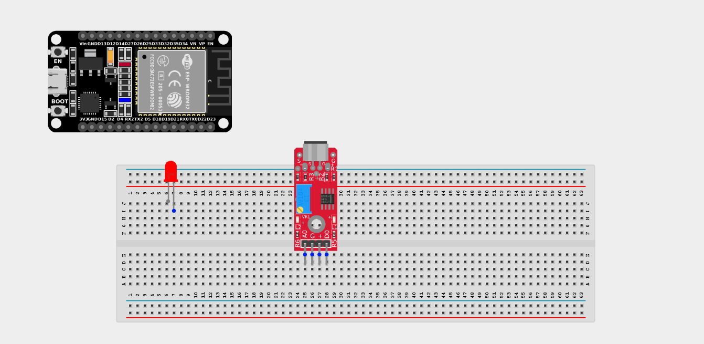
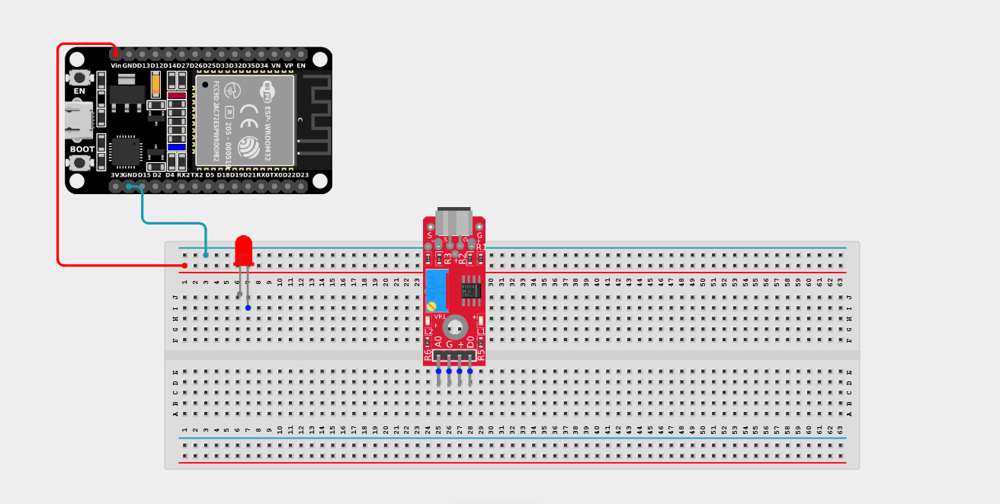
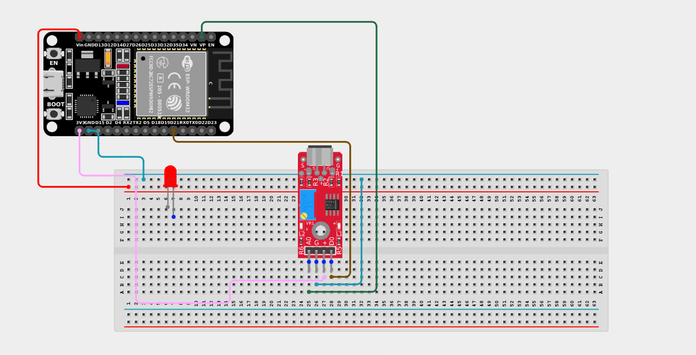
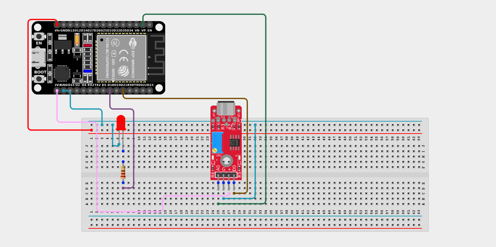

# Project 2.10.16: Operating A Sound Sensor With One LED

| **Description** | This project demonstrates how to use a sound sensor and an LED with an ESP32 board to detect sound and respond by turning on the LED. |
|------------------|----------------------------------------------------------------|
| **Use case**     | This project can be used in a clap-activated lighting system where the LED turns on when a sound such as a clap is detected. For example, a person can clap to activate a light in a room without using a switch. |

## Components (Things You will need)

|  |  |  ||  | |
|-------------------------|-------------------------|-------------------------|-------------------------|-------------------------|-------------------------|

## Building the circuit

> **Tip:** Use the [ESP32 Pin Mapping](../../../../assets/esp32_pin_mapping.png) image to locate the correct GPIO pins on your ESP32 board.

Things Needed:

- ESP32 board = 1

- Micro USB cable = 1

- Breadboard = 1

- Jumper Wires 

- Sound sensor = 1

- LED (Any color) = 1

- 220Ω Resistor = 1

---

## Mounting the components on the breadboard

**Step 1:** Mount the ESP32 and Components:

- Align the ESP32 board across the center dividing ridge of the breadboard.

- Place the Sound Sensor on the breadboard so its four pins sit in separate adjacent rows.

- Insert the LED into the breadboard (remember the longer leg is positive).



---

## Wiring the circuit

Follow these step-by-step connection details using your jumper wires:

**Step 1:** Create Power and Ground Rails

- Connect the **5V** or **VIN** pin on the ESP32 board to the positive (red) rail on the breadboard.

- Connect a **GND** pin on the ESP32 board to the negative (blue/black) rail on the breadboard.



**Step 2:** Wire the Sound Sensor

- Connect the **VCC** pin of the Sound Sensor to the 3.3V pin on the ESP32 board (or 3.3V power rail).

- Connect the **GND** pin of the Sound Sensor to the negative power rail.

- Connect the **AO (Analog Out)** pin of the Sound Sensor to **GPIO 36 (VP)** on the ESP32 board.

- Connect the **DO (Digital Out)** pin of the Sound Sensor to **GPIO 21** on the ESP32 board.



**Step 3:** Wire the LED

- Connect a **220Ω resistor** from the positive (longer) leg of the LED to **GPIO 18** on the ESP32 board.

- Connect the negative (shorter) leg of the LED to the negative ground rail.



*Make sure to connect the Micro USB cable securely to the ESP32 board and your computer.*

---

## PROGRAMMING

**Step 1:** Open your Arduino IDE. See how to set up here: [Getting Started](../../../Getting Started/Arduino_IDE_Setup.md).

**Step 2:** Write the code in sections as detailed below.

### 1. Variables and Setup

```cpp
const int soundSensorAOPin = 36; 
const int soundSensorDOPin = 21;
const int ledPin = 18; 

void setup() {
  Serial.begin(9600); 
  
  pinMode(ledPin, OUTPUT); 
  pinMode(soundSensorDOPin, INPUT);  
  pinMode(soundSensorAOPin, INPUT);
}
```
*Explanation:* We declare the Analog (AO) and Digital (DO) pins for the sound sensor, and the output pin for the LED. We set the sensor pins as `INPUT`s to read sound levels from our environment.

---

### 2. Main Loop

```cpp
void loop() {
  // Read both Digital and Analog values from the sensor
  int sensorDigital = digitalRead(soundSensorDOPin); 
  int soundValue = analogRead(soundSensorAOPin); 
  
  // Print the analog sound value to the Serial Monitor
  Serial.println(soundValue);
  
  // Check if the sound level crosses a threshold (e.g. a loud clap)
  // You might need to adjust "100" based on your sensor's sensitivity
  if (soundValue > 100) {
    digitalWrite(ledPin, HIGH); // Turn LED ON
    delay(200);                 // Keep it on for a short time
  } else {
    digitalWrite(ledPin, LOW);  // Turn LED OFF
  }
}
```
*Explanation:* 

- We use `analogRead()` to get a precise number representing the volume of the sound.

- If the volume exceeds our threshold (like `100`), the code triggers the LED to turn on. 

- You can monitor the raw sound values in the Serial Monitor and tweak the threshold value if your room is noisy or the clap isn't being registered!

---

## Uploading the code

**Step 3:** Save your code. _See the [Getting Started](../../../Getting Started/Arduino_IDE_Setup.md) section_

**Step 4:** Select the ESP32 board and port _See the [Getting Started](../../../Getting Started/Arduino_IDE_Setup.md) section:Selecting ESP32 board Type and Uploading your code_.

**Step 5:** Upload your code. _See the [Getting Started](../../../Getting Started/Arduino_IDE_Setup.md) section:Selecting ESP32 board Type and Uploading your code_

## Conclusion

This project demonstrates how a sound sensor can detect volume levels and automatically control an LED using an ESP32 board. It helps in understanding sensor input, threshold-based logic, and basic ESP32 programming for real-life applications such as smart clap-activated lights.
