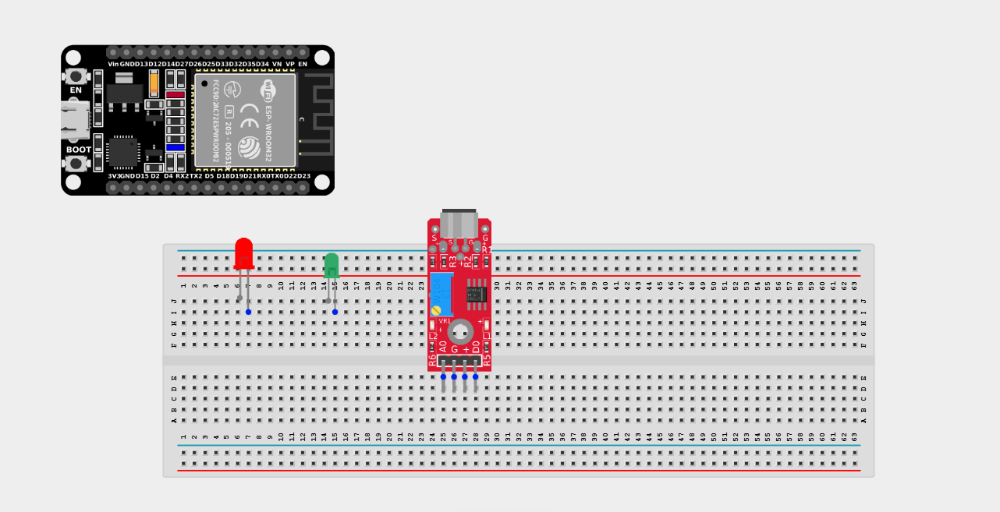
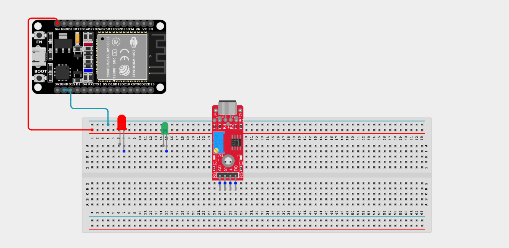
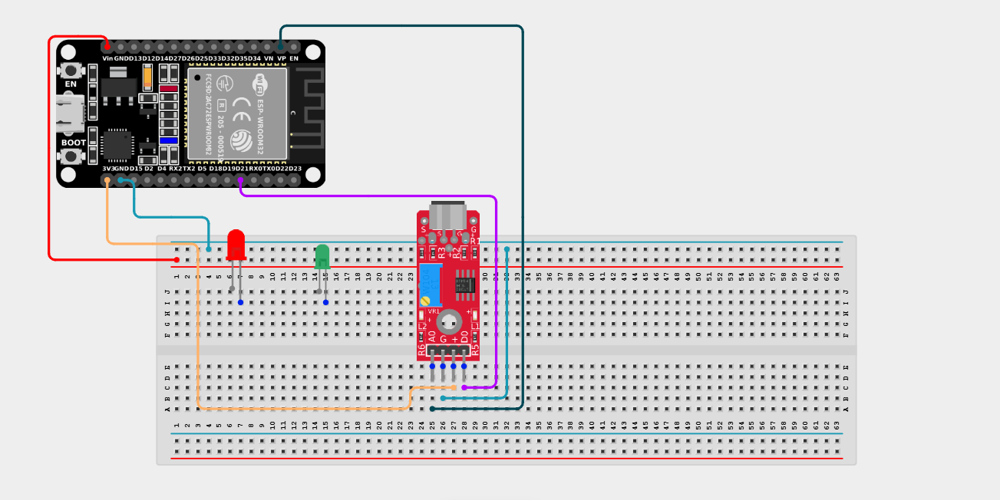
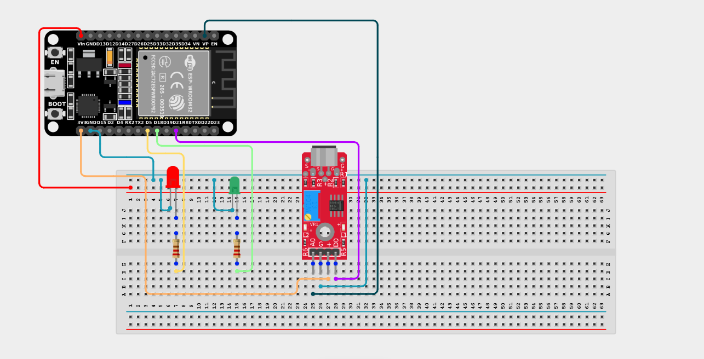

# Project 2.10.17: Operating A Sound Sensor With Two LEDs

| **Description** | This project uses a sound sensor with an ESP32 board to detect sound levels in the environment. The sensor reads analog sound signals and responds by controlling two LEDs to visually indicate sound intensity. |
|------------------|----------------------------------------------------------------|
| **Use case**     | This project can be used as a basic volume meter or noise-level warning system. A green LED can show baseline noise, while a red LED warns when the environment gets too loud! |

## Components (Things You will need)

|  |  |  |||||
|-------------------------|-------------------------|-------------------------|-------------------------|------------------------|--------------------------|--------------------------|

## Building the circuit

> **Tip:** Use the [ESP32 Pin Mapping](../../../../assets/esp32_pin_mapping.png) image to locate the correct GPIO pins on your ESP32 board.

Things Needed:

- ESP32 board = 1  

- Micro USB cable = 1

- Breadboard = 1

- Jumper Wires

- Sound Sensor = 1

- LEDs (e.g., Red and Green) = 2

- 220Ω Resistors = 2

---

## Mounting the components on the breadboard

**Step 1:** Mount the ESP32 and Components:

- Align the ESP32 board across the center dividing ridge of the breadboard.

- Place the Sound Sensor on the breadboard so its four pins sit in separate adjacent rows.

- Insert the two LEDs into the breadboard (remember the longer legs are positive).



---

## Wiring the circuit

Follow these step-by-step connection details using your jumper wires:

**Step 1:** Create Power and Ground Rails

- Connect the **5V** or **VIN** pin on the ESP32 board to the positive (red) rail on the breadboard.

- Connect a **GND** pin on the ESP32 board to the negative (blue/black) rail on the breadboard.



**Step 2:** Wire the Sound Sensor

- Connect the **VCC** pin of the Sound Sensor to the 3.3V pin on the ESP32 board (or 3.3V power rail).

- Connect the **GND** pin of the Sound Sensor to the negative power rail.

- Connect the **AO (Analog Out)** pin of the Sound Sensor to **GPIO 36 (VP)** on the ESP32 board.

- Connect the **DO (Digital Out)** pin of the Sound Sensor to **GPIO 21** on the ESP32 board.



**Step 3:** Wire the LEDs

- Connect a **220Ω resistor** from the positive (longer) leg of the first LED to **GPIO 18** on the ESP32 board.

- Connect a **220Ω resistor** from the positive (longer) leg of the second LED to **GPIO 5** on the ESP32 board.

- Connect the negative (shorter) legs of both LEDs to the negative ground rail.



*Make sure to connect the Micro USB cable securely to the ESP32 board and your computer.*

---

## PROGRAMMING

**Step 1:** Open your Arduino IDE. See how to set up here: [Getting Started](../../../Getting Started/Arduino_IDE_Setup.md).

**Step 2:** Write the code in sections as detailed below.

### 1. Variables and Setup

```cpp
const int soundSensorAOPin = 36; 
const int soundSensorDOPin = 21;
const int ledPin1 = 18;
const int ledPin2 = 5; 

void setup() {
  Serial.begin(9600); 
  
  pinMode(ledPin1, OUTPUT); 
  pinMode(ledPin2, OUTPUT);
  pinMode(soundSensorDOPin, INPUT);  
  pinMode(soundSensorAOPin, INPUT);
}
```
*Explanation:* We declare variables for the sensor and our two LEDs. We then set them up as `OUTPUT`s and `INPUT`s respectively. The Serial monitor is also initialized to 9600 baud so we can view the live sound data.

---

### 2. Main Loop

```cpp
void loop() {
  // Read analog value from the sensor
  int soundValue = analogRead(soundSensorAOPin); 
  
  // Print the analog sound value to the Serial Monitor
  Serial.println(soundValue);
  
  // Create volume thresholds
  if (soundValue > 200) {
    // Very loud! Turn both LEDs ON
    digitalWrite(ledPin1, HIGH); 
    digitalWrite(ledPin2, HIGH);
  } 
  else if (soundValue > 100) {
    // Medium noise. Turn 1 LED ON, 1 OFF
    digitalWrite(ledPin1, HIGH); 
    digitalWrite(ledPin2, LOW);
  } 
  else {
    // Quiet. Turn all LEDs OFF
    digitalWrite(ledPin1, LOW);
    digitalWrite(ledPin2, LOW);
  }
  
  delay(50); // Small delay to stabilize readings
}
```
*Explanation:* 

- We read the raw analog sound volume into the variable `soundValue`.

- We use an `if...else if...else` structure to create a multi-level volume meter!

- If it's very loud (>200), both LEDs activate. If it's just moderately loud (>100), only the first LED activates. Otherwise, they stay off. *(You may need to adjust these threshold numbers based on your specific sensor's sensitivity).*

---

## Uploading the code

**Step 3:** Save your code. _See the [Getting Started](../../../Getting Started/Arduino_IDE_Setup.md) section_

**Step 4:** Select the ESP32 board and port _See the [Getting Started](../../../Getting Started/Arduino_IDE_Setup.md) section:Selecting ESP32 board Type and Uploading your code_.

**Step 5:** Upload your code. _See the [Getting Started](../../../Getting Started/Arduino_IDE_Setup.md) section:Selecting ESP32 board Type and Uploading your code_

## Conclusion

This project demonstrated how a sound sensor can be used with an ESP32 board to detect sound levels and control multiple LEDs as a scale. It helps in understanding how analog sound signals can trigger different outputs, allowing you to create multi-stage visual indicators like volume meters or noise alarms!
