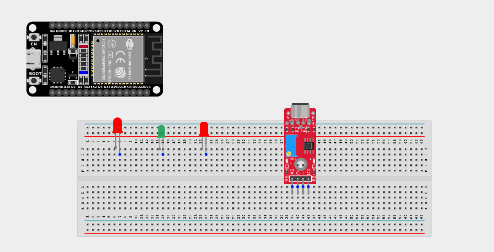
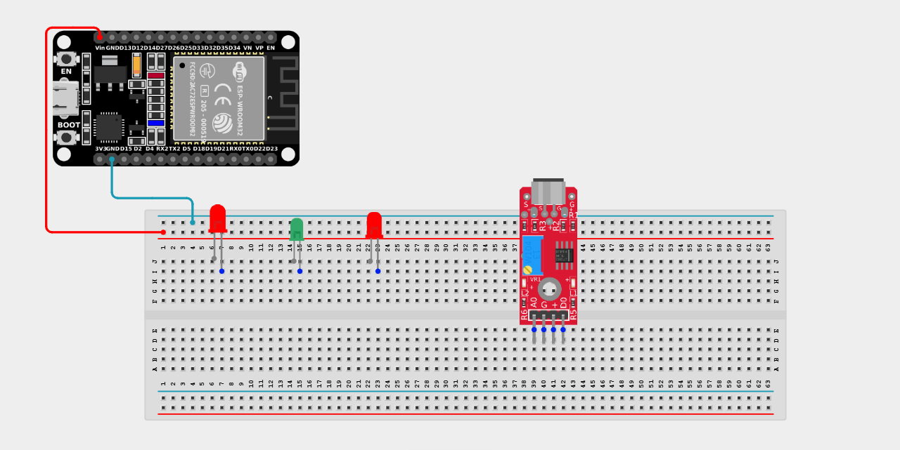
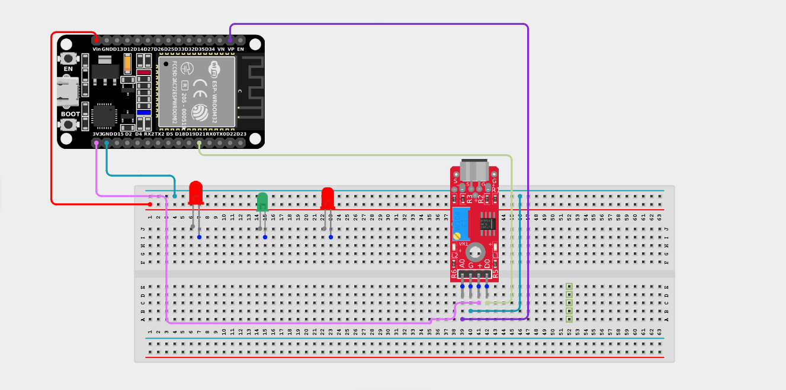
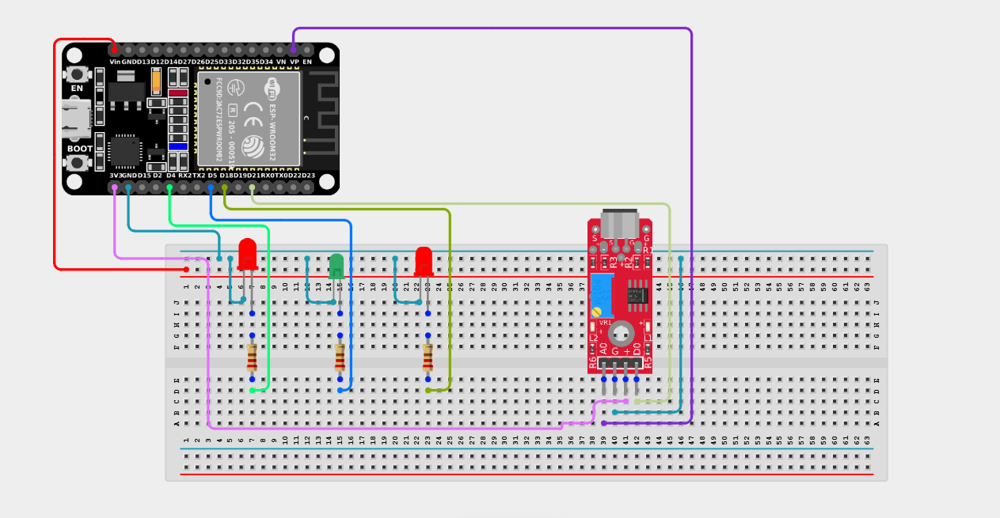

# Project 2.10.18: Operating A Sound Sensor With Three LEDs

| **Description** | This project uses a sound sensor with an ESP32 board to detect sound levels in the environment and responds by controlling three LEDs. This creates a multi-level visual indicator for sound intensity. |
|------------------|----------------------------------------------------------------|
| **Use case**     | This project acts as a complete visual volume meter! A green LED shows low sound levels, a yellow LED indicates medium sound levels, and a red LED activates when the sound is extremely high, acting as an alert. |

## Components (Things You will need)

|  |  |  || | | |
|-------------------------|-------------------------|-------------------------|-------------------------|------------------------|--------------------------|--------------------------|

## Building the circuit

> **Tip:** Use the [ESP32 Pin Mapping](../../../../assets/esp32_pin_mapping.png) image to locate the correct GPIO pins on your ESP32 board.

Things Needed:

- ESP32 board = 1  

- Micro USB cable = 1

- Breadboard = 1

- Jumper Wires 

- Sound Sensor = 1

- LEDs (e.g., Green, Yellow, Red) = 3

- 220Ω Resistors = 3

---

## Mounting the components on the breadboard

**Step 1:** Mount the ESP32 and Components:

- Align the ESP32 board across the center dividing ridge of the breadboard.

- Place the Sound Sensor on the breadboard so its four pins sit in separate adjacent rows.

- Insert the three LEDs into the breadboard (remember the longer legs are positive).



---

## Wiring the circuit

Follow these step-by-step connection details using your jumper wires:

**Step 1:** Create Power and Ground Rails

- Connect the **5V** or **VIN** pin on the ESP32 board to the positive (red) rail on the breadboard.

- Connect a **GND** pin on the ESP32 board to the negative (blue/black) rail on the breadboard.



**Step 2:** Wire the Sound Sensor

- Connect the **VCC** pin of the Sound Sensor to the 3.3V pin on the ESP32 board (or 3.3V power rail).

- Connect the **GND** pin of the Sound Sensor to the negative power rail.

- Connect the **AO (Analog Out)** pin of the Sound Sensor to **GPIO 36 (VP)** on the ESP32 board.

- Connect the **DO (Digital Out)** pin of the Sound Sensor to **GPIO 21** on the ESP32 board.



**Step 3:** Wire the LEDs

- Connect a **220Ω resistor** from the positive (longer) leg of the first LED to **GPIO 18** on the ESP32 board.

- Connect a **220Ω resistor** from the positive (longer) leg of the second LED to **GPIO 5** on the ESP32 board.

- Connect a **220Ω resistor** from the positive (longer) leg of the third LED to **GPIO 4** on the ESP32 board.

- Connect the negative (shorter) legs of all three LEDs to the negative ground rail.



*Make sure to connect the Micro USB cable securely to the ESP32 board and your computer.*

---

## PROGRAMMING

**Step 1:** Open your Arduino IDE. See how to set up here: [Getting Started](../../../Getting Started/Arduino_IDE_Setup.md).

**Step 2:** Write the code in sections as detailed below.

### 1. Variables and Setup

```cpp
const int soundSensorAOPin = 36; 
const int soundSensorDOPin = 21; 
const int ledPin1 = 18;
const int ledPin2 = 5; 
const int ledPin3 = 4;

void setup() {
  Serial.begin(9600); 
  
  pinMode(ledPin1, OUTPUT); 
  pinMode(ledPin2, OUTPUT);
  pinMode(ledPin3, OUTPUT);
  
  pinMode(soundSensorDOPin, INPUT);  
  pinMode(soundSensorAOPin, INPUT);
}
```
*Explanation:* We assign our pins for the 3 LEDs and the analog/digital pins of the sound sensor. All LEDs are set as `OUTPUT`s, while the sensor pins are `INPUT`s. The Serial Monitor is activated to allow us to read live sensor data.

---

### 2. Main Loop

```cpp
void loop() {
  // Read analog value from the sensor
  int soundValue = analogRead(soundSensorAOPin); 
  
  // Print the analog sound value to the Serial Monitor
  Serial.println(soundValue);
  
  // Multi-tier volume meter!
  if (soundValue > 300) {
    // Extremely loud! All 3 LEDs ON
    digitalWrite(ledPin1, HIGH); 
    digitalWrite(ledPin2, HIGH);
    digitalWrite(ledPin3, HIGH);
  } 
  else if (soundValue > 200) {
    // Medium noise. 2 LEDs ON
    digitalWrite(ledPin1, HIGH); 
    digitalWrite(ledPin2, HIGH);
    digitalWrite(ledPin3, LOW);
  } 
  else if (soundValue > 100) {
    // Quiet noise. 1 LED ON
    digitalWrite(ledPin1, HIGH); 
    digitalWrite(ledPin2, LOW);
    digitalWrite(ledPin3, LOW);
  } 
  else {
    // Silence. All LEDs OFF
    digitalWrite(ledPin1, LOW);
    digitalWrite(ledPin2, LOW);
    digitalWrite(ledPin3, LOW);
  }
  
  delay(50); // Small delay to stabilize readings
}
```
*Explanation:* We take the raw analog `soundValue` and pass it through a layered `if...else if` statement. As the sound increases and breaks higher thresholds, more LEDs are lit up sequentially, mimicking a DJ's audio visualizer or a noise-level warning board! *(You can tweak the 100, 200, 300 threshold values depending on how sensitive your sensor module is).*

---

## Uploading the code

**Step 3:** Save your code. _See the [Getting Started](../../../Getting Started/Arduino_IDE_Setup.md) section_

**Step 4:** Select the ESP32 board and port _See the [Getting Started](../../../Getting Started/Arduino_IDE_Setup.md) section:Selecting ESP32 board Type and Uploading your code_.

**Step 5:** Upload your code. _See the [Getting Started](../../../Getting Started/Arduino_IDE_Setup.md) section:Selecting ESP32 board Type and Uploading your code_

## Conclusion

This project demonstrated how a sound sensor can be used with an ESP32 board to detect and display sound levels using multiple LEDs. It helped in understanding how analog sensor values can control a scale of different outputs based on intensity, making it an excellent foundation for audio visualizers and noise monitoring devices.
