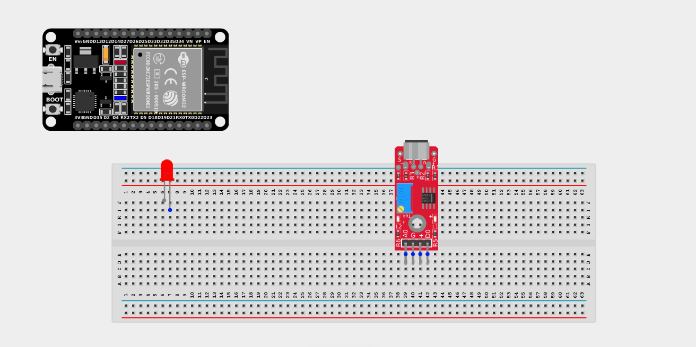
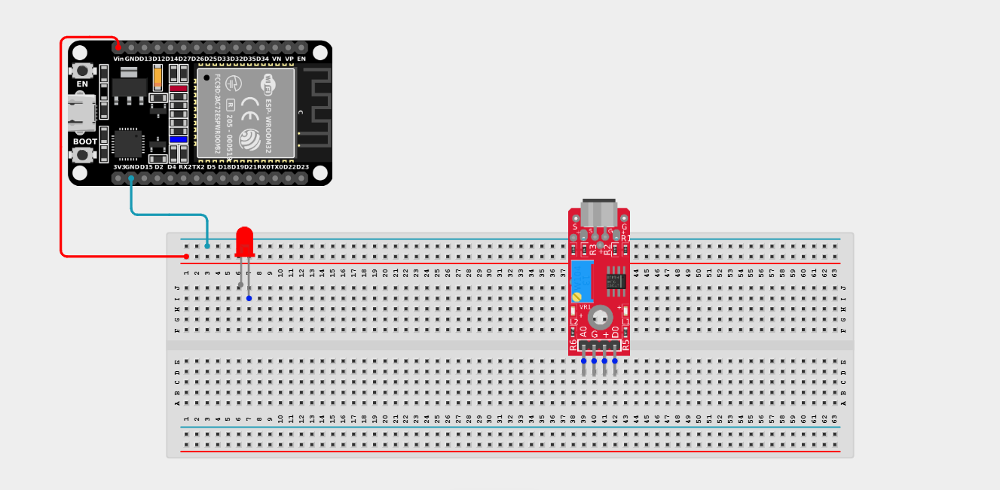
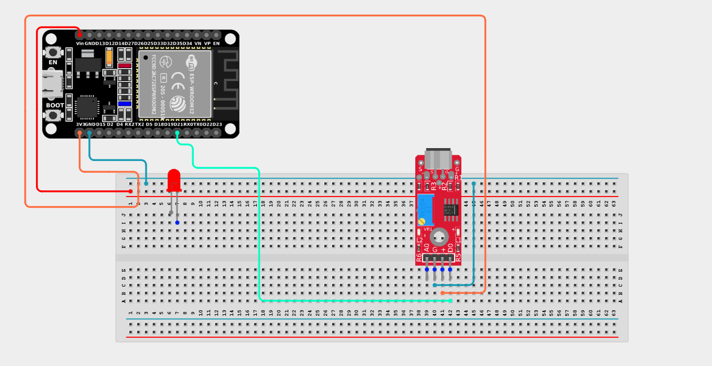
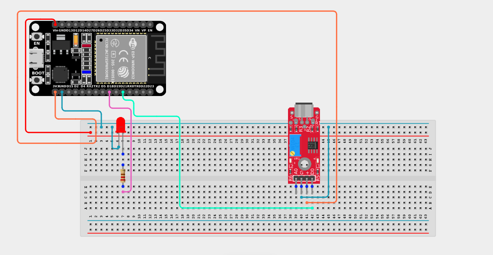

# Project 2.10.19: Clap-to-Toggle Lamp

| **Description** | This project uses a sound sensor to detect claps or sound spikes and toggles an LED ON and OFF with each detection, including a cooldown to prevent double-triggers. |
|------------------|----------------------------------------------------------------|
| **Use case**     | This project simulates a smart "clap on, clap off" lighting system. It can be used in automation systems, interactive installations, and smart home bedroom setups. |

## Components (Things You will need)

| | | | | | |
|-------------------------|-------------------------|-------------------------|-------------------------|-------------------------|-------------------------|

## Building the circuit

> **Tip:** Use the [ESP32 Pin Mapping](../../../../assets/esp32_pin_mapping.png) image to locate the correct GPIO pins on your ESP32 board.

Things Needed:

- ESP32 board = 1

- Micro USB cable = 1

- Breadboard = 1

- Jumper wires 

- Sound sensor module = 1

- LED = 1

- 220Ω resistor = 1

---

## Mounting the components on the breadboard

**Step 1:** Mount the ESP32 and Components:

- Align the ESP32 board across the center dividing ridge of the breadboard.

- Place the Sound Sensor on the breadboard so its four pins sit in separate adjacent rows.

- Insert the LED into the breadboard (remember the longer leg is positive).




---

## Wiring the circuit

Follow these step-by-step connection details using your jumper wires:

**Step 1:** Create Power and Ground Rails

- Connect the **5V** or **VIN** pin on the ESP32 board to the positive (red) rail on the breadboard.

- Connect a **GND** pin on the ESP32 board to the negative (blue/black) rail on the breadboard.



**Step 2:** Wire the Sound Sensor

- Connect the **VCC** pin of the Sound Sensor to the 3.3V pin on the ESP32 board (or 3.3V power rail).

- Connect the **GND** pin of the Sound Sensor to the negative power rail.

- Connect the **DO (Digital Out)** pin of the Sound Sensor to **GPIO 21** on the ESP32 board.

- *(Leave the AO pin unconnected, as it is not required for this project).*



**Step 3:** Wire the LED

- Connect a **220Ω resistor** from the positive (longer) leg of the LED to **GPIO 18** on the ESP32 board.

- Connect the negative (shorter) leg of the LED to the negative ground rail.




*Make sure to connect the Micro USB cable securely to the ESP32 board and your computer.*

---

## PROGRAMMING

**Step 1:** Open your Arduino IDE. See how to set up here: [Getting Started](../../../Getting Started/Arduino_IDE_Setup.md).

**Step 2:** Write the code in sections as detailed below.

### 1. Variables and Setup

```cpp
const int soundPin = 21;
const int ledPin = 18;

bool ledState = false; 
unsigned long lastTriggerTime = 0; 
const unsigned long cooldown = 500; 

void setup() {
  Serial.begin(9600);
  
  pinMode(soundPin, INPUT);
  pinMode(ledPin, OUTPUT);
  digitalWrite(ledPin, LOW);
}
```
*Explanation:* We assign our pins for the sound sensor and LED. We also create a `ledState` variable to remember if the light is currently ON or OFF. We create a `cooldown` variable of 500 milliseconds (half a second) to prevent one loud clap from accidentally triggering the light multiple times!

---

### 2. Main Loop

```cpp
void loop() {
  // Read if a sound spike (like a clap) was detected
  int soundDetected = digitalRead(soundPin);
  
  if (soundDetected == HIGH) { 
    // Check if enough time has passed since the last clap
    if (millis() - lastTriggerTime > cooldown) { 
      
      // Flip the LED state (if it was false, make it true, and vice versa)
      ledState = !ledState;
      
      // Apply the new state to the LED
      digitalWrite(ledPin, ledState ? HIGH : LOW);
      
      Serial.print("LED is ");
      Serial.println(ledState ? "ON" : "OFF");
      
      // Record the time this clap happened
      lastTriggerTime = millis();
    } 
  }
}
```
*Explanation:* 

- The loop constantly listens for a digital `HIGH` from the sound sensor.

- When it hears a clap, it checks `millis()` (the internal stopwatch) to see if `500` milliseconds have passed since the *last* clap. This ignores echoes or long noises.

- If it's a valid new clap, it uses `!ledState` to toggle the light from OFF to ON, or ON to OFF, recreating a classic "clap switch"!

---

## Uploading the code

**Step 3:** Save your code. _See the [Getting Started](../../../Getting Started/Arduino_IDE_Setup.md) section_

**Step 4:** Select the ESP32 board and port _See the [Getting Started](../../../Getting Started/Arduino_IDE_Setup.md) section:Selecting ESP32 board Type and Uploading your code_.

**Step 5:** Upload your code. _See the [Getting Started](../../../Getting Started/Arduino_IDE_Setup.md) section:Selecting ESP32 board Type and Uploading your code_

## Conclusion

This project helps you understand how to combine a sound sensor with an ESP32 board to create a state-toggling system. By implementing a cooldown timer with `millis()`, you learned how to properly handle messy real-world sensor data and prevent double-triggering in your automation solutions!
