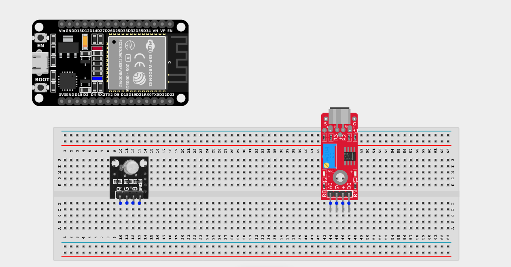
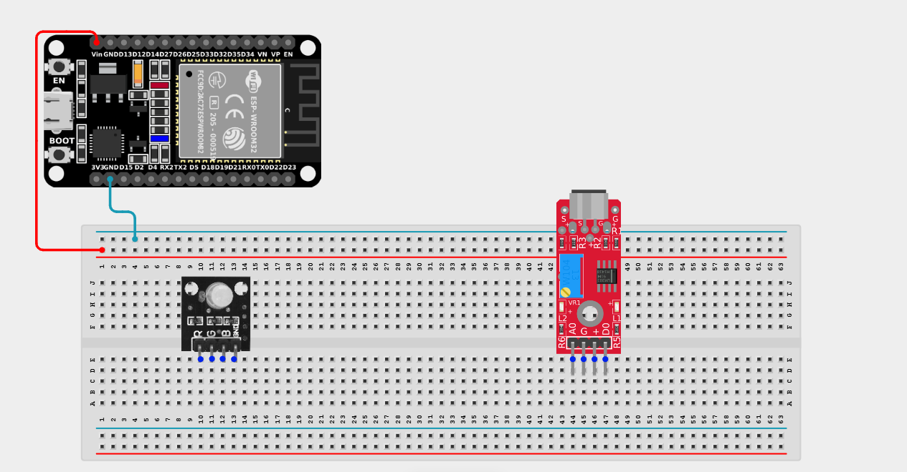
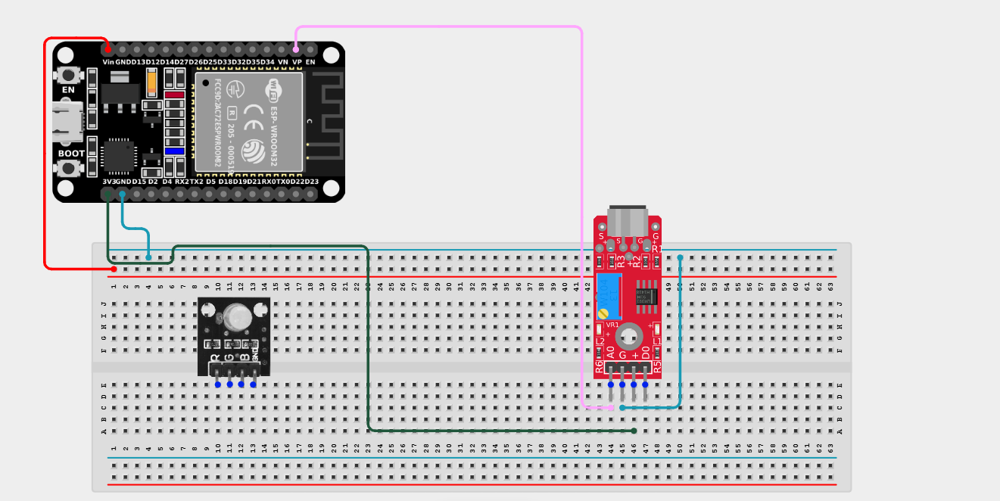
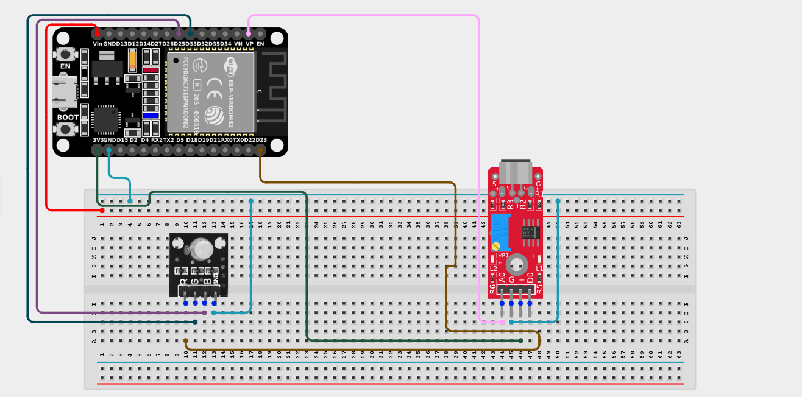

# Project 2.10.20: Sound Reactive Party Light

| **Description** | This project uses a sound sensor to detect ambient noise levels and dynamically changes an RGB LED's color in sync with music or sound peaks. |
|------------------|----------------------------------------------------------------|
| **Use case**     | This project can be used to create custom audio visualizers, dynamic DJ booth lighting, and interactive party installations that react to the beat of the music! |

## Components (Things You will need)

| | | | | | |
|-------------------------|-------------------------|-------------------------|-------------------------|-------------------------|-------------------------|

## Building the circuit

> **Tip:** Use the [ESP32 Pin Mapping](../../../../assets/esp32_pin_mapping.png) image to locate the correct GPIO pins on your ESP32 board.

Things Needed:

- ESP32 board = 1

- Micro USB cable = 1

- Breadboard = 1

- Jumper wires 

- Sound sensor module = 1

- RGB LED module = 1

---

## Mounting the components on the breadboard

**Step 1:** Mount the ESP32 and Components:

- Align the ESP32 board across the center dividing ridge of the breadboard.

- Place the Sound Sensor on the breadboard so its four pins sit in separate adjacent rows.

- Place the RGB LED module on the breadboard so its four pins sit in separate adjacent rows.



---

## Wiring the circuit

Follow these step-by-step connection details using your jumper wires:

**Step 1:** Create Power and Ground Rails

- Connect the **5V** or **VIN** pin on the ESP32 board to the positive (red) rail on the breadboard.

- Connect a **GND** pin on the ESP32 board to the negative (blue/black) rail on the breadboard.



**Step 2:** Wire the Sound Sensor

- Connect the **VCC** pin of the Sound Sensor to the 3.3V pin on the ESP32 board (or 3.3V power rail).

- Connect the **GND** pin of the Sound Sensor to the negative power rail.

- Connect the **AO (Analog Out)** pin of the Sound Sensor to **GPIO 36 (VP)** on the ESP32 board.

- *(Leave the DO pin unconnected. We only need the Analog pin to measure specific volume levels).*



**Step 3:** Wire the RGB LED Module

- Connect the **Red (R)** pin of the RGB Module to **GPIO 23** on the ESP32 board.

- Connect the **Green (G)** pin of the RGB Module to **GPIO 33** on the ESP32 board.

- Connect the **Blue (B)** pin of the RGB Module to **GPIO 25** on the ESP32 board.

- Connect the **GND (-)** pin of the RGB module to the negative ground rail. *(If using a Common Anode RGB LED, connect this pin to 3.3V instead of GND).*



*Make sure to connect the Micro USB cable securely to the ESP32 board and your computer.*

---

## PROGRAMMING

**Step 1:** Open your Arduino IDE. See how to set up here: [Getting Started](../../../Getting Started/Arduino_IDE_Setup.md).

**Step 2:** Write the code in sections as detailed below.

### 1. Variables and Setup

```cpp
const int soundPin = 36;
const int redPin = 23;
const int greenPin = 33;
const int bluePin = 25;

void setup() {
  Serial.begin(9600);
  
  pinMode(soundPin, INPUT);
  pinMode(redPin, OUTPUT);
  pinMode(greenPin, OUTPUT);
  pinMode(bluePin, OUTPUT);
}
```
*Explanation:* We assign our pins for the analog sound sensor and the three color channels of the RGB LED. We set the LED pins as outputs and start the Serial Monitor.

---

### 2. Main Loop

```cpp
void loop() {
  // Read the analog sound volume
  int soundValue = analogRead(soundPin);
  Serial.println(soundValue);
  
  // Change color based on volume thresholds!
  if (soundValue < 350) { 
    // Quiet music - Blue
    analogWrite(redPin, 0);
    analogWrite(greenPin, 0);
    analogWrite(bluePin, 255); 
  } 
  else if (soundValue < 500) {
    // Medium beat - Green
    analogWrite(redPin, 0);
    analogWrite(greenPin, 255); 
    analogWrite(bluePin, 0); 
  } 
  else if (soundValue < 700) {
    // Loud beat - Yellow
    analogWrite(redPin, 255);
    analogWrite(greenPin, 255);
    analogWrite(bluePin, 0); 
  } 
  else {
    // Drop the bass! - Red
    analogWrite(redPin, 255);
    analogWrite(greenPin, 0);
    analogWrite(bluePin, 0); 
  }
  
  delay(50); // Small delay to make the transitions smooth
}
```
*Explanation:* 

- We read the raw analog sound volume into `soundValue`.

- We use an `if...else if` chain to act as an audio visualizer. 

- When the room is quiet, the LED stays a calm Blue. When a medium beat hits, it flashes Green. A loud beat turns it Yellow, and the loudest spikes of music turn it an intense Red!

- *(You may need to adjust the 350, 500, and 700 threshold numbers based on your specific sensor and how loud your music is!)*

---

## Uploading the code

**Step 3:** Save your code. _See the [Getting Started](../../../Getting Started/Arduino_IDE_Setup.md) section_

**Step 4:** Select the ESP32 board and port _See the [Getting Started](../../../Getting Started/Arduino_IDE_Setup.md) section:Selecting ESP32 board Type and Uploading your code_.

**Step 5:** Upload your code. _See the [Getting Started](../../../Getting Started/Arduino_IDE_Setup.md) section:Selecting ESP32 board Type and Uploading your code_

## Conclusion

This project helps you understand how to use an analog sensor to control an RGB LED dynamically. By reading continuous values rather than just a simple ON/OFF, you can build rich, reactive environments that change colors perfectly in sync with the intensity of their surroundings!
