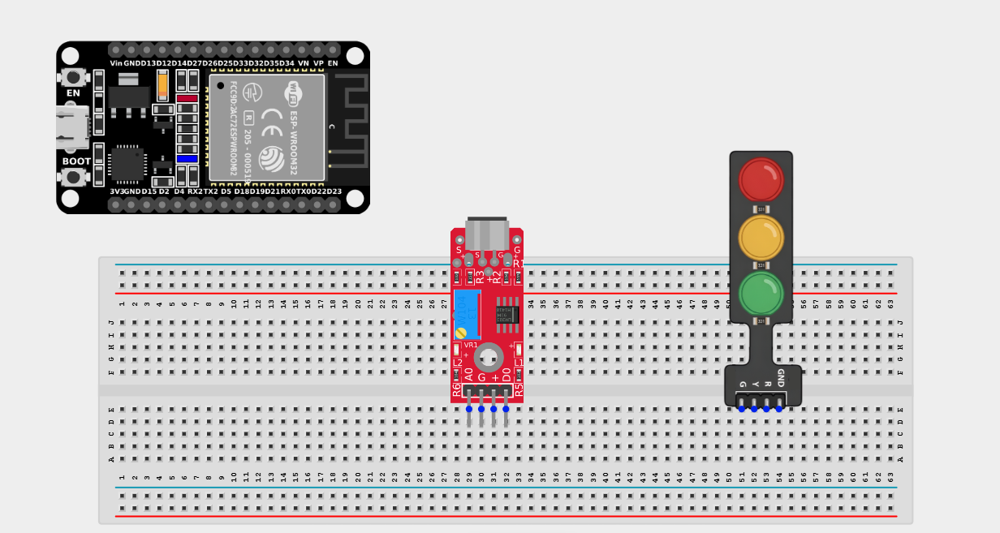
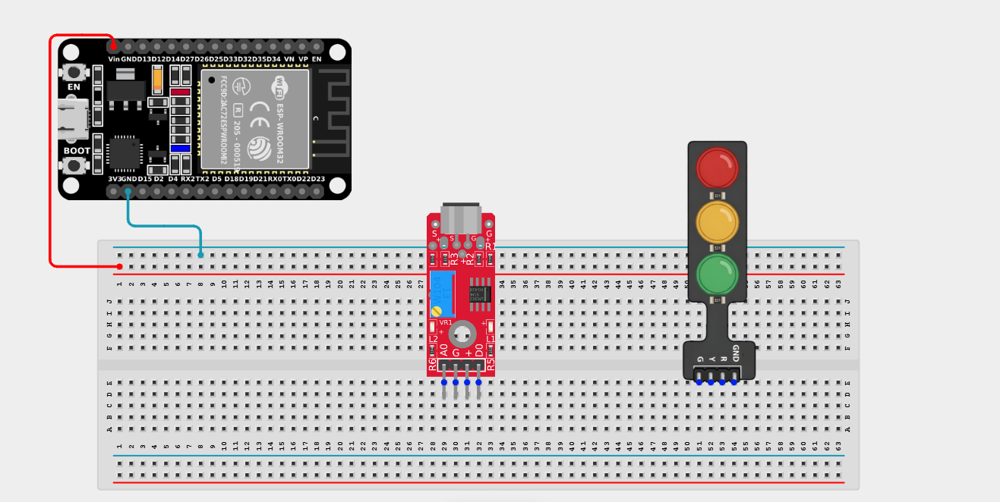
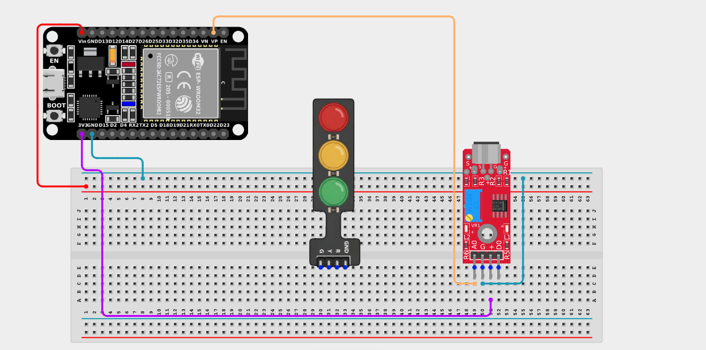
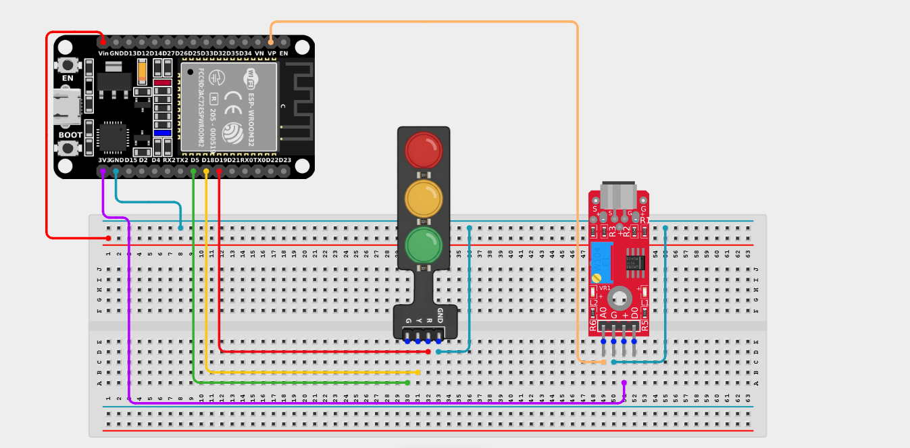

# Project 2.10.21: Decibel Visualizer

| **Description** | This project uses an analog sound sensor to measure ambient noise levels and displays the result on a Traffic Light Module, serving as a visual "quiet meter". |
|------------------|----------------------------------------------------------------|
| **Use case**     | This project can be used in classrooms or libraries to help maintain silence. A green light means noise levels are good, yellow means it's getting too noisy, and red indicates that everyone needs to quiet down immediately! |

## Components (Things You will need)

|  |  |  |  |  |  |
|-------------------------|-------------------------|-------------------------|-------------------------|-------------------------|-------------------------|

## Building the circuit

> **Tip:** Use the [ESP32 Pin Mapping](../../../../assets/esp32_pin_mapping.png) image to locate the correct GPIO pins on your ESP32 board.

Things Needed:

- ESP32 board = 1

- Micro USB cable = 1

- Breadboard = 1

- Jumper wires 

- Sound sensor module = 1

- Traffic light module = 1

---

## Mounting the components on the breadboard

**Step 1:** Mount the ESP32 and Components:

- Align the ESP32 board across the center dividing ridge of the breadboard.

- Place the Sound Sensor on the breadboard so its four pins sit in separate adjacent rows.

- Place the Traffic Light Module on the breadboard so its four pins sit in separate adjacent rows.



---

## Wiring the circuit

Follow these step-by-step connection details using your jumper wires:

**Step 1:** Create Power and Ground Rails

- Connect the **5V** or **VIN** pin on the ESP32 board to the positive (red) rail on the breadboard.

- Connect a **GND** pin on the ESP32 board to the negative (blue/black) rail on the breadboard.



**Step 2:** Wire the Sound Sensor

- Connect the **VCC** pin of the Sound Sensor to the 3.3V pin on the ESP32 board (or 3.3V power rail).

- Connect the **GND** pin of the Sound Sensor to the negative power rail.

- Connect the **AO (Analog Out)** pin of the Sound Sensor to **GPIO 36 (VP)** on the ESP32 board.

- *(Leave the DO pin unconnected. We only need the Analog pin to measure continuous volume levels).*



**Step 3:** Wire the Traffic Light Module

- Connect the **Green LED (G)** pin of the Traffic Light Module to **GPIO 5** on the ESP32 board.

- Connect the **Yellow LED (Y)** pin of the Traffic Light Module to **GPIO 18** on the ESP32 board.

- Connect the **Red LED (R)** pin of the Traffic Light Module to **GPIO 19** on the ESP32 board.

- Connect the **GND** pin of the Traffic Light Module to the negative ground rail.



*Make sure to connect the Micro USB cable securely to the ESP32 board and your computer.*

---

## PROGRAMMING

**Step 1:** Open your Arduino IDE. See how to set up here: [Getting Started](../../../Getting Started/Arduino_IDE_Setup.md).

**Step 2:** Write the code in sections as detailed below.

### 1. Variables and Setup

```cpp
const int soundPin = 36;
const int greenLED = 5;
const int yellowLED = 18;
const int redLED = 19;

void setup() {
  Serial.begin(9600);
  
  pinMode(soundPin, INPUT);
  pinMode(greenLED, OUTPUT);
  pinMode(yellowLED, OUTPUT);
  pinMode(redLED, OUTPUT);
}
```
*Explanation:* We define variables for the sensor and the three lights on our Traffic Light module. We set the LEDs as `OUTPUT` and the sensor as an `INPUT` while opening the Serial monitor for live debugging.

---

### 2. Main Loop

```cpp
void loop() {
  // Read analog value from the sensor
  int soundValue = analogRead(soundPin);
  
  Serial.print("Sound Level: ");
  Serial.println(soundValue);
  
  // Logic to classify the noise level
  if (soundValue < 350) {
    // Quiet -> Green Light!
    digitalWrite(greenLED, HIGH);
    digitalWrite(yellowLED, LOW);
    digitalWrite(redLED, LOW); 
  } 
  else if (soundValue < 600) {
    // Getting loud -> Yellow Warning Light!
    digitalWrite(greenLED, LOW);
    digitalWrite(yellowLED, HIGH);
    digitalWrite(redLED, LOW); 
  } 
  else {
    // Too loud! -> Red Danger Light!
    digitalWrite(greenLED, LOW);
    digitalWrite(yellowLED, LOW);
    digitalWrite(redLED, HIGH); 
  }
  
  delay(100); // 0.1 second delay for smooth reading
}
```
*Explanation:* 

- We read the raw analog sound volume into `soundValue`.

- We use an `if...else if...else` chain. 

- If the sound is under 350, it shows Green. Between 350 and 600, it switches to Yellow. Any sound above 600 turns the light Red, telling everyone to quiet down!

- *(Adjust these threshold numbers to suit the natural background noise of your room).*

---

## Uploading the code

**Step 3:** Save your code. _See the [Getting Started](../../../Getting Started/Arduino_IDE_Setup.md) section_

**Step 4:** Select the ESP32 board and port _See the [Getting Started](../../../Getting Started/Arduino_IDE_Setup.md) section:Selecting ESP32 board Type and Uploading your code_.

**Step 5:** Upload your code. _See the [Getting Started](../../../Getting Started/Arduino_IDE_Setup.md) section:Selecting ESP32 board Type and Uploading your code_

## Conclusion

This project helps you understand how to use an analog sensor to control a complex output module dynamically. By categorizing continuous data into "quiet," "warning," and "loud" states, you have successfully built an intelligent environmental monitor!
