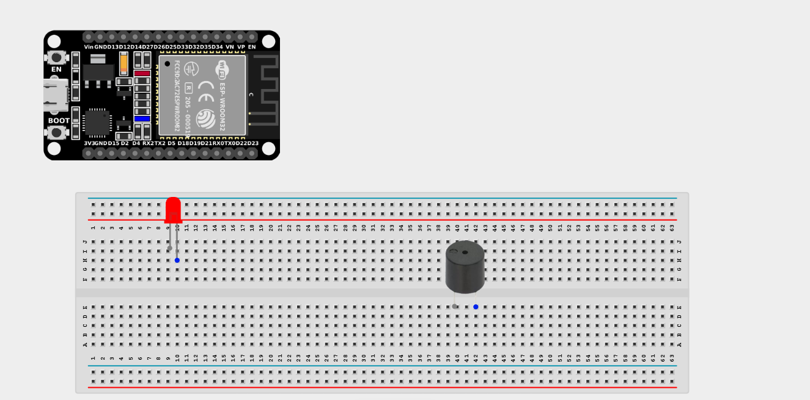
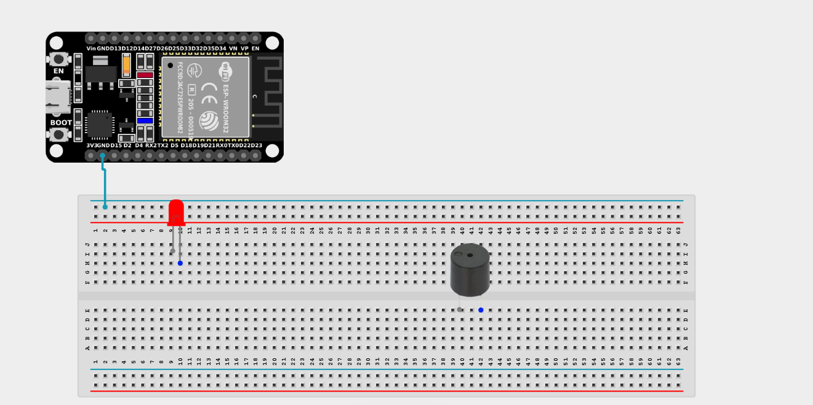
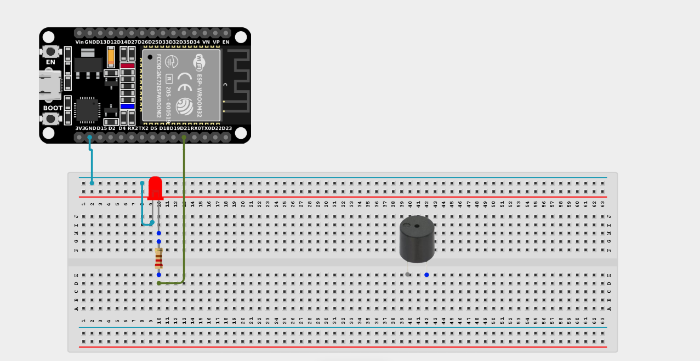
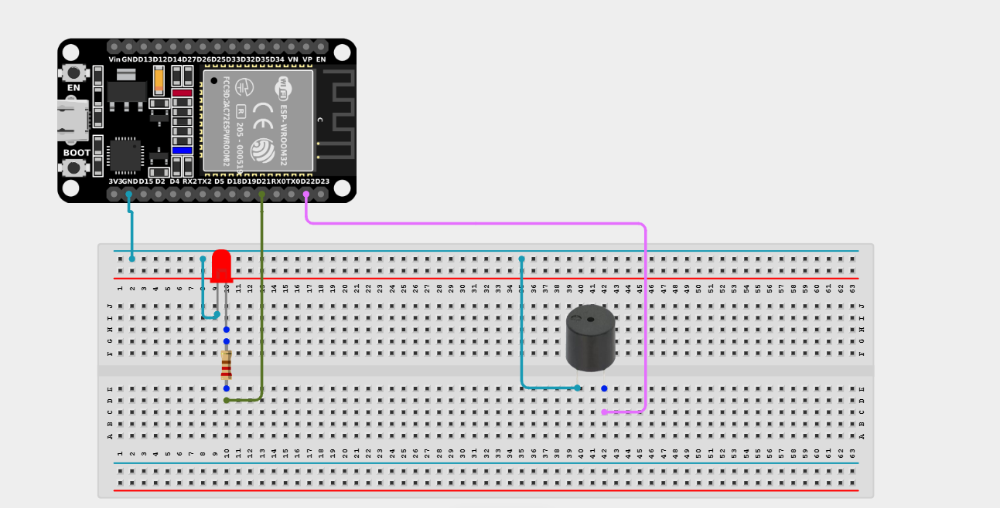

# Project 2.10.22: Heartbeat Sync Display

| **Description** | This project flashes an LED and beeps a buzzer synchronously at a configurable BPM (Beats Per Minute) rate, simulating a heartbeat monitor. |
|------------------|----------------------------------------------------------------|
| **Use case**     | This project is great for creating medical simulations, pacing metronomes for musicians, or stressful "ticking clock" sound effects in games and interactive displays. |

## Components (Things You will need)

| | | | | | |
|-------------------------|-------------------------|-------------------------|-------------------------|-------------------------|-------------------------|

## Building the circuit

> **Tip:** Use the [ESP32 Pin Mapping](../../../../assets/esp32_pin_mapping.png) image to locate the correct GPIO pins on your ESP32 board.

Things Needed:

- ESP32 board = 1

- Micro USB cable = 1

- Breadboard = 1

- Jumper wires 

- LED = 1

- Active Buzzer = 1

- 220Ω resistor = 1

---

## Mounting the components on the breadboard

**Step 1:** Mount the ESP32 and Components:

- Align the ESP32 board across the center dividing ridge of the breadboard.

- Insert the LED into the breadboard (remember the longer leg is positive).

- Insert the Buzzer into the breadboard (remember the longer leg is positive).



---

## Wiring the circuit

Follow these step-by-step connection details using your jumper wires:

**Step 1:** Create Power and Ground Rails

- Connect a **GND** pin on the ESP32 board to the negative (blue/black) rail on the breadboard.



**Step 2:** Wire the LED

- Connect a **220Ω resistor** from the positive (longer) leg of the LED to **GPIO 21** on the ESP32 board.

- Connect the negative (shorter) leg of the LED to the negative ground rail.



**Step 3:** Wire the Buzzer

- Connect the positive (longer) pin of the Buzzer to **GPIO 22** on the ESP32 board.

- Connect the negative (shorter) pin of the Buzzer to the negative ground rail.




*Make sure to connect the Micro USB cable securely to the ESP32 board and your computer.*

---

## PROGRAMMING

**Step 1:** Open your Arduino IDE. See how to set up here: [Getting Started](../../../Getting Started/Arduino_IDE_Setup.md).

**Step 2:** Write the code in sections as detailed below.

### 1. Variables and Setup

```cpp
const int ledPin = 21;
const int buzzerPin = 22;

const int BPM = 60; // Adjust Beats Per Minute here
const int beepFrequency = 1000; 

int beatInterval; // We will calculate this later

void setup() {
  Serial.begin(9600);
  
  pinMode(ledPin, OUTPUT);
  pinMode(buzzerPin, OUTPUT);
  
  // Calculate the milliseconds per beat
  // (60 seconds per minute * 1000 milliseconds) / BPM
  beatInterval = 60000 / BPM; 
}
```
*Explanation:* We set our output pins for the LED and Buzzer. Most importantly, we create a `BPM` (Beats Per Minute) variable. In `setup()`, we divide 60,000 (the number of milliseconds in a minute) by the BPM to figure out exactly how many milliseconds should pass between each "heartbeat"!

---

### 2. Main Loop

```cpp
void loop() {
  // Start the heartbeat!
  digitalWrite(ledPin, HIGH);
  tone(buzzerPin, beepFrequency); // Start the buzzer note
  
  delay(100); // Wait 0.1 seconds (length of the "beep")
  
  // End the heartbeat
  digitalWrite(ledPin, LOW);
  noTone(buzzerPin);              // Stop the buzzer
  
  // Wait for the remainder of the beat interval
  delay(beatInterval - 100);
}
```
*Explanation:* 

- We turn the LED ON and use `tone()` to start the buzzer simultaneously.

- We hold them on for exactly 100 milliseconds to create a sharp "blip" effect.

- We then turn both OFF. 

- Finally, we `delay()` for the rest of the calculated `beatInterval`. (Subtracting 100 milliseconds because we already delayed for that long while the beep was active!)

---

## Uploading the code

**Step 3:** Save your code. _See the [Getting Started](../../../Getting Started/Arduino_IDE_Setup.md) section_

**Step 4:** Select the ESP32 board and port _See the [Getting Started](../../../Getting Started/Arduino_IDE_Setup.md) section:Selecting ESP32 board Type and Uploading your code_.

**Step 5:** Upload your code. _See the [Getting Started](../../../Getting Started/Arduino_IDE_Setup.md) section:Selecting ESP32 board Type and Uploading your code_

## Conclusion

This project helps you understand how to precisely synchronize multiple output components over time. By calculating delays using math based on a target Beats Per Minute (BPM), you've learned how to create a highly accurate metronome and visual pulsing system!
