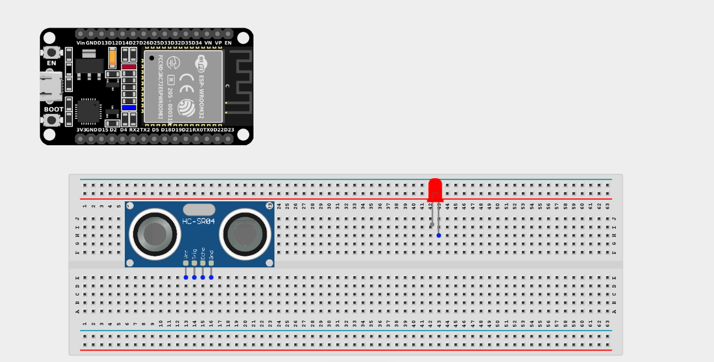
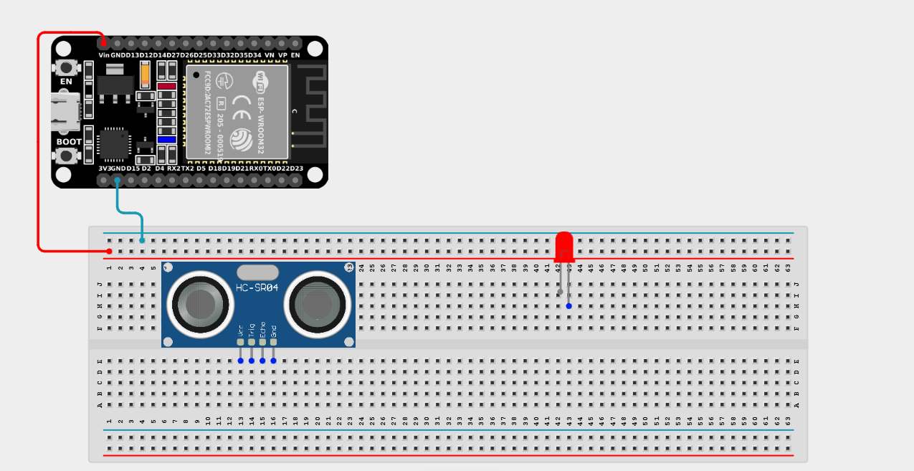
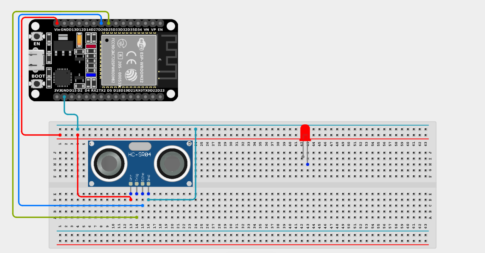
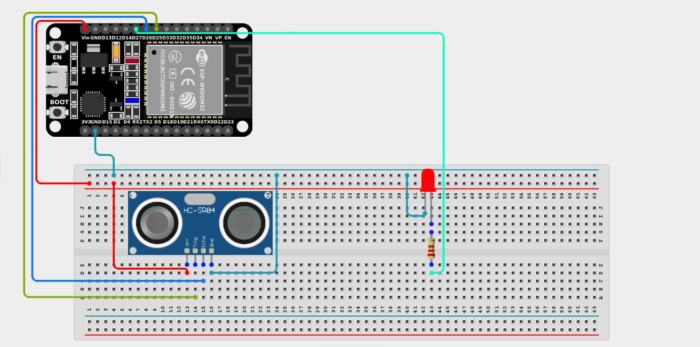

# Project 2.10.1: LED and Ultrasonic Sensor Control 

| **Description** | You will learn how to create a simple circuit using an ultrasonic sensor to measure distance and automatically control an LED based on that distance. |
|------------------|----------------------------------------------------------------|
| **Use case**     | Imagine you want to create a parking assistant for a garage. The ultrasonic sensor measures how close a car is to the wall, and turns on a warning LED when the car gets too close! |

## Components (Things You will need)

|  |  |  |  || |
|-------------------------|-------------------------|-------------------------|-------------------------|-------------------------|-------------------------|

## Building the circuit

> **Tip:** Use the [ESP32 Pin Mapping](../../../../assets/esp32_pin_mapping.png) image to locate the correct GPIO pins on your ESP32 board.

Things Needed:

- ESP32 board: 1

- Micro USB cable: 1

- Breadboard: 1

- Jumper Wires

- Red LED: 1

- Ultrasonic Sensor: 1

- 220Ω Resistor = 1

---

## Mounting the components on the breadboard

**Step 1:** Mount the ESP32 and Components:

- Align the ESP32 board across the center dividing ridge of the breadboard.

- Insert the ultrasonic sensor into the breadboard, making sure its four pins sit in separate adjacent rows facing outwards.

- Insert the red LED into the breadboard beside the ultrasonic sensor (remember the longer leg is positive).



---

## Wiring the circuit

Follow these step-by-step connection details using your jumper wires:

**Step 1:** Create Power and Ground Rails

- Connect the **5V** or **VIN** pin on the ESP32 board to the positive (red) rail on the breadboard.

- Connect a **GND** pin on the ESP32 board to the negative (blue/black) rail on the breadboard.



**Step 2:** Wire the Ultrasonic Sensor

- Connect the **VCC** pin of the Ultrasonic sensor to the positive power rail.

- Connect the **GND** pin of the Ultrasonic sensor to the negative power rail.

- Connect the **Trig** pin of the Ultrasonic sensor to **GPIO 25** on the ESP32 board.

- Connect the **ECHO** pin of the Ultrasonic sensor to **GPIO 26** on the ESP32 board.




**Step 3:** Wire the LED

- Connect a **220Ω resistor** from the positive (longer) leg of the LED to **GPIO 27** on the ESP32 board.

- Connect the negative (shorter) leg of the LED to the negative ground rail.



*Make sure to connect the Micro USB cable securely to the ESP32 board and your computer.*

---

## PROGRAMMING

**Step 1:** Open your Arduino IDE. See how to set up here: [Getting Started](../../../Getting Started/Arduino_IDE_Setup.md).

**Step 2:** Write the code in sections as detailed below.

### 1. Variables and Setup

```cpp
const int trigPin = 25;
const int echoPin = 26;
const int ledPin = 27;

long duration;
int distance;
const int distanceThreshold = 20; // 20 centimeters

void setup() {
  Serial.begin(9600);
  
  pinMode(trigPin, OUTPUT);
  pinMode(echoPin, INPUT);
  pinMode(ledPin, OUTPUT);
}
```
*Explanation:* We assign the Trig and Echo pins for the sensor, and the output pin for the LED. We also define a `distanceThreshold` of 20 centimeters; if an object gets closer than this, we will trigger the LED.

---

### 2. Main Loop

```cpp
void loop() {
  // 1. Send a 10-microsecond ping from the Trig pin
  digitalWrite(trigPin, LOW);
  delayMicroseconds(2);
  digitalWrite(trigPin, HIGH);
  delayMicroseconds(10);
  digitalWrite(trigPin, LOW);
  
  // 2. Measure how long it takes for the echo to return
  duration = pulseIn(echoPin, HIGH); 
  
  // 3. Calculate distance in centimeters (Speed of sound = 0.034 cm/us)
  distance = duration * 0.034 / 2; 
  
  // 4. Print the distance to the Serial Monitor
  Serial.print("Distance: ");
  Serial.print(distance);
  Serial.println(" cm");
  
  // 5. Turn ON the LED if an object is closer than the threshold
  if (distance < distanceThreshold) {
    digitalWrite(ledPin, HIGH); 
  } else {
    digitalWrite(ledPin, LOW); 
  }
  
  delay(100);
}
```
*Explanation:* 

- First, we send a quick burst of ultrasonic sound out of the `trigPin`.

- Next, we use `pulseIn()` to wait and see exactly how many microseconds it takes for the sound to bounce off an object and return to the `echoPin`.

- We multiply that time by the speed of sound and divide by 2 (since the sound traveled there and back) to get the distance in centimeters.

- Finally, if that distance is less than 20cm, we turn on the warning LED!

---

## Uploading the code

**Step 3:** Save your code. _See the [Getting Started](../../../Getting Started/Arduino_IDE_Setup.md) section_

**Step 4:** Select the ESP32 board and port _See the [Getting Started](../../../Getting Started/Arduino_IDE_Setup.md) section:Selecting ESP32 board Type and Uploading your code_.

**Step 5:** Upload your code. _See the [Getting Started](../../../Getting Started/Arduino_IDE_Setup.md) section:Selecting ESP32 board Type and Uploading your code_

## Conclusion

To sum up, this ultrasonic LED project demonstrates a foundational concept in interactive electronics. Through this endeavor, you learned how to measure physical proximity using sound waves and use coding logic to trigger a hardware response. This project lays the groundwork for more advanced explorations like robotics, obstacle avoidance, and security systems!
