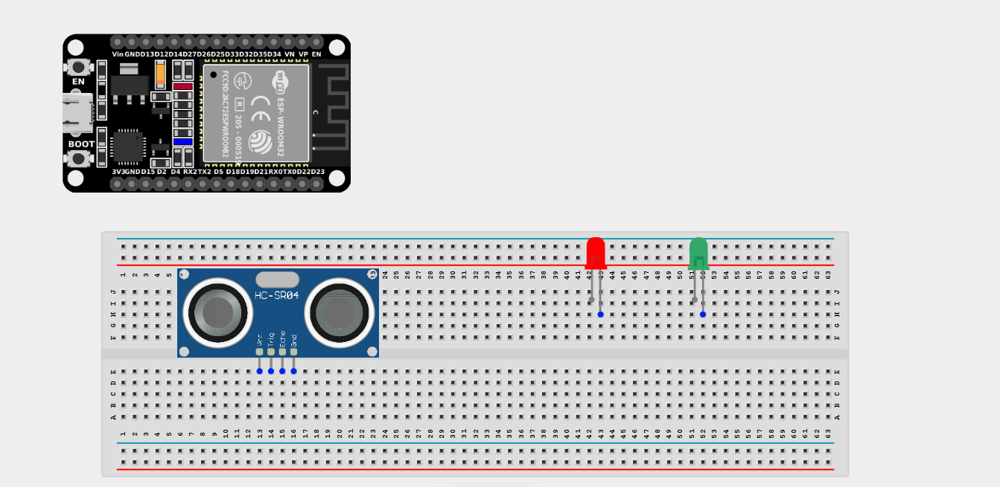
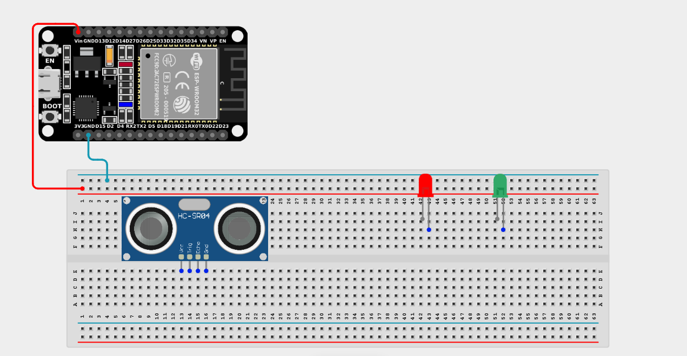
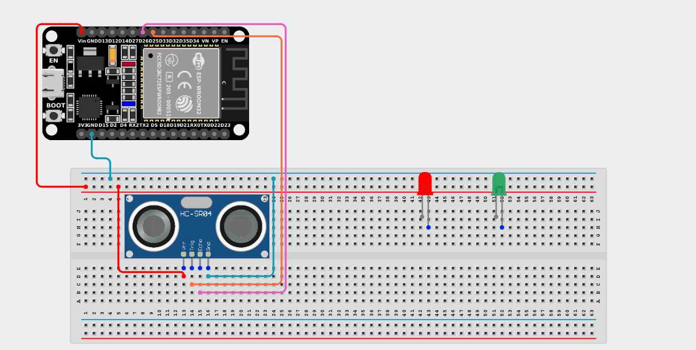
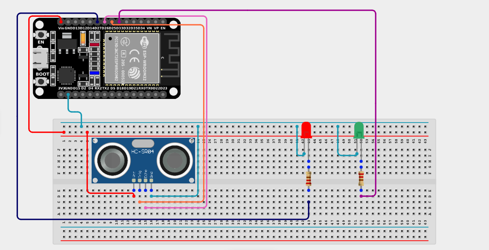

# Project 2.10.2: Two LEDs and Ultrasonic Sensor Control 

| **Description** | You will learn how to create an interactive circuit using an Ultrasonic Sensor to measure distance and automatically alternate between two LEDs based on that distance. |
|------------------|----------------------------------------------------------------|
| **Use case**     | Imagine you want to create an interactive proximity alarm. When an object is safely far away, a green LED indicates "Safe". But if an object gets too close, it switches to a red LED warning, like a reversing sensor on a car! |

## Components (Things You will need)

|  |  |  |  || ||
|-------------------------|-------------------------|-------------------------|-------------------------|-------------------------|-------------------------|-------------------------|

## Building the circuit

> **Tip:** Use the [ESP32 Pin Mapping](../../../../assets/esp32_pin_mapping.png) image to locate the correct GPIO pins on your ESP32 board.

Things Needed:

- ESP32 board = 1

- Micro USB cable = 1

- Breadboard = 1

- Jumper Wires

- Ultrasonic Sensor = 1

- LEDs (Red and Green) = 2

- 220Ω Resistors = 2

---

## Mounting the components on the breadboard

**Step 1:** Mount the ESP32 and Components:

- Align the ESP32 board across the center dividing ridge of the breadboard.

- Insert the ultrasonic sensor into the breadboard, making sure its four pins sit in separate adjacent rows facing outwards.

- Insert the two LEDs into the breadboard (remember the longer legs are positive).



---

## Wiring the circuit

Follow these step-by-step connection details using your jumper wires:

**Step 1:** Create Power and Ground Rails

- Connect the **5V** or **VIN** pin on the ESP32 board to the positive (red) rail on the breadboard.

- Connect a **GND** pin on the ESP32 board to the negative (blue/black) rail on the breadboard.



**Step 2:** Wire the Ultrasonic Sensor

- Connect the **VCC** pin of the Ultrasonic sensor to the positive power rail.

- Connect the **GND** pin of the Ultrasonic sensor to the negative power rail.

- Connect the **Trig** pin of the Ultrasonic sensor to **GPIO 25** on the ESP32 board.

- Connect the **ECHO** pin of the Ultrasonic Sensor to **GPIO 26** on the ESP32 board.


  

**Step 3:** Wire the LEDs

- Connect a **220Ω resistor** from the positive (longer) leg of the Red LED to **GPIO 27** on the ESP32 board.

- Connect a **220Ω resistor** from the positive (longer) leg of the Green LED to **GPIO 33** on the ESP32 board.

- Connect the negative (shorter) legs of both LEDs to the negative ground rail.



*Make sure to connect the Micro USB cable securely to the ESP32 board and your computer.*

---

## PROGRAMMING

**Step 1:** Open your Arduino IDE. See how to set up here: [Getting Started](../../../Getting Started/Arduino_IDE_Setup.md).

**Step 2:** Write the code in sections as detailed below.

### 1. Variables and Setup

```cpp
const int trigPin = 25;
const int echoPin = 26;

const int ledRed = 27;
const int ledGreen = 33;

long duration;
int distance;
const int distanceThreshold = 20; // 20 centimeters

void setup() {
  Serial.begin(9600);
  
  pinMode(trigPin, OUTPUT);
  pinMode(echoPin, INPUT);
  
  pinMode(ledRed, OUTPUT);
  pinMode(ledGreen, OUTPUT);
}
```
*Explanation:* We assign our ultrasonic pins (`trigPin` and `echoPin`) and the pins for our Red and Green LEDs. The `distanceThreshold` variable holds our "danger zone" distance (20 cm) that will trigger the color change.

---

### 2. Main Loop

```cpp
void loop() {
  // 1. Send a 10-microsecond ping from the Trig pin
  digitalWrite(trigPin, LOW);
  delayMicroseconds(2);
  digitalWrite(trigPin, HIGH);
  delayMicroseconds(10);
  digitalWrite(trigPin, LOW);
  
  // 2. Measure the time for the echo to bounce back
  duration = pulseIn(echoPin, HIGH); 
  
  // 3. Calculate distance (Speed of sound = 0.034 cm/us)
  distance = duration * 0.034 / 2; 
  
  Serial.print("Distance: ");
  Serial.print(distance);
  Serial.println(" cm");
  
  // 4. Decide which LED to turn on based on the distance
  if (distance < distanceThreshold) {
    // Too close! Turn on Red Warning LED, turn off Green
    digitalWrite(ledRed, HIGH); 
    digitalWrite(ledGreen, LOW); 
  } else {
    // Safe distance! Turn on Green Safe LED, turn off Red
    digitalWrite(ledRed, LOW); 
    digitalWrite(ledGreen, HIGH); 
  }
  
  delay(100);
}
```
*Explanation:* 

- We send out an ultrasonic ping and use `pulseIn()` to calculate how far away an object is in centimeters.

- We then use an `if...else` statement to create an intelligent toggle system.

- If the object is dangerously close (<20cm), the system turns the Red LED ON and the Green LED OFF.

- If the object moves away safely (>20cm), the system switches, turning the Green LED ON and the Red LED OFF!

---

## Uploading the code

**Step 3:** Save your code. _See the [Getting Started](../../../Getting Started/Arduino_IDE_Setup.md) section_

**Step 4:** Select the ESP32 board and port _See the [Getting Started](../../../Getting Started/Arduino_IDE_Setup.md) section:Selecting ESP32 board Type and Uploading your code_.

**Step 5:** Upload your code. _See the [Getting Started](../../../Getting Started/Arduino_IDE_Setup.md) section:Selecting ESP32 board Type and Uploading your code_

## Conclusion

If you encounter any problems when trying to upload your code to the board, run through your code again to check for any errors or missing lines of code. If you did not encounter any problems and the program ran as expected, Congratulations on a job well done. You now know how to build a dynamic proximity warning system using multiple LEDs!
