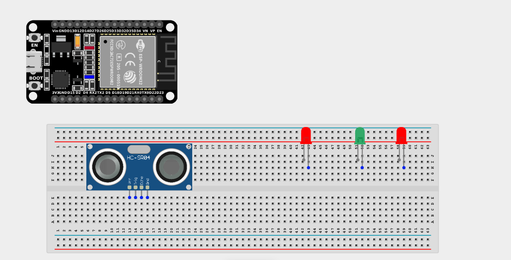
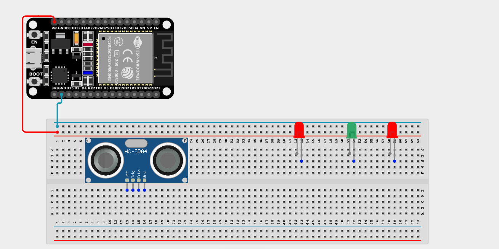
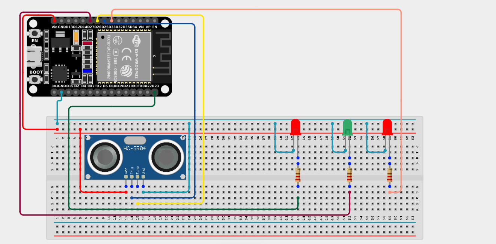

# Project 2.10.3: Three LEDs and Ultrasonic Sensor Control 

| **Description** | You will learn how to create an interactive circuit using an Ultrasonic Sensor to measure distance and progressively light up three LEDs as an object gets closer. |
|------------------|----------------------------------------------------------------|
| **Use case**     | Imagine you are designing a smart parking aid. As the car backs up, the white light turns on first to show it's approaching, the green light indicates it's getting close, and the red light flashes when it must stop! |

## Components (Things You will need)

|  |  |  |  || |
|-------------------------|-------------------------|-------------------------|-------------------------|-------------------------|-------------------------|

## Building the circuit

> **Tip:** Use the [ESP32 Pin Mapping](../../../../assets/esp32_pin_mapping.png) image to locate the correct GPIO pins on your ESP32 board.

Things Needed:

- ESP32 board = 1

- Micro USB cable = 1

- Breadboard = 1

- Jumper Wires

- Ultrasonic Sensor = 1

- LEDs (Red, Green, White) = 3

- 220Ω Resistors = 3

---

## Mounting the components on the breadboard

**Step 1:** Mount the ESP32 and Components:

- Align the ESP32 board across the center dividing ridge of the breadboard.

- Insert the ultrasonic sensor into the breadboard, making sure its four pins sit in separate adjacent rows facing outwards.

- Insert the three LEDs into the breadboard (remember the longer legs are positive).



---

## Wiring the circuit

Follow these step-by-step connection details using your jumper wires:

**Step 1:** Create Power and Ground Rails

- Connect the **5V** or **VIN** pin on the ESP32 board to the positive (red) rail on the breadboard.

- Connect a **GND** pin on the ESP32 board to the negative (blue/black) rail on the breadboard.



**Step 2:** Wire the Ultrasonic Sensor

- Connect the **VCC** pin of the Ultrasonic sensor to the positive power rail.

- Connect the **GND** pin of the Ultrasonic sensor to the negative power rail.

- Connect the **Trig** pin of the Ultrasonic sensor to **GPIO 25** on the ESP32 board.

- Connect the **ECHO** pin of the Ultrasonic sensor to **GPIO 26** on the ESP32 board.


**Step 3:** Wire the LEDs

- Connect a **220Ω resistor** from the positive (longer) leg of the Red LED to **GPIO 27** on the ESP32 board.

- Connect a **220Ω resistor** from the positive (longer) leg of the Green LED to **GPIO 33** on the ESP32 board.

- Connect a **220Ω resistor** from the positive (longer) leg of the White LED to **GPIO 23** on the ESP32 board.

- Connect the negative (shorter) legs of all three LEDs to the negative ground rail.



*Make sure to connect the Micro USB cable securely to the ESP32 board and your computer.*

---

## PROGRAMMING

**Step 1:** Open your Arduino IDE. See how to set up here: [Getting Started](../../../Getting Started/Arduino_IDE_Setup.md).

**Step 2:** Write the code in sections as detailed below.

### 1. Variables and Setup

```cpp
const int trigPin = 25;
const int echoPin = 26;

const int ledRed = 27;
const int ledGreen = 33;
const int ledWhite = 23;

long duration;
int distance;
const int distanceThreshold = 20; // 20 centimeters

void setup() {
  Serial.begin(9600);
  
  pinMode(trigPin, OUTPUT);
  pinMode(echoPin, INPUT);
  
  pinMode(ledRed, OUTPUT);
  pinMode(ledGreen, OUTPUT);
  pinMode(ledWhite, OUTPUT);
}
```
*Explanation:* We assign our ultrasonic pins (`trigPin` and `echoPin`) and the pins for our three LEDs. We define a baseline `distanceThreshold` of 20 cm that we will use to control the lights.

---

### 2. Main Loop

```cpp
void loop() {
  // 1. Send a 10-microsecond ping from the Trig pin
  digitalWrite(trigPin, LOW);
  delayMicroseconds(2);
  digitalWrite(trigPin, HIGH);
  delayMicroseconds(10);
  digitalWrite(trigPin, LOW);
  
  // 2. Measure the time for the echo to bounce back
  duration = pulseIn(echoPin, HIGH); 
  
  // 3. Calculate distance (Speed of sound = 0.034 cm/us)
  distance = duration * 0.034 / 2; 
  
  Serial.print("Distance: ");
  Serial.print(distance);
  Serial.println(" cm");
  
  // 4. Decide which LEDs to turn on based on the distance
  if (distance < distanceThreshold) {
    // Too close! Turn ALL LEDs ON
    digitalWrite(ledRed, HIGH); 
    digitalWrite(ledGreen, HIGH); 
    digitalWrite(ledWhite, HIGH); 
  } else {
    // Safe distance! Turn ALL LEDs OFF
    digitalWrite(ledRed, LOW); 
    digitalWrite(ledGreen, LOW); 
    digitalWrite(ledWhite, LOW); 
  }
  
  delay(100);
}
```
*Explanation:* 

- We send out an ultrasonic ping and calculate the distance in centimeters.

- Currently, this code simply turns ALL three LEDs on if the object is closer than 20cm, and turns them all off otherwise.

- *(Challenge: Can you modify the `if` statement to turn on ONLY the White LED when the object is at 30cm, White and Green at 20cm, and all three when it's at 10cm?)*

---

## Uploading the code

**Step 3:** Save your code. _See the [Getting Started](../../../Getting Started/Arduino_IDE_Setup.md) section_

**Step 4:** Select the ESP32 board and port _See the [Getting Started](../../../Getting Started/Arduino_IDE_Setup.md) section:Selecting ESP32 board Type and Uploading your code_.

**Step 5:** Upload your code. _See the [Getting Started](../../../Getting Started/Arduino_IDE_Setup.md) section:Selecting ESP32 board Type and Uploading your code_

## Conclusion

If you encounter any problems when trying to upload your code to the board, run through your code again to check for any errors or missing lines of code. You now understand how to expand your digital outputs and trigger multiple indicators simultaneously based on sensor input!
