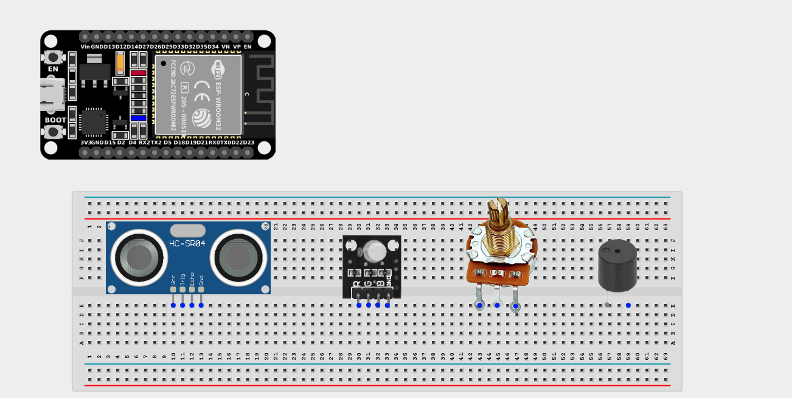
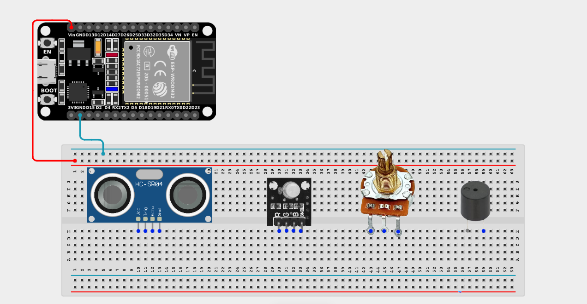
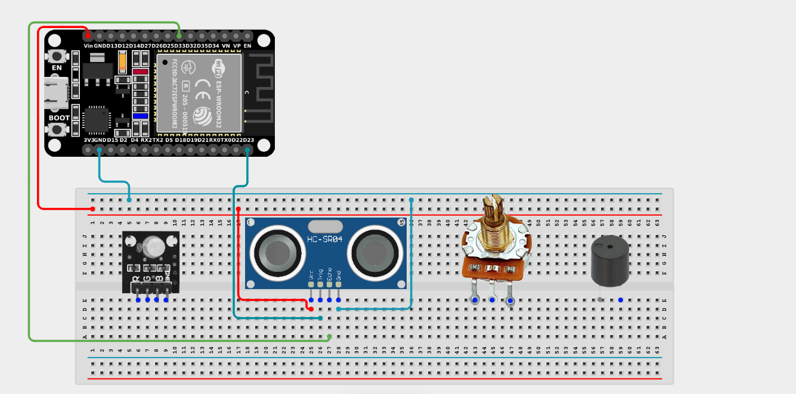
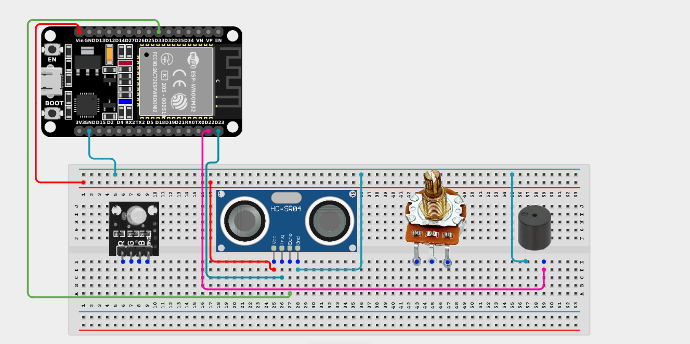
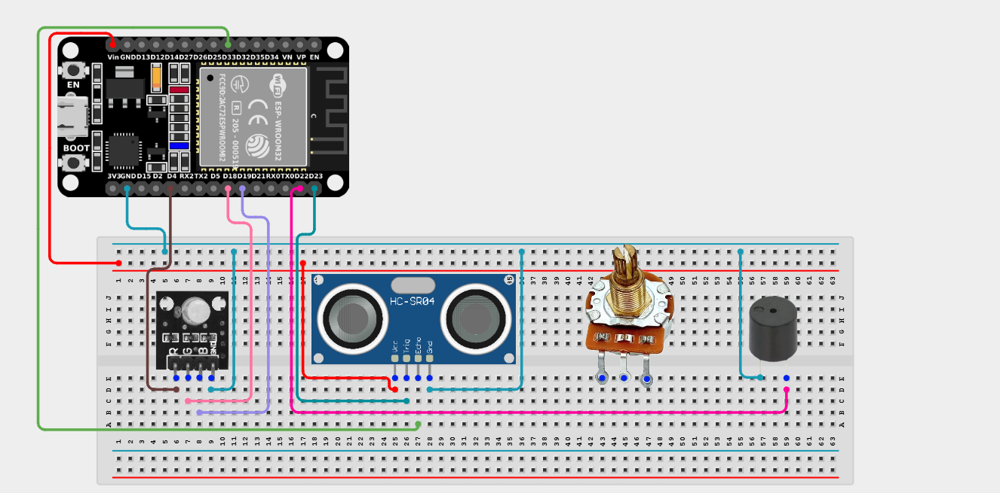
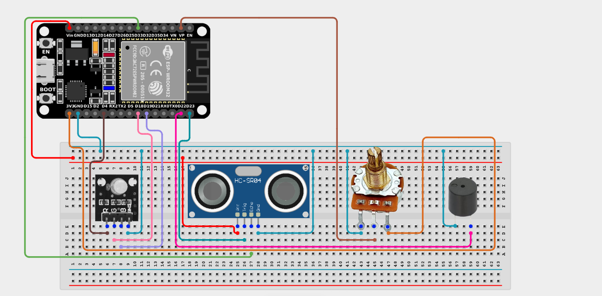

# Project 2.11.1: Distance Theremin

| **Description** | This project turns hand movements into music! Using an ultrasonic sensor, buzzer, and potentiometer, the distance between your hand and the sensor controls the pitch, while the potentiometer adjusts the volume or tempo. An RGB LED changes color according to the note range. |
|------------------|----------------------------------------------------------------|
| **Use case**     | This project can be used in musical instruments, sound experiments, STEM demonstrations, and for learning about sound waves and frequency generation. |

## Components (Things You will need)

| | | | | | | | |
|-------------------------|-------------------------|-------------------------|-------------------------|-------------------------|-------------------------|-------------------------|-------------------------|

## Building the circuit

> **Tip:** Use the [ESP32 Pin Mapping](../../../../assets/esp32_pin_mapping.png) image to locate the correct GPIO pins on your ESP32 board.

Things Needed:

- ESP32 board = 1

- Micro USB cable = 1

- Breadboard = 1

- Jumper wires 

- Ultrasonic Sensor = 1

- Active Buzzer = 1

- RGB LED module = 1

- Potentiometer = 1

---

## Mounting the components on the breadboard

**Step 1:** Mount the ESP32 and Components:

- Align the ESP32 board across the center dividing ridge of the breadboard.

- Insert the Ultrasonic Sensor into the breadboard so its four pins sit in separate adjacent rows, facing outward.

- Insert the Buzzer into the breadboard (remember the longer pin is positive).

- Insert the RGB LED into the breadboard.

- Insert the Potentiometer into the breadboard so its three pins sit in separate adjacent rows.



---

## Wiring the circuit

Follow these step-by-step connection details using your jumper wires:

**Step 1:** Create Power and Ground Rails

- Connect the **5V** or **VIN** pin on the ESP32 board to the positive (red) rail on the breadboard.

- Connect a **GND** pin on the ESP32 board to the negative (blue/black) rail on the breadboard.



**Step 2:** Wire the Ultrasonic Sensor

- Connect the **VCC** pin of the Ultrasonic sensor to the positive power rail.

- Connect the **GND** pin of the Ultrasonic sensor to the negative power rail.

- Connect the **Trig** pin of the Ultrasonic sensor to **GPIO 23** on the ESP32 board.

- Connect the **ECHO** pin of Ultrasonic sensor to **GPIO 33** on the ESP32 board.




**Step 3:** Wire the Buzzer

- Connect the **positive (+)** pin of the Buzzer to **GPIO 22** on the ESP32 board.

- Connect the **negative (-)** pin of the Buzzer to the negative ground rail.




**Step 4:** Wire the RGB LED

- Connect the **Red (R)** pin of the RGB LED to **GPIO 4** on the ESP32 board.

- Connect the **Green (G)** pin of the RGB LED to **GPIO 18** on the ESP32 board.

- Connect the **Blue (B)** pin of the RGB LED to **GPIO 19** on the ESP32 board.

- Connect the **GND (-)** pin of the RGB LED to the negative ground rail. *(If using a Common Anode RGB LED, connect this pin to 3.3V instead of GND).*




**Step 5:** Wire the Potentiometer

- Connect the **Left outer pin** of the Potentiometer to the positive 3.3V power rail.

- Connect the **Right outer pin** of the Potentiometer to the negative ground rail.

- Connect the **Middle (Signal)** pin of the Potentiometer to **GPIO 36 (VP)** on the ESP32 board.




*Make sure to connect the Micro USB cable securely to the ESP32 board and your computer.*

---

## PROGRAMMING

**Step 1:** Open your Arduino IDE. See how to set up here: [Getting Started](../../Getting Started/Arduino_IDE_Setup.md).

**Step 2:** Write the code in sections as detailed below.

### 1. Variables and Setup

```cpp
const int trigPin = 23;
const int echoPin = 33;
const int buzzerPin = 22;

const int redPin = 4;
const int greenPin = 18;
const int bluePin = 19;

const int potPin = 36;

long duration;
int distance;
int potValue;

void setup() {
  Serial.begin(9600);
  
  pinMode(trigPin, OUTPUT);
  pinMode(echoPin, INPUT);
  pinMode(buzzerPin, OUTPUT);
  
  pinMode(redPin, OUTPUT);
  pinMode(greenPin, OUTPUT);
  pinMode(bluePin, OUTPUT);
  
  // The ESP32 analog pins are INPUTs by default
}
```
*Explanation:* We declare all our pins. The ultrasonic sensor has a Trigger (OUTPUT) and Echo (INPUT). The Buzzer and RGB LED colors are OUTPUTs. We also prepare variables to store the distance from the sensor and the value from the potentiometer.

---

### 2. Main Loop

```cpp
void loop() {
  // 1. Read Potentiometer
  potValue = analogRead(potPin);
  
  // 2. Read Ultrasonic Distance
  digitalWrite(trigPin, LOW);
  delayMicroseconds(2);
  digitalWrite(trigPin, HIGH);
  delayMicroseconds(10);
  digitalWrite(trigPin, LOW);
  
  duration = pulseIn(echoPin, HIGH); 
  distance = duration * 0.034 / 2; 
  
  // 3. Constrain distance to a playable range (2cm to 30cm)
  if (distance < 2) distance = 2;
  if (distance > 30) distance = 30;
  
  // 4. Map distance to a sound frequency (e.g., 200Hz to 1500Hz)
  int pitch = map(distance, 2, 30, 200, 1500);
  
  // 5. Map Potentiometer to a delay (tempo) or use it for something else
  int tempoDelay = map(potValue, 0, 4095, 10, 200); 
  
  // Play the sound!
  tone(buzzerPin, pitch);
  
  // 6. Change RGB Color based on pitch
  if (pitch < 600) {
    // Low notes -> Red
    analogWrite(redPin, 255);
    analogWrite(greenPin, 0);
    analogWrite(bluePin, 0);
  } 
  else if (pitch < 1000) {
    // Medium notes -> Green
    analogWrite(redPin, 0);
    analogWrite(greenPin, 255);
    analogWrite(bluePin, 0);
  } 
  else {
    // High notes -> Blue
    analogWrite(redPin, 0);
    analogWrite(greenPin, 0);
    analogWrite(bluePin, 255);
  }
  
  // Wait before reading again based on the potentiometer knob!
  delay(tempoDelay);
}
```
*Explanation:* 

- We read both the potentiometer and the ultrasonic sensor.

- We limit the distance between 2cm and 30cm so the instrument behaves predictably.

- `map()` takes the distance (2 to 30) and translates it into a musical pitch (200Hz to 1500Hz).

- `map()` also takes the potentiometer knob position (0 to 4095) and translates it into a speed/tempo delay.

- The `tone()` function plays the pitch, and the `if/else` block assigns a color to the RGB LED based on how high or low the pitch is!

---

## Uploading the code

**Step 3:** Save your code. _See the [Getting Started](../../Getting Started/Arduino_IDE_Setup.md) section_

**Step 4:** Select the ESP32 board and port _See the [Getting Started](../../Getting Started/Arduino_IDE_Setup.md) section:Selecting ESP32 board Type and Uploading your code_.

**Step 5:** Upload your code. _See the [Getting Started](../../Getting Started/Arduino_IDE_Setup.md) section:Selecting ESP32 board Type and Uploading your code_

## Conclusion

This project demonstrates how multiple inputs (analog and digital/time-based) can be combined to control complex outputs (audio frequency and RGB color). By moving your hand up and down, you've essentially built a digital Theremin—one of the earliest electronic musical instruments!
