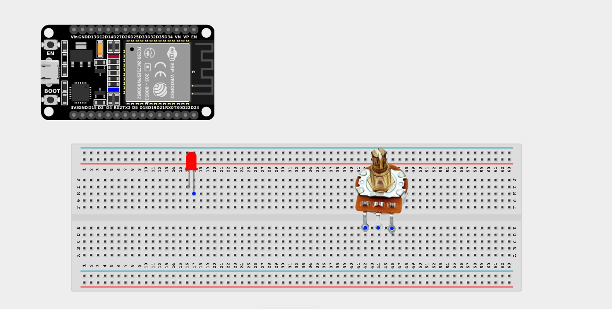
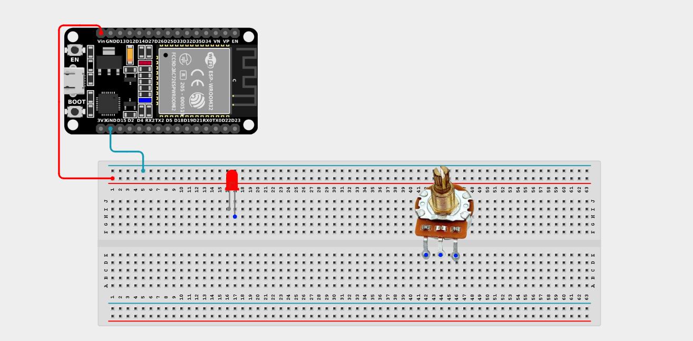
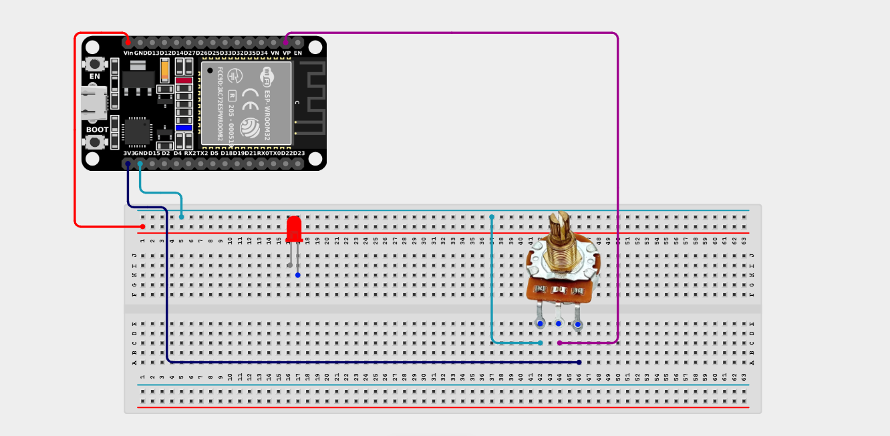
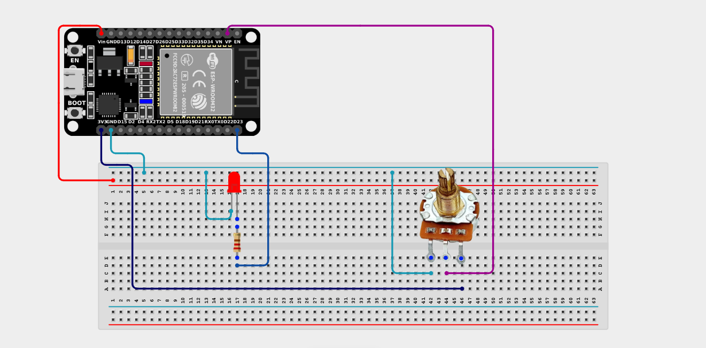

# Project 2.11.2: Potentiometer LED Dimmer

| **Description** | This project uses a potentiometer to control the brightness of an LED through PWM (Pulse Width Modulation), creating a smooth dimming effect just like a real household dimmer switch! |
|------------------|----------------------------------------------------------------|
| **Use case**     | This project can be used in automation systems, interactive installations, and embedded control applications like adjustable dashboard lighting or reading lamps. |

## Components (Things You will need)

| | | | | | |
|-------------------------|-------------------------|-------------------------|-------------------------|-------------------------|-------------------------|

## Building the circuit

> **Tip:** Use the [ESP32 Pin Mapping](../../../../assets/esp32_pin_mapping.png) image to locate the correct GPIO pins on your ESP32 board.

Things Needed:

- ESP32 board = 1

- Micro USB cable = 1

- Breadboard = 1

- Jumper wires 

- Potentiometer = 1

- LED = 1

- 220Ω resistor = 1

---

## Mounting the components on the breadboard

**Step 1:** Mount the ESP32 and Components:

- Align the ESP32 board across the center dividing ridge of the breadboard.

- Insert the Potentiometer into the breadboard so its three pins sit in separate adjacent rows.

- Insert the LED into the breadboard (remember the longer leg is positive).



---

## Wiring the circuit

Follow these step-by-step connection details using your jumper wires:

**Step 1:** Create Power and Ground Rails

- Connect the **5V** or **VIN** pin on the ESP32 board to the positive (red) rail on the breadboard.

- Connect a **GND** pin on the ESP32 board to the negative (blue/black) rail on the breadboard.



**Step 2:** Wire the Potentiometer

- Connect the **Left outer pin** of the Potentiometer to the positive 3.3V power rail.

- Connect the **Right outer pin** of the Potentiometer to the negative ground rail.

- Connect the **Middle (Signal) pin** of the Potentiometer to **GPIO 36 (VP)** on the ESP32 board.



**Step 3:** Wire the LED

- Connect a **220Ω resistor** from the positive (longer) leg of the LED to **GPIO 23** on the ESP32 board.

- Connect the negative (shorter) leg of the LED to the negative ground rail.



*Make sure to connect the Micro USB cable securely to the ESP32 board and your computer.*

---

## PROGRAMMING

**Step 1:** Open your Arduino IDE. See how to set up here: [Getting Started](../../Getting Started/Arduino_IDE_Setup.md).

**Step 2:** Write the code in sections as detailed below.

### 1. Variables and Setup

```cpp
const int potPin = 36;
const int ledPin = 23;

int potValue = 0;
int brightness = 0;

void setup() {
  Serial.begin(9600);
  
  pinMode(ledPin, OUTPUT);
  // Potentiometer pin is an analog input, no pinMode needed for ESP32 analog pins
}
```
*Explanation:* We assign the pins for our potentiometer (input) and LED (output). We also create variables to store the raw value from the knob (`potValue`) and the calculated PWM value for the LED (`brightness`).

---

### 2. Main Loop

```cpp
void loop() {
  // 1. Read the raw analog value from the potentiometer (0 to 4095 on ESP32)
  potValue = analogRead(potPin);
  
  // 2. Map the 12-bit analog reading (0-4095) to an 8-bit PWM value (0-255)
  brightness = map(potValue, 0, 4095, 0, 255);
  
  // 3. Write the PWM brightness value to the LED
  analogWrite(ledPin, brightness);
  
  // 4. Print the values to the Serial Monitor for debugging
  Serial.print("Potentiometer: ");
  Serial.print(potValue);
  Serial.print("  |  Brightness: ");
  Serial.println(brightness);
  
  delay(10); // Short delay for smooth fading
}
```
*Explanation:* 

- First, we `analogRead()` the potentiometer. Because the ESP32 has a 12-bit ADC (Analog-to-Digital Converter), the knob gives us a value between 0 and 4095.

- However, standard `analogWrite()` for PWM (Pulse Width Modulation) expects a value between 0 and 255!

- We use the magical `map()` function to perfectly scale the 0-4095 range down to the 0-255 range.

- Finally, we apply that calculated `brightness` to the LED. By rapidly turning the LED on and off (PWM), it appears to dim smoothly as you turn the knob!

---

## Uploading the code

**Step 3:** Save your code. _See the [Getting Started](../../Getting Started/Arduino_IDE_Setup.md) section_

**Step 4:** Select the ESP32 board and port _See the [Getting Started](../../Getting Started/Arduino_IDE_Setup.md) section:Selecting ESP32 board Type and Uploading your code_.

**Step 5:** Upload your code. _See the [Getting Started](../../Getting Started/Arduino_IDE_Setup.md) section:Selecting ESP32 board Type and Uploading your code_

## Conclusion

This project helps you understand analog-to-digital conversion and Pulse Width Modulation (PWM). By reading an analog input and properly mapping it to an output range, you have successfully built a hardware volume/brightness control!
