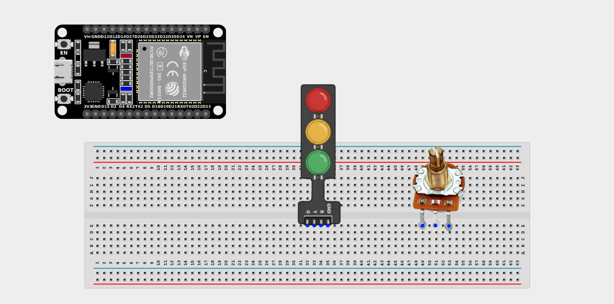
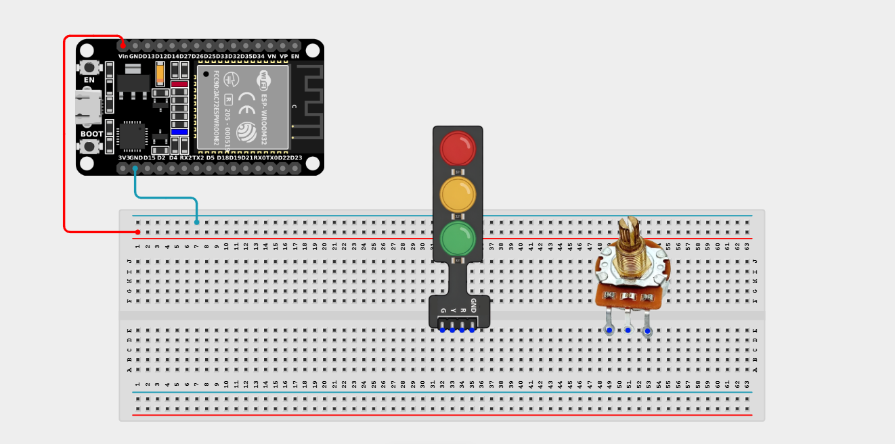
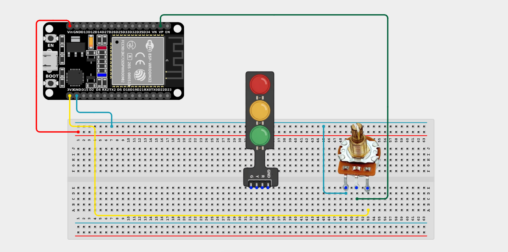
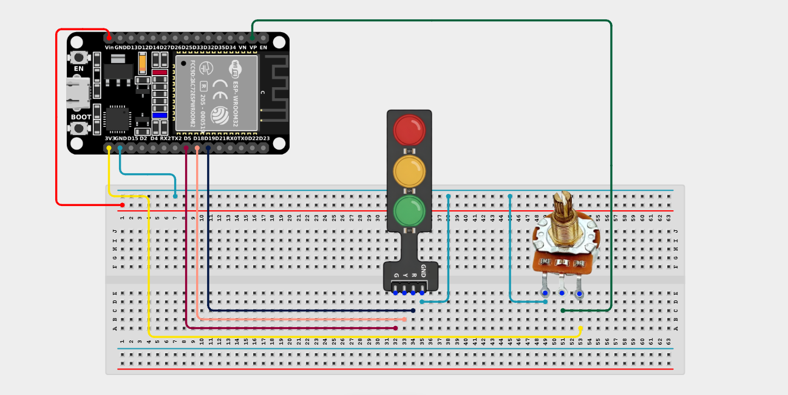

# Project 2.11.3: Manual Traffic Speed Dial

| **Description** | This project uses a potentiometer to manually control the cycling speed of a Traffic Light Module, allowing you to speed up or slow down the light sequence in real-time by turning the knob. |
|------------------|----------------------------------------------------------------|
| **Use case**     | This project can be used in automation systems, testing traffic simulations, or any system where a user needs manual control over the timing and speed of an automated sequence. |

## Components (Things You will need)

| | | | | | |
|-------------------------|-------------------------|-------------------------|-------------------------|-------------------------|-------------------------|

## Building the circuit

> **Tip:** Use the [ESP32 Pin Mapping](../../../../assets/esp32_pin_mapping.png) image to locate the correct GPIO pins on your ESP32 board.

Things Needed:

- ESP32 board = 1

- Micro USB cable = 1

- Breadboard = 1

- Jumper wires 

- Potentiometer = 1

- Traffic Light Module = 1

---

## Mounting the components on the breadboard

**Step 1:** Mount the ESP32 and Components:

- Align the ESP32 board across the center dividing ridge of the breadboard.

- Insert the Potentiometer into the breadboard so its three pins sit in separate adjacent rows.

- Insert the Traffic Light Module into the breadboard so its four pins sit in separate adjacent rows.



---

## Wiring the circuit

Follow these step-by-step connection details using your jumper wires:

**Step 1:** Create Power and Ground Rails

- Connect the **5V** or **VIN** pin on the ESP32 board to the positive (red) rail on the breadboard.

- Connect a **GND** pin on the ESP32 board to the negative (blue/black) rail on the breadboard.



**Step 2:** Wire the Potentiometer

- Connect the **Left outer pin** of the Potentiometer to the positive 3.3V power rail.

- Connect the **Right outer pin** of the Potentiometer to the negative ground rail.

- Connect the **Middle (Signal) pin** of the Potentiometer to **GPIO 36 (VP)** on the ESP32 board.



**Step 3:** Wire the Traffic Light Module

- Connect the **Green LED (G)** pin of the Traffic Light Module to **GPIO 5** on the ESP32 board.

- Connect the **Yellow LED (Y)** pin of the Traffic Light Module to **GPIO 18** on the ESP32 board.

- Connect the **Red LED (R)** pin of the Traffic Light Module to **GPIO 19** on the ESP32 board.

- Connect the **GND** pin of the Traffic Light Module to the negative ground rail.




*Make sure to connect the Micro USB cable securely to the ESP32 board and your computer.*

---

## PROGRAMMING

**Step 1:** Open your Arduino IDE. See how to set up here: [Getting Started](../../Getting Started/Arduino_IDE_Setup.md).

**Step 2:** Write the code in sections as detailed below.

### 1. Variables and Setup

```cpp
const int potPin = 36;

const int greenLED = 5;
const int yellowLED = 18;
const int redLED = 19;

int potValue;
int delayTime;

void setup() {
  Serial.begin(9600);
  
  pinMode(greenLED, OUTPUT);
  pinMode(yellowLED, OUTPUT);
  pinMode(redLED, OUTPUT);
}
```
*Explanation:* We declare our analog input pin for the potentiometer and the digital output pins for the three traffic lights. The `delayTime` variable will hold the calculated speed of our sequence based on the knob's position.

---

### 2. Main Loop

```cpp
void loop() {
  // Read the knob position (0 to 4095 on ESP32)
  potValue = analogRead(potPin);
  
  // Map the knob position to a delay time between 200ms and 2000ms
  delayTime = map(potValue, 0, 4095, 200, 2000);
  
  Serial.print("Delay Time: ");
  Serial.print(delayTime);
  Serial.println(" ms");
  
  // Phase 1: Green Light
  digitalWrite(greenLED, HIGH);
  digitalWrite(yellowLED, LOW);
  digitalWrite(redLED, LOW);
  delay(delayTime); // Wait based on the knob!
  
  // Phase 2: Yellow Light
  digitalWrite(greenLED, LOW);
  digitalWrite(yellowLED, HIGH);
  digitalWrite(redLED, LOW);
  delay(delayTime); // Wait based on the knob!
  
  // Phase 3: Red Light
  digitalWrite(greenLED, LOW);
  digitalWrite(yellowLED, LOW);
  digitalWrite(redLED, HIGH);
  delay(delayTime); // Wait based on the knob!
}
```
*Explanation:* 

- At the start of every loop, we read the potentiometer.

- We use `map()` to translate the knob's 0-4095 value into a delay between 200 milliseconds (very fast) and 2000 milliseconds (very slow).

- We then cycle through the Green, Yellow, and Red lights sequentially. Between each light change, we pause execution using `delay(delayTime)`. 

- By turning the knob, you inject a larger or smaller delay directly into the traffic light sequence, manually throttling the "speed" of the program!

---

## Uploading the code

**Step 3:** Save your code. _See the [Getting Started](../../Getting Started/Arduino_IDE_Setup.md) section_

**Step 4:** Select the ESP32 board and port _See the [Getting Started](../../Getting Started/Arduino_IDE_Setup.md) section:Selecting ESP32 board Type and Uploading your code_.

**Step 5:** Upload your code. _See the [Getting Started](../../Getting Started/Arduino_IDE_Setup.md) section:Selecting ESP32 board Type and Uploading your code_

## Conclusion

This project helps you understand how analog inputs can be used to control the timing and flow of an automated sequence. Instead of hardcoding delays, you've created a dynamically adjustable system that reacts to user input in real-time!
