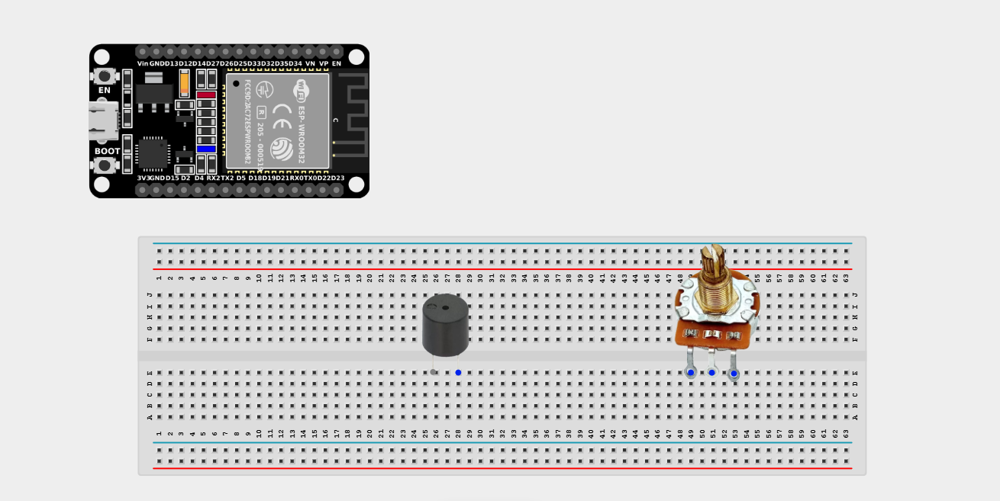
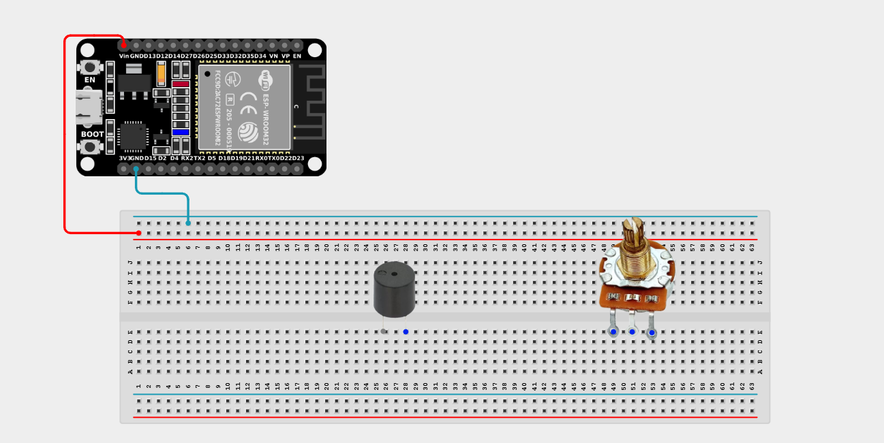
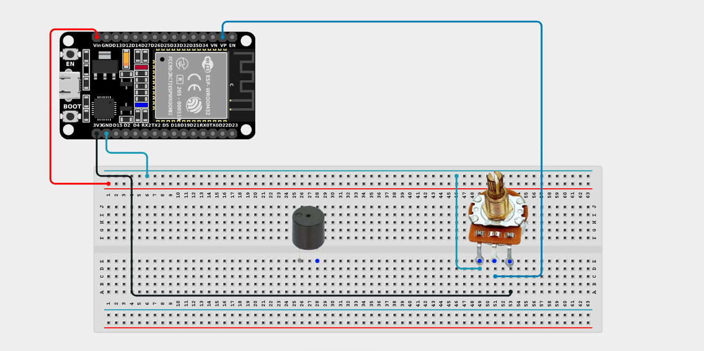
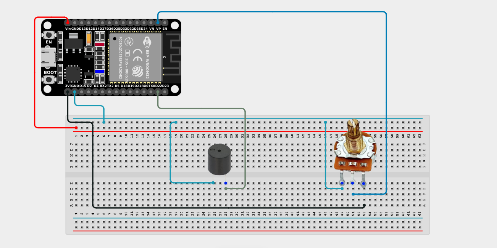

# Project 2.11.4: Potentiometer Frequency Theremin

| **Description** | This project uses a potentiometer to manually control the pitch of a buzzer, creating a simple theremin-like musical instrument that produces different continuous tones as the dial is turned. |
|------------------|----------------------------------------------------------------|
| **Use case**     | This project can be used to understand how analog resistance translates to audio frequencies. It's the foundation for digital synthesizers, adjustable alarms, and interactive audio exhibits! |

## Components (Things You will need)

| | | | | | |
|-------------------------|-------------------------|-------------------------|-------------------------|-------------------------|-------------------------|

## Building the circuit

> **Tip:** Use the [ESP32 Pin Mapping](../../../../assets/esp32_pin_mapping.png) image to locate the correct GPIO pins on your ESP32 board.

Things Needed:

- ESP32 board = 1

- Micro USB cable = 1

- Breadboard = 1

- Jumper wires 

- Potentiometer = 1

- Active Buzzer = 1

---

## Mounting the components on the breadboard

**Step 1:** Mount the ESP32 and Components:

- Align the ESP32 board across the center dividing ridge of the breadboard.

- Insert the Potentiometer into the breadboard so its three pins sit in separate adjacent rows.

- Insert the Buzzer into the breadboard (remember the longer leg is positive).



---

## Wiring the circuit

Follow these step-by-step connection details using your jumper wires:

**Step 1:** Create Power and Ground Rails

- Connect the **5V** or **VIN** pin on the ESP32 board to the positive (red) rail on the breadboard.

- Connect a **GND** pin on the ESP32 board to the negative (blue/black) rail on the breadboard.



**Step 2:** Wire the Potentiometer

- Connect the **Left outer pin** of the Potentiometer to the positive 3.3V power rail.

- Connect the **Right outer pin** of the Potentiometer to the negative ground rail.

- Connect the **Middle (Signal) pin** of the Potentiometer to **GPIO 36 (VP)** on the ESP32 board.



**Step 3:** Wire the Buzzer

- Connect the **positive (+)** pin of the Buzzer to **GPIO 22** on the ESP32 board.

- Connect the **negative (-)** pin of the Buzzer to the negative ground rail.



*Make sure to connect the Micro USB cable securely to the ESP32 board and your computer.*

---

## PROGRAMMING

**Step 1:** Open your Arduino IDE. See how to set up here: [Getting Started](../../Getting Started/Arduino_IDE_Setup.md).

**Step 2:** Write the code in sections as detailed below.

### 1. Variables and Setup

```cpp
const int potPin = 36;
const int buzzerPin = 22;

int potValue;
int frequency;

void setup() {
  Serial.begin(9600);
  pinMode(buzzerPin, OUTPUT);
}
```
*Explanation:* We declare our potentiometer pin (`potPin`) and the buzzer output (`buzzerPin`). We also set up variables to hold the raw knob value and the calculated audio frequency.

---

### 2. Main Loop

```cpp
void loop() {
  // 1. Read the knob position (0 to 4095 on ESP32)
  potValue = analogRead(potPin);
  
  // 2. Map the knob position to a musical frequency (e.g. 200 Hz to 2000 Hz)
  frequency = map(potValue, 0, 4095, 200, 2000);
  
  // 3. Play the sound!
  tone(buzzerPin, frequency);
  
  // 4. Print the values to the Serial Monitor
  Serial.print("Potentiometer: ");
  Serial.print(potValue);
  Serial.print("  |  Frequency: ");
  Serial.print(frequency);
  Serial.println(" Hz");
  
  delay(10); // Small delay for stability
}
```
*Explanation:* 

- We read the potentiometer's value, which ranges from 0 to 4095.

- The magic happens with `map(potValue, 0, 4095, 200, 2000)`. This smoothly scales the knob's rotation into an audible frequency range (200Hz is a low hum, 2000Hz is a high-pitched squeal).

- We then use `tone(buzzerPin, frequency)` to instantly apply that frequency to the buzzer. Turning the knob literally "plays" the instrument!

---

## Uploading the code

**Step 3:** Save your code. _See the [Getting Started](../../Getting Started/Arduino_IDE_Setup.md) section_

**Step 4:** Select the ESP32 board and port _See the [Getting Started](../../Getting Started/Arduino_IDE_Setup.md) section:Selecting ESP32 board Type and Uploading your code_.

**Step 5:** Upload your code. _See the [Getting Started](../../Getting Started/Arduino_IDE_Setup.md) section:Selecting ESP32 board Type and Uploading your code_

## Conclusion

This project helps you understand how physical motion translates to digital data, which is then mapped to audio waves. You have essentially created a basic, tunable sound synthesizer!
