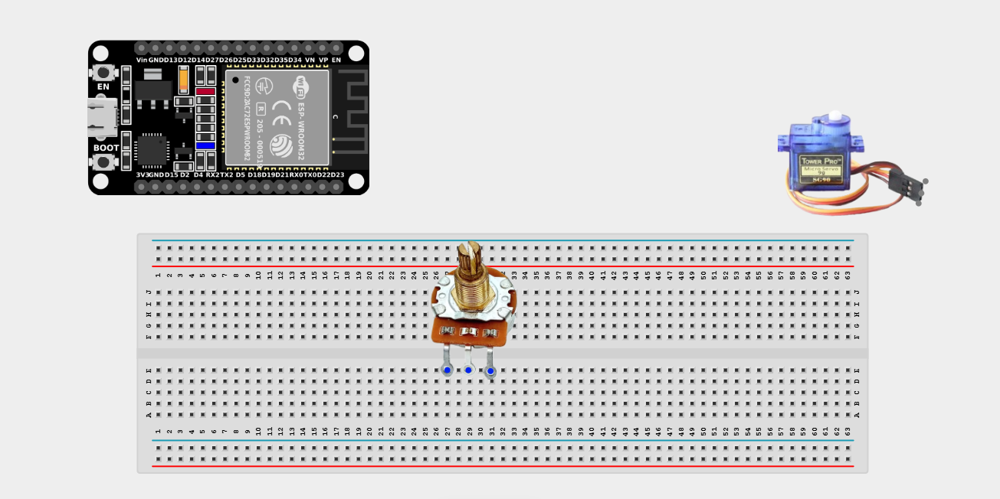
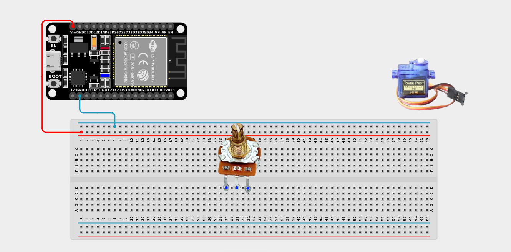
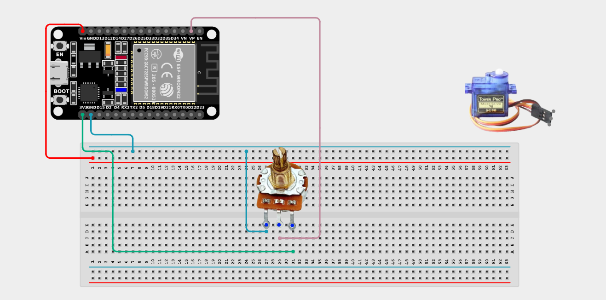
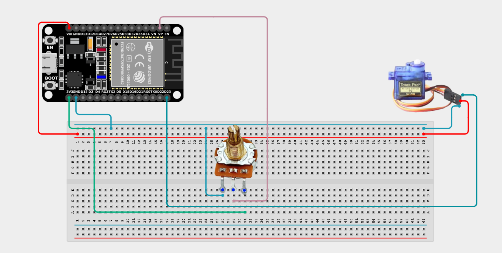

# Project 2.11.5: Potentiometer Servo Link

| **Description** | This project uses a potentiometer to physically control the angular position of a servo motor. Turning the knob sweeps the motor seamlessly from 0 to 180 degrees. |
|------------------|----------------------------------------------------------------|
| **Use case**     | This is exactly how robotic arms and RC (Remote Control) vehicles are steered! The physical position of your joystick or steering wheel maps directly to the physical position of the wheels or joints. |

## Components (Things You will need)

| | | | | | |
|-------------------------|-------------------------|-------------------------|-------------------------|-------------------------|-------------------------|

## Building the circuit

> **Tip:** Use the [ESP32 Pin Mapping](../../../../assets/esp32_pin_mapping.png) image to locate the correct GPIO pins on your ESP32 board.

Things Needed:

- ESP32 board = 1

- Micro USB cable = 1

- Breadboard = 1

- Jumper wires 

- Potentiometer = 1

- Servo motor = 1

---

## Mounting the components on the breadboard

**Step 1:** Mount the ESP32 and Components:

- Align the ESP32 board across the center dividing ridge of the breadboard.

- Insert the Potentiometer into the breadboard so its three pins sit in separate adjacent rows.

- Attach a servo blade (horn) onto the top of the servo motor so you can easily see it turn. 



---

## Wiring the circuit

Follow these step-by-step connection details using your jumper wires:

**Step 1:** Create Power and Ground Rails

- Connect the **5V** or **VIN** pin on the ESP32 board to the positive (red) rail on the breadboard.

- Connect a **GND** pin on the ESP32 board to the negative (blue/black) rail on the breadboard.



**Step 2:** Wire the Potentiometer

- Connect the **Left outer pin** of the Potentiometer to the positive 3.3V power rail.

- Connect the **Right outer pin** of the Potentiometer to the negative ground rail.

- Connect the **Middle (Signal) pin** of the Potentiometer to **GPIO 36 (VP)** on the ESP32 board.



**Step 3:** Wire the Servo Motor

*(Servo wire colors may vary. Usually: Red = VCC, Brown/Black = GND, Orange/Yellow = Signal)*

- Connect the **VCC (Red)** wire of the Servo to the positive 5V power rail.

- Connect the **GND (Brown/Black)** wire of the Servo to the negative ground rail.

- Connect the **Signal (Orange/Yellow)** wire of the Servo to **GPIO 23** on the ESP32 board.



*Make sure to connect the Micro USB cable securely to the ESP32 board and your computer.*

---

## PROGRAMMING

**Step 1:** Open your Arduino IDE. See how to set up here: [Getting Started](../../Getting Started/Arduino_IDE_Setup.md).

**Step 2:** Write the code in sections as detailed below.

### 1. Variables and Setup

```cpp
#include <ESP32Servo.h> // Make sure you have the ESP32Servo library installed!

const int potPin = 36;
const int servoPin = 23;

Servo myServo; 
int potValue;
int servoAngle;

void setup() {
  Serial.begin(9600);
  
  // Attach the servo variable to the correct pin
  myServo.attach(servoPin); 
}
```
*Explanation:* We include the `ESP32Servo.h` library, which contains all the complex math needed to move a servo motor perfectly. We declare our pins, create a `myServo` object, and use `myServo.attach()` in setup to tell the board which pin controls the motor.

---

### 2. Main Loop

```cpp
void loop() {
  // 1. Read the knob position (0 to 4095 on ESP32)
  potValue = analogRead(potPin);
  
  // 2. Map the knob position to a degree angle (0 to 180 degrees)
  servoAngle = map(potValue, 0, 4095, 0, 180);
  
  // 3. Move the servo to that angle!
  myServo.write(servoAngle);
  
  // 4. Print the values to the Serial Monitor
  Serial.print("Potentiometer: ");
  Serial.print(potValue);
  Serial.print("  |  Servo Angle: ");
  Serial.print(servoAngle);
  Serial.println("°");
  
  delay(15); // Small delay to let the servo physically reach the position
}
```
*Explanation:* 

- We read the potentiometer's value, which is a number between 0 and 4095.

- Because a standard servo motor can only rotate half a circle, we use `map()` to squeeze that 0-4095 range into a 0 to 180 degree scale.

- We issue the `myServo.write(servoAngle)` command, which instructs the motor to immediately turn to that specific angle!

- As you twist the knob, the servo continuously mimics your exact hand movements.

---

## Uploading the code

**Step 3:** Save your code. _See the [Getting Started](../../Getting Started/Arduino_IDE_Setup.md) section_

**Step 4:** Select the ESP32 board and port _See the [Getting Started](../../Getting Started/Arduino_IDE_Setup.md) section:Selecting ESP32 board Type and Uploading your code_.

**Step 5:** Upload your code. _See the [Getting Started](../../Getting Started/Arduino_IDE_Setup.md) section:Selecting ESP32 board Type and Uploading your code_

## Conclusion

This project helps you understand proportional physical control. By taking a digital sensor input, translating it mathematically, and applying it to a physical actuator, you have created the basis for robotics control systems!
