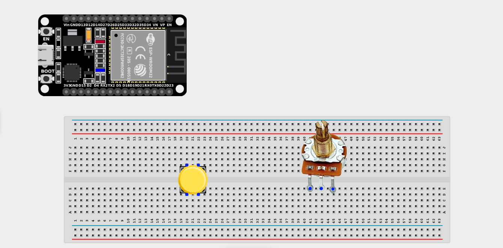
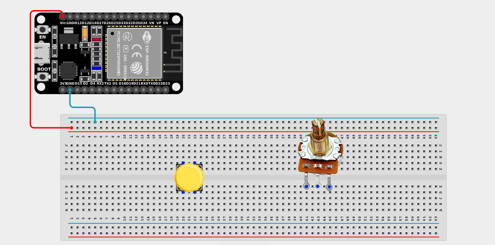
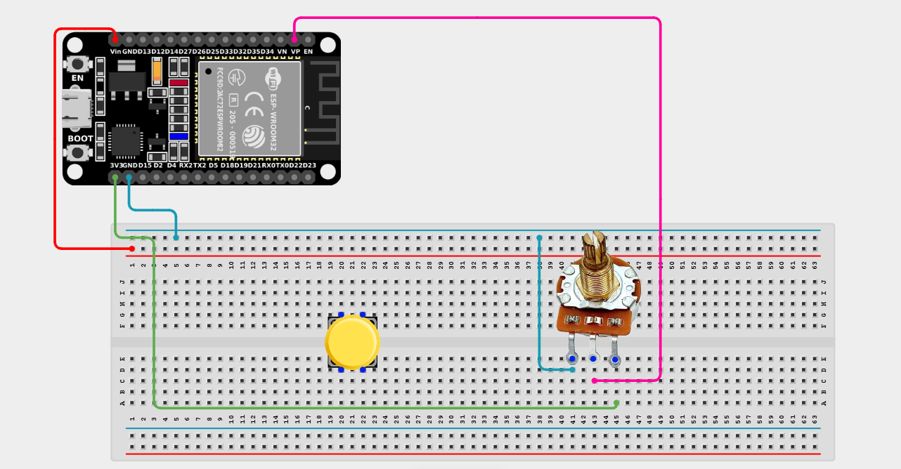
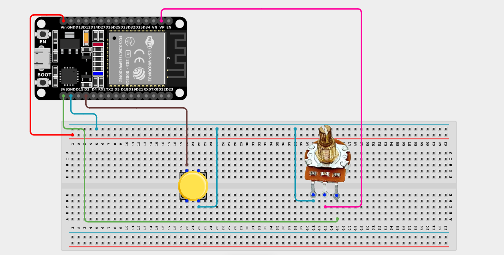

# Project 2.11.6: Menu Calibration Selector

| **Description** | This project allows a user to "dial in" a value using a potentiometer, and then permanently save that value by pressing a push button, creating a simple user interface for system calibration. |
|------------------|----------------------------------------------------------------|
| **Use case**     | Imagine an oven where you turn a dial to select the temperature, then push the button to confirm. This is used in almost all digital interfaces that don't have touchscreens! |

## Components (Things You will need)

|  |  |  |  |  |  |
| --- | --- | --- | --- | --- | --- |

## Building the circuit

> **Tip:** Use the [ESP32 Pin Mapping](../../../../assets/esp32_pin_mapping.png) image to locate the correct GPIO pins on your ESP32 board.

Things Needed:

- ESP32 board = 1

- Micro USB cable = 1

- Breadboard = 1

- Jumper wires 

- Potentiometer = 1

- Push Button = 1

---

## Mounting the components on the breadboard

**Step 1:** Mount the ESP32 and Components:

- Align the ESP32 board across the center dividing ridge of the breadboard.

- Insert the Potentiometer into the breadboard so its three pins sit in separate adjacent rows.

- Insert the Push Button across the center divider of the breadboard.



---

## Wiring the circuit

Follow these step-by-step connection details using your jumper wires:

**Step 1:** Create Power and Ground Rails

- Connect the **5V** or **VIN** pin on the ESP32 board to the positive (red) rail on the breadboard.

- Connect a **GND** pin on the ESP32 board to the negative (blue/black) rail on the breadboard.



**Step 2:** Wire the Potentiometer

- Connect the **Left outer pin** of the Potentiometer to the positive 3.3V power rail.

- Connect the **Right outer pin** of the Potentiometer to the negative ground rail.

- Connect the **Middle (Signal) pin** of the Potentiometer to **GPIO 36 (VP)** on the ESP32 board.



**Step 3:** Wire the Push Button

- Connect **one side** of the push button to **GPIO 2** on the ESP32 board.

- Connect the **other side** of the push button to the negative ground rail. *(We will use the ESP32's internal pull-up resistor).*



*Make sure to connect the Micro USB cable securely to the ESP32 board and your computer.*

---

## PROGRAMMING

**Step 1:** Open your Arduino IDE. See how to set up here: [Getting Started](../../Getting Started/Arduino_IDE_Setup.md).

**Step 2:** Write the code in sections as detailed below.

### 1. Variables and Setup

```cpp
const int potPin = 36;
const int buttonPin = 2;

int currentValue = 0;
int storedValue = 0;

bool lastButtonState = HIGH;
bool currentButtonState;

void setup() {
  Serial.begin(9600);
  
  // Use INPUT_PULLUP so we don't need an external resistor
  pinMode(buttonPin, INPUT_PULLUP);
  
  Serial.println("=== Calibration Menu ===");
  Serial.println("1. Rotate the dial to select a value.");
  Serial.println("2. Press the button to SAVE the value.");
}
```
*Explanation:* We assign our pins for the dial and the button. We create `currentValue` (what the dial says right now) and `storedValue` (the last value we saved). We also set up `INPUT_PULLUP` for the button and print a welcome message.

---

### 2. Main Loop

```cpp
void loop() {
  // Read both inputs
  currentValue = analogRead(potPin);
  currentButtonState = digitalRead(buttonPin);
  
  // Detect a button press (state change from HIGH to LOW)
  if (lastButtonState == HIGH && currentButtonState == LOW) {
    delay(50); // Debounce delay
    
    // SAVE the value!
    storedValue = currentValue;
    
    Serial.println("----------------------------");
    Serial.print(">>> SAVED VALUE: ");
    Serial.println(storedValue);
    Serial.println("----------------------------");
  }
  
  // Print the live status
  Serial.print("Current Dial: ");
  Serial.print(currentValue);
  Serial.print("   |   Currently Saved: ");
  Serial.println(storedValue);
  
  // Remember the button state for the next loop
  lastButtonState = currentButtonState;
  
  delay(100); 
}
```
*Explanation:* 

- We constantly read the live `currentValue` of the dial.

- We check for a *button press*. When we press the button, it connects the pin to Ground, pulling it `LOW`.

- If a press is detected, we overwrite `storedValue` with `currentValue` and print a confirmation message!

- If the button is not pressed, it just shows the live knob turning, while remembering whatever value was saved previously.

---

## Uploading the code

**Step 3:** Save your code. _See the [Getting Started](../../Getting Started/Arduino_IDE_Setup.md) section_

**Step 4:** Select the ESP32 board and port _See the [Getting Started](../../Getting Started/Arduino_IDE_Setup.md) section:Selecting ESP32 board Type and Uploading your code_.

**Step 5:** Upload your code. _See the [Getting Started](../../Getting Started/Arduino_IDE_Setup.md) section:Selecting ESP32 board Type and Uploading your code_

## Conclusion

This project helps you understand how memory states and hardware interrupts work together. You've created a UI (User Interface) where a human can physically input variables into a system and "lock them in" for the program to use later!
