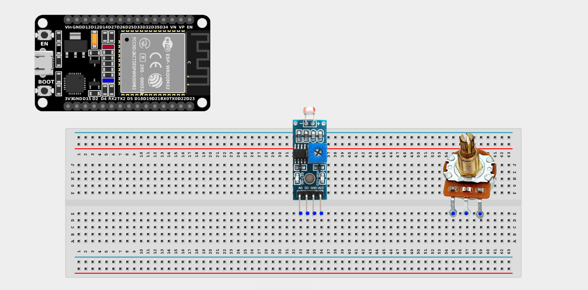
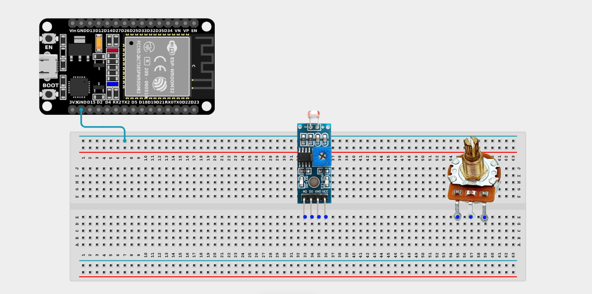
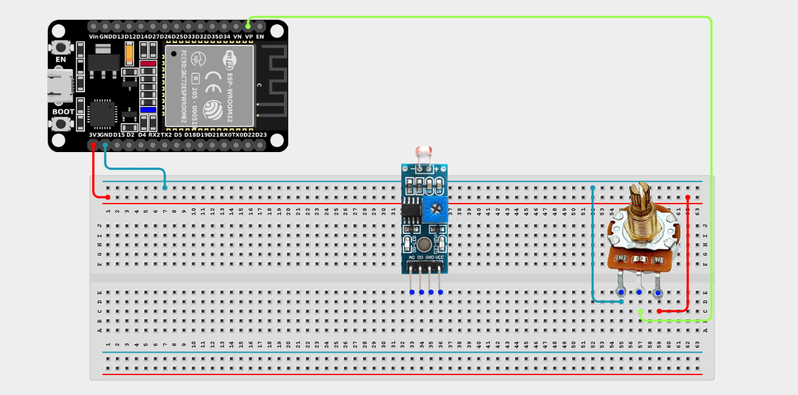
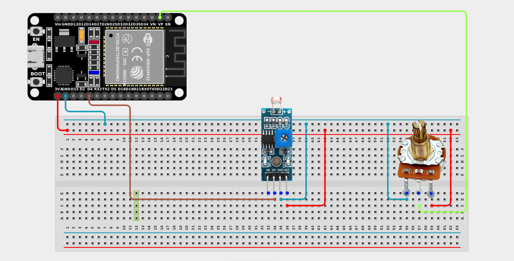

# Project 2.11.7: Lux Threshold Tuner

| **Description** | This project uses a potentiometer to physically adjust the light/dark threshold of an LDR (Light Dependent Resistor), creating a custom, user-calibrated light sensor system. |
|------------------|----------------------------------------------------------------|
| **Use case**     | This is exactly how automatic streetlights or automatic garden lights work. Instead of hardcoding what "dark" means, a user can turn a dial to decide exactly how dark it needs to be before the lights turn on! |

## Components (Things You will need)

|  |  |  |  |  |  |
| --- | --- | --- | --- | --- | --- |

## Building the circuit

> **Tip:** Use the [ESP32 Pin Mapping](../../../../assets/esp32_pin_mapping.png) image to locate the correct GPIO pins on your ESP32 board.

Things Needed:

- ESP32 board = 1

- Micro USB cable = 1

- Breadboard = 1

- Jumper wires

- LDR Sensor Module = 1

- Potentiometer = 1

---

## Mounting the components on the breadboard

**Step 1:** Mount the ESP32 and Components:

- Align the ESP32 board across the center dividing ridge of the breadboard.

- Insert the Potentiometer into the breadboard so its three pins sit in separate adjacent rows.

- Insert the LDR Sensor Module into the breadboard so its pins sit in separate adjacent rows.



---

## Wiring the circuit

Follow these step-by-step connection details using your jumper wires:

**Step 1:** Create Power and Ground Rails

- Connect the **5V** or **VIN** pin on the ESP32 board to the positive (red) rail on the breadboard.

- Connect a **GND** pin on the ESP32 board to the negative (blue/black) rail on the breadboard.



**Step 2:** Wire the Potentiometer

- Connect the **Left outer pin** of the Potentiometer to the positive 3.3V power rail.

- Connect the **Right outer pin** of the Potentiometer to the negative ground rail.

- Connect the **Middle (Signal) pin** of the Potentiometer to **GPIO 36 (VP)** on the ESP32 board.



**Step 3:** Wire the LDR Module

- Connect the **VCC** pin of the LDR Module to the 3.3V pin on the ESP32 board (or 3.3V power rail).

- Connect the **GND** pin of the LDR Module to the negative ground rail.

- Connect the **DO (Digital Out)** pin of the LDR Module to **GPIO 4** on the ESP32 board.



*Make sure to connect the Micro USB cable securely to the ESP32 board and your computer.*

---

## PROGRAMMING

**Step 1:** Open your Arduino IDE. See how to set up here: [Getting Started](../../Getting Started/Arduino_IDE_Setup.md).

**Step 2:** Write the code in sections as detailed below.

### 1. Variables and Setup

```cpp
const int potPin = 36;
const int ldrPin = 4;

int customThreshold;
int lightState;

void setup() {
  Serial.begin(9600);
  
  pinMode(ldrPin, INPUT);
}
```
*Explanation:* We declare `potPin` as the analog knob for our threshold setting, and `ldrPin` as the digital input coming from the light sensor. 

*(Note: Most LDR modules have a small blue box with a screw on them. That screw is actually a built-in tiny potentiometer! However, for this project, we are ignoring the built-in screw and using our big, user-friendly breadboard potentiometer to create a software threshold).*

---

### 2. Main Loop

```cpp
void loop() {
  // Read the potentiometer to get the user's custom threshold setting
  customThreshold = analogRead(potPin);
  
  // Read the digital state from the LDR module
  lightState = digitalRead(ldrPin);
  
  Serial.print("Custom System Threshold Setting: ");
  Serial.print(customThreshold);
  Serial.print("  |  System Status: ");
  
  // Check the light state
  // On most digital LDR modules, LOW means Bright Light, and HIGH means Darkness
  if (lightState == LOW) {
    Serial.println("Bright Environment Detected!");
  } else {
    Serial.println("Dark Environment Detected!");
  }
  
  // In a real application, you would compare customThreshold mathematically 
  // against an ANALOG LDR reading (AO pin) rather than just the digital DO pin!
  
  delay(300);
}
```
*Explanation:* 

- We read the potentiometer, which represents the user "turning up or down" the sensitivity of their imaginary streetlights.

- We then read whether the digital sensor currently thinks it's light or dark.

- *(Advanced Challenge: Try wiring the AO (Analog Out) pin of the LDR module to GPIO 39.

Then, mathematically compare `analogRead(potPin)` against `analogRead(39)` in an `if` statement to create a true, software-driven Lux Threshold tuner!)*

---

## Uploading the code

**Step 3:** Save your code. _See the [Getting Started](../../Getting Started/Arduino_IDE_Setup.md) section_

**Step 4:** Select the ESP32 board and port _See the [Getting Started](../../Getting Started/Arduino_IDE_Setup.md) section:Selecting ESP32 board Type and Uploading your code_.

**Step 5:** Upload your code. _See the [Getting Started](../../Getting Started/Arduino_IDE_Setup.md) section:Selecting ESP32 board Type and Uploading your code_

## Conclusion

This project helps you understand how hardware parameters can be dynamically altered by software and external user inputs. You've explored the foundations of user-calibrated embedded systems!
