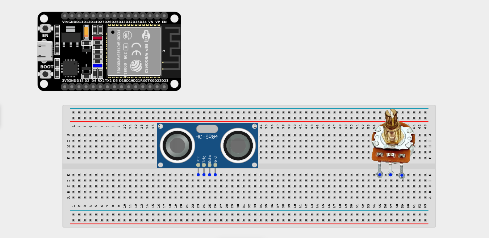
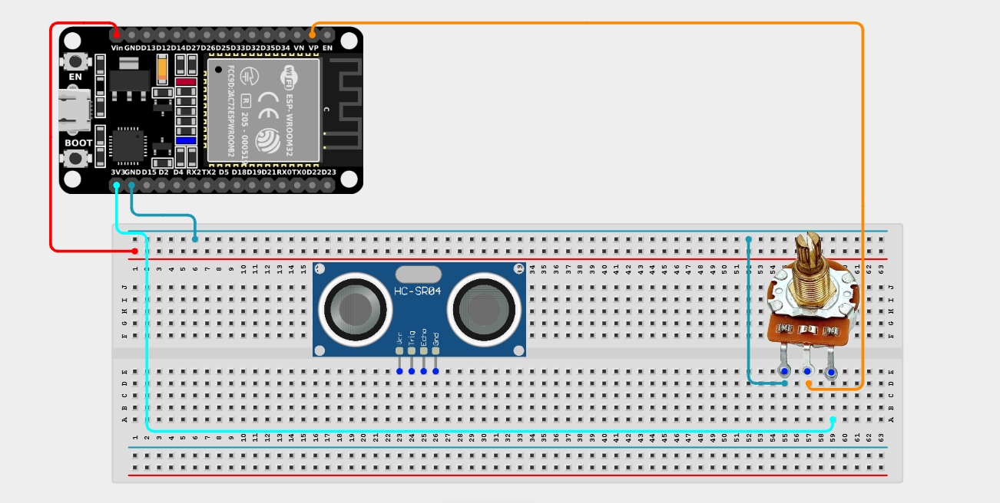
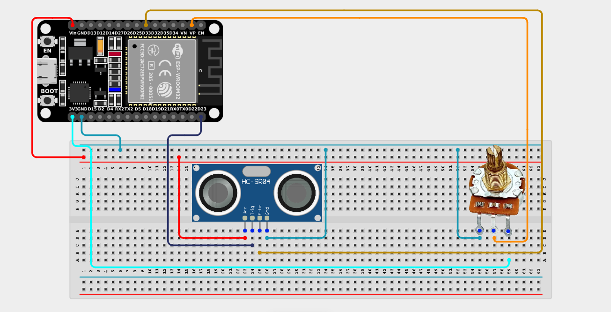

# Project 2.11.8: Safety Distance Calibrator

| **Description** | This project uses a potentiometer to physically adjust the safety distance boundary of an ultrasonic sensor (from 10cm to 100cm) without changing any code. |
|------------------|----------------------------------------------------------------|
| **Use case**     | This project can be used in parking assistance systems, robot obstacle detection, industrial safety zones, and automated machinery, where the minimum safe distance needs to be adjusted quickly on the fly based on current operating conditions. |

## Components (Things You will need)

|  |  |  |  |  |  |
| --- | --- | --- | --- | --- | --- |

## Building the circuit

> **Tip:** Use the [ESP32 Pin Mapping](../../../../assets/esp32_pin_mapping.png) image to locate the correct GPIO pins on your ESP32 board.

Things Needed:

- ESP32 board = 1

- Micro USB cable = 1

- Breadboard = 1

- Jumper wires 

- Ultrasonic sensor = 1

- Potentiometer = 1

---

## Mounting the components on the breadboard

**Step 1:** Mount the ESP32 and Components:

- Align the ESP32 board across the center dividing ridge of the breadboard.

- Insert the Potentiometer into the breadboard so its three pins sit in separate adjacent rows.

- Insert the Ultrasonic Sensor so its four pins (VCC, TRIG, ECHO, GND) sit in separate adjacent rows.



---

## Wiring the circuit

Follow these step-by-step connection details using your jumper wires:

**Step 1:** Create Power and Ground Rails

*Both the ultrasonic sensor and the potentiometer require access to 5V and GND. Since the ESP32 board has only one 5V pin, use the breadboard power rails to distribute power.*

- Connect the **5V** or **VIN** pin on the ESP32 board to the positive (red) rail on the breadboard.

- Connect a **GND** pin on the ESP32 board to the negative (blue/black) rail on the breadboard.


**Step 2:** Wire the Potentiometer

- Connect the **Left outer pin** of the Potentiometer to the positive 3.3V power rail.

- Connect the **Right outer pin** of the Potentiometer to the negative ground rail.

- Connect the **Middle (Signal) pin** of the Potentiometer to **GPIO 36 (VP)** on the ESP32 board.




**Step 3:** Wire the Ultrasonic Sensor

- Connect the **VCC** pin of the Ultrasonic sensor to the positive 5V power rail.

- Connect the **GND** pin of the Ultrasonic sensor to the negative ground rail.

- Connect the **TRIG** pin of the Ultrasonic sensor to **GPIO 23** on the ESP32 board.

- Connect the **ECHO** pin of the Ultrasonic sensor to **GPIO 33** on the ESP32 board.
 



*Make sure to connect the Micro USB cable securely to the ESP32 board and your computer.*

---

## PROGRAMMING

**Step 1:** Open your Arduino IDE. See how to set up here: [Getting Started](../../Getting Started/Arduino_IDE_Setup.md).

**Step 2:** Write the code in sections as detailed below.

### 1. Variables and Setup

```cpp
const int trigPin = 23;
const int echoPin = 33;
const int potPin = 36;

long duration;
float distance;
int threshold; // This will hold our adjustable safety limit

void setup() {
  Serial.begin(9600);
  
  pinMode(trigPin, OUTPUT);
  pinMode(echoPin, INPUT);
}
```
*Explanation:* We declare our pins for the ultrasonic sensor (`trigPin`, `echoPin`) and our potentiometer (`potPin`). We also set up variables to hold our calculations.

---

### 2. Main Loop

```cpp
void loop() {
  // 1. Read the user's desired safety threshold via the Potentiometer
  int potValue = analogRead(potPin);
  
  // Map the dial (0-4095) to a physical distance limit (10cm to 100cm)
  threshold = map(potValue, 0, 4095, 10, 100); 
  
  // 2. Trigger the Ultrasonic Sensor to send a ping
  digitalWrite(trigPin, LOW);
  delayMicroseconds(2);
  digitalWrite(trigPin, HIGH);
  delayMicroseconds(10);
  digitalWrite(trigPin, LOW);
  
  // 3. Measure how long it took for the echo to return
  duration = pulseIn(echoPin, HIGH);
  
  // 4. Calculate the distance in cm (Speed of sound is ~0.0343 cm/us)
  distance = duration * 0.0343 / 2;
  
  // 5. Print out the data for monitoring
  Serial.print("Current Distance: ");
  Serial.print(distance);
  Serial.print(" cm  |  Safety Limit Dial: ");
  Serial.print(threshold);
  Serial.print(" cm  |  Status: ");
  
  // 6. Check if the object has breached our custom safety zone!
  if (distance <= threshold) {
    Serial.println("WARNING: Object Inside Safety Zone!");
  } else {
    Serial.println("Safe");
  }
  
  delay(300);
}
```
*Explanation:* 

- We read the knob to get our `threshold` (the safety limit).

- We fire the ultrasonic ping, wait for the echo, and calculate the actual `distance` of the object in front of us.

- We then compare the physical reality (`distance`) against the user's requirement (`threshold`).

- If something gets closer than the limit set by the dial, the system throws a warning!

---

## Uploading the code

**Step 3:** Save your code. _See the [Getting Started](../../Getting Started/Arduino_IDE_Setup.md) section_

**Step 4:** Select the ESP32 board and port _See the [Getting Started](../../Getting Started/Arduino_IDE_Setup.md) section:Selecting ESP32 board Type and Uploading your code_.

**Step 5:** Upload your code. _See the [Getting Started](../../Getting Started/Arduino_IDE_Setup.md) section:Selecting ESP32 board Type and Uploading your code_

## Conclusion

This project helps learners understand how to combine variable analog inputs with complex sensor measurements. You've created a fully adjustable, real-time safety system without needing to re-upload code every time the requirements change!
