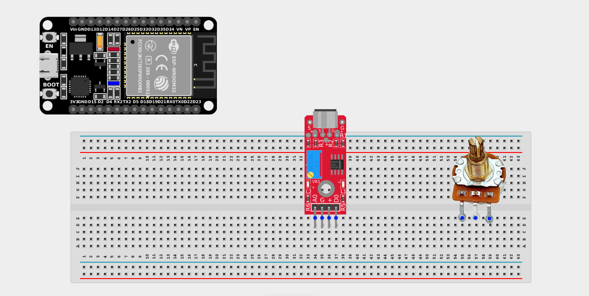
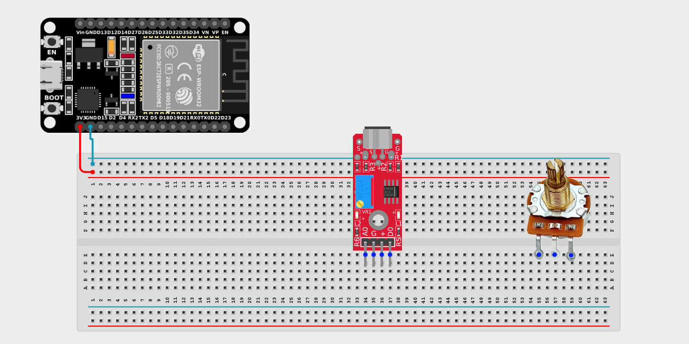
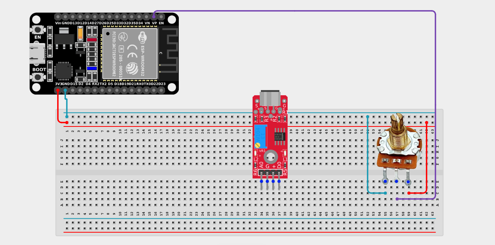
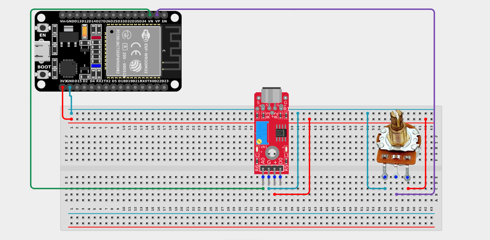

# Project 2.11.9: Clap Sensitivity Dial

| **Description** | This project uses a potentiometer to adjust the clap detection threshold of a sound sensor. The ESP32 continuously reads the analog output of the sound sensor and compares it with a threshold set by the potentiometer to detect loud sounds dynamically. |
|------------------|----------------------------------------------------------------|
| **Use case**     | This project can be used in voice-activated lighting, smart home controls, noise-triggered alarms, and interactive installations, where the sound detection sensitivity needs to be adjusted to suit quiet bedrooms vs noisy workshops. |

## Components (Things You will need)

|  |  |  |  |  |  |
| --- | --- | --- | --- | --- | --- |

## Building the circuit

> **Tip:** Use the [ESP32 Pin Mapping](../../../../assets/esp32_pin_mapping.png) image to locate the correct GPIO pins on your ESP32 board.

Things Needed:

- ESP32 board = 1

- Micro USB cable = 1

- Breadboard = 1

- Jumper wires 

- Sound sensor module = 1

- Potentiometer = 1

---

## Mounting the components on the breadboard

**Step 1:** Mount the ESP32 and Components:

- Align the ESP32 board across the center dividing ridge of the breadboard.

- Insert the Potentiometer into the breadboard so its three pins sit in separate adjacent rows.

- Insert the Sound Sensor Module into the breadboard so its pins sit in separate adjacent rows.



---

## Wiring the circuit

Follow these step-by-step connection details using your jumper wires:

**Step 1:** Create Power and Ground Rails

*Both the sound sensor and the potentiometer require 5V and GND. Since the ESP32 board has only one 5V pin, use the breadboard power rails to distribute power.*

- Connect the **3.3V** or **VIN** pin on the ESP32 board to the positive (red) rail on the breadboard.

- Connect a **GND** pin on the ESP32 board to the negative (blue/black) rail on the breadboard.



**Step 2:** Wire the Potentiometer

- Connect the **Left outer pin** of the Potentiometer to the positive 3.3V power rail.

- Connect the **Right outer pin** of the Potentiometer to the negative ground rail.

- Connect the **Middle (Signal) pin** of the Potentiometer to **GPIO 36 (VP)** on the ESP32 board.



**Step 3:** Wire the Sound Sensor

- Connect the **VCC** pin of the Sound sensor to the 3.3V pin on the ESP32 board (or 3.3V power rail).

- Connect the **GND** pin of the Sound sensor to the negative ground rail.

- Connect the **AO (Analog Out)** pin of the Sound sensor to **GPIO 39 (VN)** on the ESP32 board.



*Make sure to connect the Micro USB cable securely to the ESP32 board and your computer.*

---

## PROGRAMMING

**Step 1:** Open your Arduino IDE. See how to set up here: [Getting Started](../../Getting Started/Arduino_IDE_Setup.md).

**Step 2:** Write the code in sections as detailed below.

### 1. Variables and Setup

```cpp
const int potPin = 36;
const int soundPin = 39;

int threshold;
int soundLevel;

void setup() {
  Serial.begin(9600);
}
```
*Explanation:* We declare our analog pins (`potPin` and `soundPin`). Because we are purely reading analog voltages, we don't strictly need to declare `pinMode` in setup. 

---

### 2. Main Loop

```cpp
void loop() {
  // Read the user's custom threshold from the potentiometer
  threshold = analogRead(potPin);
  
  // Read the actual ambient noise level from the sound sensor
  soundLevel = analogRead(soundPin);
  
  // Print everything out
  Serial.print("Sensitivity Threshold: ");
  Serial.print(threshold);
  Serial.print("  |  Current Sound Level: ");
  Serial.print(soundLevel);
  Serial.print("  |  Status: ");
  
  // Check if the current noise exceeds the user's limit
  if (soundLevel > threshold) {
    Serial.println("CLAP DETECTED! (Loud sound)");
  } else {
    Serial.println("Quiet...");
  }
  
  delay(100);
}
```
*Explanation:* 

- First, we read the `threshold` from the potentiometer (our adjustable sensitivity dial).

- Then, we read the `soundLevel` from the sound sensor. This number bounces around based on room noise.

- We directly compare the two analog signals: if `soundLevel > threshold`, then a loud event occurred! By turning the dial, you change how loud a sound needs to be before it registers as a "clap".

---

## Uploading the code

**Step 3:** Save your code. _See the [Getting Started](../../Getting Started/Arduino_IDE_Setup.md) section_

**Step 4:** Select the ESP32 board and port _See the [Getting Started](../../Getting Started/Arduino_IDE_Setup.md) section:Selecting ESP32 board Type and Uploading your code_.

**Step 5:** Upload your code. _See the [Getting Started](../../Getting Started/Arduino_IDE_Setup.md) section:Selecting ESP32 board Type and Uploading your code_

## Conclusion

This project helps learners understand how to build dynamic calibration systems. By comparing two analog inputs directly in code, you created an adjustable smart sensor system!
