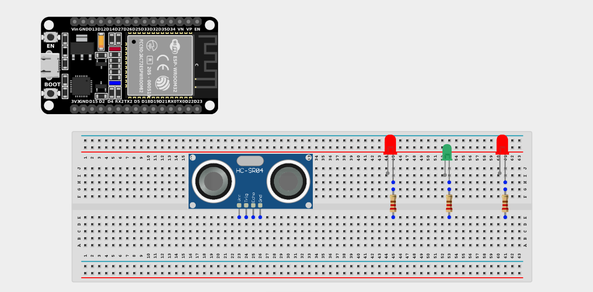
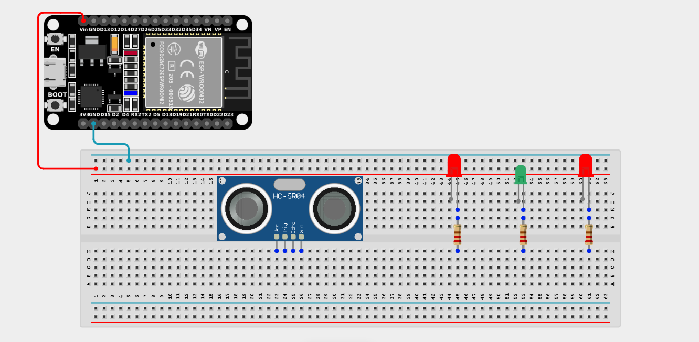
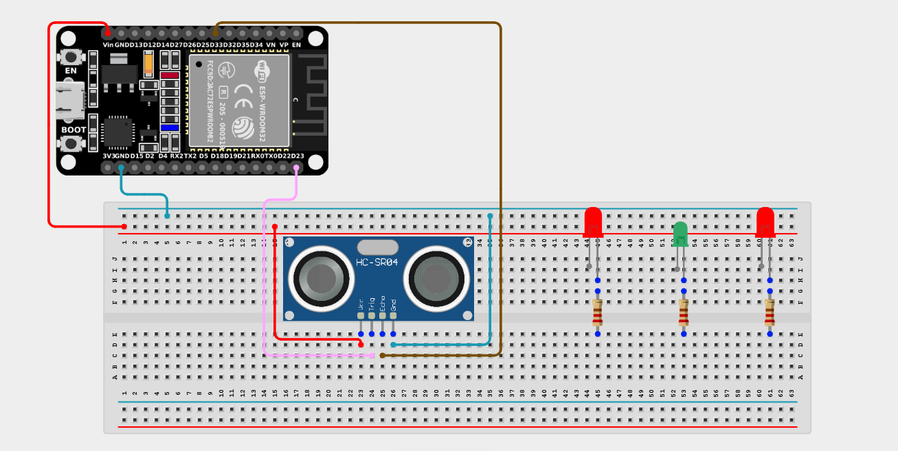
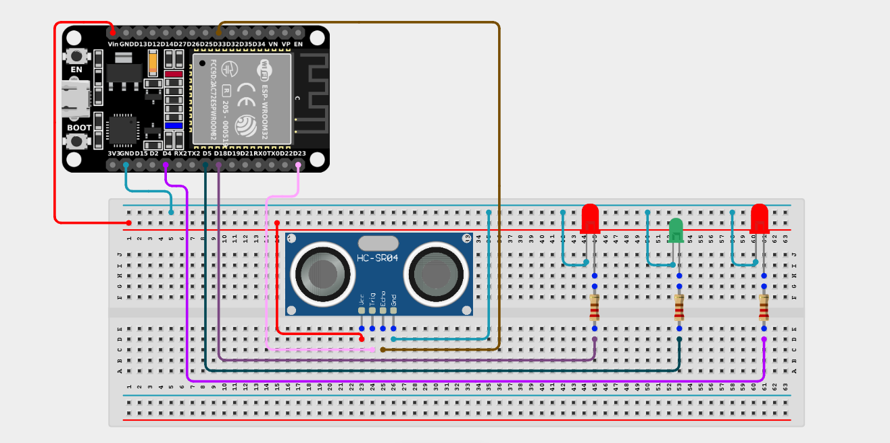

# Project 2.12.1: Automatic Traffic Detection

| **Description** | This project simulates an intelligent street lighting system that responds to approaching vehicles or pedestrians using ultrasonic sensing and LED lighting. |
| --------------- | -------------------------------------------------------------------------------------------------------------------------------------------------------------------------------------------------------------------------------------------------------------------------- |
| **Use case**    | Smart street lighting, energy-saving systems, and smart city applications. Lights remain off to save energy, and only turn on when an object approaches within 100cm.|

## Components (Things You will need)

|  |  |  |  |  | | |
| --------------------------------------------------- | ------------------------------------------------------ | ----------------------------------------------------------- | --------------------------------------------------------- | ------------------------------------------------------ | ------------------------------------------------------ | ------------------------------------------------------ | 

## Building the circuit

> **Tip:** Use the [ESP32 Pin Mapping](../../../../assets/esp32_pin_mapping.png) image to locate the correct GPIO pins on your ESP32 board.

Things Needed:

- ESP32 board = 1

- Micro USB cable = 1

- Breadboard = 1

- Jumper Wires 

- Ultrasonic Sensor = 1

- LEDs = 3 (Yellow or White)

- 220Ω Resistors = 3

---

## Mounting the components on the breadboard

**Step 1:** Mount the ESP32 and Components:

- Align the ESP32 board across the center dividing ridge of the breadboard.

- Insert the Ultrasonic Sensor so its four pins (VCC, TRIG, ECHO, GND) sit in separate adjacent rows.

- Insert the 3 LEDs into the breadboard. Remember, the longer leg is the positive (anode) and the shorter leg is the negative (cathode).

- Connect one 220Ω resistor to the positive leg of each LED.



---

## Wiring the circuit

Follow these step-by-step connection details using your jumper wires:

**Step 1:** Create Power and Ground Rails

- Connect the **5V** or **VIN** pin on the ESP32 board to the positive (red) rail on the breadboard.

- Connect a **GND** pin on the ESP32 board to the negative (blue/black) rail on the breadboard.



**Step 2:** Wire the Ultrasonic Sensor

- Connect the **VCC** pin of the Ultrasonic sensor to the positive 5V power rail.

- Connect the **GND** pin of the Ultrasonic sensor to the negative ground rail.

- Connect the **TRIG** pin of the Ultrasonic sensor to **GPIO 23** on the ESP32 board.

- Connect the **ECHO** pin of the Ultrasonic sensor to **GPIO 33** on the ESP32 board.



**Step 3:** Wire the LEDs

- Connect the free end of the first LED's resistor to **GPIO 4**.

Connect its negative leg to GND.

- Connect the free end of the second LED's resistor to **GPIO 5**.

Connect its negative leg to GND.

- Connect the free end of the third LED's resistor to **GPIO 18**.

Connect its negative leg to GND.



*Make sure to connect the Micro USB cable securely to the ESP32 board and your computer.*

---

## PROGRAMMING

**Step 1:** Open your Arduino IDE. See how to set up here: [Getting Started](../../Getting Started/Arduino_IDE_Setup.md).

**Step 2:** Write the code in sections as detailed below.

### 1. Variables and Setup

```cpp
const int trigPin = 23;
const int echoPin = 33;

const int led1 = 4;
const int led2 = 5;
const int led3 = 18;

long duration;
float distance;

void setup() {
  Serial.begin(9600);
  
  pinMode(trigPin, OUTPUT);
  pinMode(echoPin, INPUT);
  
  pinMode(led1, OUTPUT);
  pinMode(led2, OUTPUT);
  pinMode(led3, OUTPUT);
}
```
*Explanation:* We declare pins for our sensor and our three LEDs, and configure their pin modes correctly (sensor trigger is output, echo is input, all LEDs are outputs).

---

### 2. Main Loop

```cpp
void loop() {
  // 1. Trigger the Ultrasonic Sensor to send a ping
  digitalWrite(trigPin, LOW);
  delayMicroseconds(2);
  digitalWrite(trigPin, HIGH);
  delayMicroseconds(10);
  digitalWrite(trigPin, LOW);
  
  // 2. Measure how long it took for the echo to return
  duration = pulseIn(echoPin, HIGH);
  
  // 3. Calculate the distance in cm (Speed of sound is ~0.0343 cm/us)
  distance = duration * 0.0343 / 2;
  
  Serial.print("Target Distance: ");
  Serial.print(distance);
  Serial.println(" cm");
  
  // 4. Logic: If target is within 100cm, turn on the "street lights"
  if (distance > 0 && distance <= 100) {
    digitalWrite(led1, HIGH);
    digitalWrite(led2, HIGH);
    digitalWrite(led3, HIGH);
  } else {
    // If nothing is nearby, save energy and turn them off
    digitalWrite(led1, LOW);
    digitalWrite(led2, LOW);
    digitalWrite(led3, LOW);
  }
  
  delay(100);
}
```
*Explanation:* 

- We send a ping and calculate the distance of the nearest object.

- The `if (distance > 0 && distance <= 100)` statement checks if a vehicle or person is within 100cm (and ensuring distance isn't negative/zero from a read error). 

- If a target is close enough, we power `HIGH` all three LEDs, simulating an array of street lights illuminating ahead of the driver. Otherwise, they turn off.

---

## Uploading the code

**Step 3:** Save your code. _See the [Getting Started](../../Getting Started/Arduino_IDE_Setup.md) section_

**Step 4:** Select the ESP32 board and port _See the [Getting Started](../../Getting Started/Arduino_IDE_Setup.md) section:Selecting ESP32 board Type and Uploading your code_.

**Step 5:** Upload your code. _See the [Getting Started](../../Getting Started/Arduino_IDE_Setup.md) section:Selecting ESP32 board Type and Uploading your code_

## Conclusion

You have successfully built an automatic traffic detection system! You learned how to measure distance using an ultrasonic sensor, detect the presence of approaching vehicles, and use conditional statements to automate a multi-light system. Similar technology is used in smart city applications to improve energy efficiency.
