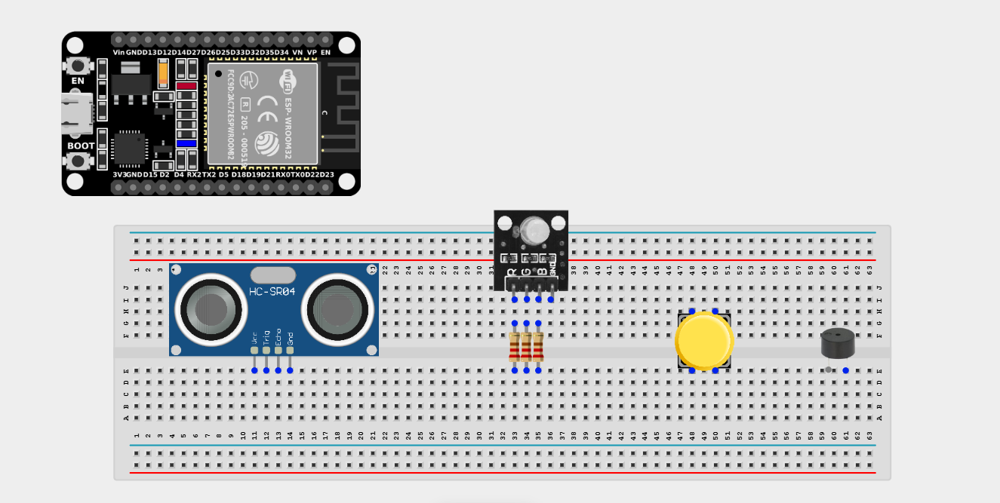
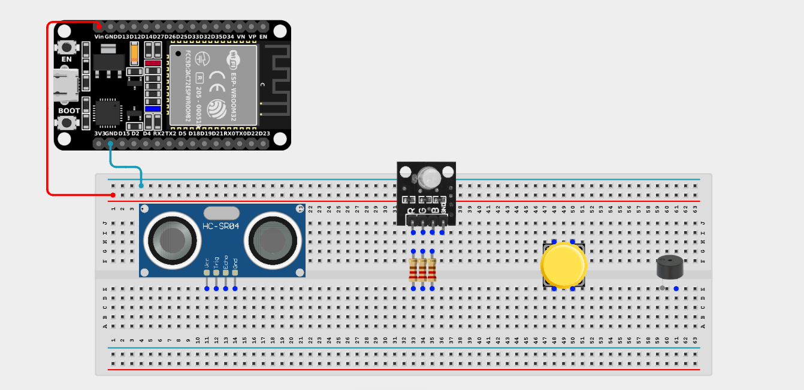
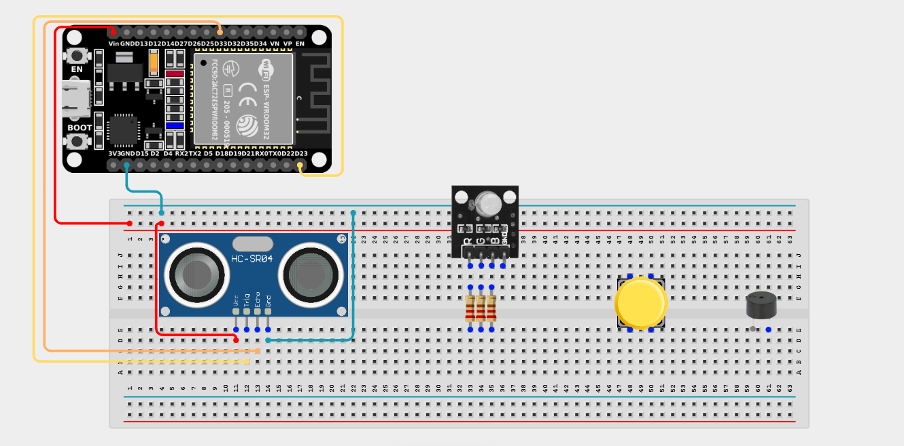
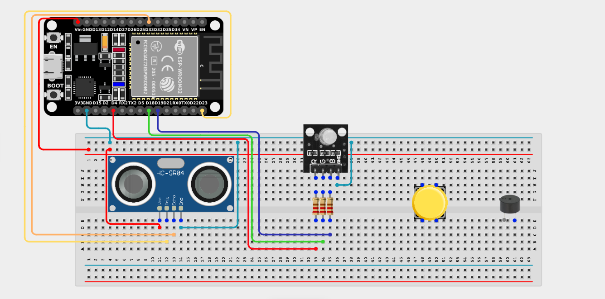
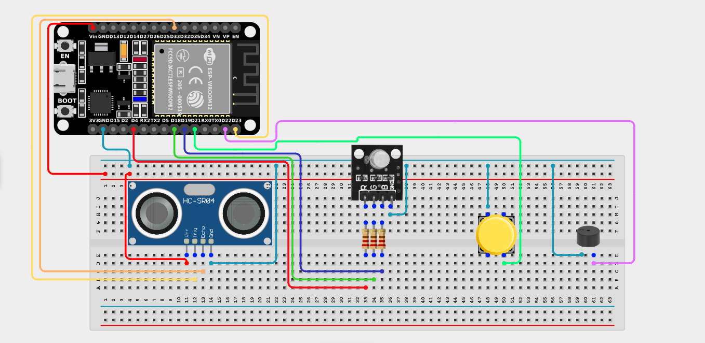

# Project 2.13.1: Intruder Alarm System

| **Description** | This project creates a simple security system that can be armed and disarmed using a pushbutton. When armed, the ultrasonic sensor detects intruders and triggers both visual (flashing red RGB LED) and audible (buzzer) alarms. |
| --------------- | -------------------------------------------------------------------------------------------------------------------------------------------------------------------------------------------------------------------------------------------------------------------------- |
| **Use case**    | Home security systems, intrusion detection, perimeter monitoring, and smart alarm systems that can be toggled on and off by the user. |

## Components (Things You will need)

|  |  |  |  |  |  |  |  |  |
| --------------------------------------------------- | ------------------------------------------------------ | ----------------------------------------------------------- | --------------------------------------------------------- | ------------------------------------------------------ | ------------------------------------------------------ | ------------------------------------------------------ | ------------------------------------------------------ | ------------------------------------------------------ | 

## Building the circuit

> **Tip:** Use the [ESP32 Pin Mapping](../../../../assets/esp32_pin_mapping.png) image to locate the correct GPIO pins on your ESP32 board.

Things Needed:

- ESP32 board = 1

- Micro USB cable = 1

- Breadboard = 1

- Jumper Wires 

- Ultrasonic Sensor = 1

- RGB LED = 1

- 220Ω Resistors = 3

- Active Buzzer = 1

- Pushbutton = 1

---

## Mounting the components on the breadboard

**Step 1:** Mount the ESP32 and Components:

- Align the ESP32 board across the center dividing ridge of the breadboard.

- Insert the Ultrasonic Sensor so its four pins (VCC, TRIG, ECHO, GND) sit in separate adjacent rows.

- Insert the RGB LED into the breadboard. Remember, the longest leg is the common cathode (Negative).

- Insert the Pushbutton across the center divider of the breadboard.

- Insert the Buzzer (remember the longer leg is positive).

- Connect one 220Ω resistor to the Red, Green, and Blue legs of the RGB LED.




---

## Wiring the circuit

Follow these step-by-step connection details using your jumper wires:

**Step 1:** Create Power and Ground Rails

- Connect the **5V** or **VIN** pin on the ESP32 board to the positive (red) rail on the breadboard.

- Connect a **GND** pin on the ESP32 board to the negative (blue/black) rail on the breadboard.



**Step 2:** Wire the Ultrasonic Sensor

- Connect the **VCC** pin of the Ultrasonic sensor to the positive 5V power rail.

- Connect the **GND** pin of the Ultrasonic sensor to the negative ground rail.

- Connect the **TRIG** pin of the Ultrasonic sensor to **GPIO 23** on the ESP32 board.

- Connect the **ECHO** pin of the Ultrasonic sensor to **GPIO 33** on the ESP32 board.


  

**Step 3:** Wire the RGB LED

- Connect the **Common Cathode (longest leg)** of the RGB LED to the negative ground rail.

- Connect the free end of the resistor connected to the **Red (R)** leg to **GPIO 4**.

- Connect the free end of the resistor connected to the **Green (G)** leg to **GPIO 18**.

- Connect the free end of the resistor connected to the **Blue (B)** leg to **GPIO 19**.



**Step 4:** Wire the Buzzer & Pushbutton

- Connect the **positive (+)** pin of the Buzzer to **GPIO 22** on the ESP32 board.

- Connect the **negative (-)** pin of the Buzzer to the negative ground rail.

- Connect **one side** of the Pushbutton to **GPIO 21** on the ESP32 board.

- Connect the **other side** of the Pushbutton to the negative ground rail. *(We will use the internal pull-up resistor).*



*Make sure to connect the Micro USB cable securely to the ESP32 board and your computer.*

---

## PROGRAMMING

**Step 1:** Open your Arduino IDE. See how to set up here: [Getting Started](../../Getting Started/Arduino_IDE_Setup.md).

**Step 2:** Write the code in sections as detailed below.

### 1. Variables and Setup

```cpp
const int trigPin = 23;
const int echoPin = 33;
const int buttonPin = 21;
const int buzzerPin = 22;

const int redPin = 4;
const int greenPin = 18;
const int bluePin = 19;

long duration;
float distance;

bool isArmed = false;
bool lastButtonState = HIGH;
bool currentButtonState;

void setup() {
  Serial.begin(9600);
  
  pinMode(trigPin, OUTPUT);
  pinMode(echoPin, INPUT);
  
  pinMode(redPin, OUTPUT);
  pinMode(greenPin, OUTPUT);
  pinMode(bluePin, OUTPUT);
  
  pinMode(buzzerPin, OUTPUT);
  pinMode(buttonPin, INPUT_PULLUP);
  
  Serial.println("System Disarmed. Press button to Arm.");
}
```
*Explanation:* We declare all our pins. We set up an `isArmed` variable to remember whether the security system is currently turned on or off.

---

### 2. Main Loop

```cpp
void loop() {
  // 1. Read the button to toggle armed state
  currentButtonState = digitalRead(buttonPin);
  
  if (lastButtonState == HIGH && currentButtonState == LOW) {
    isArmed = !isArmed; // Toggle the state
    if (isArmed) {
      Serial.println("SYSTEM ARMED! Monitoring...");
    } else {
      Serial.println("SYSTEM DISARMED.");
    }
    delay(200); // Debounce
  }
  lastButtonState = currentButtonState;
  
  // 2. If the system is armed, monitor for intruders
  if (isArmed) {
    // Send ping
    digitalWrite(trigPin, LOW); delayMicroseconds(2);
    digitalWrite(trigPin, HIGH); delayMicroseconds(10);
    digitalWrite(trigPin, LOW);
    
    // Read echo
    duration = pulseIn(echoPin, HIGH);
    distance = duration * 0.0343 / 2;
    
    // Check if someone is within 50cm!
    if (distance > 0 && distance <= 50) {
      Serial.println("INTRUDER ALERT!!!");
      // Trigger Alarm!
      digitalWrite(buzzerPin, HIGH);
      digitalWrite(redPin, HIGH);
      digitalWrite(greenPin, LOW);
      digitalWrite(bluePin, LOW);
      delay(500);
      
      digitalWrite(buzzerPin, LOW);
      digitalWrite(redPin, LOW);
      delay(500);
    } else {
      // System Armed, but no intruder. Show solid Green.
      digitalWrite(redPin, LOW);
      digitalWrite(greenPin, HIGH);
      digitalWrite(bluePin, LOW);
    }
  } else {
    // System Disarmed. Turn off alarm components.
    digitalWrite(buzzerPin, LOW);
    digitalWrite(redPin, LOW);
    digitalWrite(greenPin, LOW);
    digitalWrite(bluePin, LOW);
  }
}
```
*Explanation:* 

- We first check if the button was pressed. If so, we flip the `isArmed` switch on or off.

- If the system is `isArmed`, we use the ultrasonic sensor to check for objects closer than 50cm.

- If an object is detected, we flash the Red LED and sound the buzzer!

- If no object is detected, we show a solid Green LED to indicate "Armed & Safe".

- If the system is completely disarmed, we turn off the LEDs and buzzer so the user can walk past safely.

---

## Uploading the code

**Step 3:** Save your code. _See the [Getting Started](../../Getting Started/Arduino_IDE_Setup.md) section_

**Step 4:** Select the ESP32 board and port _See the [Getting Started](../../Getting Started/Arduino_IDE_Setup.md) section:Selecting ESP32 board Type and Uploading your code_.

**Step 5:** Upload your code. _See the [Getting Started](../../Getting Started/Arduino_IDE_Setup.md) section:Selecting ESP32 board Type and Uploading your code_

## Conclusion

This project demonstrates how a button can be used as a toggle switch to activate or deactivate a complex monitoring loop. You have successfully built a real-world security alarm!
