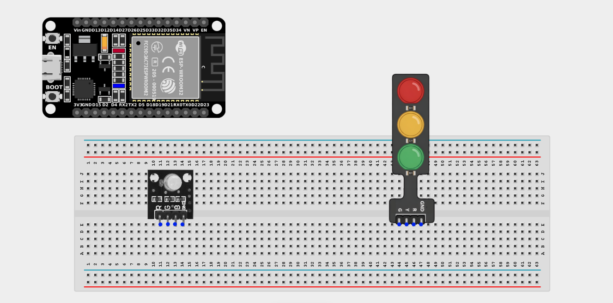
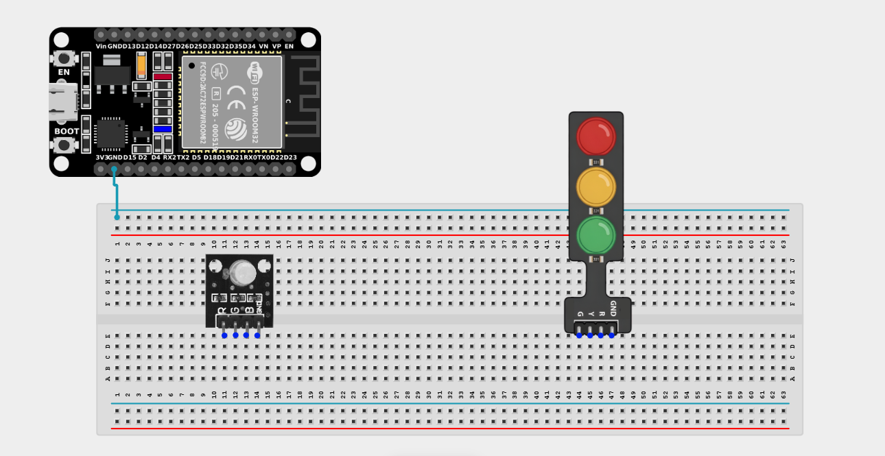
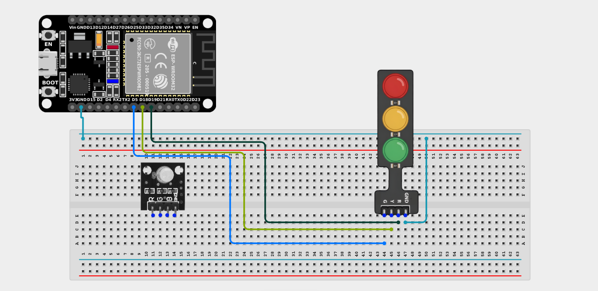
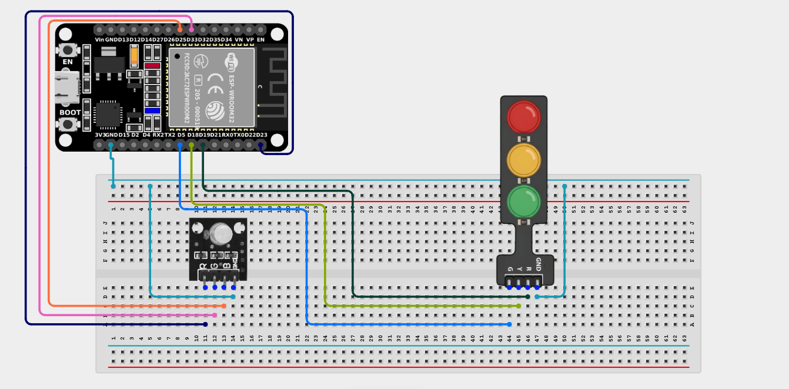

# Project 2.14.1: Double Intersection Simulator

| **Description** | This project coordinates an RGB LED and a Traffic Light Module to simulate a two-way intersection with coordinated visual indicators. |
|------------------|----------------------------------------------------------------|
| **Use case**     | Understanding state machines and coordinated timing arrays, which are essential for city traffic management systems, industrial automation, and complex sequencing. |

## Components (Things You will need)

| | | | | | |
|-------------------------|-------------------------|-------------------------|-------------------------|-------------------------|-------------------------|

## Building the circuit

> **Tip:** Use the [ESP32 Pin Mapping](../../../../assets/esp32_pin_mapping.png) image to locate the correct GPIO pins on your ESP32 board.

Things Needed:

- ESP32 board = 1

- Micro USB cable = 1

- Breadboard = 1

- Jumper wires 

- RGB LED module = 1

- Traffic light module = 1

---

## Mounting the components on the breadboard

**Step 1:** Mount the ESP32 and Components:

- Align the ESP32 board across the center dividing ridge of the breadboard.

- Insert the Traffic Light Module into the breadboard so its four pins (G, Y, R, GND) sit in separate adjacent rows.

- Insert the RGB LED Module into the breadboard so its four pins (R, G, B, -) sit in separate adjacent rows.



---

## Wiring the circuit

Follow these step-by-step connection details using your jumper wires:

**Step 1:** Create Power and Ground Rails

- Connect a **GND** pin on the ESP32 board to the negative (blue/black) rail on the breadboard.



**Step 2:** Wire the Traffic Light Module (Intersection A)

- Connect the **Green (G)** pin of the Traffic Light Module to **GPIO 5** on the ESP32 board.

- Connect the **Yellow (Y)** pin of the Traffic Light Module to **GPIO 18** on the ESP32 board.

- Connect the **Red (R)** pin of the Traffic Light Module to **GPIO 19** on the ESP32 board.

- Connect the **GND** pin of the Traffic Light Module to the negative ground rail.



**Step 3:** Wire the RGB LED (Intersection B)

- Connect the **Red (R)** pin of the RGB LED to **GPIO 23** on the ESP32 board.

- Connect the **Green (G)** pin of the RGB LED to **GPIO 33** on the ESP32 board.

- Connect the **Blue (B)** pin of the RGB LED to **GPIO 25** on the ESP32 board. *(We will use Blue as Yellow for this intersection).*

- Connect the **GND (-)** pin of the RGB LED to the negative ground rail.



*Make sure to connect the Micro USB cable securely to the ESP32 board and your computer.*

---

## PROGRAMMING

**Step 1:** Open your Arduino IDE. See how to set up here: [Getting Started](../../Getting Started/Arduino_IDE_Setup.md).

**Step 2:** Write the code in sections as detailed below.

### 1. Variables and Setup

```cpp
// Intersection A (Traffic Light Module)
const int greenA = 5;
const int yellowA = 18;
const int redA = 19;

// Intersection B (RGB LED Module)
const int redB = 23;
const int greenB = 33;
const int blueB = 25; // Simulating Yellow

void setup() {
  pinMode(greenA, OUTPUT);
  pinMode(yellowA, OUTPUT);
  pinMode(redA, OUTPUT);
  
  pinMode(redB, OUTPUT);
  pinMode(greenB, OUTPUT);
  pinMode(blueB, OUTPUT);
}
```
*Explanation:* We map out both "intersections" to their correct pins and set them all as outputs.

---

### 2. Main Loop & Functions

```cpp
void loop() {
  // PHASE 1: Intersection A is GREEN, Intersection B is RED
  digitalWrite(greenA, HIGH);
  digitalWrite(yellowA, LOW);
  digitalWrite(redA, LOW);
  
  setRGB(255, 0, 0); // Red
  delay(4000);
  
  // PHASE 2: Intersection A is YELLOW, Intersection B is RED
  digitalWrite(greenA, LOW);
  digitalWrite(yellowA, HIGH);
  digitalWrite(redA, LOW);
  
  setRGB(255, 0, 0); // Red
  delay(2000);
  
  // PHASE 3: Intersection A is RED, Intersection B is GREEN
  digitalWrite(greenA, LOW);
  digitalWrite(yellowA, LOW);
  digitalWrite(redA, HIGH);
  
  setRGB(0, 255, 0); // Green
  delay(4000);
  
  // PHASE 4: Intersection A is RED, Intersection B is YELLOW (Blue/Yellow)
  digitalWrite(greenA, LOW);
  digitalWrite(yellowA, LOW);
  digitalWrite(redA, HIGH);
  
  setRGB(255, 255, 0); // Yellow (Mix of Red and Green)
  delay(2000);
}

// Helper function to easily set RGB colors
void setRGB(int r, int g, int b) {
  analogWrite(redB, r);
  analogWrite(greenB, g);
  analogWrite(blueB, b);
}
```
*Explanation:* 

- We create a 4-phase sequence, just like a real city intersection.

- **Phase 1:** Traffic moves on Road A (Green), Road B stops (Red).

- **Phase 2:** Road A gets ready to stop (Yellow), Road B remains stopped (Red).

- **Phase 3:** Road A stops (Red), Road B moves (Green).

- **Phase 4:** Road A remains stopped (Red), Road B gets ready to stop (Yellow).

- We use a helper function `setRGB()` to keep the code clean when commanding the RGB LED module!

---

## Uploading the code

**Step 3:** Save your code. _See the [Getting Started](../../Getting Started/Arduino_IDE_Setup.md) section_

**Step 4:** Select the ESP32 board and port _See the [Getting Started](../../Getting Started/Arduino_IDE_Setup.md) section:Selecting ESP32 board Type and Uploading your code_.

**Step 5:** Upload your code. _See the [Getting Started](../../Getting Started/Arduino_IDE_Setup.md) section:Selecting ESP32 board Type and Uploading your code_

## Conclusion

This project helps you understand how to control multiple independent systems in a coordinated, time-based manner. You've built a foundational state-machine!
