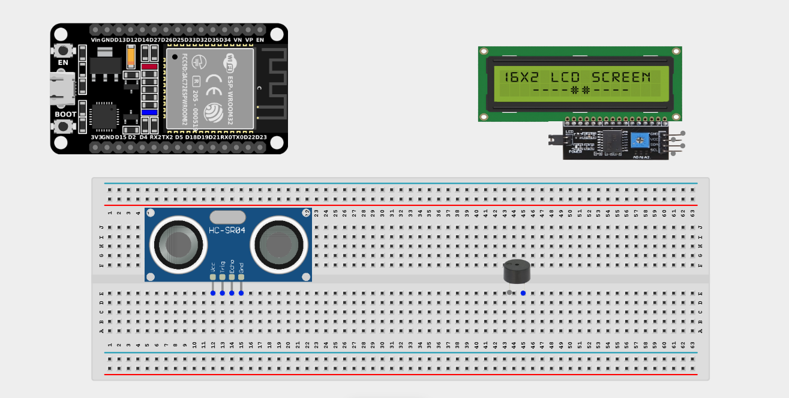
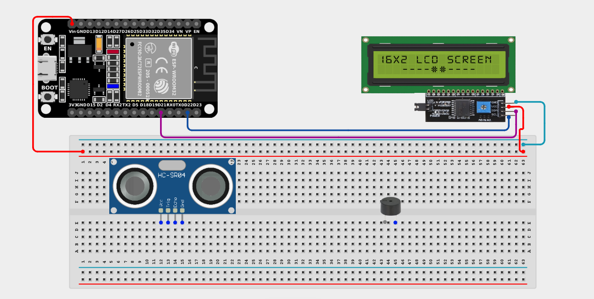
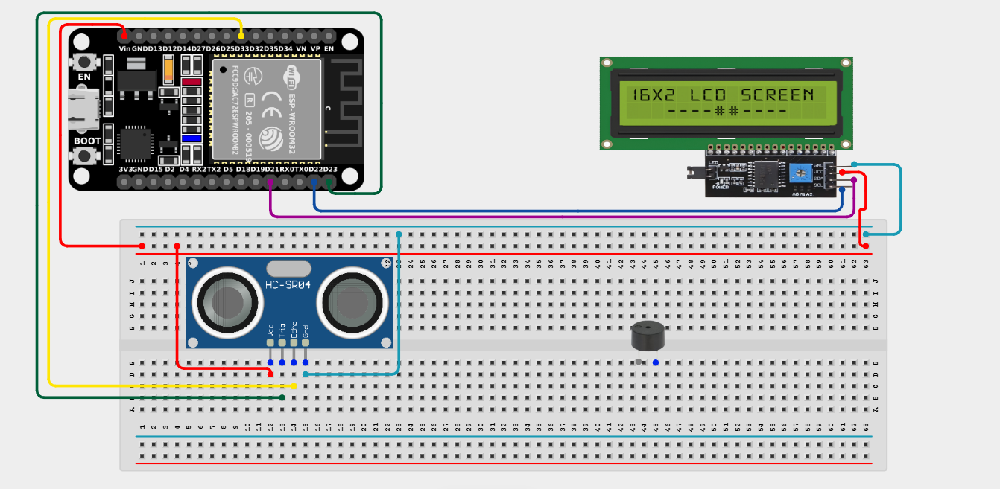
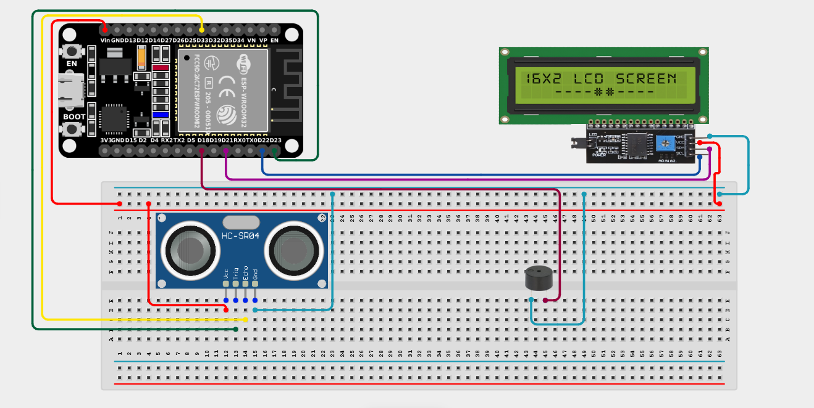

# Project 2.1: Smart Parking Assistant

| **Description** | This project uses an ultrasonic sensor, buzzer, and LCD display to assist drivers when parking. As an object gets closer, the system displays the distance on the LCD and increases the buzzer beep frequency. |
|------------------|----------------------------------------------------------------------------------------------------------------------------------------------------------------------------------------------|
| **Use case**     | This project is connected to real-world uses such as parking sensors commonly used in modern vehicles to prevent collisions when reversing. |

## Components (Things You will need)

|  |  |  |  |  |  |  |
| --- | --- | --- | --- | --- | --- | --- |

## Building the circuit

> **Tip:** Use the [ESP32 Pin Mapping](../../assets/esp32_pin_mapping.png) image to locate the correct GPIO pins on your ESP32 board.

Things Needed:

- ESP32 board = 1

- Micro USB cable = 1

- Breadboard = 1

- Jumper Wires

- Ultrasonic Sensor = 1

- I2C LCD Display = 1

- Buzzer = 1

---

## Mounting the components on the breadboard

**Step 1:** Mount the ESP32, Ultrasonic Sensor, and Buzzer:

- Align the ESP32 board across the center dividing ridge of the breadboard.

- Place the Ultrasonic sensor on the breadboard so its 4 pins sit in separate adjacent rows.

- Place the buzzer on the breadboard with its positive (+) and negative (-) pins in separate rows.

- (The LCD display usually has wires connected directly to its 4 pins, so it doesn't need to be pushed into the breadboard directly).



---

## Wiring the circuit

Follow these step-by-step connection details using your jumper wires:

**Step 1:** Wire the I2C LCD Display

- Connect **VCC** of the LCD to the **5V** or **VIN** pin on the ESP32 board.

- Connect **GND** of the LCD to a **GND pin** on the ESP32 board.

- Connect **SDA** of the LCD to **GPIO 21** on the ESP32 board.

- Connect **SCL** of the LCD to **GPIO 22** on the ESP32 board.



**Step 2:** Wire the Ultrasonic Sensor

- Connect **VCC** of the sensor to the **5V** or **VIN** pin.

- Connect **GND** of the sensor to a **GND pin**.

- Connect **Trig** of the sensor to **GPIO 23** on the ESP32 board.

- Connect **ECHO** of the sensor to **GPIO 33** on the ESP32 board.


 

**Step 3:** Wire the Buzzer

- Connect the **positive (+)** pin of the buzzer to **GPIO 18** on the ESP32 board.

- Connect the **negative (-)** pin of the buzzer to a **GND pin** on the ESP32 board.



*Make sure to connect the Micro USB cable securely to the ESP32 board and your computer.*

---

## PROGRAMMING

**Step 1:** Open your Arduino IDE. See how to set up here: [Getting Started](../Getting Started/Arduino_IDE_Setup.md).

**Step 2:** Write the code in sections as detailed below.

### 1. Library Inclusion and Variable Declarations

```cpp
#include <LiquidCrystal_I2C.h>

LiquidCrystal_I2C lcd(0x27, 16, 2);

const int trigPin = 23;
const int echoPin = 33;
const int buzzerPin = 18;
```
*Explanation:* We include the `LiquidCrystal_I2C` library to easily control the screen. `lcd(0x27, 16, 2)` sets up a 16x2 LCD at the default address `0x27`. We also define pins for the ultrasonic sensor (Trig=23, Echo=33) and the buzzer (18).

---

### 2. Setup Function

```cpp
void setup() {
  pinMode(trigPin, OUTPUT);
  pinMode(echoPin, INPUT);
  pinMode(buzzerPin, OUTPUT);
  
  lcd.init();
  lcd.backlight();
}
```
*Explanation:* In `setup()`, we configure our pins as inputs or outputs. We also initialize the LCD (`lcd.init()`) and turn on its backlight so we can see the text.

---

### 3. Loop Function

```cpp
void loop() {
  // Generate ultrasonic pulse
  digitalWrite(trigPin, LOW);
  delayMicroseconds(2);
  digitalWrite(trigPin, HIGH);
  delayMicroseconds(10);
  digitalWrite(trigPin, LOW);
  
  // Measure echo time and calculate distance
  long duration = pulseIn(echoPin, HIGH);
  int distance = duration * 0.034 / 2;
  
  // Display distance on the first line of the LCD
  lcd.setCursor(0, 0);
  lcd.print("Distance: ");
  lcd.print(distance);
  lcd.print(" cm   "); // Extra spaces to clear old numbers
  
  // Alert zones for the buzzer
  if (distance > 0 && distance < 10) {
    tone(buzzerPin, 1000);
  } else if (distance >= 10 && distance < 20) {
    tone(buzzerPin, 500);
  } else {
    noTone(buzzerPin);
  }
  
  delay(100);
}
```
*Explanation:* 

- We send a sound wave using `trigPin` and calculate the `distance` using the time it takes to return to `echoPin`.

- `lcd.setCursor(0, 0)` sets the text to start at the first column of the first row. We then print the distance.

- The `if-else` statement controls the buzzer: if the object is very close (< 10cm), it emits a high-pitched 1000Hz tone. If it's between 10cm and 20cm, it emits a lower 500Hz tone. Otherwise, the buzzer is silent.

---

## Uploading the code

**Step 3:** Save your code. _See the [Getting Started](../Getting Started/Arduino_IDE_Setup.md) section_

**Step 4:** Select the ESP32 board and port _See the [Getting Started](../Getting Started/Arduino_IDE_Setup.md) section:Selecting ESP32 board Type and Uploading your code_.

**Step 5:** Upload your code. _See the [Getting Started](../Getting Started/Arduino_IDE_Setup.md) section:Selecting ESP32 board Type and Uploading your code_

## CONCLUSION

The distance appears on the LCD screen, providing a visual cue. The buzzer beeps differently as objects move closer, providing an audio cue. There is no sound when objects are safely far away, perfectly replicating a car's reverse parking assist system!
