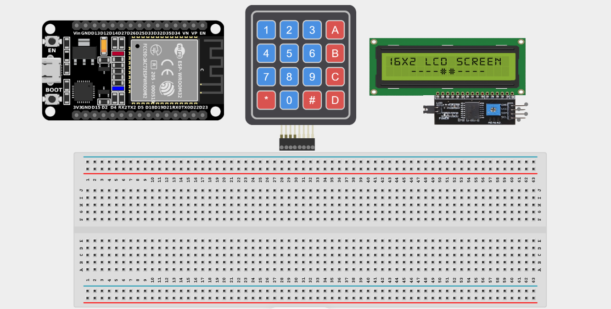
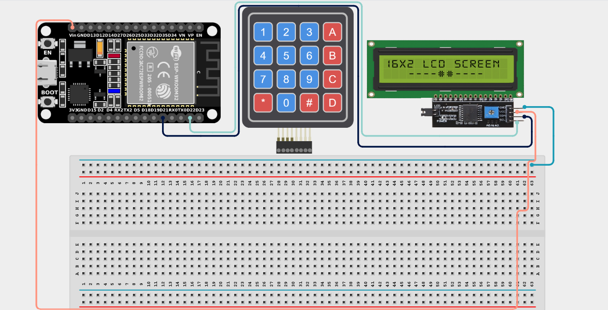
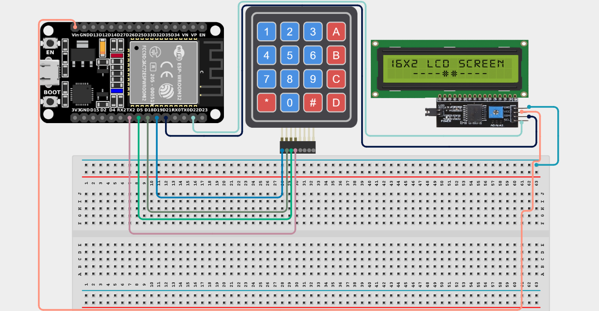
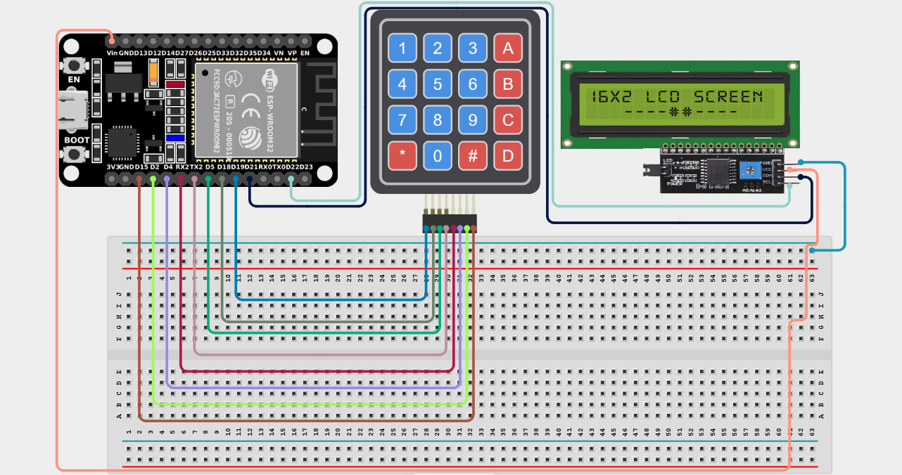

# Project 2.2: Digital Safe Lock

| **Description** | Build a password-protected safe using a keypad and LCD display. Users must enter the correct PIN to unlock the system. |
|------------------|---------------------------------------------------------------------------------------------------------------------|
| **Use case**     | This project is connected to real-world uses such as ATMs, smart locks, hotel room safes, and security devices. |

## Components (Things You will need)

|  |  |  |  |  |  |
| --- | --- | --- | --- | --- | --- |

## Building the circuit

> **Tip:** Use the [ESP32 Pin Mapping](../../assets/esp32_pin_mapping.png) image to locate the correct GPIO pins on your ESP32 board.

Things Needed:

- ESP32 board = 1

- Micro USB cable = 1

- Breadboard = 1

- Jumper Wires

- I2C LCD Display = 1

- 4x4 Keypad = 1

---

## Mounting the components on the breadboard

**Step 1:** Mount the ESP32 and Keypad:

- Align the ESP32 board across the center dividing ridge of the breadboard.

- (The LCD display and Keypad usually have their own wires or header pins that you connect using jumper wires).



---

## Wiring the circuit

Follow these step-by-step connection details using your jumper wires:

**Step 1:** Wire the I2C LCD Display

- Connect **VCC** of the LCD to the **5V** or **VIN** pin on the ESP32 board.

- Connect **GND** of the LCD to a **GND pin** on the ESP32 board.

- Connect **SDA** of the LCD to **GPIO 21** on the ESP32 board.

- Connect **SCL** of the LCD to **GPIO 22** on the ESP32 board.



**Step 2:** Wire the 4x4 Keypad (Rows)

- Connect **Row 1 (R1)** of the keypad to **GPIO 19** on the ESP32 board.

- Connect **Row 2 (R2)** of the keypad to **GPIO 18** on the ESP32 board.

- Connect **Row 3 (R3)** of the keypad to **GPIO 5** on the ESP32 board.

- Connect **Row 4 (R4)** of the keypad to **GPIO 17** on the ESP32 board.



**Step 3:** Wire the 4x4 Keypad (Columns)

- Connect **Column 1 (C1)** of the keypad to **GPIO 16** on the ESP32 board.

- Connect **Column 2 (C2)** of the keypad to **GPIO 4** on the ESP32 board.

- Connect **Column 3 (C3)** of the keypad to **GPIO 2** on the ESP32 board.

- Connect **Column 4 (C4)** of the keypad to **GPIO 15** on the ESP32 board.



*Make sure to connect the Micro USB cable securely to the ESP32 board and your computer.*

---

## PROGRAMMING

**Step 1:** Open your Arduino IDE. See how to set up here: [Getting Started](../Getting Started/Arduino_IDE_Setup.md).

*(Note: You will need to install the `Keypad` library from the Arduino Library Manager for this project).*

**Step 2:** Write the code in sections as detailed below.

### 1. Library Inclusion and Object Setup

```cpp
#include <Keypad.h>
#include <LiquidCrystal_I2C.h>

// LCD setup
LiquidCrystal_I2C lcd(0x27, 16, 2);

// Keypad setup
const byte ROWS = 4;
const byte COLS = 4;
char keys[ROWS][COLS] = {
  {'1','2','3','A'},
  {'4','5','6','B'},
  {'7','8','9','C'},
  {'*','0','#','D'}
};

byte rowPins[ROWS] = {19, 18, 5, 17};
byte colPins[COLS] = {16, 4, 2, 15};

Keypad keypad = Keypad(makeKeymap(keys), rowPins, colPins, ROWS, COLS);

String password = "1234";
String input = "";
```
*Explanation:* We include libraries for the Keypad and LCD. We define the 4x4 layout of our keys. We also list our row and column pins (`rowPins` and `colPins`) exactly as wired to the ESP32. We set the secret `password` to "1234" and create an empty `input` string to store the user's keystrokes.

---

### 2. Setup Function

```cpp
void setup() {
  lcd.init();
  lcd.backlight();
  lcd.print("Enter PIN:");
}
```
*Explanation:* This initializes the screen, turns on its backlight, and asks the user to enter their PIN.

---

### 3. Loop Function

```cpp
void loop() {
  char key = keypad.getKey();
  
  if (key) { // If a key was pressed
    input += key; // Add the pressed key to the input string
    lcd.setCursor(0, 1); // Move to the second line
    lcd.print(input); // Print what was typed so far
  }
  
  // Check if 4 characters have been entered
  if (input.length() == 4) {
    lcd.clear();
    
    if (input == password) {
      lcd.print("Access Granted!");
    } else {
      lcd.print("Access Denied!");
    }
    
    delay(2000); // Wait 2 seconds before resetting
    
    input = ""; // Clear the input string
    lcd.clear(); // Clear the screen
    lcd.print("Enter PIN:"); // Prompt again
  }
}
```
*Explanation:* 

- `keypad.getKey()` checks if a button was pressed. If it was, we add that character to our `input` string and display it on the second line of the LCD.

- Once the length of the input reaches 4 digits, we compare it to our secret `password`.

- If it matches, we show "Access Granted!". If not, "Access Denied!".

- We wait 2 seconds, then reset everything so the user can try again.

---

## Uploading the code

**Step 3:** Save your code. _See the [Getting Started](../Getting Started/Arduino_IDE_Setup.md) section_

**Step 4:** Select the ESP32 board and port _See the [Getting Started](../Getting Started/Arduino_IDE_Setup.md) section:Selecting ESP32 board Type and Uploading your code_.

**Step 5:** Upload your code. _See the [Getting Started](../Getting Started/Arduino_IDE_Setup.md) section:Selecting ESP32 board Type and Uploading your code_

## CONCLUSION

Users enter a PIN using the keypad. The LCD displays the entered characters dynamically. Entering the correct password grants access, while an incorrect password securely displays an error message, demonstrating the core logic of a digital lock system.
