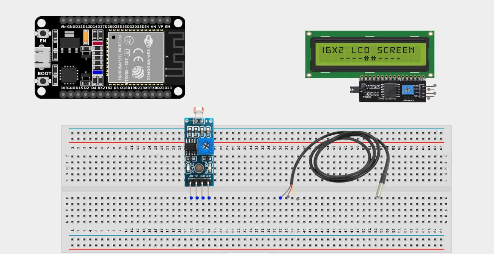
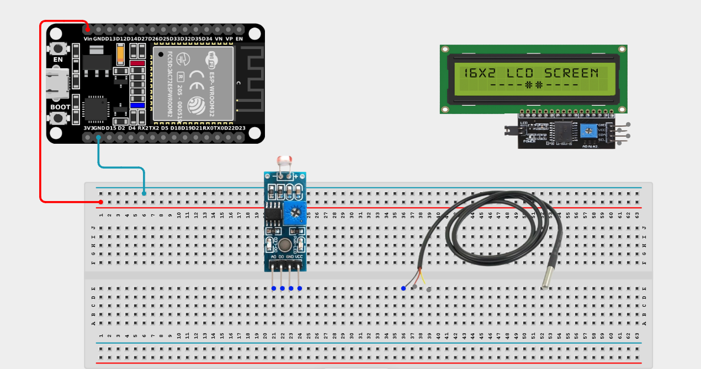
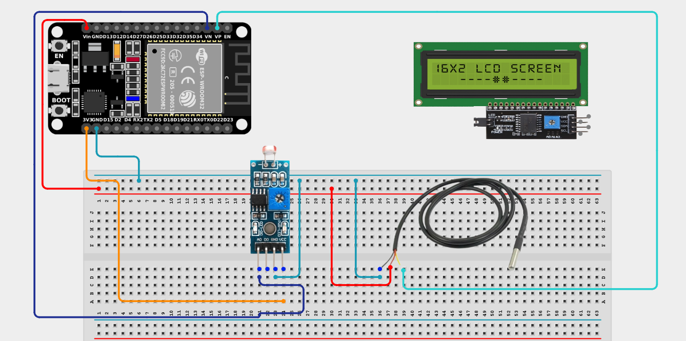
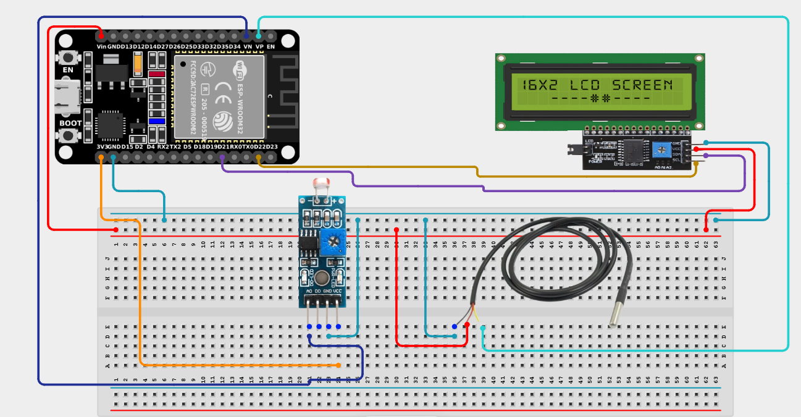

# Project 2.3: Environmental Monitoring Station

| **Description** | This project combines a temperature sensor, LDR, and an LCD display to monitor environmental conditions in real time. |
|------------------|---------------------------------------------------------------------------------------------------------------------------------------|
| **Use case**     | This project is connected to real-world uses such as smart agriculture, greenhouses, and weather monitoring systems. |

## Components (Things You will need)

|  |  |  |  |  |  |  |
| --- | --- | --- | --- | --- | --- | --- |

## Building the circuit

> **Tip:** Use the [ESP32 Pin Mapping](../../assets/esp32_pin_mapping.png) image to locate the correct GPIO pins on your ESP32 board.

Things Needed:

- ESP32 board = 1

- Micro USB cable = 1

- Breadboard = 1

- Jumper Wires

- Temperature Sensor = 1

- LDR Module = 1

- I2C LCD Display = 1

---

## Mounting the components on the breadboard

**Step 1:** Mount the ESP32 and Sensors:

- Align the ESP32 board across the center dividing ridge of the breadboard.

- Place the Temperature Sensor and the LDR Module on the breadboard so their pins sit in separate adjacent rows.



---

## Wiring the circuit

Follow these step-by-step connection details using your jumper wires:

**Step 1:** Create Power and Ground Rails

- Connect the **5V** or **VIN** pin on the ESP32 board to the positive (red) rail on the breadboard.

- Connect a **GND** pin on the ESP32 board to the negative (blue/black) rail on the breadboard.



**Step 2:** Wire the Temperature Sensor

- Connect **VCC** of the temperature sensor to the positive power rail.

- Connect **GND** of the temperature sensor to the negative power rail.

- Connect the **Signal (Analog Out)** wire of the temperature sensor to **GPIO 36** (also labeled VP) on the ESP32 board.


**Step 3:** Wire the LDR Module

- Connect **VCC** of the LDR module to the 3.3V pin on the ESP32 board (or 3.3V power rail).

- Connect **GND** of the LDR module to the negative power rail.

- Connect the **AO (Analog Output)** pin of the LDR module to **GPIO 39** (also labeled VN) on the ESP32 board.



**Step 4:** Wire the I2C LCD Display

- Connect **VCC** of the LCD to the positive power rail.

- Connect **GND** of the LCD to the negative power rail.

- Connect **SDA** of the LCD to **GPIO 21** on the ESP32 board.

- Connect **SCL** of the LCD to **GPIO 22** on the ESP32 board.



*Make sure to connect the Micro USB cable securely to the ESP32 board and your computer.*

---

## PROGRAMMING

**Step 1:** Open your Arduino IDE. See how to set up here: [Getting Started](../Getting Started/Arduino_IDE_Setup.md).

**Step 2:** Write the code in sections as detailed below.

### 1. Library Inclusion and Object Setup

```cpp
#include <LiquidCrystal_I2C.h>

LiquidCrystal_I2C lcd(0x27, 16, 2);

const int tempPin = 36;
const int ldrPin = 39;
```
*Explanation:* We include the library to control the I2C LCD and set its address (`0x27`). We also define `tempPin` as 36 and `ldrPin` as 39.

---

### 2. Setup Function

```cpp
void setup() {
  lcd.init();
  lcd.backlight();
}
```
*Explanation:* This simply initializes the LCD screen and turns on the backlight so we can view the environmental readings. Analog pins don't require `pinMode` setup.

---

### 3. Loop Function

```cpp
void loop() {
  // Read analog values from sensors
  int tempValue = analogRead(tempPin);
  int lightValue = analogRead(ldrPin);
  
  // Display Temperature
  lcd.setCursor(0, 0); // First row
  lcd.print("Temp: ");
  lcd.print(tempValue);
  lcd.print("    "); // Clear any leftover characters
  
  // Display Light level
  lcd.setCursor(0, 1); // Second row
  lcd.print("Light: ");
  lcd.print(lightValue);
  lcd.print("    "); // Clear any leftover characters
  
  delay(500); // Update every half second
}
```
*Explanation:* 

- `analogRead()` reads the current voltage level from the sensors as a raw number between 0 and 4095.

- The `lcd.setCursor(0, 0)` command points to the first row to display the temperature data.

- The `lcd.setCursor(0, 1)` command points to the second row to display the light data.

- The `delay(500)` makes the system wait half a second before refreshing the values on the screen.

---

## Uploading the code

**Step 3:** Save your code. _See the [Getting Started](../Getting Started/Arduino_IDE_Setup.md) section_

**Step 4:** Select the ESP32 board and port _See the [Getting Started](../Getting Started/Arduino_IDE_Setup.md) section:Selecting ESP32 board Type and Uploading your code_.

**Step 5:** Upload your code. _See the [Getting Started](../Getting Started/Arduino_IDE_Setup.md) section:Selecting ESP32 board Type and Uploading your code_

## CONCLUSION

The LCD displays temperature readings and light intensity values simultaneously. Both values update continuously, creating a compact and effective environmental monitoring station!
