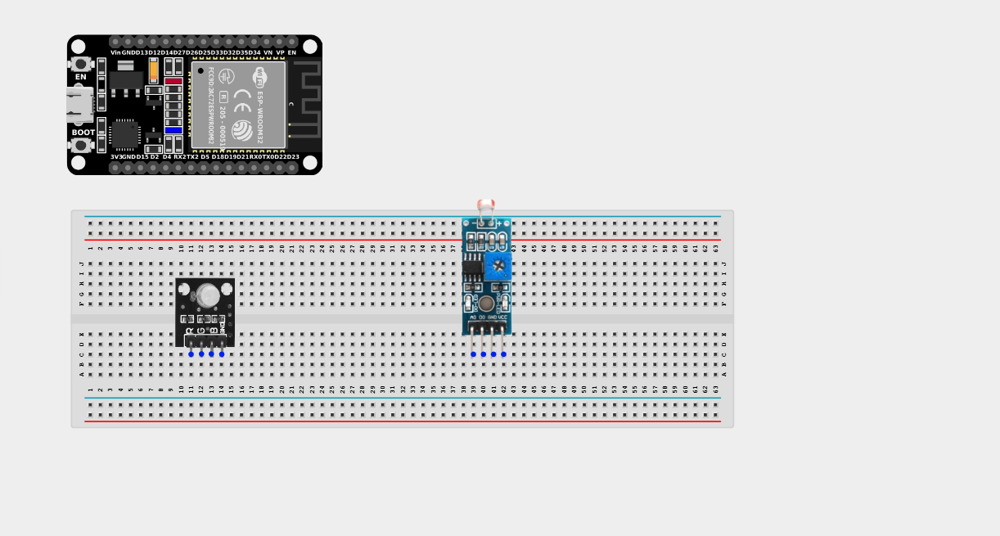
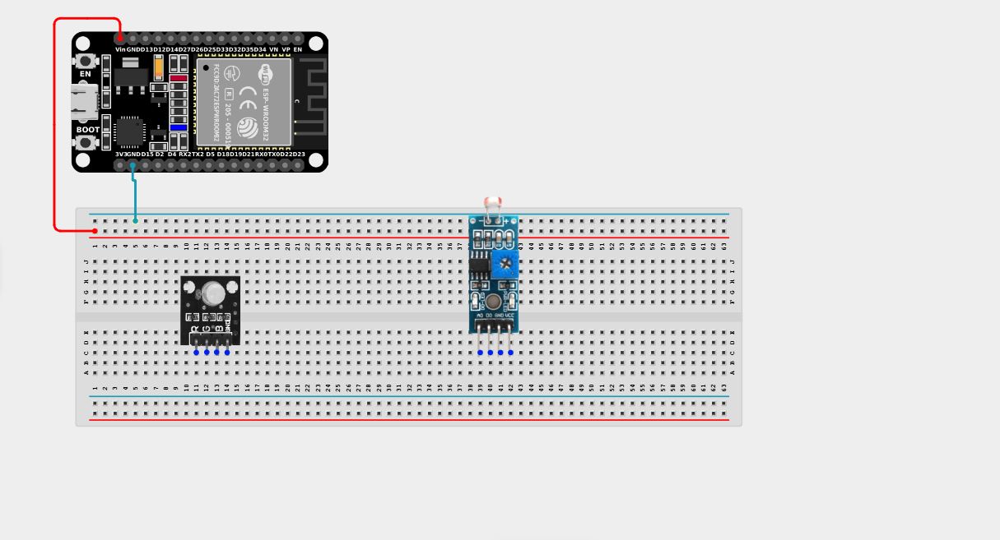
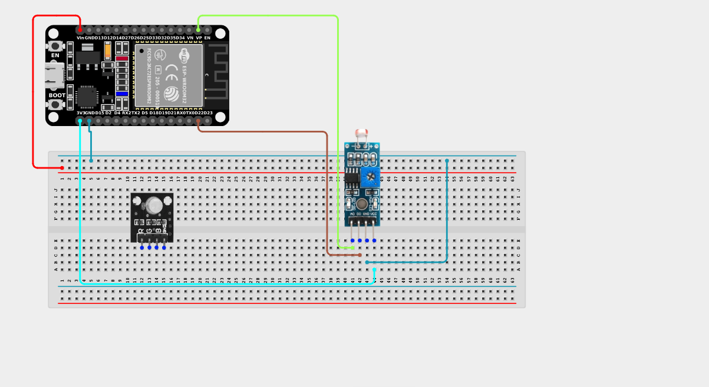
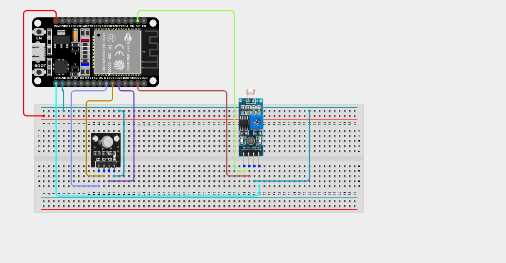

# Project 2.4.1: Light Dependent Resistor with RGB

| **Description** | This project teaches you how to use a Light Dependent Resistor (LDR) to detect changes in ambient light intensity and control an RGB LED accordingly. The ESP32 continuously reads the amount of light falling on the sensor and changes the RGB LED color based on the detected light level. |
|------------------|----------------------------------------------------------------|
| **Use case**     | Light-sensitive systems such as automatic streetlights, smart home lighting, garden lights, security lighting, daylight monitoring systems, and environmental sensing devices that respond to changes in surrounding light conditions. |

## Components (Things You will need)

|  |  |  |  |  ||
|-------------------------|-------------------------|-------------------------|-------------------------|-------------------------|-------------------------|

## Building the circuit

> **Tip:** Use the [ESP32 Pin Mapping](../../../../assets/esp32_pin_mapping.png) image to locate the correct GPIO pins on your ESP32 board.

Things Needed:

- ESP32 board = 1  

- Micro USB cable = 1

- Breadboard = 1

- Jumper Wires 

- LDR Sensor Module = 1

- RGB LED Module = 1

---

## Mounting the components on the breadboard

**Step 1:** Mount the ESP32 and Components:

- Align the ESP32 board across the center dividing ridge of the breadboard.

- Insert the LDR Sensor Module into the breadboard so its pins sit in separate adjacent rows.

- Insert the RGB LED Module into the breadboard so its four pins (R, G, B, -) sit in separate adjacent rows.

---


## Wiring the circuit

Follow these step-by-step connection details using your jumper wires:

**Step 1:** Create Power and Ground Rails

- Connect the **5V** or **VIN** pin on the ESP32 board to the positive (red) rail on the breadboard.

- Connect a **GND** pin on the ESP32 board to the negative (blue/black) rail on the breadboard.


**Step 2:** Wire the LDR Module

- Connect the **VCC** pin of the LDR Module to the 3.3V pin on the ESP32 board (or 3.3V power rail).

- Connect the **GND** pin of the LDR Module to the negative ground rail.

- Connect the **AO (Analog Out)** pin of the LDR Module to **GPIO 36 (VP)** on the ESP32 board.

- Connect the **DO (Digital Out)** pin of the LDR Module to **GPIO 22** on the ESP32 board.


**Step 3:** Wire the RGB LED Module

- Connect the **GND (-)** pin of the RGB LED to the negative ground rail.

- Connect the **Red (R)** pin of the RGB LED to **GPIO 18** on the ESP32 board.

- Connect the **Green (G)** pin of the RGB LED to **GPIO 19** on the ESP32 board.

- Connect the **Blue (B)** pin of the RGB LED to **GPIO 21** on the ESP32 board.



*Make sure to connect the Micro USB cable securely to the ESP32 board and your computer.*

---

## PROGRAMMING

**Step 1:** Open your Arduino IDE. See how to set up here: [Getting Started](../../Getting Started/Arduino_IDE_Setup.md).

**Step 2:** Write the code in sections as detailed below.

### 1. Variables and Setup

```cpp
const int ldrAnalogPin = 36;
const int ldrDigitalPin = 22;

const int redPin = 18;
const int greenPin = 19;
const int bluePin = 21;

int ldrValue;
int digitalValue;

void setup() {
  Serial.begin(9600);
  
  pinMode(ldrDigitalPin, INPUT);
  
  pinMode(redPin, OUTPUT);
  pinMode(greenPin, OUTPUT);
  pinMode(bluePin, OUTPUT);
}
```
*Explanation:* We declare pins for the LDR (both analog and digital outputs) and the RGB LED. We set the digital LDR pin as `INPUT`, and the RGB pins as `OUTPUT`.

---

### 2. Main Loop

```cpp
void loop() {
  // Read the analog value (0-4095) representing exact light intensity
  ldrValue = analogRead(ldrAnalogPin);
  
  // Read the digital value (HIGH or LOW) representing a simple bright/dark state
  digitalValue = digitalRead(ldrDigitalPin);
  
  Serial.print("Analog Light Value: ");
  Serial.print(ldrValue);
  Serial.print("  |  Digital State: ");
  Serial.println(digitalValue);
  
  // Logic: If it is VERY bright (low analog value)
  // Note: On many LDR modules, lower analog values = brighter light!
  if (ldrValue < 100) {
    // Flash RED
    digitalWrite(redPin, HIGH);
    delay(200);
    digitalWrite(redPin, LOW);
    delay(200);
    
    // Flash BLUE
    digitalWrite(bluePin, HIGH);
    delay(200);
    digitalWrite(bluePin, LOW);
    delay(200);
    
    // Flash GREEN
    digitalWrite(greenPin, HIGH);
    delay(200);
    digitalWrite(greenPin, LOW);
    delay(200);
  } else {
    // If it is NOT very bright, turn the LED blue
    digitalWrite(redPin, LOW);
    digitalWrite(greenPin, LOW);
    digitalWrite(bluePin, HIGH);
  }
}
```
*Explanation:* 

- We read both the analog and digital outputs of the sensor, printing them to the Serial monitor so you can see the raw data.

- The `if (ldrValue < 100)` checks if a very intense light (like a flashlight or direct sun) is shining on the sensor.

- If it is very bright, it runs a loop flashing Red, Blue, and Green in sequence.

- If it is normal room lighting or dark (the `else` block), the LED just stays solid Blue!

---

## Uploading the code

**Step 3:** Save your code. _See the [Getting Started](../../Getting Started/Arduino_IDE_Setup.md) section_

**Step 4:** Select the ESP32 board and port _See the [Getting Started](../../Getting Started/Arduino_IDE_Setup.md) section:Selecting ESP32 board Type and Uploading your code_.

**Step 5:** Upload your code. _See the [Getting Started](../../Getting Started/Arduino_IDE_Setup.md) section:Selecting ESP32 board Type and Uploading your code_

## Conclusion

You learned how to read analog light intensity values from an LDR, detect changes in ambient lighting, and use those readings to conditionally control the colors of an RGB LED. These concepts form the foundation of many real-world environmental monitoring devices!
