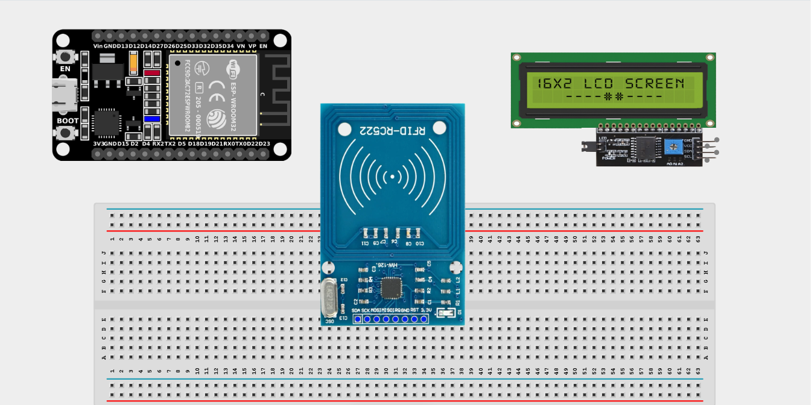
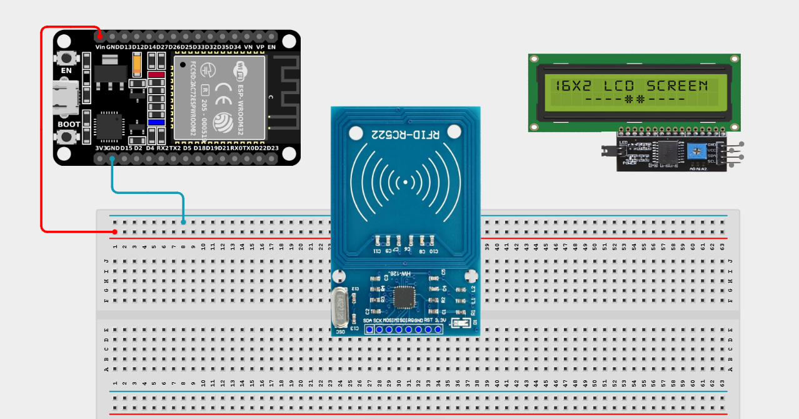
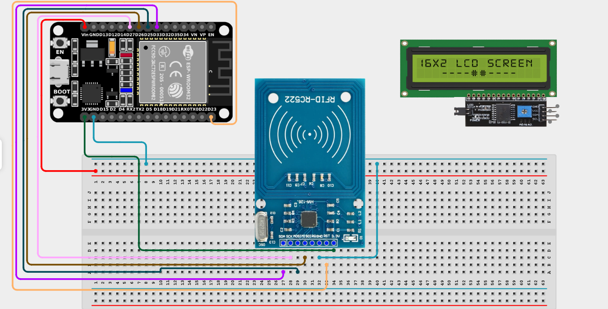
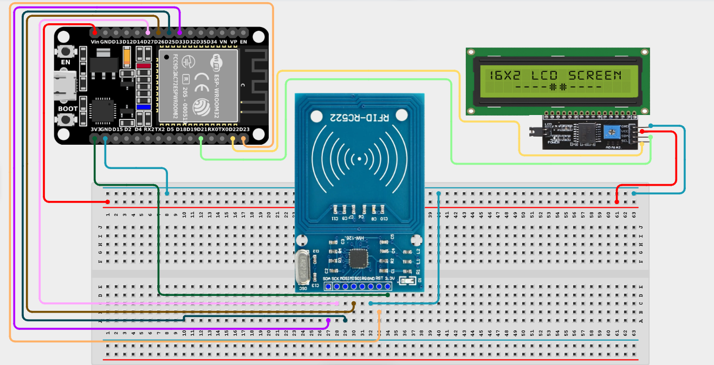

# Project 2.4: RFID Attendance Logger

| **Description** | In this project, learners will build a digital attendance logging system using an RFID reader, RFID cards or tags, and an LCD display. When a registered RFID card is presented to the reader, the system displays the user's attendance status on the LCD. RFID technology is widely used in schools, offices, libraries, and access-control systems, and this project introduces contactless identification and data verification. |
|------------------|------------------------------------------------------------------------------------------------------------------------------------------------------------------------------------------------------------------------------------------------------------------------------------------------------------------------------------------------------------------------------------------------------------------------------------------------------------|
| **Use case**     | This project is connected to real-world uses such as school attendance systems, office access control, library check-ins, and hotel key-card systems. |

## Components (Things You will need)

|  |  |  |  |  |  |
| --- | --- | --- | --- | --- | --- |

## Building the circuit

> **Tip:** Use the [ESP32 Pin Mapping](../../assets/esp32_pin_mapping.png) image to locate the correct GPIO pins on your ESP32 board.

Things Needed:

- ESP32 board = 1

- Micro USB cable = 1

- Breadboard = 1

- Jumper Wires

- RFID Reader (MFRC522) = 1

- I2C LCD Display = 1

- RFID Card / Key Fob = 1

---

## Mounting the components on the breadboard

**Step 1:** Mount the ESP32 and RFID Reader:

- Align the ESP32 board across the center dividing ridge of the breadboard.

- Place the RFID Reader on the breadboard so its pins sit in separate adjacent rows. (Often it's easier to connect female-to-male jumper wires directly to the reader's pins).



---

## Wiring the circuit

Follow these step-by-step connection details using your jumper wires:

**Step 1:** Create Power and Ground Rails

- Connect the **5V** or **VIN** pin on the ESP32 board to the positive power rail on the breadboard (for the LCD).

- Connect the **3V3** pin on the ESP32 board to a separate row on the breadboard (for the RFID Reader).

- Connect a **GND** pin on the ESP32 board to the negative power rail on the breadboard.



**Step 2:** Wire the RFID Reader (MFRC522)

- Connect **3.3V (VCC)** of the RFID reader to the **3V3** pin row. *(**NB:** Do not connect the RFID reader to 5V, it will be damaged!)*

- Connect **GND** of the RFID reader to the negative power rail.

- Connect **RST** of the RFID reader to **GPIO 23** on the ESP32 board.

- Connect **MISO** of the RFID reader to **GPIO 26** on the ESP32 board.

- Connect **MOSI** of the RFID reader to **GPIO 25** on the ESP32 board.

- Connect **SCK** of the RFID reader to **GPIO 27** on the ESP32 board.

- Connect **SDA (SS)** of the RFID reader to **GPIO 33** on the ESP32 board.



**Step 3:** Wire the I2C LCD Display

- Connect **VCC** of the LCD to the **5V** positive power rail.

- Connect **GND** of the LCD to the negative power rail.

- Connect **SDA** of the LCD to **GPIO 21** on the ESP32 board.

- Connect **SCL** of the LCD to **GPIO 22** on the ESP32 board.



*Make sure to connect the Micro USB cable securely to the ESP32 board and your computer.*

---

## PROGRAMMING

**Step 1:** Open your Arduino IDE. See how to set up here: [Getting Started](../Getting Started/Arduino_IDE_Setup.md).

*(Note: You will need to install the `MFRC522` library from the Arduino Library Manager for the RFID to work).*

**Step 2:** Write the code in sections as detailed below.

### 1. Library Inclusion and Object Setup

```cpp
#include <SPI.h>
#include <MFRC522.h>
#include <Wire.h>
#include <LiquidCrystal_I2C.h>

#define SS_PIN 33
#define RST_PIN 23

// Create RFID and LCD objects
MFRC522 rfid(SS_PIN, RST_PIN);
LiquidCrystal_I2C lcd(0x27, 16, 2);

// Registered UID (You will need to replace this with your card's UID)
String authorizedCard = "39 B2 C3 D4"; 
```
*Explanation:* We include libraries for SPI communication (required for RFID), the MFRC522 reader, and the LCD. We define the RFID's control pins and initialize both devices. `authorizedCard` holds the unique ID (UID) of the card allowed to log attendance. (You'll find your card's actual UID in the Serial Monitor later).

---

### 2. Setup Function

```cpp
void setup() {
  Serial.begin(9600);
  
  SPI.begin();      // Start SPI communication
  rfid.PCD_Init();  // Initialize RFID reader
  
  lcd.init();       // Initialize LCD
  lcd.backlight();
  lcd.print("Scan Your Card");
}
```
*Explanation:* In `setup()`, we start up the Serial Monitor, initialize the SPI hardware bus, turn on the RFID reader, and display a welcome message on the LCD.

---

### 3. Loop Function

```cpp
void loop() {
  // Wait for a new RFID card
  if (!rfid.PICC_IsNewCardPresent()) {
    return;
  }
  // Read the card's data
  if (!rfid.PICC_ReadCardSerial()) {
    return;
  }
  
  // Store the UID as a String
  String cardUID = "";
  for (byte i = 0; i < rfid.uid.size; i++) {
    cardUID += String(rfid.uid.uidByte[i], HEX);
    if (i < rfid.uid.size - 1) {
      cardUID += " ";
    }
  }
  cardUID.toUpperCase();
  
  // Print UID to Serial Monitor (Copy this to update your authorizedCard variable!)
  Serial.println("Scanned UID: " + cardUID);
  
  lcd.clear();
  
  // Verify card against authorizedCard
  if (cardUID == authorizedCard) {
    lcd.print("Attendance");
    lcd.setCursor(0, 1);
    lcd.print("Recorded");
  } else {
    lcd.print("Unknown Card");
    lcd.setCursor(0, 1);
    lcd.print("Access Denied");
  }
  
  delay(3000); // Display the result for 3 seconds
  
  // Reset screen
  lcd.clear();
  lcd.print("Scan Your Card");
}
```
*Explanation:* 

- The loop continuously checks if a card is near the reader.

- If one is found, it extracts its UID byte by byte, converts it to readable text (HEX), and capitalizes it.

- **Tip:** When you first run this, scan your card and check the Serial Monitor for its UID. Copy that UID into the `authorizedCard` variable at the top of the code and re-upload!

- If the scanned UID matches the `authorizedCard`, it displays "Attendance Recorded". If not, it denies access.

---

## Uploading the code

**Step 3:** Save your code. _See the [Getting Started](../Getting Started/Arduino_IDE_Setup.md) section_

**Step 4:** Select the ESP32 board and port _See the [Getting Started](../Getting Started/Arduino_IDE_Setup.md) section:Selecting ESP32 board Type and Uploading your code_.

**Step 5:** Upload your code. _See the [Getting Started](../Getting Started/Arduino_IDE_Setup.md) section:Selecting ESP32 board Type and Uploading your code_

## CONCLUSION

When a registered RFID card is scanned, the LCD displays "Attendance Recorded", confirming that the user's attendance has been successfully logged. If an unregistered RFID card is scanned, the LCD displays "Unknown Card" and "Access Denied", protecting the system from unauthorized entries.
