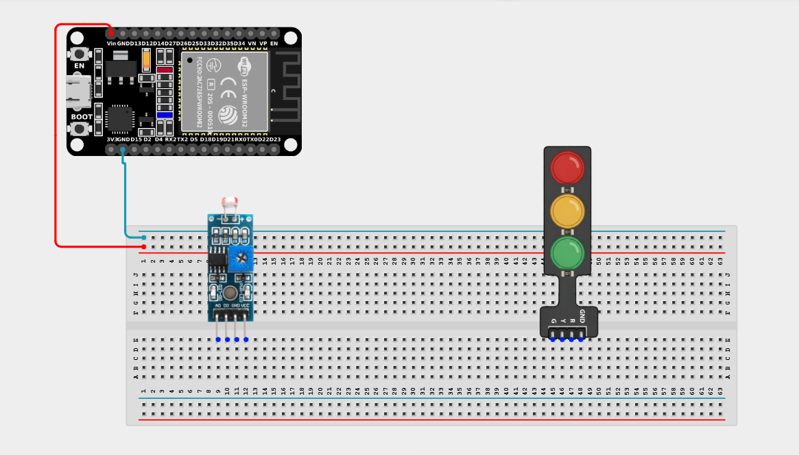
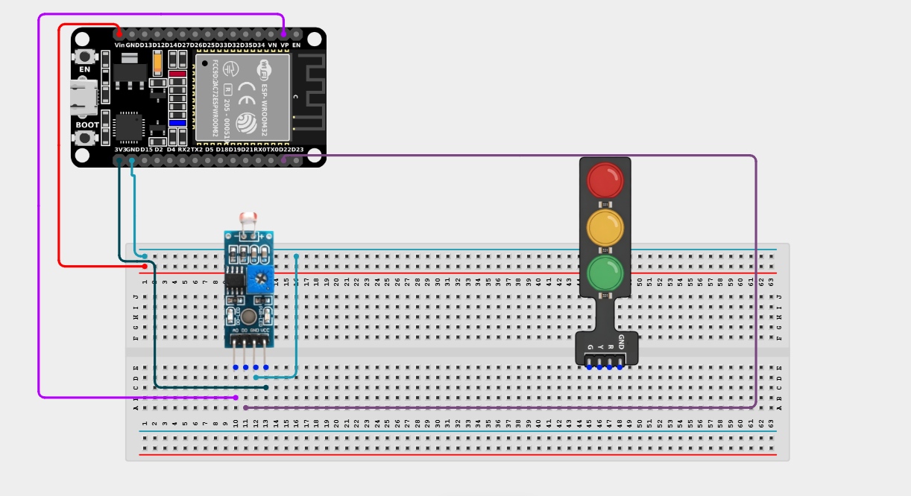
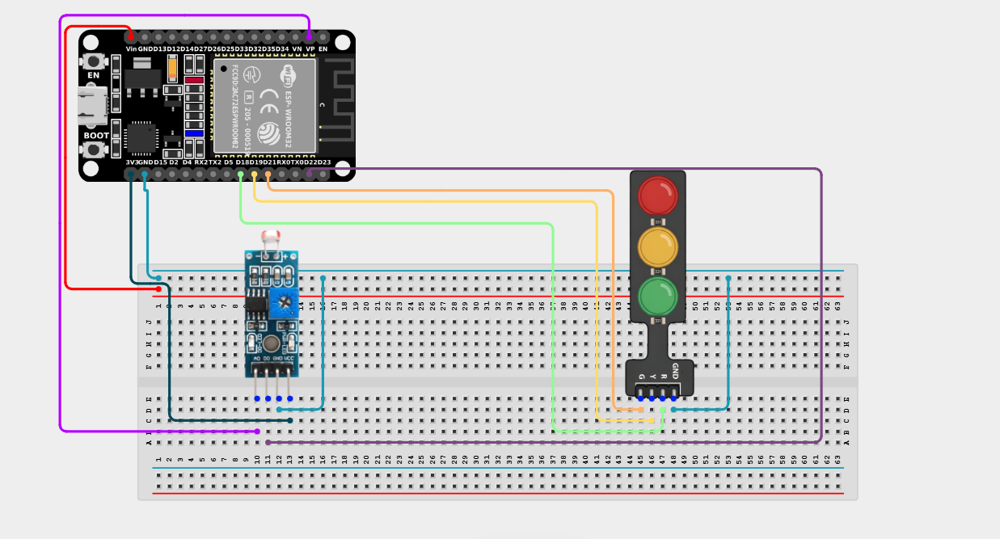

# Project 2.5.1: Traffic Light with LDR

| **Description** | Learn how to use a Light Dependent Resistor (LDR) to detect changes in light intensity and automatically control a traffic light module. This project demonstrates how sensors enable smart automation by allowing electronic systems to respond to their environment. |
|------------------|----------------------------------------------------------------|
| **Use case**     | Automatic streetlights, smart outdoor lighting, parking lot lights, tunnel lighting systems, and other applications that operate based on surrounding light conditions. |

## Components (Things You will need)

|  |  |  ||||
|-------------------------|-------------------------|-------------------------|-------------------------|-------------------------|--------------------------|

## Building the circuit

> **Tip:** Use the [ESP32 Pin Mapping](../../../../assets/esp32_pin_mapping.png) image to locate the correct GPIO pins on your ESP32 board.

Things Needed:

- ESP32 board = 1  

- Micro USB cable = 1

- Breadboard = 1

- Jumper Wires

- LDR Sensor Module = 1

- Traffic Light Module = 1

---

## Mounting the components on the breadboard

**Step 1:** Mount the ESP32 and Components:

- Align the ESP32 board across the center dividing ridge of the breadboard.

- Insert the LDR Sensor Module into the breadboard so its pins sit in separate adjacent rows.

- Insert the Traffic Light Module into the breadboard so its four pins (G, Y, R, GND) sit in separate adjacent rows.

---

## Wiring the circuit

Follow these step-by-step connection details using your jumper wires:

**Step 1:** Create Power and Ground Rails

- Connect the **5V** or **VIN** pin on the ESP32 board to the positive (red) rail on the breadboard.

- Connect a **GND** pin on the ESP32 board to the negative (blue/black) rail on the breadboard.


**Step 2:** Wire the LDR Module

- Connect the **VCC** pin of the LDR Module to the 3.3V pin on the ESP32 board (or 3.3V power rail).

- Connect the **GND** pin of the LDR Module to the negative ground rail.

- Connect the **AO (Analog Out)** pin of the LDR Module to **GPIO 36 (VP)** on the ESP32 board.

- Connect the **DO (Digital Out)** pin of the LDR Module to **GPIO 22** on the ESP32 board.


**Step 3:** Wire the Traffic Light Module

- Connect the **Red (R)** pin of the Traffic Light Module to **GPIO 18** on the ESP32 board.

- Connect the **Yellow (Y)** pin of the Traffic Light Module to **GPIO 19** on the ESP32 board.

- Connect the **Green (G)** pin of the Traffic Light Module to **GPIO 21** on the ESP32 board.

- Connect the **GND** pin of the Traffic Light Module to the negative ground rail.



*Make sure to connect the Micro USB cable securely to the ESP32 board and your computer.*

---

## PROGRAMMING

**Step 1:** Open your Arduino IDE. See how to set up here: [Getting Started](../../Getting Started/Arduino_IDE_Setup.md).

**Step 2:** Write the code in sections as detailed below.

### 1. Variables and Setup

```cpp
const int ldrAnalogPin = 36;
const int ldrDigitalPin = 22;

const int redPin = 18;
const int yellowPin = 19;
const int greenPin = 21;

int ldrValue;
int digitalValue;

void setup() {
  Serial.begin(9600);
  
  pinMode(ldrDigitalPin, INPUT);
  
  pinMode(redPin, OUTPUT);
  pinMode(yellowPin, OUTPUT);
  pinMode(greenPin, OUTPUT);
}
```
*Explanation:* We declare our analog and digital pins for the light sensor, and the three output pins for the Traffic Light Module. We ensure the digital sensor pin is set to `INPUT`.

---

### 2. Main Loop

```cpp
void loop() {
  // Read the analog value (0-4095) representing exact light intensity
  ldrValue = analogRead(ldrAnalogPin);
  
  // Read the digital value (HIGH or LOW) representing a simple bright/dark state
  digitalValue = digitalRead(ldrDigitalPin);
  
  Serial.print("Analog Light Value: ");
  Serial.print(ldrValue);
  Serial.print("  |  Digital State: ");
  Serial.println(digitalValue);
  
  // Logic: If it is VERY bright (low analog value)
  // Note: On many LDR modules, lower analog values = brighter light!
  if (ldrValue < 100) {
    // Run a full traffic light sequence
    digitalWrite(redPin, HIGH);
    delay(1000);
    digitalWrite(redPin, LOW);
    
    digitalWrite(greenPin, HIGH);
    delay(1000);
    digitalWrite(greenPin, LOW);
    
    digitalWrite(yellowPin, HIGH);
    delay(1000);
    digitalWrite(yellowPin, LOW);
    delay(1000);
  } else {
    // If it is NOT very bright, turn off all traffic lights!
    digitalWrite(redPin, LOW);
    digitalWrite(greenPin, LOW);
    digitalWrite(yellowPin, LOW);
  }
}
```
*Explanation:* 

- First, we read both the precise analog light intensity and the simple binary digital state.

- The `if (ldrValue < 100)` statement acts as our trigger. If you shine a bright flashlight at the sensor, it drops the analog value below 100.

- When it senses bright light, it runs a 3-second sequence flashing the Red, Green, and Yellow lights.

- In normal room lighting or darkness (analog value > 100), the `else` block executes, shutting all the lights off!

---

## Uploading the code

**Step 3:** Save your code. _See the [Getting Started](../../Getting Started/Arduino_IDE_Setup.md) section_

**Step 4:** Select the ESP32 board and port _See the [Getting Started](../../Getting Started/Arduino_IDE_Setup.md) section:Selecting ESP32 board Type and Uploading your code_.

**Step 5:** Upload your code. _See the [Getting Started](../../Getting Started/Arduino_IDE_Setup.md) section:Selecting ESP32 board Type and Uploading your code_

## Conclusion

You have successfully built a smart traffic light system that uses a Light Dependent Resistor (LDR) to detect changes in ambient light. Experiment by changing the `100` threshold or modifying the traffic light sequence to explore how sensor-based automation works!
