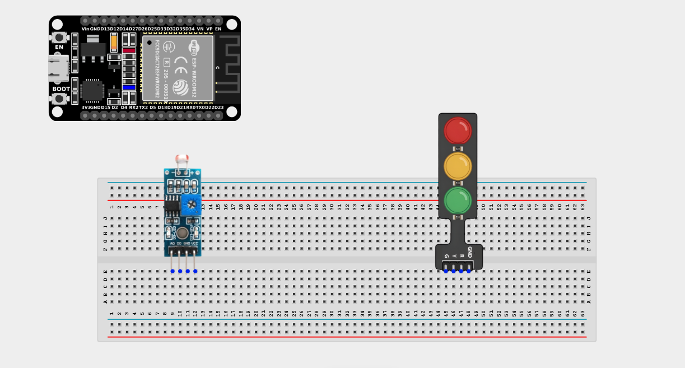
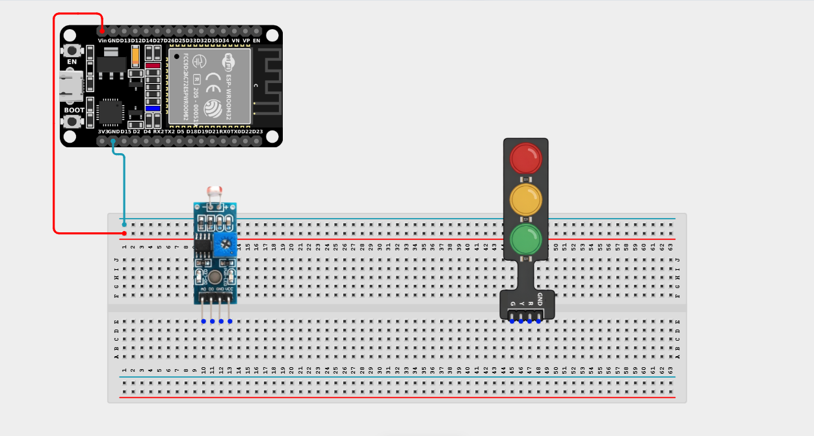
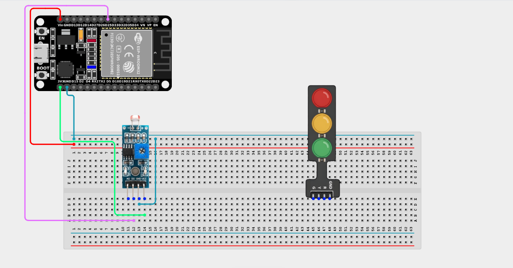
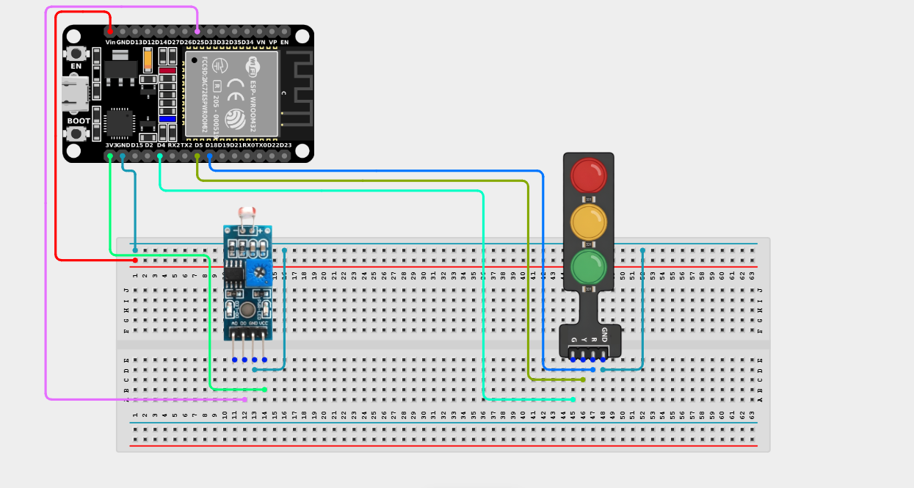

# Project 2.5.2: Solar-Sensing Streetlight

| **Description** | This project uses an LDR to detect ambient light levels and controls a Traffic Light Module to display Green (sunny day) or Red (night/darkness) based on the light intensity. |
|------------------|----------------------------------------------------------------|
| **Use case**     | This logic powers millions of automatic streetlights worldwide. A simple light sensor detects dusk and automatically powers up the city grid's lighting. |

## Components (Things You will need)

| | | | | | |
|-------------------------|-------------------------|-------------------------|-------------------------|-------------------------|-------------------------|

## Building the circuit

> **Tip:** Use the [ESP32 Pin Mapping](../../../../assets/esp32_pin_mapping.png) image to locate the correct GPIO pins on your ESP32 board.

Things Needed:

- ESP32 board = 1

- Micro USB cable = 1

- Breadboard = 1

- Jumper wires 

- LDR Sensor Module = 1

- Traffic Light Module = 1

---

## Mounting the components on the breadboard

**Step 1:** Mount the ESP32 and Components:

- Align the ESP32 board across the center dividing ridge of the breadboard.

- Insert the LDR Sensor Module into the breadboard so its pins sit in separate adjacent rows.

- Insert the Traffic Light Module into the breadboard so its four pins (G, Y, R, GND) sit in separate adjacent rows.


---


## Wiring the circuit

Follow these step-by-step connection details using your jumper wires:

**Step 1:** Create Power and Ground Rails

- Connect the **5V** or **VIN** pin on the ESP32 board to the positive (red) rail on the breadboard.

- Connect a **GND** pin on the ESP32 board to the negative (blue/black) rail on the breadboard.


**Step 2:** Wire the LDR Module

- Connect the **VCC** pin of the LDR Module to the 3.3V pin on the ESP32 board (or 3.3V power rail).

- Connect the **GND** pin of the LDR Module to the negative ground rail.

- Connect the **DO (Digital Out)** pin of the LDR Module to **GPIO 25** on the ESP32 board.


**Step 3:** Wire the Traffic Light Module

- Connect the **GND** pin of the Traffic Light Module to the negative ground rail.

- Connect the **Green (G)** pin of the Traffic Light Module to **GPIO 4** on the ESP32 board.

- Connect the **Yellow (Y)** pin of the Traffic Light Module to **GPIO 5** on the ESP32 board.

- Connect the **Red (R)** pin of the Traffic Light Module to **GPIO 18** on the ESP32 board.




*Make sure to connect the Micro USB cable securely to the ESP32 board and your computer.*

---

## PROGRAMMING

**Step 1:** Open your Arduino IDE. See how to set up here: [Getting Started](../../Getting Started/Arduino_IDE_Setup.md).

**Step 2:** Write the code in sections as detailed below.

### 1. Variables and Setup

```cpp
const int ldrDigitalPin = 25;

const int greenLED = 4;
const int yellowLED = 5;
const int redLED = 18;

void setup() {
  Serial.begin(9600);
  
  pinMode(ldrDigitalPin, INPUT);
  
  pinMode(greenLED, OUTPUT);
  pinMode(yellowLED, OUTPUT);
  pinMode(redLED, OUTPUT);
}
```
*Explanation:* We assign our pins. Because this project is purely digital, we only need to read the binary `HIGH` / `LOW` state of the LDR's `DO` pin to determine if it is day or night!

---

### 2. Main Loop

```cpp
void loop() {
  // Read the digital state of the light sensor
  // (Usually HIGH = dark, LOW = light, but depends on module tuning)
  int isDark = digitalRead(ldrDigitalPin);
  
  if (isDark == HIGH) {
    Serial.println("Streetlight Status: NIGHT (Red On)");
    
    // Turn ON the Red light, turn off the others
    digitalWrite(greenLED, LOW);
    digitalWrite(yellowLED, LOW);
    digitalWrite(redLED, HIGH);
  } else {
    Serial.println("Streetlight Status: DAY (Green On)");
    
    // Turn ON the Green light, turn off the others
    digitalWrite(greenLED, HIGH);
    digitalWrite(yellowLED, LOW);
    digitalWrite(redLED, LOW);
  }
  
  delay(100); // Small delay for stability
}
```
*Explanation:* 

- We read `ldrDigitalPin`. If it's `HIGH`, the environment is dark! 

- In our `if (isDark == HIGH)` block, we trigger "Night Mode", which turns on the Red LED and shuts the others down.

- If it's daytime (`isDark == LOW`), the `else` block takes over, turning the Green LED on to signify bright, sunny conditions.

- *Note: If your sensor seems backwards, try turning the tiny potentiometer screw on the blue box of the LDR module to adjust its threshold!*

---

## Uploading the code

**Step 3:** Save your code. _See the [Getting Started](../../Getting Started/Arduino_IDE_Setup.md) section_

**Step 4:** Select the ESP32 board and port _See the [Getting Started](../../Getting Started/Arduino_IDE_Setup.md) section:Selecting ESP32 board Type and Uploading your code_.

**Step 5:** Upload your code. _See the [Getting Started](../../Getting Started/Arduino_IDE_Setup.md) section:Selecting ESP32 board Type and Uploading your code_

## Conclusion

This project helps you understand how binary environmental data (is it dark? Yes/No) can instantly drive conditional physical responses, powering the core logic of automation!
