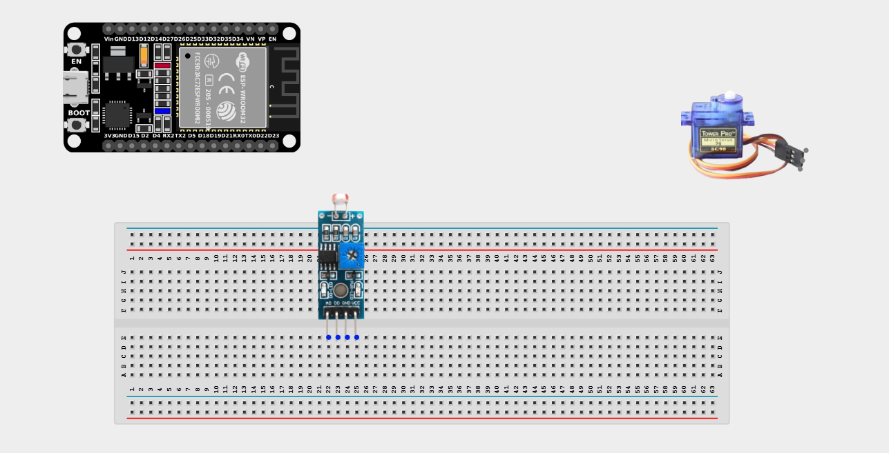
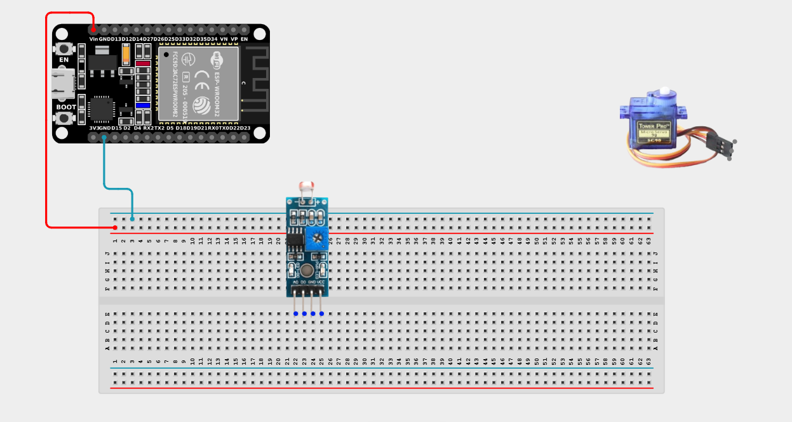
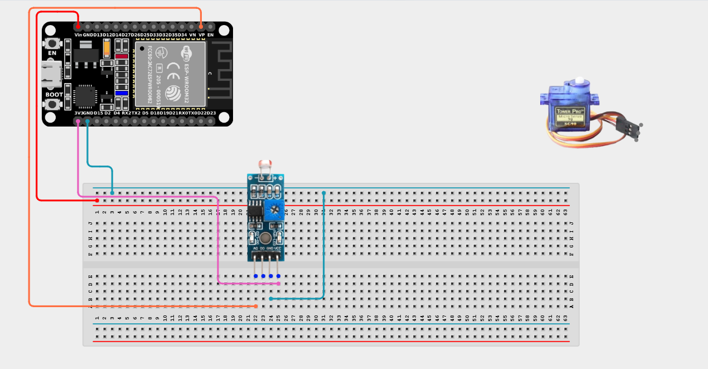
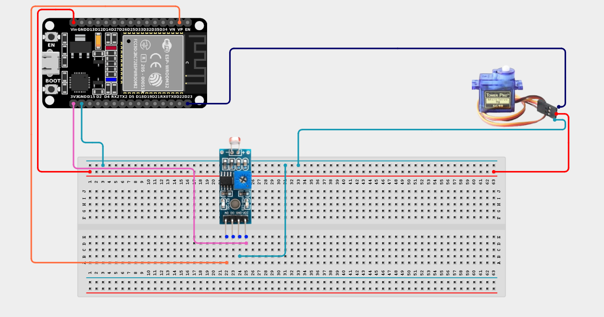

# Project 2.5.3: Light-Sensitive Canopy Controller

| **Description** | This project uses an LDR to detect sunlight intensity and controls a servo motor to extend or retract a shade canopy automatically. |
|------------------|----------------------------------------------------------------|
| **Use case**     | This project can be used in automation systems, smart homes (like motorized blinds), greenhouses, and interactive installations where physical movement responds to environmental changes. |

## Components (Things You will need)

| | | | | | |
|-------------------------|-------------------------|-------------------------|-------------------------|-------------------------|-------------------------|

## Building the circuit

> **Tip:** Use the [ESP32 Pin Mapping](../../../../assets/esp32_pin_mapping.png) image to locate the correct GPIO pins on your ESP32 board.

Things Needed:

- ESP32 board = 1

- Micro USB cable = 1

- Breadboard = 1

- Jumper wires

- LDR Sensor Module = 1

- Servo motor = 1

---

## Mounting the components on the breadboard

**Step 1:** Mount the ESP32 and Components:

- Align the ESP32 board across the center dividing ridge of the breadboard.

- Insert the LDR Sensor Module into the breadboard so its pins sit in separate adjacent rows.

- The Servo Motor will sit loose, connected via male-to-male jumper wires directly to the board/breadboard.



---

## Wiring the circuit

Follow these step-by-step connection details using your jumper wires:

**Step 1:** Create Power and Ground Rails

- Connect the **5V** or **VIN** pin on the ESP32 board to the positive (red) rail on the breadboard.

- Connect a **GND** pin on the ESP32 board to the negative (blue/black) rail on the breadboard.



**Step 2:** Wire the LDR Module

- Connect the **VCC** pin of the LDR Module to the 3.3V pin on the ESP32 board (or 3.3V power rail).

- Connect the **GND** pin of the LDR Module to the negative ground rail.

- Connect the **AO (Analog Out)** pin of the LDR Module to **GPIO 36 (VP)** on the ESP32 board.



**Step 3:** Wire the Servo Motor

- Connect the Servo's **Brown/Black (GND)** wire to the negative ground rail.

- Connect the Servo's **Red (VCC)** wire to the positive 5V power rail.

- Connect the Servo's **Orange/Yellow (Signal)** wire to **GPIO 23** on the ESP32 board.




*Make sure to connect the Micro USB cable securely to the ESP32 board and fix the servo blade firmly on the servo motor.*

---

## PROGRAMMING

**Step 1:** Open your Arduino IDE. See how to set up here: [Getting Started](../../Getting Started/Arduino_IDE_Setup.md).

**Step 2:** Write the code in sections as detailed below.

### 1. Variables and Setup

```cpp
#include <ESP32Servo.h>

const int ldrAnalogPin = 36;
const int servoPin = 23;

Servo canopyServo;

void setup() {
  Serial.begin(9600);
  
  // Attach the servo to the correct pin
  canopyServo.attach(servoPin);
  
  // Start the servo at position 0 (Retracted)
  canopyServo.write(0);
  Serial.println("System Initialized. Canopy Retracted.");
}
```
*Explanation:* We include the `ESP32Servo.h` library to control the motor. We create a `Servo` object named `canopyServo`, attach it to our pin, and command it to go to 0 degrees when the system boots up.

---

### 2. Main Loop

```cpp
void loop() {
  // Read the analog value (0-4095) representing light intensity
  int lightLevel = analogRead(ldrAnalogPin);
  
  Serial.print("Sunlight Value: ");
  Serial.println(lightLevel);
  
  // Logic: Lower analog value means BRIGHTER light (on most modules)
  if (lightLevel < 400) {
    Serial.println("-> Bright Sunlight! EXTENDING Canopy.");
    canopyServo.write(180); // Move servo 180 degrees (open the shade)
  } 
  else if (lightLevel > 700) {
    Serial.println("-> Dark/Cloudy. RETRACTING Canopy.");
    canopyServo.write(0);   // Move servo back to 0 degrees (close the shade)
  }
  
  // Small delay for stability
  delay(500);
}
```
*Explanation:* 

- We read the precise light level using `analogRead()`.

- If the sun is very bright (value drops below 400), we extend the canopy by commanding the servo to 180 degrees.

- If it becomes cloudy or dark (value rises above 700), we retract the canopy by moving the servo back to 0 degrees.

- Notice the gap between 400 and 700? This prevents the motor from "jittering" back and forth constantly if the light level hovers right around the threshold!

---

## Uploading the code

**Step 3:** Save your code. _See the [Getting Started](../../Getting Started/Arduino_IDE_Setup.md) section_

**Step 4:** Select the ESP32 board and port _See the [Getting Started](../../Getting Started/Arduino_IDE_Setup.md) section:Selecting ESP32 board Type and Uploading your code_.

**Step 5:** Upload your code. _See the [Getting Started](../../Getting Started/Arduino_IDE_Setup.md) section:Selecting ESP32 board Type and Uploading your code_

## Conclusion

This project helps you understand how environmental sensors can drive physical, mechanical movement. You have successfully built the core logic of a smart-home motorized window blind!
