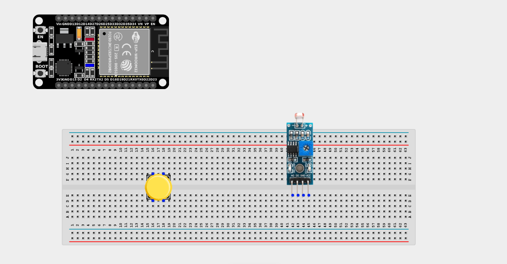
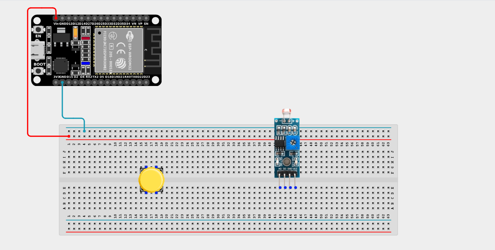
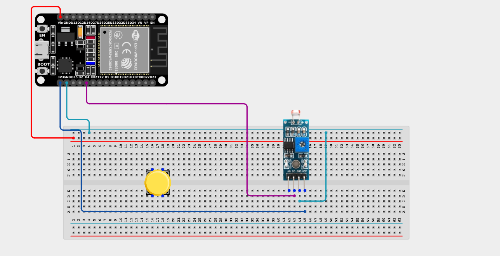
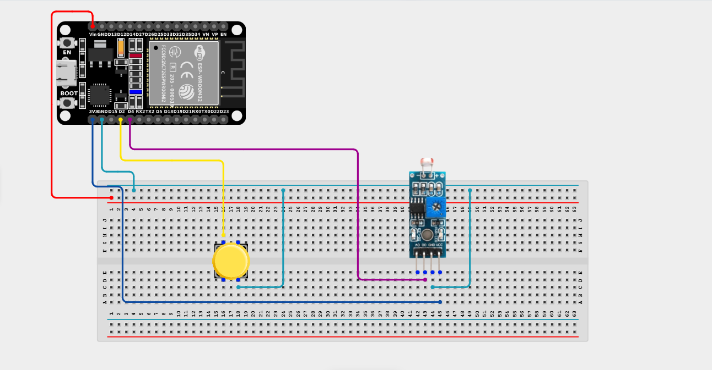

# Project 2.5.4: Manual Night Override

| **Description** | This project uses a push button to override the automatic reading of an LDR, allowing manual control when the automatic light sensing is not desired. |
|------------------|----------------------------------------------------------------|
| **Use case**     | This project can be used in smart lighting systems, home automation, industrial control panels, and energy management systems, where users need the ability to manually override automatic light sensing. |

## Components (Things You will need)

|  |  |  |  |  |  |
| --- | --- | --- | --- | --- | --- |

## Building the circuit

> **Tip:** Use the [ESP32 Pin Mapping](../../../../assets/esp32_pin_mapping.png) image to locate the correct GPIO pins on your ESP32 board.

Things Needed:

- ESP32 board = 1

- Micro USB cable = 1

- Breadboard = 1

- Jumper wires

- Push button = 1

- LDR module = 1

---

## Mounting the components on the breadboard

**Step 1:** Mount the ESP32 and Components:

- Align the ESP32 board across the center dividing ridge of the breadboard.

- Insert the Push button across the center divider of the breadboard.

- Insert the LDR Sensor Module into the breadboard so its pins sit in separate adjacent rows.



---

## Wiring the circuit

Follow these step-by-step connection details using your jumper wires:

**Step 1:** Create Power and Ground Rails

- Connect the **5V** or **VIN** pin on the ESP32 board to the positive (red) rail on the breadboard.

- Connect a **GND** pin on the ESP32 board to the negative (blue/black) rail on the breadboard.



**Step 2:** Wire the LDR Module

- Connect the **VCC** pin of the LDR Module to the 3.3V pin on the ESP32 board (or 3.3V power rail).

- Connect the **GND** pin of the LDR Module to the negative ground rail.

- Connect the **DO (Digital Out)** pin of the LDR Module to **GPIO 4** on the ESP32 board.


**Step 3:** Wire the Push Button

- Connect **one terminal** of the push button to **GPIO 2** on the ESP32 board.

- Connect the **other terminal** of the push button to the negative ground rail. *(We will use the internal pull-up resistor)*.




*Make sure to connect the Micro USB cable securely to the ESP32 board and your computer.*

---

## PROGRAMMING

**Step 1:** Open your Arduino IDE. See how to set up here: [Getting Started](../../Getting Started/Arduino_IDE_Setup.md).

**Step 2:** Write the code in sections as detailed below.

### 1. Variables and Setup

```cpp
const int ldrPin = 4; 
const int buttonPin = 2;

bool automaticMode = true; // By default, the system is automatic
bool lastButtonState = HIGH;
bool currentButtonState;

void setup() {
  Serial.begin(9600);
  
  pinMode(ldrPin, INPUT);
  pinMode(buttonPin, INPUT_PULLUP);
  
  Serial.println("=== Automatic Light Sensing ===");
  Serial.println("Press the button to enable or disable automatic mode.");
}
```
*Explanation:* We declare our LDR and Button pins. We create a `boolean` state variable called `automaticMode` which tracks whether the system is in Auto or Manual Override!

---

### 2. Main Loop

```cpp
void loop() {
  // 1. Read the push button to check for toggles
  currentButtonState = digitalRead(buttonPin);
  
  // If the button was just pressed...
  if (lastButtonState == HIGH && currentButtonState == LOW) { 
    delay(50); // Debounce
    
    // Toggle the mode!
    automaticMode = !automaticMode;
    
    if (automaticMode) { 
      Serial.println(">>> Automatic Mode Enabled"); 
    } else { 
      Serial.println(">>> Manual Override Enabled (System Paused)"); 
    } 
  } 
  
  lastButtonState = currentButtonState; 
  
  // 2. Execute logic based on the current mode
  if (automaticMode) { 
    // The system is AUTOMATIC. Read the sensor!
    int lightState = digitalRead(ldrPin);
    
    if (lightState == LOW) { 
      // Note: LOW usually indicates bright light on the digital pin
      Serial.println("[AUTO] Bright Environment Detected"); 
    } else { 
      Serial.println("[AUTO] Dark Environment Detected (Turn on lights!)");
    } 
  } else { 
    // The system is MANUAL OVERRIDE. Ignore the sensor!
    Serial.println("[MANUAL] Automatic Light Sensing Disabled. Awaiting manual commands..."); 
  }
  
  delay(500); // Slow down the loop for readable serial monitor output
}
```
*Explanation:* 

- We first check the button. If clicked, it flips the `automaticMode` variable from `true` to `false` (and vice-versa).

- If `automaticMode` is `true`, we actively read the light sensor and print whether it's Bright or Dark.

- If `automaticMode` is `false`, we completely ignore the sensor, simulating an override state where a human takes manual control of the lights!

---

## Uploading the code

**Step 3:** Save your code. _See the [Getting Started](../../Getting Started/Arduino_IDE_Setup.md) section_

**Step 4:** Select the ESP32 board and port _See the [Getting Started](../../Getting Started/Arduino_IDE_Setup.md) section:Selecting ESP32 board Type and Uploading your code_.

**Step 5:** Upload your code. _See the [Getting Started](../../Getting Started/Arduino_IDE_Setup.md) section:Selecting ESP32 board Type and Uploading your code_

## Conclusion

This project helps you understand how a simple push button can be used as a software "toggle switch" to completely bypass automated sensor logic, a critical feature for fail-safes and manual override systems!
