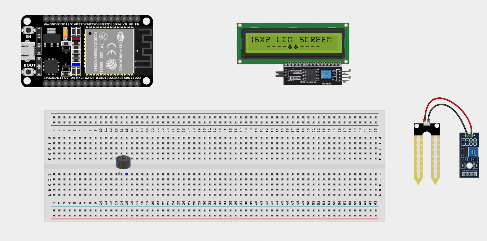
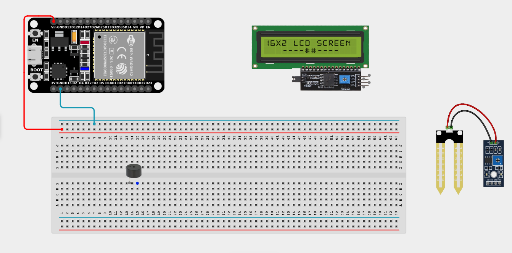
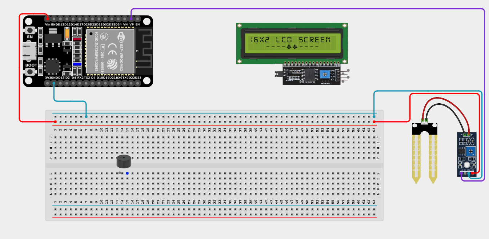
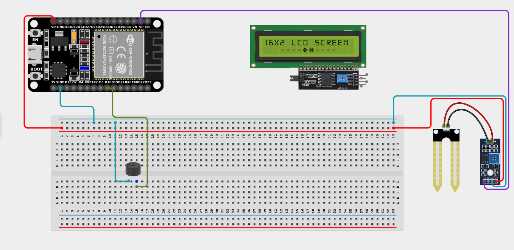
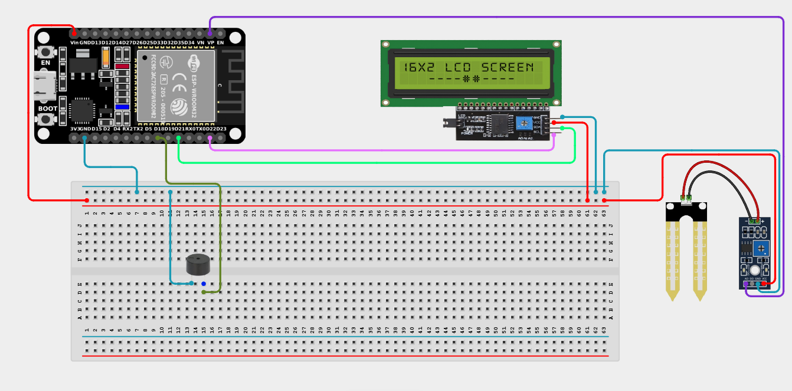

# Project 2.6: Smart Irrigation Monitor

| **Description** | In this project, learners will build a simple smart irrigation monitoring system that measures soil moisture levels and alerts users when watering is needed. The system displays moisture readings on an LCD and sounds a buzzer when the soil becomes too dry. This project introduces precision agriculture and environmental monitoring concepts. |
|------------------|---------------------------------------------------------------------------------------------------------------------------------------------------------------------------------------------------------------------------------------------------------------------------------------------------------------------------------------------------------------------------------------------------|
| **Use case**     | This project is connected to real-world uses such as smart farms, greenhouse irrigation systems, and home gardening automation. |

## Components (Things You will need)

|  |  |  |  |  |  |  |
| --- | --- | --- | --- | --- | --- | --- |

## Building the circuit

> **Tip:** Use the [ESP32 Pin Mapping](../../assets/esp32_pin_mapping.png) image to locate the correct GPIO pins on your ESP32 board.

Things Needed:

- ESP32 board = 1

- Micro USB cable = 1

- Breadboard = 1

- Jumper Wires

- Soil Moisture Sensor = 1

- I2C LCD Display = 1

- Buzzer = 1

---

## Mounting the components on the breadboard

**Step 1:** Mount the ESP32 and Components:

- Align the ESP32 board across the center dividing ridge of the breadboard.

- Place the Buzzer on the breadboard with its positive and negative pins in separate rows.

- (The Soil Moisture sensor and LCD connect via jumper wires directly).



---

## Wiring the circuit

Follow these step-by-step connection details using your jumper wires:

**Step 1:** Create Power and Ground Rails

- Connect the **5V** or **VIN** pin on the ESP32 board to the positive (red) rail on the breadboard.

- Connect a **GND** pin on the ESP32 board to the negative (blue/black) rail on the breadboard.



**Step 2:** Wire the Soil Moisture Sensor

- Connect **VCC** of the moisture sensor to the positive power rail.

- Connect **GND** of the moisture sensor to the negative power rail.

- Connect the **OUT (Analog)** pin of the moisture sensor to **GPIO 36** (also labeled VP) on the ESP32 board.



**Step 3:** Wire the Buzzer

- Connect the **positive (+)** pin of the buzzer to **GPIO 18** on the ESP32 board.

- Connect the **negative (-)** pin of the buzzer to the negative power rail.



**Step 4:** Wire the I2C LCD Display

- Connect **VCC** of the LCD to the positive power rail.

- Connect **GND** of the LCD to the negative power rail.

- Connect **SDA** of the LCD to **GPIO 21** on the ESP32 board.

- Connect **SCL** of the LCD to **GPIO 22** on the ESP32 board.



*Make sure to connect the Micro USB cable securely to the ESP32 board and your computer.*

---

## PROGRAMMING

**Step 1:** Open your Arduino IDE. See how to set up here: [Getting Started](../Getting Started/Arduino_IDE_Setup.md).

**Step 2:** Write the code in sections as detailed below.

### 1. Library Inclusion and Object Setup

```cpp
#include <Wire.h>
#include <LiquidCrystal_I2C.h>

LiquidCrystal_I2C lcd(0x27, 16, 2);

const int moisturePin = 36;
const int buzzerPin = 18;
```
*Explanation:* We include the library to control the I2C LCD and set its address (`0x27`). We define `moisturePin` for our analog moisture sensor reading and `buzzerPin` for the alarm.

---

### 2. Setup Function

```cpp
void setup() {
  lcd.init();
  lcd.backlight();
  pinMode(buzzerPin, OUTPUT);
}
```
*Explanation:* Initializes the LCD screen, turns on its backlight, and configures the buzzer pin as an output.

---

### 3. Loop Function

```cpp
void loop() {
  // Read analog value from the moisture sensor
  int moistureValue = analogRead(moisturePin);
  
  // Display the raw moisture value on the first row
  lcd.setCursor(0, 0);
  lcd.print("Moisture: ");
  lcd.print(moistureValue);
  lcd.print("   "); // Clear trailing characters
  
  // Check if soil is dry (You may need to adjust this threshold)
  // Lower values usually mean wetter soil, but it depends on your specific sensor!
  if (moistureValue > 2000) { 
    digitalWrite(buzzerPin, HIGH); // Sound alarm
    lcd.setCursor(0, 1);
    lcd.print("Water Needed!   ");
  } else {
    digitalWrite(buzzerPin, LOW);  // Turn off alarm
    lcd.setCursor(0, 1);
    lcd.print("Soil Healthy!   ");
  }
  
  delay(500); // Wait half a second before next reading
}
```
*Explanation:* 

- `analogRead(moisturePin)` reads the current moisture level in the soil.

- The LCD prints the value on the top line.

- The `if/else` checks the moisture level. (Note: On many analog soil sensors, dry soil has high resistance and therefore returns a high analog value, while wet soil conducts well and returns a low value). If the value is above our threshold, it sounds the buzzer and tells the user to water the plant!

---

## Uploading the code

**Step 3:** Save your code. _See the [Getting Started](../Getting Started/Arduino_IDE_Setup.md) section_

**Step 4:** Select the ESP32 board and port _See the [Getting Started](../Getting Started/Arduino_IDE_Setup.md) section:Selecting ESP32 board Type and Uploading your code_.

**Step 5:** Upload your code. _See the [Getting Started](../Getting Started/Arduino_IDE_Setup.md) section:Selecting ESP32 board Type and Uploading your code_

## CONCLUSION

When the soil is dry, the buzzer sounds to indicate that watering is needed and the screen displays an alert. When the soil is moist, the buzzer remains off, indicating that the moisture level is sufficient. The system continuously monitors and updates the soil moisture readings in real time, serving as an excellent automated gardener!
