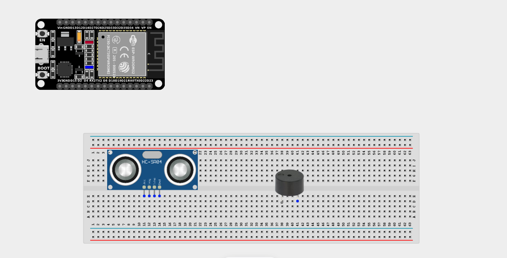
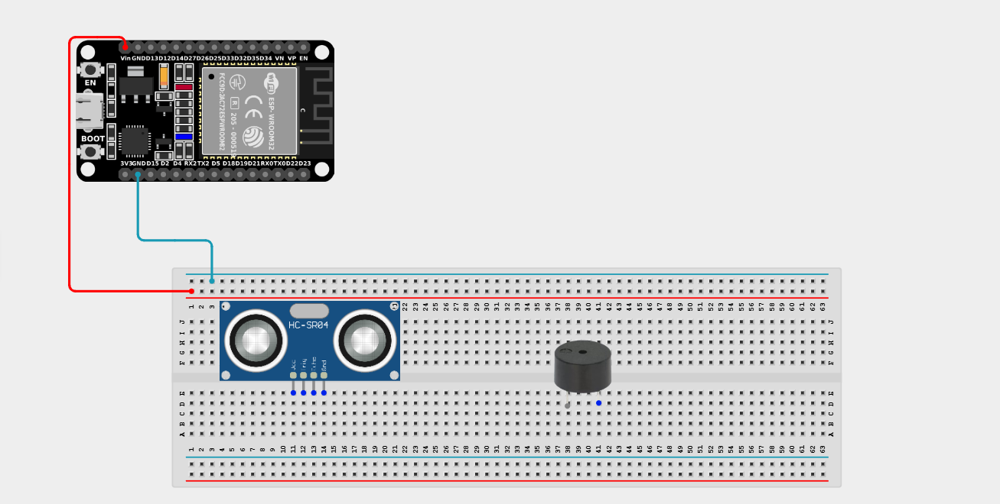
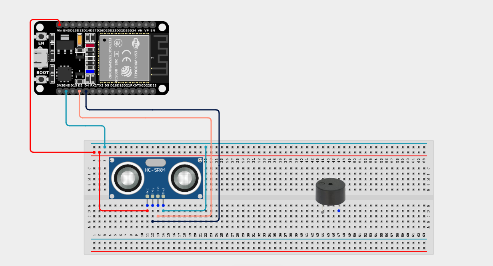
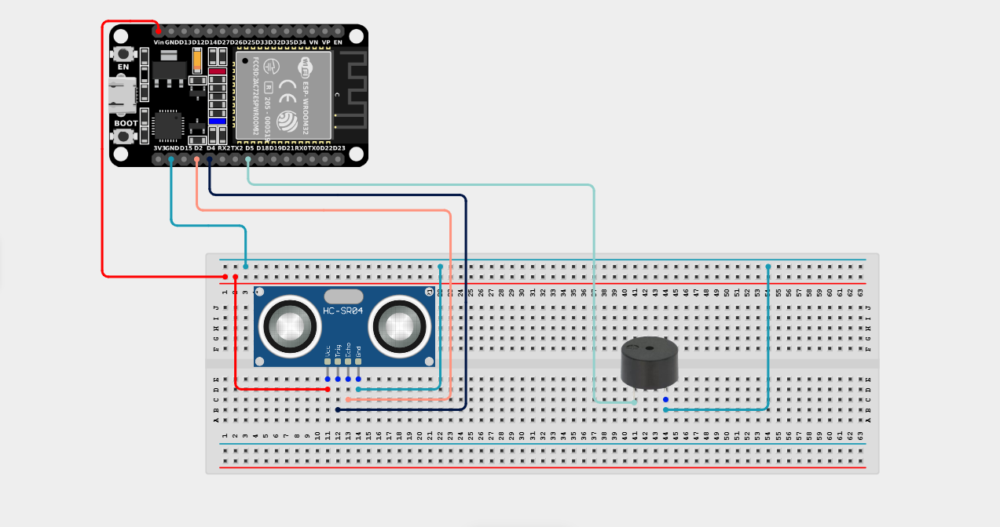

# Project 2.6.1: Smart Sound Alert System

| **Description** | This project shows how to use an ultrasonic sensor and a buzzer with an ESP32 board to create a smart sound alert system. When an object comes close to the sensor, the buzzer produces a sound alert. |
|------------------|----------------------------------------------------------------|
| **Use case**     | This project can be used as a simple security or obstacle detection system that alerts users when an object is nearby, similar to a car's backup radar.  |

## Components (Things You will need)

|  |  |  |  |  |  |
| --------------------------------------------------- | ----------------------------------------------------------- | --------------------------------------------------------- | ------------------------------------------------------ | ------------------------------------------------------ | ------------------------------------------------------ |

## Building the circuit

> **Tip:** Use the [ESP32 Pin Mapping](../../../../assets/esp32_pin_mapping.png) image to locate the correct GPIO pins on your ESP32 board.

Things Needed:

- ESP32 board = 1

- Micro USB cable = 1

- Breadboard = 1

- Jumper wires 

- Ultrasonic sensor = 1

- Active Buzzer = 1

---

## Mounting the components on the breadboard

**Step 1:** Mount the ESP32 and Components:

- Align the ESP32 board across the center dividing ridge of the breadboard.

- Insert the Ultrasonic Sensor so its four pins (VCC, TRIG, ECHO, GND) sit in separate adjacent rows.

- Insert the Buzzer into the breadboard (remember the longer leg is positive).

---

## Wiring the circuit

Follow these step-by-step connection details using your jumper wires:

**Step 1:** Create Power and Ground Rails

- Connect the **5V** or **VIN** pin on the ESP32 board to the positive (red) rail on the breadboard.

- Connect a **GND** pin on the ESP32 board to the negative (blue/black) rail on the breadboard.


**Step 2:** Wire the Ultrasonic Sensor

- Connect the **VCC** pin of the Ultrasonic sensor to the positive 5V power rail.

- Connect the **GND** pin of the Ultrasonic sensor to the negative ground rail.

- Connect the **Trig (Trigger)** pin of the Ultrasonic sensor to **GPIO 4** on the ESP32 board.

- **Wire the Echo Pin Voltage Divider (5V to 3.3V Protection)**:
  - Connect a **1kΩ resistor** from the Ultrasonic Sensor's **ECHO** pin to **GPIO 2** on the ESP32 board.
  - Connect a **2kΩ resistor** from **GPIO 2** to the **GND** rail on the breadboard.
  > **Voltage Safety Notice:** Because the HC-SR04 operates at 5V, its Echo pin outputs a 5V signal. The 1kΩ/2kΩ voltage divider safely steps this down to ~3.33V, protecting the ESP32 GPIO 2 from over-voltage damage.

  



**Step 3:** Wire the Buzzer

- Connect the **positive (+)** pin of the Buzzer to **GPIO 5** on the ESP32 board.

- Connect the **negative (-)** pin of the Buzzer to the negative ground rail.



*Make sure to connect the Micro USB cable securely to the ESP32 board and your computer.*

---

## PROGRAMMING

**Step 1:** Open your Arduino IDE. See how to set up here: [Getting Started](../../Getting Started/Arduino_IDE_Setup.md).

**Step 2:** Write the code in sections as detailed below.

### 1. Variables and Setup

```cpp
const int echoPin = 2;
const int trigPin = 4;
const int buzzerPin = 5;

const int dist_threshold = 20; // 20cm threshold

long duration;
int distance;

void setup() {
  Serial.begin(9600);
  
  pinMode(trigPin, OUTPUT);
  pinMode(echoPin, INPUT);
  
  pinMode(buzzerPin, OUTPUT);
}
```
*Explanation:* We declare pins for our sensor and buzzer. The Trigger pin is an `OUTPUT` (it sends the sound wave), and the Echo pin is an `INPUT` (it listens for the bounce). We set a `dist_threshold` of 20cm.

---

### 2. Main Loop

```cpp
void loop() {
  // 1. Send the ultrasonic pulse
  digitalWrite(trigPin, LOW); 
  delayMicroseconds(2);
  digitalWrite(trigPin, HIGH); 
  delayMicroseconds(10);
  digitalWrite(trigPin, LOW); 
  
  // 2. Measure the time it takes for the echo to return
  duration = pulseIn(echoPin, HIGH);
  
  // 3. Calculate distance in centimeters
  distance = duration * 0.034 / 2;
  
  // 4. Print the distance to the Serial Monitor
  Serial.print("Distance: ");
  Serial.print(distance);
  Serial.println(" cm");
  
  // 5. Sound the alarm if an object is too close!
  if (distance > 0 && distance < dist_threshold) {
    digitalWrite(buzzerPin, HIGH); 
    delay(200);
    digitalWrite(buzzerPin, LOW); 
    delay(100);
  } else {
    // Ensure buzzer is off if no object is close
    digitalWrite(buzzerPin, LOW);
  }
  
  delay(100); // Small delay before next measurement
}
```
*Explanation:* 

- We send out a 10-microsecond sound pulse using the `Trig` pin.

- `pulseIn()` measures exactly how long it takes for the sound to bounce off an object and return to the `Echo` pin.

- We do some math (`duration * 0.034 / 2`) to convert that time into centimeters!

- If the object is closer than our 20cm threshold, the buzzer sounds rapidly!

---

## Uploading the code

**Step 3:** Save your code. _See the [Getting Started](../../Getting Started/Arduino_IDE_Setup.md) section_

**Step 4:** Select the ESP32 board and port _See the [Getting Started](../../Getting Started/Arduino_IDE_Setup.md) section:Selecting ESP32 board Type and Uploading your code_.

**Step 5:** Upload your code. _See the [Getting Started](../../Getting Started/Arduino_IDE_Setup.md) section:Selecting ESP32 board Type and Uploading your code_

## Conclusion

Open the Serial Monitor to view the measured distance. When an object comes closer than 20 centimetres, the buzzer produces a sound alert. This project helps learners understand how to combine sensors and output devices to build practical radar and alarm systems!
