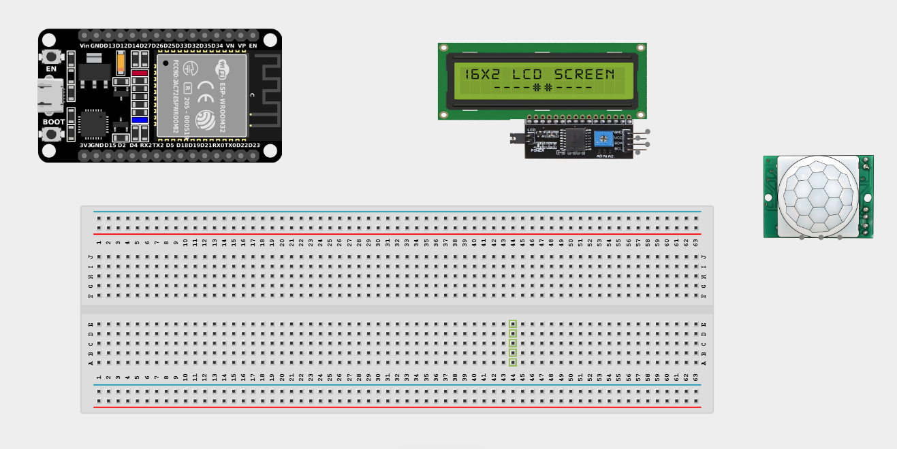
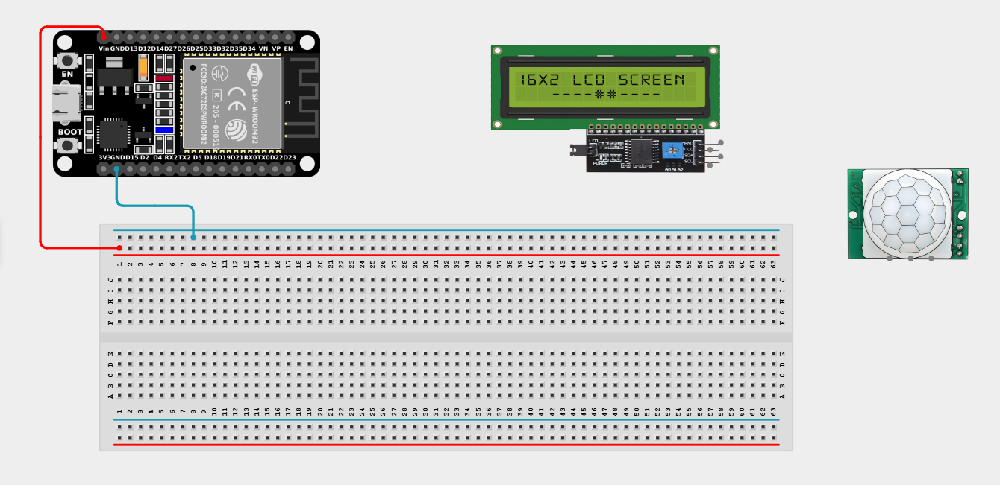
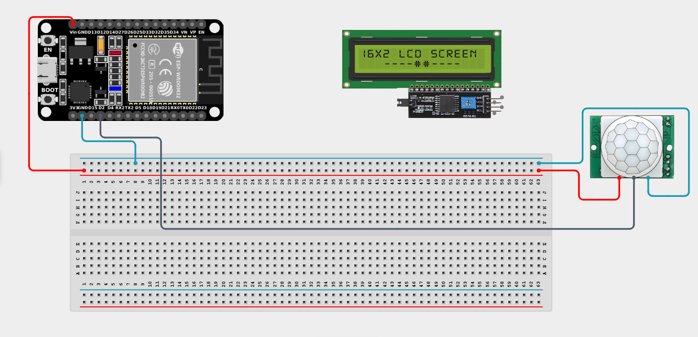
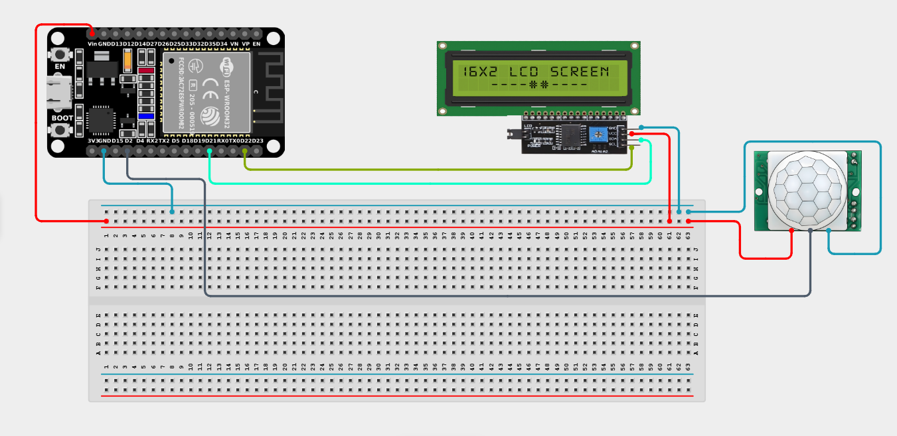

# Project 2.7: Motion Activated Welcome Display

| **Description** | This project uses a PIR Motion Sensor and an LCD Display to greet visitors automatically when movement is detected. |
|------------------|----------------------------------------------------------------|
| **Use case**     | This project is connected to real-world uses such as automatic doors, smart lighting systems, interactive billboards, and security devices. |

## Components (Things You will need)

|  |  |  |  |  |  |
| --- | --- | --- | --- | --- | --- |

## Building the circuit

> **Tip:** Use the [ESP32 Pin Mapping](../../assets/esp32_pin_mapping.png) image to locate the correct GPIO pins on your ESP32 board.

Things Needed:

- ESP32 board = 1

- Micro USB cable = 1

- Breadboard = 1

- Jumper Wires

- PIR Motion Sensor = 1

- I2C LCD Display = 1

---

## Mounting the components on the breadboard

**Step 1:** Mount the ESP32 and Components:

- Align the ESP32 board across the center dividing ridge of the breadboard.

- Connect jumper wires directly from the PIR Motion Sensor and LCD Display to the breadboard/ESP32.



---

## Wiring the circuit

Follow these step-by-step connection details using your jumper wires:

**Step 1:** Create Power and Ground Rails

- Connect the **5V** or **VIN** pin on the ESP32 board to the positive (red) rail on the breadboard.

- Connect a **GND** pin on the ESP32 board to the negative (blue/black) rail on the breadboard.



**Step 2:** Wire the PIR Motion Sensor

- Connect the **VCC** pin of the PIR motion sensor to the positive power rail.

- Connect the **GND** pin of the PIR motion sensor to the negative power rail.

- Connect the **OUT (Signal)** pin of the PIR motion sensor to **GPIO 2** on the ESP32 board.



**Step 3:** Wire the I2C LCD Display

- Connect the **VCC** pin of the LCD to the positive power rail.

- Connect the **GND** pin of the LCD to the negative power rail.

- Connect the **SDA** pin of the LCD to **GPIO 21** on the ESP32 board.

- Connect the **SCL** pin of the LCD to **GPIO 22** on the ESP32 board.



*Make sure to connect the Micro USB cable securely to the ESP32 board and your computer.*

---

## PROGRAMMING

**Step 1:** Open your Arduino IDE. See how to set up here: [Getting Started](../Getting Started/Arduino_IDE_Setup.md).

**Step 2:** Write the code in sections as detailed below.

### 1. Library Inclusion and Object Setup

```cpp
#include <Wire.h>
#include <LiquidCrystal_I2C.h>

LiquidCrystal_I2C lcd(0x27, 16, 2);

const int pirPin = 2;
```
*Explanation:* We include the library to control the I2C LCD and set its address (`0x27`). We define `pirPin` as 2 for our digital motion sensor input.

---

### 2. Setup Function

```cpp
void setup() {
  pinMode(pirPin, INPUT);
  
  lcd.init();
  lcd.backlight();
  lcd.print("Waiting...");
}
```
*Explanation:* Initializes the PIR sensor pin as an `INPUT` to detect motion. The LCD screen is initialized, its backlight is turned on, and it displays the default "Waiting..." message on startup.

---

### 3. Loop Function

```cpp
void loop() {
  int motion = digitalRead(pirPin); // Read digital HIGH/LOW from PIR sensor
  
  if (motion == HIGH) {
    // If motion is detected, PIR outputs HIGH
    lcd.clear();
    lcd.print("Welcome!");
    lcd.setCursor(0, 1);
    lcd.print("Motion Found");
  } else {
    // If no motion is detected, PIR outputs LOW
    lcd.clear();
    lcd.print("Waiting...");
  }
  
  delay(500); // Check twice a second
}
```
*Explanation:* 

- `digitalRead(pirPin)` checks if the PIR sensor has triggered. It returns `HIGH` if it senses movement, and `LOW` if nothing is moving.

- If motion is detected, we clear the screen and print "Welcome! Motion Found".

- If no motion is detected, we clear the screen and return to the default "Waiting..." state.

---

## Uploading the code

**Step 3:** Save your code. _See the [Getting Started](../Getting Started/Arduino_IDE_Setup.md) section_

**Step 4:** Select the ESP32 board and port _See the [Getting Started](../Getting Started/Arduino_IDE_Setup.md) section:Selecting ESP32 board Type and Uploading your code_.

**Step 5:** Upload your code. _See the [Getting Started](../Getting Started/Arduino_IDE_Setup.md) section:Selecting ESP32 board Type and Uploading your code_

## CONCLUSION

When no motion is detected by the PIR sensor, the LCD displays "Waiting..." to indicate that the system is in standby mode. When motion is detected, the LCD instantly displays a welcome message, indicating that a person has approached. This effectively simulates a smart interactive greeting system!
