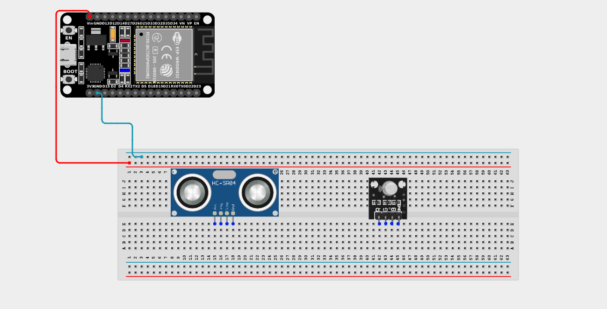
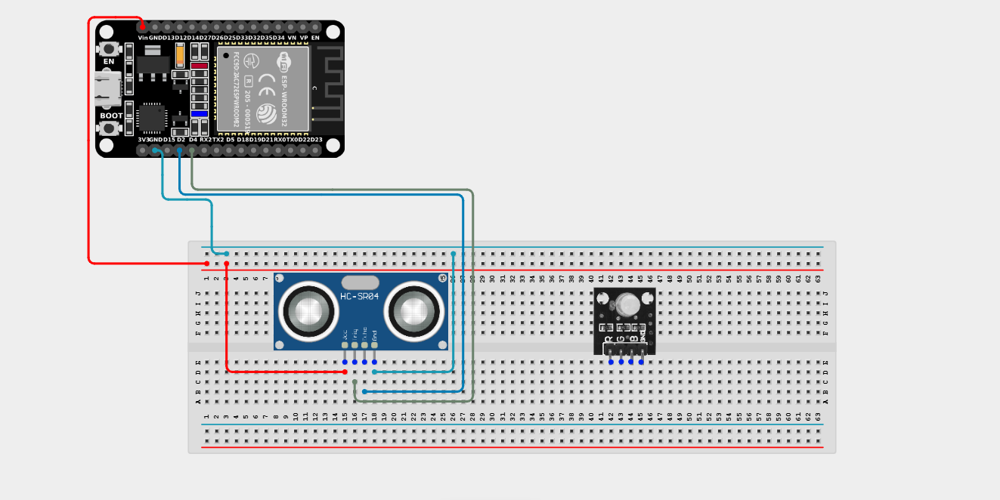
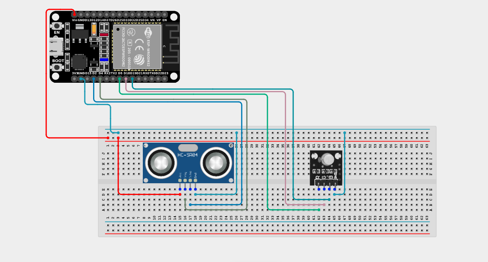

# Project 2.7.1: Smart Lighting System with RGB Module

| **Description** | Learn how to use an ultrasonic sensor with an RGB LED module and an ESP32 board to create a smart lighting system. The RGB LED flashes brightly when an object is detected within a specified distance. |
| --------------- | --------------------------------------------------------------------------------------------------------------------------------------------- |
| **Use case**    | Smart parking indicators, automatic decorative lighting, proximity warning systems, interactive displays, and smart home lighting applications. |

## Components (Things You will need)

|  |  |  |  |  |  |
| --------------------------------------------------- | ------------------------------------------------------ | ----------------------------------------------------------- | --------------------------------------------------------- | ------------------------------------------------------ | ------------------------------------------------------ |

## Building the circuit

> **Tip:** Use the [ESP32 Pin Mapping](../../../../assets/esp32_pin_mapping.png) image to locate the correct GPIO pins on your ESP32 board.

Things Needed:

- ESP32 board = 1

- Micro USB cable = 1

- Breadboard = 1

- Jumper wires

- Ultrasonic Sensor = 1

- RGB LED Module = 1

---

## Mounting the components on the breadboard

**Step 1:** Mount the ESP32 and Components:

- Align the ESP32 board across the center dividing ridge of the breadboard.

- Insert the Ultrasonic Sensor so its four pins (VCC, TRIG, ECHO, GND) sit in separate adjacent rows.

- Insert the RGB LED Module into the breadboard so its four pins (R, G, B, -) sit in separate adjacent rows.


---

## Wiring the circuit

Follow these step-by-step connection details using your jumper wires:

**Step 2:** Create Power and Ground Rails

- Connect the **5V** or **VIN** pin on the ESP32 board to the positive (red) rail on the breadboard.

- Connect a **GND** pin on the ESP32 board to the negative (blue/black) rail on the breadboard.



**Step 3:** Wire the Ultrasonic Sensor

- Connect the **VCC** pin of the Ultrasonic sensor to the positive 5V power rail.

- Connect the **GND** pin of the Ultrasonic sensor to the negative ground rail.

- Connect the **Trig (Trigger)** pin of the Ultrasonic sensor to **GPIO 4** on the ESP32 board.

- Connect the **ECHO** pin to **GPIO 2** on the ESP32 board.





**Step 4:** Wire the RGB LED Module

- Connect the **GND (-)** pin of the RGB LED module to the negative ground rail.

- Connect the **Red (R)** pin of the RGB module to **GPIO 5** on the ESP32 board.

- Connect the **Green (G)** pin of the RGB module to **GPIO 18** on the ESP32 board.

- Connect the **Blue (B)** pin of the RGB module to **GPIO 19** on the ESP32 board.




*Make sure to connect the Micro USB cable securely to the ESP32 board and your computer.*

---

## PROGRAMMING

**Step 1:** Open your Arduino IDE. See how to set up here: [Getting Started](../../Getting Started/Arduino_IDE_Setup.md).

**Step 2:** Write the code in sections as detailed below.

### 1. Variables and Setup

```cpp
const int echoPin = 2;
const int trigPin = 4;

const int redPin = 5;
const int greenPin = 18;
const int bluePin = 19;

long duration;
long distance;

const int dis_threshold = 15; // 15cm trigger distance

void setup() {
  Serial.begin(9600);
  
  pinMode(trigPin, OUTPUT);
  pinMode(echoPin, INPUT);
  
  pinMode(redPin, OUTPUT);
  pinMode(greenPin, OUTPUT);
  pinMode(bluePin, OUTPUT);
}
```
*Explanation:* We configure our ultrasonic sensor (Trigger as Output, Echo as Input) and all three pins of the RGB LED as outputs. We set a `dis_threshold` of 15cm.

---

### 2. Main Loop

```cpp
void loop() {
  // 1. Send the ultrasonic pulse
  digitalWrite(trigPin, LOW); 
  delayMicroseconds(2);
  digitalWrite(trigPin, HIGH); 
  delayMicroseconds(10);
  digitalWrite(trigPin, LOW);
  
  // 2. Measure the time it takes for the echo to return
  duration = pulseIn(echoPin, HIGH);
  
  // 3. Calculate distance in centimeters
  distance = duration * 0.034 / 2;
  
  Serial.print("Distance: ");
  Serial.print(distance);
  Serial.println(" cm");
  
  // 4. Trigger lighting effect if object is close!
  if (distance > 0 && distance < dis_threshold) {
    // Flash Red
    digitalWrite(redPin, HIGH); 
    delay(200);
    digitalWrite(redPin, LOW); 
    delay(200);
    
    // Flash Blue
    digitalWrite(bluePin, HIGH); 
    delay(200);
    digitalWrite(bluePin, LOW); 
    delay(200);
    
    // Flash Green
    digitalWrite(greenPin, HIGH); 
    delay(200);
    digitalWrite(greenPin, LOW); 
  } else {
    // If no object is close, ensure lights are OFF
    digitalWrite(redPin, LOW);
    digitalWrite(bluePin, LOW);
    digitalWrite(greenPin, LOW);
  }
  
  delay(100);
}
```
*Explanation:* 

- We send a sound wave and calculate how far away the nearest object is.

- If the object is within 15 centimetres, the RGB LED will flash Red, then Blue, then Green in a rapid sequence!

- If the object moves away, the `else` block turns all the colours off.

---

## Uploading the code

**Step 3:** Save your code. _See the [Getting Started](../../Getting Started/Arduino_IDE_Setup.md) section_

**Step 4:** Select the ESP32 board and port _See the [Getting Started](../../Getting Started/Arduino_IDE_Setup.md) section:Selecting ESP32 board Type and Uploading your code_.

**Step 5:** Upload your code. _See the [Getting Started](../../Getting Started/Arduino_IDE_Setup.md) section:Selecting ESP32 board Type and Uploading your code_

## Conclusion

Open the Serial Monitor to view the measured distance. When an object moves within 15 cm of the ultrasonic sensor, the RGB module cycles through the red, blue, and green colours! You have successfully built a smart lighting system that responds to physical proximity.
