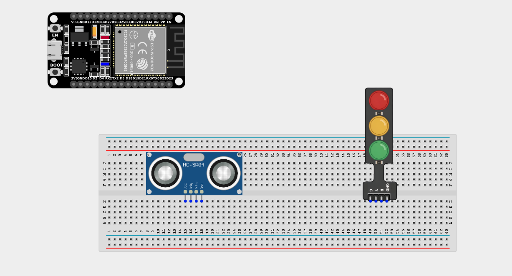
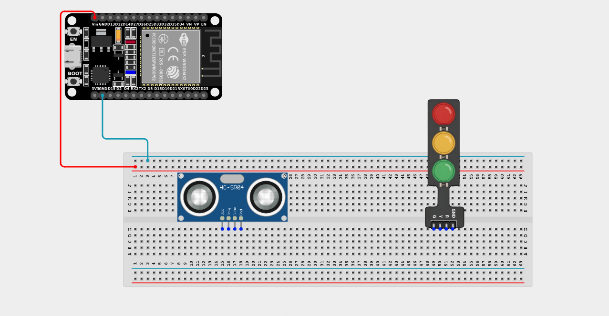
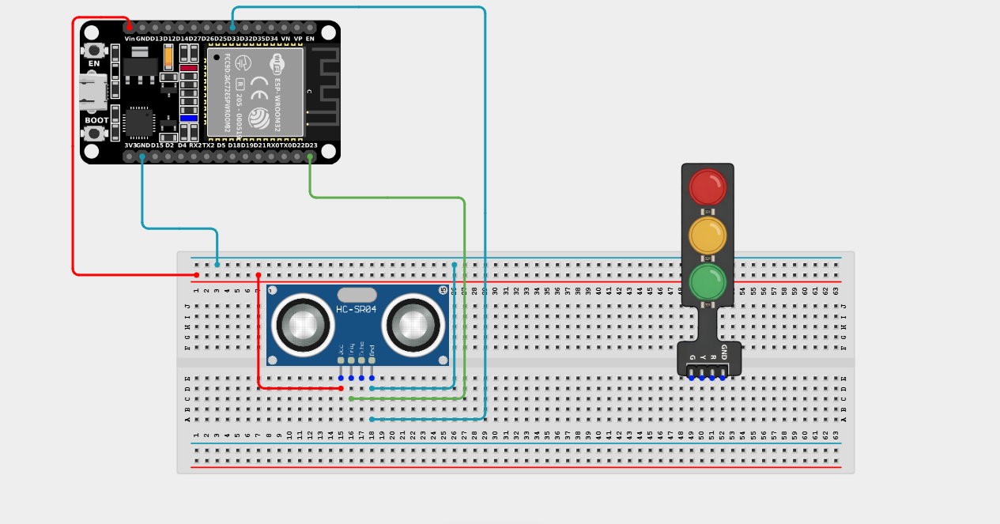
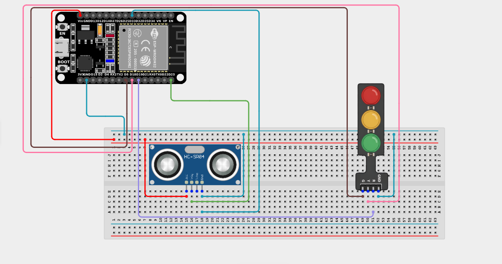

# Project 2.7.2: Backing Distance Meter

| **Description** | This project uses an ultrasonic sensor to measure proximity and displays the distance zone using a Traffic Light Module (Green=Safe, Yellow=Caution, Red=Danger). |
|------------------|----------------------------------------------------------------|
| **Use case**     | This logic powers the backup sensors in modern cars. As you reverse closer to an obstacle, the dashboard display changes from green (clear) to yellow (warning) to red (stop!). |

## Components (Things You will need)

| | | | | | |
|-------------------------|-------------------------|-------------------------|-------------------------|-------------------------|-------------------------|

## Building the circuit

> **Tip:** Use the [ESP32 Pin Mapping](../../../../assets/esp32_pin_mapping.png) image to locate the correct GPIO pins on your ESP32 board.

Things Needed:

- ESP32 board = 1

- Micro USB cable = 1 

- Breadboard = 1

- Jumper wires 

- Ultrasonic sensor = 1

- Traffic light module = 1

---

## Mounting the components on the breadboard

**Step 1:** Mount the ESP32 and Components:

- Align the ESP32 board across the center dividing ridge of the breadboard.

- Insert the Ultrasonic sensor so its four pins (VCC, TRIG, ECHO, GND) sit in separate adjacent rows.

- Insert the Traffic light module so its four pins (G, Y, R, GND) sit in separate adjacent rows.




---

## Wiring the circuit

Follow these step-by-step connection details using your jumper wires:

**Step 1:** Create Power and Ground Rails

- Connect the **5V** or **VIN** pin on the ESP32 board to the positive (red) rail on the breadboard.

- Connect a **GND** pin on the ESP32 board to the negative (blue/black) rail on the breadboard.



**Step 2:** Wire the Ultrasonic Sensor

- Connect the **VCC** pin of the sensor to the positive 5V power rail.

- Connect the **GND** pin of the sensor to the negative ground rail.

- Connect the **TRIG** pin of the sensor to **GPIO 23** on the ESP32 board.

- Connect a the **ECHO** pin to **GPIO 33** on the ESP32 board.




 

**Step 3:** Wire the Traffic Light Module

- Connect the **GND** pin of the module to the negative ground rail.

- Connect the **Green (G)** pin of the module to **GPIO 5** on the ESP32 board.

- Connect the **Yellow (Y)** pin of the module to **GPIO 18** on the ESP32 board.

- Connect the **Red (R)** pin of the module to **GPIO 19** on the ESP32 board.




*Make sure to connect the Micro USB cable securely to the ESP32 board and your computer.*

---

## PROGRAMMING

**Step 1:** Open your Arduino IDE. See how to set up here: [Getting Started](../../Getting Started/Arduino_IDE_Setup.md).

**Step 2:** Write the code in sections as detailed below.

### 1. Variables and Setup

```cpp
const int trigPin = 23;
const int echoPin = 33;

const int greenLED = 5;
const int yellowLED = 18;
const int redLED = 19;

long duration;
float distance;

void setup() {
  Serial.begin(9600);
  
  pinMode(trigPin, OUTPUT);
  pinMode(echoPin, INPUT);
  
  pinMode(greenLED, OUTPUT);
  pinMode(yellowLED, OUTPUT);
  pinMode(redLED, OUTPUT);
  
  Serial.println("Backing System Online. Displaying distances...");
}
```
*Explanation:* We declare our ultrasonic sensor and Traffic Light pins. The LEDs act as our visual "dashboard" to show the driver how close they are to hitting something!

---

### 2. Main Loop

```cpp
void loop() {
  // 1. Send the ultrasonic pulse
  digitalWrite(trigPin, LOW);
  delayMicroseconds(2);
  digitalWrite(trigPin, HIGH);
  delayMicroseconds(10);
  digitalWrite(trigPin, LOW);
  
  // 2. Measure echo and calculate distance
  duration = pulseIn(echoPin, HIGH);
  distance = duration * 0.0343 / 2;
  
  Serial.print("Distance: ");
  Serial.print(distance);
  Serial.println(" cm");
  
  // 3. Logic to control the LEDs based on distance zones
  if (distance > 30) { 
    // Safe Zone (Greater than 30cm) -> Green Light
    digitalWrite(greenLED, HIGH);
    digitalWrite(yellowLED, LOW);
    digitalWrite(redLED, LOW); 
  } 
  else if (distance > 15 && distance <= 30) {
    // Caution Zone (Between 15cm and 30cm) -> Yellow Light
    digitalWrite(greenLED, LOW);
    digitalWrite(yellowLED, HIGH);
    digitalWrite(redLED, LOW); 
  } 
  else { 
    // Danger Zone (Closer than 15cm) -> Red Light
    digitalWrite(greenLED, LOW);
    digitalWrite(yellowLED, LOW);
    digitalWrite(redLED, HIGH); 
  }
  
  delay(200); // Read the distance 5 times a second
}
```
*Explanation:* 

- Every loop, we measure the exact distance to the nearest object using the ultrasonic sensor.

- The `if / else if / else` block creates three distinct distance "zones":

- **Safe (>30cm):** Green LED turns on.

- **Caution (15cm - 30cm):** Yellow LED turns on.

- **Danger (<15cm):** Red LED turns on.

- Because it checks this multiple times a second, the light shifts instantly as you move an object closer or further away!

---

## Uploading the code

**Step 3:** Save your code. _See the [Getting Started](../../Getting Started/Arduino_IDE_Setup.md) section_

**Step 4:** Select the ESP32 board and port _See the [Getting Started](../../Getting Started/Arduino_IDE_Setup.md) section:Selecting ESP32 board Type and Uploading your code_.

**Step 5:** Upload your code. _See the [Getting Started](../../Getting Started/Arduino_IDE_Setup.md) section:Selecting ESP32 board Type and Uploading your code_

## Conclusion

This project helps you understand how a simple set of lights can be used to translate complex numerical data (distance in centimeters) into an instantly recognizable visual warning system for users!
