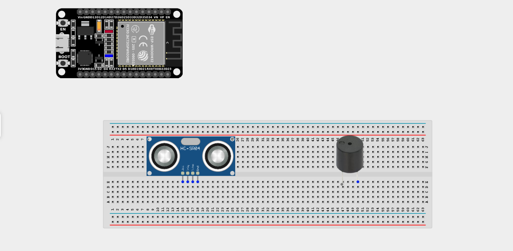
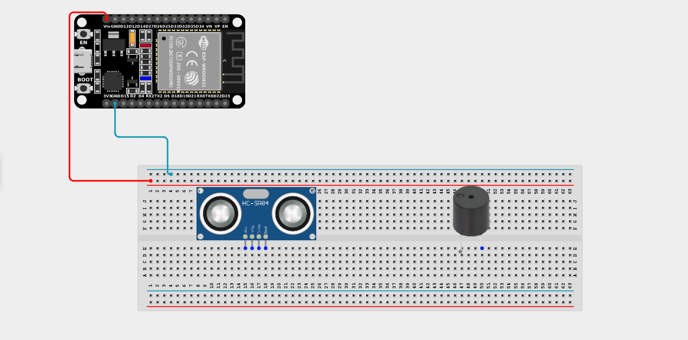
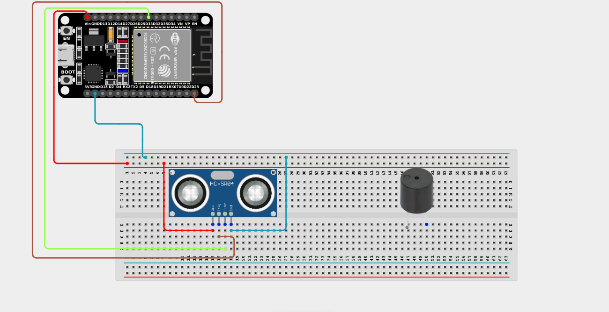
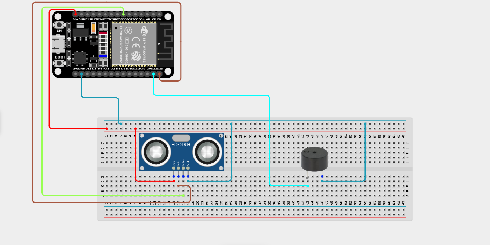

# Project 2.7.3: Proximity Alarm Radar

| **Description** | This project uses an ultrasonic sensor to measure distance and makes a buzzer beep at a rate that increases as an object approaches, mimicking vehicle parking radar. |
|------------------|----------------------------------------------------------------|
| **Use case**     | Used extensively in modern cars. As the driver backs up towards a wall, the audible beeps get faster and faster, eventually becoming a solid tone when a collision is imminent. |

## Components (Things You will need)

| | | | | | |
|-------------------------|-------------------------|-------------------------|-------------------------|-------------------------|-------------------------|

## Building the circuit

> **Tip:** Use the [ESP32 Pin Mapping](../../../../assets/esp32_pin_mapping.png) image to locate the correct GPIO pins on your ESP32 board.

Things Needed:

- ESP32 board = 1

- Micro USB cable = 1

- Breadboard = 1

- Jumper wires

- Ultrasonic sensor = 1

- Active Buzzer = 1

---

## Mounting the components on the breadboard

**Step 1:** Mount the ESP32 and Components:

- Align the ESP32 board across the center dividing ridge of the breadboard.

- Insert the Ultrasonic Sensor so its four pins (VCC, TRIG, ECHO, GND) sit in separate adjacent rows.

- Insert the Buzzer into the breadboard (remember the longer leg is positive).



---

## Wiring the circuit

Follow these step-by-step connection details using your jumper wires:

**Step 1:** Create Power and Ground Rails

- Connect the **5V** or **VIN** pin on the ESP32 board to the positive (red) rail on the breadboard.

- Connect a **GND** pin on the ESP32 board to the negative (blue/black) rail on the breadboard.


**Step 2:** Wire the Ultrasonic Sensor

- Connect the **VCC** pin of the sensor to the positive 5V power rail.

- Connect the **GND** pin of the sensor to the negative ground rail.

- Connect the **TRIG** pin of the sensor to **GPIO 23** on the ESP32 board.

- Connect the **ECHO** pin to **GPIO 33** on the ESP32 board.

 

**Step 3:** Wire the Buzzer

- Connect the **positive pin (longer leg)** of the buzzer to **GPIO 22** on the ESP32 board.

- Connect the **negative pin** of the buzzer to the negative ground rail.



*Make sure to connect the Micro USB cable securely to the ESP32 board and your computer.*

---

## PROGRAMMING

**Step 1:** Open your Arduino IDE. See how to set up here: [Getting Started](../../Getting Started/Arduino_IDE_Setup.md).

**Step 2:** Write the code in sections as detailed below.

### 1. Variables and Setup

```cpp
const int trigPin = 23;
const int echoPin = 33;
const int buzzerPin = 22;

long duration;
float distance;

void setup() {
  Serial.begin(9600);
  
  pinMode(trigPin, OUTPUT);
  pinMode(echoPin, INPUT);
  pinMode(buzzerPin, OUTPUT);
}
```
*Explanation:* We initialize our distance sensor pins and the output pin for the alarm buzzer.

---

### 2. Main Loop

```cpp
void loop() {
  // 1. Send out ultrasonic ping
  digitalWrite(trigPin, LOW);
  delayMicroseconds(2);
  digitalWrite(trigPin, HIGH);
  delayMicroseconds(10);
  digitalWrite(trigPin, LOW);
  
  // 2. Measure distance
  duration = pulseIn(echoPin, HIGH);
  distance = duration * 0.0343 / 2;
  
  Serial.print("Distance: ");
  Serial.print(distance);
  Serial.println(" cm");
  
  // 3. Modulate buzzer beep frequency based on distance!
  if (distance > 50) { 
    // Far away: Silent
    noTone(buzzerPin); 
  }
  else if (distance > 30) { 
    // Getting closer: Slow Beep
    tone(buzzerPin, 1000); // 1000Hz frequency
    delay(500); // Wait half a second
    noTone(buzzerPin);
    delay(500); 
  }
  else if (distance > 20) {
    // Very close: Fast Beep
    tone(buzzerPin, 1000);
    delay(300);
    noTone(buzzerPin);
    delay(300); 
  }
  else if (distance > 10) { 
    // Dangerously close: Very Fast Beep
    tone(buzzerPin, 1000);
    delay(150);
    noTone(buzzerPin);
    delay(150); 
  }   
  else { 
    // Collision imminent (< 10cm): SOLID TONE
    tone(buzzerPin, 1000); 
  }
}
```
*Explanation:* 

- We measure the distance continuously. 

- Using `if` and `else if` statements, we check which distance range the object is in.

- We use the `tone()` function to play a 1000Hz note, and `noTone()` to silence it.

- Notice how the `delay()` values get smaller (500 -> 300 -> 150) as the distance decreases? This creates the effect of the beep speeding up as you get closer to the obstacle!

- If the object is under 10cm away, the `delay()` is removed entirely, resulting in a solid continuous warning tone!

---

## Uploading the code

**Step 3:** Save your code. _See the [Getting Started](../../Getting Started/Arduino_IDE_Setup.md) section_

**Step 4:** Select the ESP32 board and port _See the [Getting Started](../../Getting Started/Arduino_IDE_Setup.md) section:Selecting ESP32 board Type and Uploading your code_.

**Step 5:** Upload your code. _See the [Getting Started](../../Getting Started/Arduino_IDE_Setup.md) section:Selecting ESP32 board Type and Uploading your code_

## Conclusion

This project helps you understand how you can change the timing (`delay`) dynamically based on sensor data to create responsive, intuitive alerts that humans instantly understand without looking at a screen!
