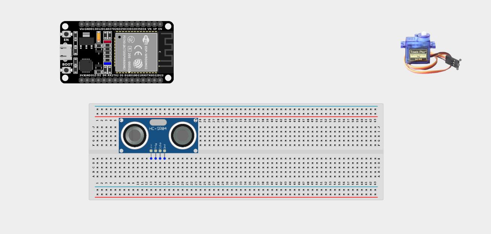
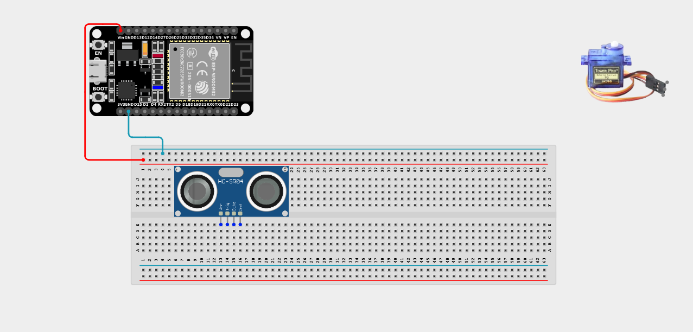
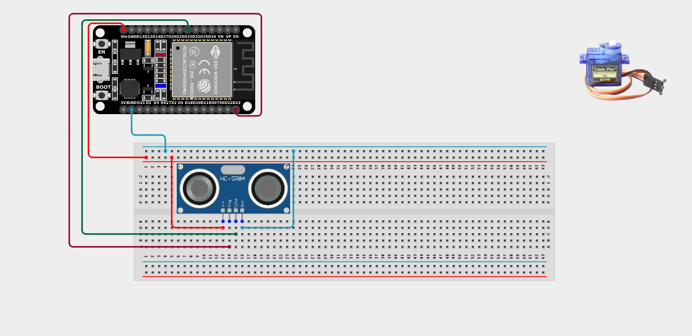
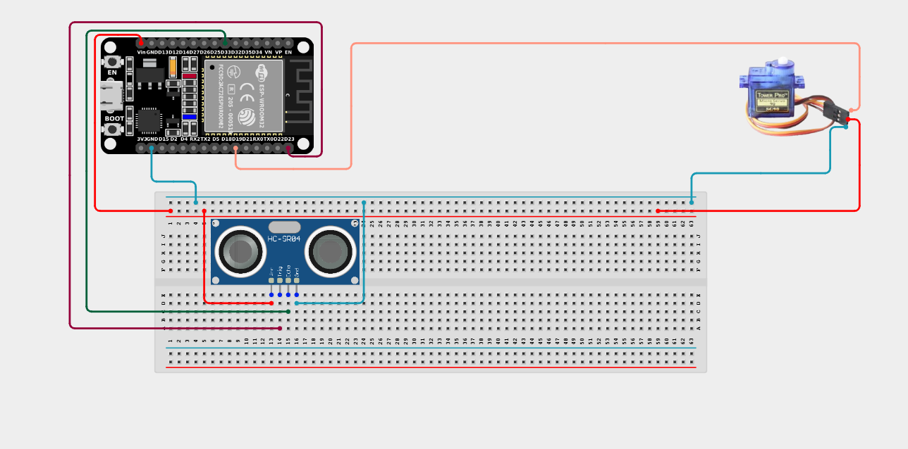

# Project 2.7.4: Automatic Barrier Gate

| **Description** | This project uses an ultrasonic sensor to detect objects and controls a servo motor to open a barrier gate when something is within 20cm, closing automatically when clear. |
|------------------|----------------------------------------------------------------|
| **Use case**     | This is the exact technology used in automated parking garages, toll booths, and smart railway crossings! The sensor acts as a virtual "tripwire" to trigger mechanical movement. |

## Components (Things You will need)

| | | | | | |
|-------------------------|-------------------------|-------------------------|-------------------------|-------------------------|-------------------------|

## Building the circuit

> **Tip:** Use the [ESP32 Pin Mapping](../../../../assets/esp32_pin_mapping.png) image to locate the correct GPIO pins on your ESP32 board.

Things Needed:

- ESP32 board = 1

- Micro USB cable = 1

- Breadboard = 1

- Jumper wires 

- Ultrasonic sensor = 1

- Servo motor = 1

---

## Mounting the components on the breadboard

**Step 1:** Mount the ESP32 and Components:

- Align the ESP32 board across the center dividing ridge of the breadboard.

- Insert the Ultrasonic Sensor into the breadboard so its four pins (VCC, TRIG, ECHO, GND) sit in separate adjacent rows.

- The Servo Motor will sit loose, connected via male-to-male jumper wires.



---

## Wiring the circuit

Follow these step-by-step connection details using your jumper wires:

**Step 1:** Create Power and Ground Rails

- Connect the **5V** or **VIN** pin on the ESP32 board to the positive (red) rail on the breadboard.

- Connect a **GND** pin on the ESP32 board to the negative (blue/black) rail on the breadboard.


**Step 2:** Wire the Ultrasonic Sensor

- Connect the **VCC** pin of the sensor to the positive 5V power rail.

- Connect the **GND** pin of the sensor to the negative ground rail.

- Connect the **TRIG** pin of the sensor to **GPIO 23** on the ESP32 board.

- Connect the **ECHO** pin of the sensor to **GPIO 33** on the ESP32 board.




**Step 3:** Wire the Servo Motor

- Connect the **GND (Brown/Black)** wire of the servo to the negative ground rail.

- Connect the **VCC (Red)** wire of the servo to the positive 5V power rail.

- Connect the **Signal (Orange/Yellow)** wire of the servo to **GPIO 19** on the ESP32 board.



*Make sure to connect the Micro USB cable securely to the ESP32 board and fix the servo blade firmly on the servo motor.*

---

## PROGRAMMING

**Step 1:** Open your Arduino IDE. See how to set up here: [Getting Started](../../Getting Started/Arduino_IDE_Setup.md).

**Step 2:** Write the code in sections as detailed below.

### 1. Variables and Setup

```cpp
#include <ESP32Servo.h>

const int trigPin = 23;
const int echoPin = 33;
const int servoPin = 19;

Servo gateServo;

long duration;
float distance;

void setup() {
  Serial.begin(9600);
  
  pinMode(trigPin, OUTPUT);
  pinMode(echoPin, INPUT);
  
  // Attach the servo and set to closed position (0 degrees)
  gateServo.attach(servoPin);
  gateServo.write(0); 
  Serial.println("Gate System Online. Gate Closed.");
}
```
*Explanation:* We import the `ESP32Servo.h` library to control the motor. We initialize the ultrasonic sensor and set the gate's starting position to `0` (closed/horizontal).

---

### 2. Main Loop

```cpp
void loop() {
  // 1. Ping the ultrasonic sensor
  digitalWrite(trigPin, LOW);
  delayMicroseconds(2);
  digitalWrite(trigPin, HIGH);
  delayMicroseconds(10);
  digitalWrite(trigPin, LOW);
  
  // 2. Measure distance
  duration = pulseIn(echoPin, HIGH);
  distance = duration * 0.0343 / 2;
  
  Serial.print("Distance: ");
  Serial.print(distance);
  Serial.println(" cm");
  
  // 3. Control the gate!
  if (distance > 0 && distance <= 20) { 
    // A car/object is closer than 20cm! Open the gate!
    Serial.println(">>> Vehicle Detected. Opening Gate!");
    gateServo.write(90); // Move to 90 degrees (Vertical/Open)
  } 
  else { 
    // No object detected. Close the gate.
    gateServo.write(0);  // Move back to 0 degrees (Horizontal/Closed)
  }
  
  delay(200); // Wait slightly before scanning again
}
```
*Explanation:* 

- We read the distance to see if an object (like a car) has pulled up in front of the gate.

- The `if` statement checks if the distance is 20cm or less. If so, it commands the servo motor to move to 90 degrees, physically lifting the barrier arm!

- As soon as the car drives through and the distance increases beyond 20cm, the `else` block triggers, returning the servo to 0 degrees and closing the gate.

---

## Uploading the code

**Step 3:** Save your code. _See the [Getting Started](../../Getting Started/Arduino_IDE_Setup.md) section_

**Step 4:** Select the ESP32 board and port _See the [Getting Started](../../Getting Started/Arduino_IDE_Setup.md) section:Selecting ESP32 board Type and Uploading your code_.

**Step 5:** Upload your code. _See the [Getting Started](../../Getting Started/Arduino_IDE_Setup.md) section:Selecting ESP32 board Type and Uploading your code_

## Conclusion

This project helps you understand how sensor data can be seamlessly linked to mechanical action, allowing systems to independently react and control physical infrastructure!
