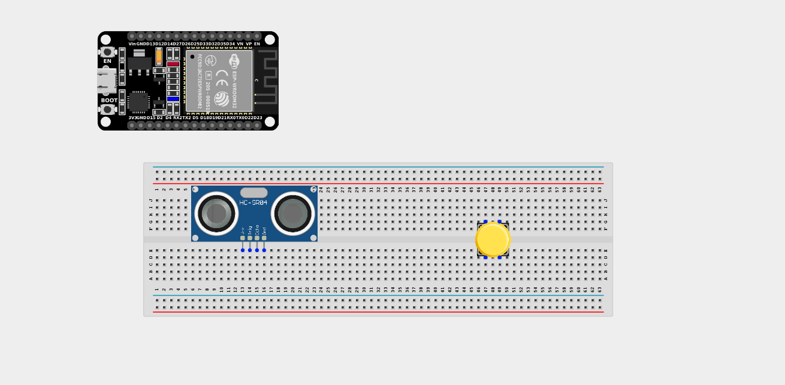
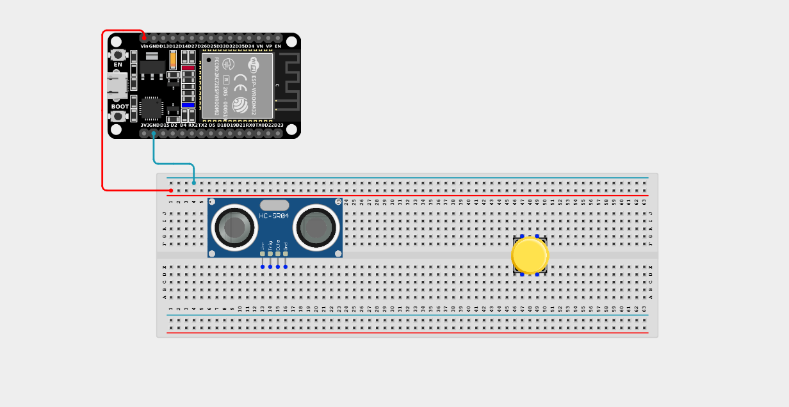
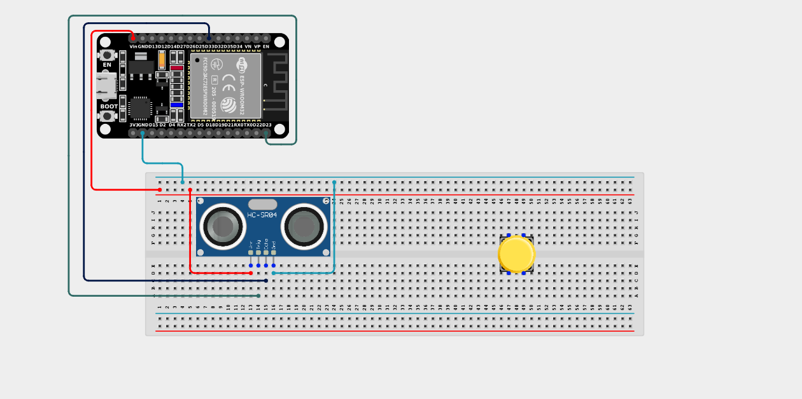
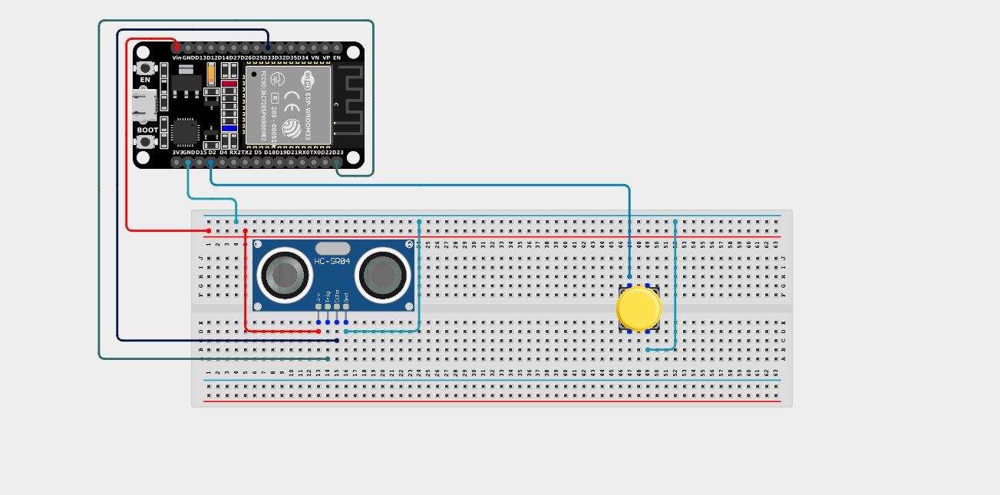

# Project 2.7.5: Manual Trigger Radar

| **Description** | This project activates ultrasonic distance measurement only when a push button is held down, conserving power and allowing on-demand readings. |
|------------------|----------------------------------------------------------------|
| **Use case**     | This logic is used in portable measuring devices, battery-powered field inspection tools, and robotics, where distance measurements are taken only when explicitly requested by a user to save battery life. |

## Components (Things You will need)

| | | | | | |
| --- | --- | --- | --- | --- | --- |

## Building the circuit

> **Tip:** Use the [ESP32 Pin Mapping](../../../../assets/esp32_pin_mapping.png) image to locate the correct GPIO pins on your ESP32 board.

Things Needed:

- ESP32 board = 1

- Micro USB cable = 1

- Breadboard = 1

- Jumper wires

- Push button = 1

- Ultrasonic sensor = 1

---

## Mounting the components on the breadboard

**Step 1:** Mount the ESP32 and Components:

- Align the ESP32 board across the center dividing ridge of the breadboard.

- Insert the Push button across the center divider of the breadboard.

- Insert the Ultrasonic Sensor so its four pins (VCC, TRIG, ECHO, GND) sit in separate adjacent rows.



---

## Wiring the circuit

Follow these step-by-step connection details using your jumper wires:

**Step 1:** Create Power and Ground Rails

- Connect the **5V** or **VIN** pin on the ESP32 board to the positive (red) rail on the breadboard.

- Connect a **GND** pin on the ESP32 board to the negative (blue/black) rail on the breadboard.


**Step 2:** Wire the Ultrasonic Sensor

- Connect the **VCC** pin of the sensor to the positive 5V power rail.

- Connect the **GND** pin of the sensor to the negative ground rail.

- Connect the **TRIG** pin of the sensor to **GPIO 23** on the ESP32 board.

- Connect the **ECHO** pin of the sensor to **GPIO 33** on the ESP32 board.




**Step 3:** Wire the Push Button

- Connect **one terminal** of the push button to **GPIO 2** on the ESP32 board.

- Connect the **other terminal** of the push button to the negative ground rail. *(We will use the internal pull-up resistor)*.



*Make sure to connect the Micro USB cable securely to the ESP32 board and your computer.*

---

## PROGRAMMING

**Step 1:** Open your Arduino IDE. See how to set up here: [Getting Started](../../Getting Started/Arduino_IDE_Setup.md).

**Step 2:** Write the code in sections as detailed below.

### 1. Variables and Setup

```cpp
const int trigPin = 23;
const int echoPin = 33;
const int buttonPin = 2;

long duration;
float distance;

void setup() {
  Serial.begin(9600);
  
  pinMode(trigPin, OUTPUT);
  pinMode(echoPin, INPUT);
  pinMode(buttonPin, INPUT_PULLUP);
  
  Serial.println("System Ready. Press and hold the button to measure distance.");
}
```
*Explanation:* We declare our ultrasonic sensor pins and the push button. We use `INPUT_PULLUP` for the button so we don't need a physical resistor.

---

### 2. Main Loop

```cpp
void loop() {
  // Read the button state
  // Because we used INPUT_PULLUP, LOW means the button is pressed!
  if (digitalRead(buttonPin) == LOW) {
    
    // 1. Send the ultrasonic pulse
    digitalWrite(trigPin, LOW);
    delayMicroseconds(2);
    digitalWrite(trigPin, HIGH);
    delayMicroseconds(10);
    digitalWrite(trigPin, LOW);
    
    // 2. Measure distance
    duration = pulseIn(echoPin, HIGH);
    distance = duration * 0.0343 / 2;
    
    // 3. Print the result
    Serial.print("Target Distance: ");
    Serial.print(distance);
    Serial.println(" cm");
    
    // Read 10 times a second while the button is held down
    delay(100); 
  } 
  // If the button is NOT pressed, do nothing! The sensor sleeps.
}
```
*Explanation:* 

- The entire ultrasonic scanning process is wrapped inside an `if (digitalRead(buttonPin) == LOW)` statement.

- If the button is not being pressed, the code skips the `if` block entirely. The sensor never sends a pulse, saving processing power.

- When you press and hold the button, the `if` block runs repeatedly, acting like a live "scanner" until you release it!

---

## Uploading the code

**Step 3:** Save your code. _See the [Getting Started](../../Getting Started/Arduino_IDE_Setup.md) section_

**Step 4:** Select the ESP32 board and port _See the [Getting Started](../../Getting Started/Arduino_IDE_Setup.md) section:Selecting ESP32 board Type and Uploading your code_.

**Step 5:** Upload your code. _See the [Getting Started](../../Getting Started/Arduino_IDE_Setup.md) section:Selecting ESP32 board Type and Uploading your code_

## Conclusion

This project helps you understand how physical switches can be used to control the execution of power-intensive sensor polling, a critical concept in battery-powered IoT devices!
