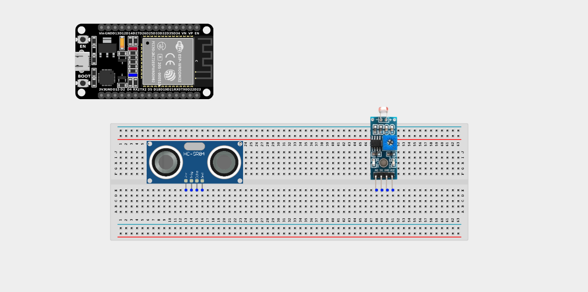
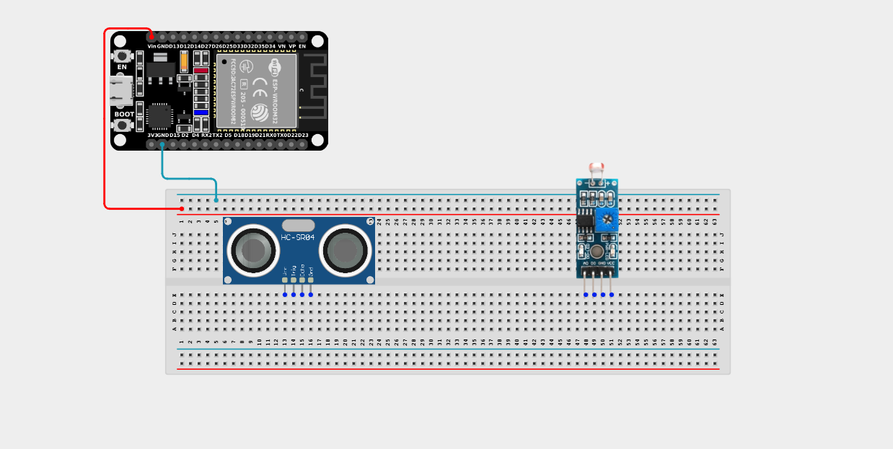
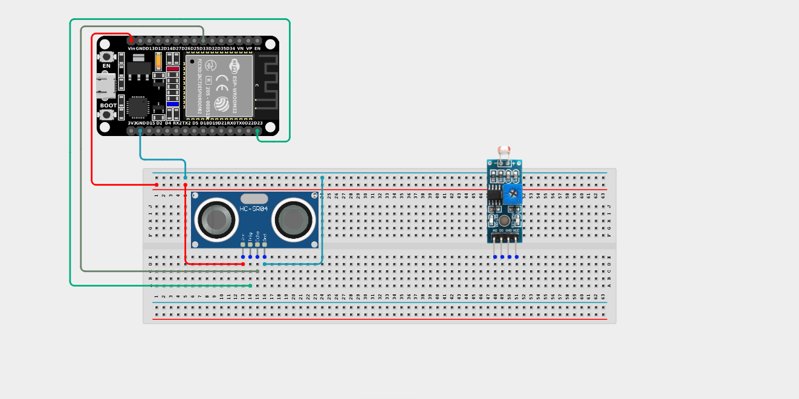
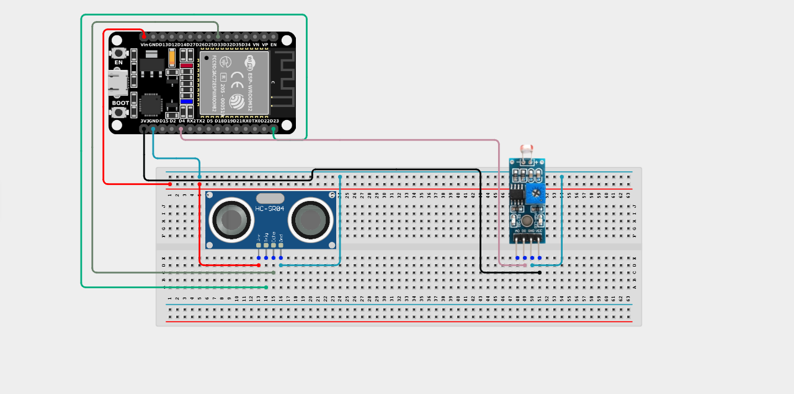

# Project 2.7.6: Solar Proximity Switch

| **Description** | This project activates ultrasonic proximity detection only when the LDR detects nighttime darkness, creating a solar-aware sensor system. |
|------------------|----------------------------------------------------------------|
| **Use case**     | This project logic powers smart outdoor lighting and security systems that should only look for motion or proximity after the sun goes down, saving massive amounts of energy during the day. |

## Components (Things You will need)

|  |  |  |  |  |  |
| --- | --- | --- | --- | --- | --- |

## Building the circuit

> **Tip:** Use the [ESP32 Pin Mapping](../../../../assets/esp32_pin_mapping.png) image to locate the correct GPIO pins on your ESP32 board.

Things Needed:

- ESP32 board = 1

- Micro USB cable = 1

- Breadboard = 1

- Jumper wires 

- LDR module = 1

- Ultrasonic sensor = 1

---

## Mounting the components on the breadboard

**Step 1:** Mount the ESP32 and Components:

- Align the ESP32 board across the center dividing ridge of the breadboard.

- Insert the Ultrasonic Sensor so its four pins (VCC, TRIG, ECHO, GND) sit in separate adjacent rows.

- Insert the LDR Sensor Module so its pins sit in separate adjacent rows.



---

## Wiring the circuit

Follow these step-by-step connection details using your jumper wires:

**Step 1:** Create Power and Ground Rails

- Connect the **5V** or **VIN** pin on the ESP32 board to the positive (red) rail on the breadboard.

- Connect a **GND** pin on the ESP32 board to the negative (blue/black) rail on the breadboard.


**Step 2:** Wire the Ultrasonic Sensor

- Connect the **VCC** pin of the Ultrasonic sensor to the positive 5V power rail.

- Connect the **GND** pin of the Ultrasonic sensor to the negative ground rail.

- Connect the **TRIG** pin of the sensor to **GPIO 23** on the ESP32 board.

- Connect the **ECHO** pin of the sensor to **GPIO 33** on the ESP32 board.




**Step 3:** Wire the LDR Module

- Connect the **VCC** pin of the LDR to the 3.3V pin on the ESP32 board (or 3.3V power rail).

- Connect the **GND** pin of the LDR to the negative ground rail.

- Connect the **DO (Digital Out)** pin of the LDR to **GPIO 4** on the ESP32 board.



*Make sure to connect the Micro USB cable securely to the ESP32 board and your computer.*

---

## PROGRAMMING

**Step 1:** Open your Arduino IDE. See how to set up here: [Getting Started](../../Getting Started/Arduino_IDE_Setup.md).

**Step 2:** Write the code in sections as detailed below.

### 1. Variables and Setup

```cpp
const int trigPin = 23;
const int echoPin = 33;
const int ldrPin = 4;

long duration;
float distance;

void setup() {
  Serial.begin(9600);
  
  pinMode(trigPin, OUTPUT);
  pinMode(echoPin, INPUT);
  pinMode(ldrPin, INPUT);
  
  Serial.println("Solar Proximity System Online.");
}
```
*Explanation:* We declare our ultrasonic pins and the digital output pin of our light sensor. 

---

### 2. Main Loop

```cpp
void loop() {
  // Read the digital state of the light sensor
  // (Usually HIGH = dark, LOW = light, but depends on module tuning)
  int isDark = digitalRead(ldrPin);
  
  if (isDark == HIGH) {
    Serial.print("[NIGHT DETECTED] Scanning: ");
    
    // 1. Send the ultrasonic pulse
    digitalWrite(trigPin, LOW);
    delayMicroseconds(2);
    digitalWrite(trigPin, HIGH);
    delayMicroseconds(10);
    digitalWrite(trigPin, LOW);
    
    // 2. Measure distance
    duration = pulseIn(echoPin, HIGH);
    distance = duration * 0.0343 / 2;
    
    Serial.print(distance);
    Serial.println(" cm");
  } 
  else {
    // If it is daytime, do not use the ultrasonic sensor at all!
    Serial.println("[DAYTIME] Ultrasonic Sensor Inactive (Sleeping...)");
  }
  
  // Wait half a second before checking the light level again
  delay(500);
}
```
*Explanation:* 

- We use the `isDark` variable as a gatekeeper. 

- If the environment is dark (`isDark == HIGH`), it runs the code block that physically triggers the ultrasonic sensor and calculates distance.

- If it is bright daytime, the `else` block executes, doing absolutely nothing except printing a sleep message. 

- Using environmental sensors to gate power-heavy sensors is a core principle of green IoT design!

---

## Uploading the code

**Step 3:** Save your code. _See the [Getting Started](../../Getting Started/Arduino_IDE_Setup.md) section_

**Step 4:** Select the ESP32 board and port _See the [Getting Started](../../Getting Started/Arduino_IDE_Setup.md) section:Selecting ESP32 board Type and Uploading your code_.

**Step 5:** Upload your code. _See the [Getting Started](../../Getting Started/Arduino_IDE_Setup.md) section:Selecting ESP32 board Type and Uploading your code_

## Conclusion

This project helps you understand how you can chain sensors together logically, making one sensor's data dependent on another sensor's state to create highly efficient, "smart" devices!
